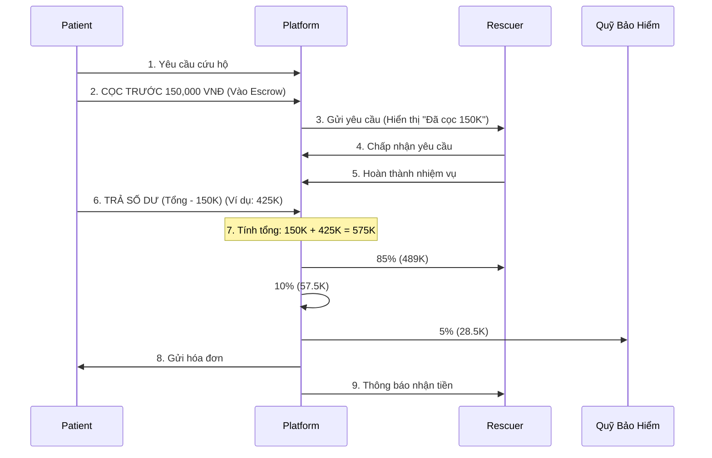
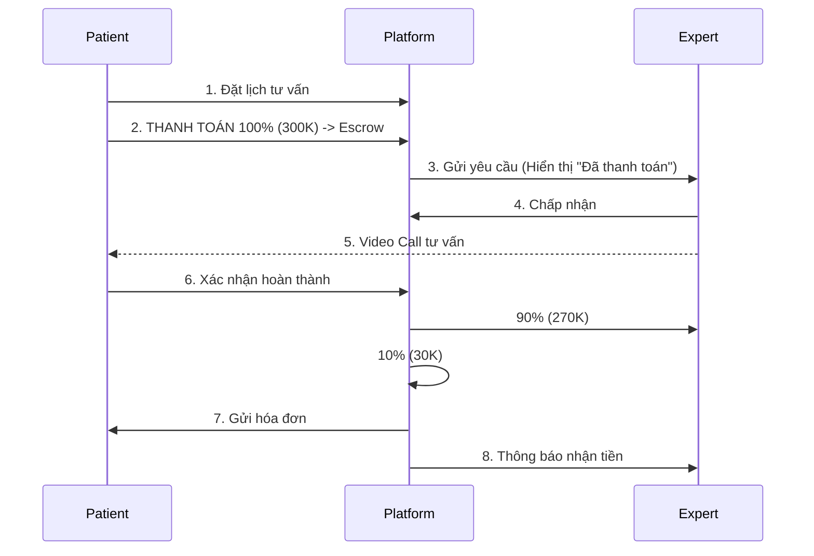
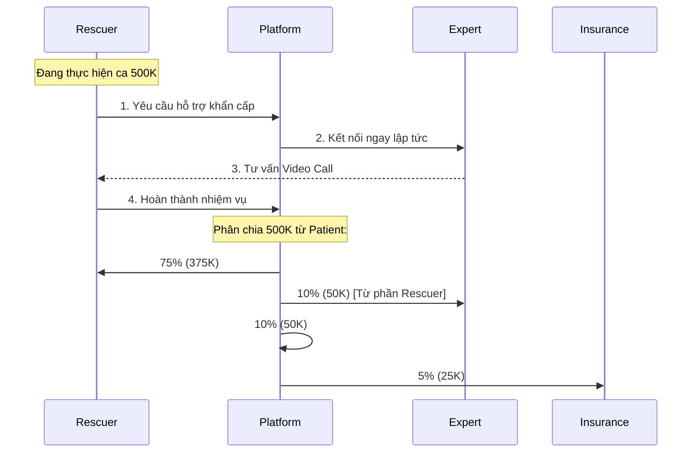
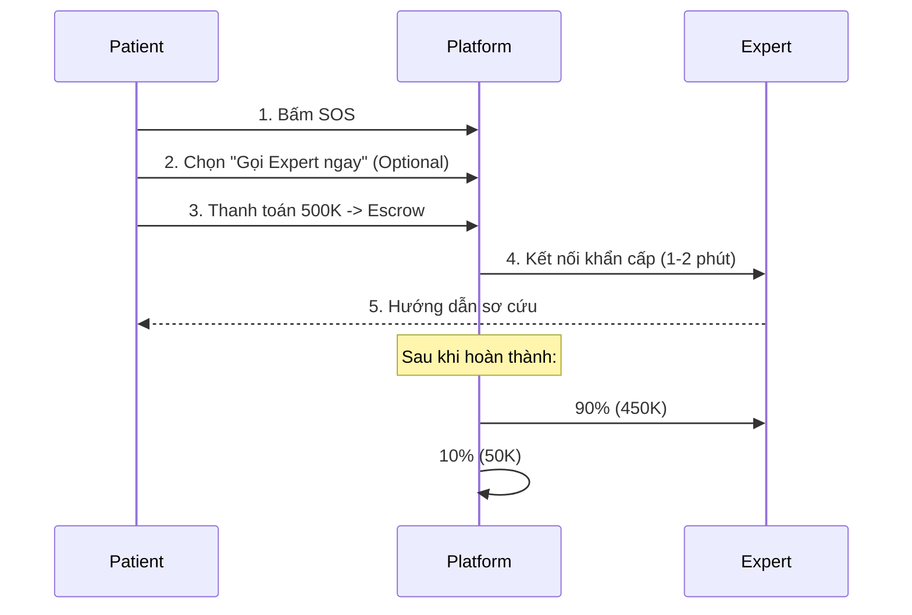

# LUỒNG TIỀN CHI TIẾT - HỆ THỐNG SNAKEAID

**Phiên bản:** 1.0
**Ngày tạo:** 14/12/2025
**Mục đích:** Làm rõ luồng tiền giữa các bên: Patient, Rescuer, Expert, và Platform

---

## 📌 TỔNG QUAN LUỒNG TIỀN

Hệ thống SnakeAid có **4 luồng thanh toán chính**:

1.  **Patient → Platform → Rescuer** (Dịch vụ cứu hộ rắn)
2.  **Patient → Platform → Expert** (Tư vấn chuyên gia trực tiếp)
3.  **Platform → Expert** hoặc **Rescuer → Expert** (Hỗ trợ khẩn cấp cho Rescuer)
4.  **Patient → Platform → Expert** (Tư vấn khẩn cấp qua SOS - Optional)

---

## 💰 CHI TIẾT CÁC LUỒNG THANH TOÁN

### 1. LUỒNG TIỀN: DỊCH VỤ CỨU HỘ RẮN

**Kịch bản:** Patient phát hiện rắn trong nhà → Yêu cầu đội cứu hộ đến bắt rắn → Rescuer thực hiện → Thanh toán

#### 1.1. Quy trình thanh toán

#### 1.2. Phân chia doanh thu chi tiết - RESCUE REQUEST

> [!EXAMPLE]
> **Ví dụ đơn hàng 575,000 VNĐ:**
> *   **Cọc trước (FIXED):** 150,000 VNĐ
> *   **Số dư sau:** 425,000 VNĐ

| Bên nhận | Tỷ lệ | Số tiền | Mục đích |
| :--- | :--- | :--- | :--- |
| **Rescuer** | 85% | 489,000 VNĐ | Thu nhập dịch vụ |
| **Platform** | 10% | 57,500 VNĐ | Phí vận hành |
| **Quỹ bảo hiểm** | 5% | 28,500 VNĐ | Bảo hiểm tai nạn Rescuer |
| **TỔNG** | **100%** | **575,000 VNĐ** | |

#### 1.3. Cơ chế Tiền Cọc (Anti-Ghosting)

<strong>🔍 Tại sao cần cọc 150,000 VNĐ? (Nhấn để xem chi tiết)</strong>

**Rủi ro nếu không cọc:**
1.  **Địa chỉ ảo:** Rescuer đến nơi không có ai.
2.  **Khách bùng:** "Rắn chạy rồi, không trả tiền".
3.  **Hủy ngang:** Hủy khi Rescuer đang đi.

**Giải pháp:** Cọc Fixed 150K bảo vệ Rescuer (bù chi phí xăng xe/thời gian) nhưng đủ nhỏ để Patient không ngại đặt.

**Xử lý các tình huống cọc:**

| Tình huống | Xử lý tiền cọc (150K) | Số dư (425K) |
| :--- | :--- | :--- |
| **Hoàn thành** | Tính vào tổng | Patient trả thêm |
| **Patient hủy SAU khi nhận** | Rescuer nhận 100% | Không trả |
| **Patient hủy TRƯỚC khi nhận** | Hoàn 100% Patient | Không trả |
| **Rescuer không đến** | Hoàn 100% Patient + Phạt Rescuer | Không trả |
| **Rắn tự chạy mất** | Chia đôi (75K mỗi bên) | Không trả |

---

### 2. LUỒNG TIỀN: TƯ VẤN CHUYÊN GIA

**Kịch bản:** Patient đặt lịch tư vấn → Thanh toán trước → Expert tư vấn

#### 2.1. Quy trình thanh toán (THANH TOÁN TRƯỚC)

#### 2.2. Phân chia doanh thu

> [!NOTE]
> **Quy tắc:** Thanh toán 100% trước, giữ trong Escrow. Hoàn tiền nếu Expert không đến.

| Bên nhận | Tỷ lệ | Số tiền (Ví dụ 300K) |
| :--- | :--- | :--- |
| **Expert** | 90% | 270,000 VNĐ |
| **Platform** | 10% | 30,000 VNĐ |

---

### 3. LUỒNG TIỀN: HỖ TRỢ KHẨN CẤP (RESCUER ↔ EXPERT)

**Kịch bản:** Rescuer gặp rắn khó → Gọi Expert hỗ trợ → Chia sẻ phí

#### 3.1. Quy trình thanh toán (Phương án 2: Chia sẻ)

#### 3.2. Tại sao Rescuer phải trả?

> [!TIP]
> **Lợi ích cho Rescuer dù mất 50K:**
> *   ✅ **An toàn:** Tránh bị rắn lạ cắn.
> *   ✅ **Tiết kiệm thời gian:** Xử lý nhanh (15p thay vì 1h) → Nhận thêm ca khác.
> *   ✅ **Uy tín:** Không bắt nhầm/xử lý sai.

---

### 4. LUỒNG TIỀN: TƯ VẤN KHẨN CẤP SOS (OPTIONAL)

**Kịch bản:** Patient bị rắn cắn → Gọi SOS → Chọn thêm Expert hỗ trợ

#### 4.1. Quy trình

**So sánh chi phí:**

| Tiêu chí | Tư vấn Thường | SOS Khẩn Cấp |
| :--- | :--- | :--- |
| **Giá** | 300,000 đ | **500,000 đ** |
| **Phản hồi** | 5-15 phút | **1-2 phút** |
| **Ưu tiên** | Bình thường | **Cao nhất** |
| **Mục đích** | Kiến thức | **Cứu người** |

---

## 🔒 TỔNG HỢP CÁC CHÍNH SÁCH BẢO VỆ

*   🛡️ **Escrow:** Tiền luôn được giữ trung gian cho đến khi dịch vụ hoàn tất.
*   🛡️ **Bảo hiểm:** 5% doanh thu cứu hộ luôn được trích vào quỹ bảo vệ Rescuer.
*   🛡️ **Anti-Fraud:**
    *   Cọc 150K để chống đơn ảo.
    *   GPS Tracking xác minh vị trí.
    *   Rating 2 chiều.

---

**📞 Hỗ trợ thanh toán:** payment@snakeaid.vn
