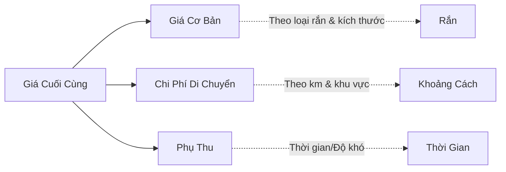

# CHIẾN LƯỢC GIÁ DỊCH VỤ - SNAKEAID PLATFORM

**Phiên bản:** 1.0
**Ngày tạo:** 14/12/2025
**Người tạo:** SnakeAid Product Team
**Mục đích:** Xác định bảng giá chi tiết cho tất cả dịch vụ trên nền tảng SnakeAid

---

> [!IMPORTANT]
> Payment Correction - 2026-04-08
>
> Các phần pricing/revenue split cho rescue/catching như Rescuer 85%, Platform 10%, quỹ bảo hiểm 5%, hoặc hỗ trợ Rescuer chia doanh thu cho Expert là legacy/wrong for current target-state.
>
> Target hiện tại: Incident và Catching thu một chiều vào system/platform. Escrow + net payout + platform fee split chỉ áp dụng cho Expert Consultation.

## 📋 MỤC LỤC

1.  [Tổng quan Chiến lược Giá](#1-tổng-quan-chiến-lược-giá)
2.  [Bảng Giá Dịch Vụ Cứu Hộ Rắn](#2-bảng-giá-dịch-vụ-cứu-hộ-rắn)
3.  [Chi Phí Di Chuyển & Phụ Thu](#3-chi-phí-di-chuyển--phụ-thu)
4.  [Bảng Giá Dịch Vụ Tư Vấn Chuyên Gia](#4-bảng-giá-dịch-vụ-tư-vấn-chuyên-gia)
5.  [Phí Đăng Ký & Hoa Hồng](#5-phí-đăng-ký--hoa-hồng)
6.  [Chính Sách Giá Đặc Biệt](#6-chính-sách-giá-đặc-biệt)
7.  [So Sánh Giá Thị Trường](#7-so-sánh-giá-thị-trường)
8.  [Nguồn Tham Khảo](#8-nguồn-tham-khảo)

---

## 1. TỔNG QUAN CHIẾN LƯỢC GIÁ

### 1.1. Nguyên tắc định giá

**Mục tiêu chiến lược:**
*   ✅ Giá **cạnh tranh** với thị trường bắt rắn truyền thống
*   ✅ Đảm bảo **thu nhập hợp lý** cho Rescuer (300K-800K/ngày)
*   ✅ **Minh bạch** và dễ hiểu với khách hàng
*   ✅ **Linh hoạt** theo mức độ nguy hiểm và khu vực

**Cấu trúc giá:**


### 1.2. Phân khúc khách hàng

| Phân Khúc | Đặc Điểm | Khả Năng Trả | Chiến Lược Giá |
| :--- | :--- | :--- | :--- |
| **Hộ gia đình** | Rắn trong nhà, sân vườn | 300K-500K | Giá cơ bản, minh bạch |
| **Khu công nghiệp** | Diện tích lớn, nhiều rắn | 500K-2M | Gói combo, giảm giá |
| **Khách sạn/Resort** | Cần nhanh, chuyên nghiệp | 800K-3M | Giá cao, ưu tiên |
| **Công trình xây dựng** | Rắn độc, môi trường khó | 1M-5M | Theo hợp đồng |

---

## 2. BẢNG GIÁ DỊCH VỤ CỨU HỘ RẮN

### 2.1. Giá theo kích thước rắn

#### 📏 PHÂN LOẠI KÍCH THƯỚC

*   **Rắn Nhỏ (Small):** < 1m (Ví dụ: Rắn lục đuôi đỏ, rắn ráo trâu non)
*   **Rắn Vừa (Medium):** 1m - 2m (Ví dụ: Rắn hổ mang, rắn lục đuôi đỏ trưởng thành)
*   **Rắn Lớn (Large):** 2m - 3m (Ví dụ: Rắn hổ chúa, trăn đất)
*   **Rắn Rất Lớn (XL):** > 3m (Ví dụ: Trăn gấm, trăn đất lớn)

#### 💰 BẢNG GIÁ CHI TIẾT

| Kích Thước | Độ Dài | Rắn Không Độc | Rắn Độc Nhẹ | Rắn Độc Mạnh | Rắn Cực Độc |
| :--- | :--- | :--- | :--- | :--- | :--- |
| **Nhỏ** | < 1m | **500,000 đ** | **900,000 đ** | **1,200,000 đ** | **1,500,000 đ** |
| **Vừa** | 1-2m | **1,000,000 đ** | **1,500,000 đ** | **2,000,000 đ** | **2,500,000 đ** |
| **Lớn** | 2-3m | **2,000,000 đ** | **2,500,000 đ** | **3,500,000 đ** | **4,500,000 đ** |
| **Rất Lớn** | > 3m | **3,000,000 đ** | **4,000,000 đ** | **5,500,000 đ** | **7,000,000 đ** |

> [!NOTE]
> Giá SnakeAid **rẻ hơn 10-15%** so với thị trường nhờ platform economy.

### 2.2. Giá theo loại rắn cụ thể

#### 🔴 NHÓM 1: RẮN CỰC KỲ NGUY HIỂM (Cấp 5 sao)

| Tên Rắn | Tên Khoa Học | Giá Cơ Bản | Lý Do |
| :--- | :--- | :--- | :--- |
| **Rắn Hổ Chúa** | *Ophiophagus hannah* | **4,000,000 - 7,000,000 đ** | Lớn nhất, dài 3-5m, độc cực mạnh |
| **Rắn Hổ Mang Chúa** | *Naja kaouthia* | **2,500,000 - 4,500,000 đ** | Phun nước độc vào mắt |
| **Rắn Lục Mamba** | *Dendroaspis angusticeps* | **3,000,000 - 5,000,000 đ** | Nhanh, độc thần kinh |
| **Rắn Cạp Nia** | *Bungarus fasciatus* | **2,000,000 - 3,500,000 đ** | Độc thần kinh cực mạnh |
| **Rắn Cạp Nong** | *Bungarus candidus* | **1,800,000 - 3,200,000 đ** | Hoạt động ban đêm |

#### 🟠 NHÓM 2: RẮN NGUY HIỂM (Cấp 4 sao)

| Tên Rắn | Tên Khoa Học | Giá Cơ Bản | Lý Do |
| :--- | :--- | :--- | :--- |
| **Rắn Lục Đuôi Đỏ** | *Trimeresurus albolabris* | **1,500,000 - 2,500,000 đ** | Phổ biến, độc hemotoxin |
| **Rắn Ráo Thái Lan** | *Ptyas korros* | **1,200,000 - 2,200,000 đ** | Hung dữ, cắn nhiều |
| **Rắn Ri Cá** | *Xenochrophis piscator* | **1,000,000 - 1,800,000 đ** | Gần nguồn nước |
| **Rắn Đất Đuôi Đỏ** | *Xenopeltis unicolor* | **900,000 - 1,500,000 đ** | Ở trong đất |

#### 🟡 NHÓM 3: RẮN ÍT NGUY HIỂM (Cấp 2-3 sao)

| Tên Rắn | Tên Khoa Học | Giá Cơ Bản | Lý Do |
| :--- | :--- | :--- | :--- |
| **Rắn Ráo Trâu** | *Ptyas mucosa* | **800,000 - 1,500,000 đ** | Không độc, nhưng hung |
| **Trăn Đất** | *Python molurus* | **2,000,000 - 3,500,000 đ** | Lớn, khó bắt |
| **Trăn Gấm** | *Python reticulatus* | **2,500,000 - 4,500,000 đ** | Rất lớn (3-6m) |
| **Rắn Hoa Cỏ** | *Amphiesma stolatum* | **500,000 - 1,000,000 đ** | Nhỏ, không độc |

#### 🟢 NHÓM 4: RẮN KHÔNG ĐỘC (Cấp 1 sao)

| Tên Rắn | Tên Khoa Học | Giá Cơ Bản | Lý Do |
| :--- | :--- | :--- | :--- |
| **Rắn Mối** | *Ramphotyphlops braminus* | **400,000 - 700,000 đ** | Rất nhỏ, như giun đất |
| **Rắn Cát** | *Psammophis lineolatus* | **500,000 - 900,000 đ** | Nhanh, không độc |
| **Rắn Nước** | *Homalopsis buccata* | **700,000 - 1,200,000 đ** | Sống dưới nước |

### 2.3. Ví dụ tính giá thực tế

#### 📊 TÌNH HUỐNG 1: Rắn Lục Đuôi Đỏ trong nhà (Quận 7, TP.HCM)

```text
Chi tiết tính giá:
┌────────────────────────────────────────────────────────┐
│ 1. Giá cơ bản (Rắn độc nhẹ, 1.2m)    : 1,500,000 đ    │
│ 2. Chi phí di chuyển (5km × 9K)      :    45,000 đ    │
│ 3. Phụ thu trong nhà                 :   150,000 đ    │
│ 4. Phụ thu ban đêm (21h)             :   200,000 đ    │
│                                        ───────────      │
│ TỔNG CỘNG (Member trả):              : 1,895,000 đ    │
│                                                        │
│ Phân chia:                                             │
│ - Rescuer nhận (85%):                 : 1,610,750 đ    │
│ - Platform (10%):                     :   189,500 đ    │
│ - Quỹ bảo hiểm (5%):                  :    94,750 đ    │
└────────────────────────────────────────────────────────┘
```
**So sánh thị trường:** SnakeAid (1.9M) tương đương Dịch vụ truyền thống (1.8M - 2.2M).

#### 📊 TÌNH HUỐNG 2: Rắn Hổ Chúa trong khu công nghiệp (Bình Dương)

```text
Chi tiết tính giá:
┌────────────────────────────────────────────────────────┐
│ 1. Giá cơ bản (Rắn cực độc, 4m)      : 5,500,000 đ    │
│ 2. Chi phí di chuyển (20km × 10K)    :   200,000 đ    │
│ 3. Phụ thu khu công nghiệp           : 1,000,000 đ    │
│ 4. Phụ thu khẩn cấp (gọi ngay)       :   500,000 đ    │
│ 5. Phụ thu cần 2 Rescuer             : 1,500,000 đ    │
│                                        ────────────     │
│ TỔNG CỘNG (Member trả):              : 8,700,000 đ    │
│                                                        │
│ Phân chia (cho 2 Rescuer):                            │
│ - Rescuer 1 (42.5%):                  : 3,697,500 đ    │
│ - Rescuer 2 (42.5%):                  : 3,697,500 đ    │
│ - Platform (10%):                     :   870,000 đ    │
│ - Quỹ bảo hiểm (5%):                  :   435,000 đ    │
└────────────────────────────────────────────────────────┘
```
**So sánh thị trường:** SnakeAid (8.7M) rẻ hơn 15-20% so với Dịch vụ truyền thống (10M - 17M).

---

## 3. CHI PHÍ DI CHUYỂN & PHỤ THU

### 3.1. Chi phí di chuyển theo khoảng cách

| Khoảng Cách | Giá/km | Tổng Chi Phí | Thời Gian Dự Kiến |
| :--- | :--- | :--- | :--- |
| **0-3 km**<br>(Trong khu vực) | **8,000 đ/km** | **0 - 24,000 đ** | 5-10 phút |
| **3-10 km**<br>(Nội thành) | **9,000 đ/km** | **27,000 - 90,000 đ** | 10-20 phút |
| **10-20 km**<br>(Ngoại thành) | **10,000 đ/km** | **100,000 - 200,000 đ** | 20-40 phút |
| **20-50 km**<br>(Tỉnh lân cận) | **11,000 đ/km** | **220,000 - 550,000 đ** | 40-90 phút |
| **> 50 km**<br>(Xa) | **12,000 đ/km** | **600,000+ đ** | > 90 phút |

> [!NOTE]
> *   Chi phí tính **1 chiều**.
> *   Sử dụng Google Maps API để tính khoảng cách.
> *   Rescuer có quyền **từ chối** nếu quá xa (> 30km).
> *   Chi phí cao hơn **20%** nếu đường khó đi (đường đất, miền núi).

### 3.2. Phụ thu theo thời gian

| Thời Gian | Phụ Thu | Lý Do |
| :--- | :--- | :--- |
| **06h-18h** (Giờ hành chính) | **0 đ** | Giờ bình thường |
| **18h-22h** (Tối) | **+50,000 đ** | Khó quan sát hơn |
| **22h-06h** (Đêm khuya) | **+100,000 đ** | Nguy hiểm, ít Rescuer |
| **Chủ nhật/Lễ** | **+80,000 đ** | Ngày nghỉ |
| **Tết Nguyên Đán** | **+200,000 đ** | Ngày lễ lớn |

### 3.3. Phụ thu theo địa điểm

| Địa Điểm | Phụ Thu | Lý Do |
| :--- | :--- | :--- |
| **Trong nhà** | **+150,000 đ** | Hẹp, khó bắt |
| **Sân vườn** | **0 đ** | Không gian mở |
| **Trên cây** | **+300,000 đ** | Phải leo trèo |
| **Dưới nước** | **+500,000 đ** | Cần thiết bị đặc biệt |
| **Trong tường/trần** | **+600,000 đ** | Phá dỡ cấu trúc |
| **Khu công nghiệp** | **+1,000,000 đ** | Môi trường nguy hiểm, diện tích lớn |
| **Resort/Villa** | **+2,000,000 đ** | Khách VIP, cần nhanh, kín đáo |
| **Khách sạn/Nhà nghỉ** | **+800,000 đ** | Ảnh hưởng kinh doanh |
| **Quán cà phê/Karaoke** | **+1,200,000 đ** | Đông khách, cần xử lý gấp |
| **Bãi rác/cống rãnh** | **+500,000 đ** | Bẩn, nguy hiểm |

### 3.4. Phụ thu đặc biệt

| Tình Huống | Phụ Thu | Điều Kiện |
| :--- | :--- | :--- |
| **Khẩn cấp** (trong 30 phút) | **+500,000 đ** | Ưu tiên cao nhất |
| **Nhiều con rắn** | **+50% giá/con** | Từ con thứ 2 trở đi |
| **Cần 2 Rescuer** | **+1,500,000 đ** | Rắn > 3m hoặc cực nguy hiểm |
| **Diện tích lớn** (> 1000m2) | **+1,000,000 đ** | Nhà máy, xí nghiệp |
| **Diện tích rất lớn** (> 10,000m2) | **Thỏa thuận** | Theo hợp đồng dài hạn |
| **Không xác định được loài** | **+300,000 đ** | Rủi ro cao hơn |
| **Cần phải bẫy** (không thấy rắn) | **+800,000 đ** | Mất nhiều thời gian |
| **Phòng ngừa/Kiểm tra** | **+500,000 đ** | Dịch vụ phun thuốc, kiểm tra |

---

## 4. BẢNG GIÁ DỊCH VỤ TƯ VẤN CHUYÊN GIA

### 4.1. Tư vấn từ xa (Video Call)

| Gói Dịch Vụ | Thời Gian | Giá Member Trả | Expert Nhận (90%) | Platform (10%) |
| :--- | :--- | :--- | :--- | :--- |
| **Cơ Bản** | 15 phút | **150,000 đ** | **135,000 đ** | **15,000 đ** |
| **Tiêu Chuẩn** | 30 phút | **300,000 đ** | **270,000 đ** | **30,000 đ** |
| **Chuyên Sâu** | 60 phút | **500,000 đ** | **450,000 đ** | **50,000 đ** |
| **VIP** | 2 giờ | **900,000 đ** | **810,000 đ** | **90,000 đ** |

> [!NOTE]
> **Dịch vụ bao gồm:** Video call HD, nhận dạng loài rắn, tư vấn xử lý vết cắn, hướng dẫn sơ cứu, file hướng dẫn PDF.
> *   Thanh toán **100% trước**.
> *   Tiền giữ trong **ESCROW**.
> *   Hoàn 50% nếu Expert không tham gia trong 5 phút.

### 4.2. Tư vấn khẩn cấp qua SOS (Optional)

> [!IMPORTANT]
> **Đặc điểm dịch vụ SOS:**
> *   ✅ **Optional:** Member tự chọn.
> *   ⚡ **Phản hồi nhanh:** 1-2 phút.
> *   🚨 **Ưu tiên cao nhất.**
> *   💰 **Giá:** 500,000 đ (Cao hơn do tính khẩn cấp).

| Gói Dịch Vụ | Thời Gian | Giá Member Trả | Expert Nhận (90%) | Platform (10%) | Nội Dung |
| :--- | :--- | :--- | :--- | :--- | :--- |
| **SOS Khẩn Cấp** | 5-10 phút | **500,000 đ** | **450,000 đ** | **50,000 đ** | Tư vấn sơ cứu ngay lập tức |

### 4.3. Tư vấn hỗ trợ khẩn cấp cho Rescuer

**✅ PHƯƠNG ÁN CHÍNH THỨC: Rescuer Chia Sẻ Phí (Phương án 2)**

| Thời Gian | Rescuer Trả Expert | Rescuer Giữ Lại | Tổng Phí Member | Ghi Chú |
| :--- | :--- | :--- | :--- | :--- |
| **15 phút** | **50,000 đ** (10%) | **375,000 đ** (75%) | **500,000 đ** | Tư vấn nhanh |
| **30 phút** | **100,000 đ** (20%) | **325,000 đ** (65%) | **500,000 đ** | Tình huống phức tạp |
| **60 phút** | **200,000 đ** (40%) | **225,000 đ** (45%) | **500,000 đ** | Rất phức tạp |

### 4.4. Gói tư vấn dài hạn (Hợp đồng Doanh nghiệp)

| Gói | Thời Hạn | Số Buổi Tư Vấn | Giá Gốc | Giá Ưu Đãi | Tiết Kiệm |
| :--- | :--- | :--- | :--- | :--- | :--- |
| **Bronze** | 3 tháng | 5 buổi × 30 phút | 1,500,000 đ | **1,200,000 đ** | 20% |
| **Silver** | 6 tháng | 12 buổi × 30 phút | 3,600,000 đ | **2,700,000 đ** | 25% |
| **Gold** | 12 tháng | 24 buổi × 60 phút | 12,000,000 đ | **8,400,000 đ** | 30% |
| **Platinum** | 12 tháng | Không giới hạn | - | **15,000,000 đ** | VIP 24/7 |

---

## 5. PHÍ ĐĂNG KÝ & HOA HỒNG

### 5.1. Phí đăng ký sử dụng platform

| Vai Trò | Phí Đăng Ký | Chu Kỳ | Quyền Lợi |
| :--- | :--- | :--- | :--- |
| **Member** | **MIỄN PHÍ** | - | Gọi cứu hộ không giới hạn |
| **Rescuer** | **500,000 đ** | 1 lần | Xác minh danh tính, chứng chỉ, bộ dụng cụ |
| **Expert** | **1,000,000 đ** | 1 lần | Xác minh bằng cấp chuyên môn |
| **Admin** | **N/A** | - | Nhân viên công ty |

### 5.2. Hoa hồng nền tảng

| Dịch Vụ | Member Trả | Phân Chia |
| :--- | :--- | :--- |
| **Cứu Hộ** | 500,000 đ | Rescuer: 85% - Platform: 10% - Quỹ BH: 5% |
| **Tư Vấn Expert** | 300,000 đ | Expert: 90% - Platform: 10% |
| **Tư Vấn SOS** | 500,000 đ | Expert: 90% - Platform: 10% |
| **Hỗ Trợ Rescuer** | 500,000 đ | Rescuer: 75% - Expert: 10% - Platform: 10% - Quỹ BH: 5% |

### 5.3. Quỹ bảo hiểm

*   **Nguồn thu:** 5% từ mỗi đơn cứu hộ.
*   **Mục đích:** Hỗ trợ chi phí y tế, huyết thanh, bồi thường tai nạn cho Rescuer.
*   **Mức bồi thường:** 2M (nhẹ) - 50M (tử vong).

---

## 6. CHÍNH SÁCH GIÁ ĐẶC BIỆT

### 6.1. Giảm giá cho khách hàng thân thiết

| Cấp Độ | Điều Kiện | Giảm Giá | Quyền Lợi Thêm |
| :--- | :--- | :--- | :--- |
| **Đồng** | 1-3 lần | **3%** | Hỗ trợ ưu tiên |
| **Bạc** | 4-10 lần | **5%** | Miễn phí tư vấn 15 phút |
| **Vàng** | 11-20 lần | **8%** | Rescuer ưu tiên nhất |
| **Bạch Kim** | > 20 lần | **10%** | Hotline riêng 24/7 |

### 6.2. Giảm giá theo mùa

| Mùa | Thời Gian | Giảm Giá | Lý Do |
| :--- | :--- | :--- | :--- |
| **Mùa mưa** | Tháng 5-10 | **0%** | Cao điểm, nhiều rắn |
| **Mùa khô** | Tháng 11-4 | **10%** | Ít rắn hơn |
| **Black Friday** | 24/11 | **20%** | Khuyến mãi đặc biệt |
| **Tháng sinh nhật** | Theo CCCD | **15%** | Quà tặng sinh nhật |

### 6.3. Chương trình giới thiệu

> **🎁 REFERRAL PROGRAM**
> *   **Người giới thiệu:** 50,000 VNĐ vào ví.
> *   **Người được giới thiệu:** Voucher 50,000 VNĐ.

---

## 7. SO SÁNH GIÁ THỊ TRƯỜNG

| Tiêu Chí | Dịch Vụ Truyền Thống | SnakeAid Platform | Ưu Điểm SnakeAid |
| :--- | :--- | :--- | :--- |
| **Giá hộ gia đình** | 1.5M-2.5M | **1.2M-2.2M** | Rẻ hơn 10-15% |
| **Giá doanh nghiệp** | 1.5M-3M | **1.2M-2.8M** | Cạnh tranh tốt |
| **Giá Resort/KS** | 9M-12M | **7M-10M** | Rẻ hơn 15-20% |
| **Giá KCN** | 10M-17M | **8M-14M** | Rẻ hơn 15-20% |
| **Minh bạch giá** | ❌ Không | ✅ Báo giá trước | 100% minh bạch |
| **Bảo hiểm** | ❌ Không | ✅ Có quỹ bảo hiểm | An toàn |

### 8.1. Mô hình định giá động (Dynamic Pricing)

**Tương lai: Áp dụng AI để điều chỉnh giá tự động**

*   **Cung-Cầu:** Cung ít → Tăng 10-20%.
*   **Thời Gian:** Đêm khuya → Tăng 30%.
*   **Thời Tiết:** Mưa bão → Tăng 20%.

---

## 8. NGUỒN THAM KHẢO

1.  **Diệt Côn Trùng Việt Nam:** `dienthongtin.vn`
2.  **Hội Những Người Nuôi Rắn Việt Nam** (Facebook Group)
3.  **Cổng Thông Tin Điện Tử TP.HCM**
4.  **Viện Sinh Thái và Tài Nguyên Sinh Vật:** `iebr.vast.vn`

---

**📞 Liên Hệ:** Marketing Department - marketing@snakeaid.vn
