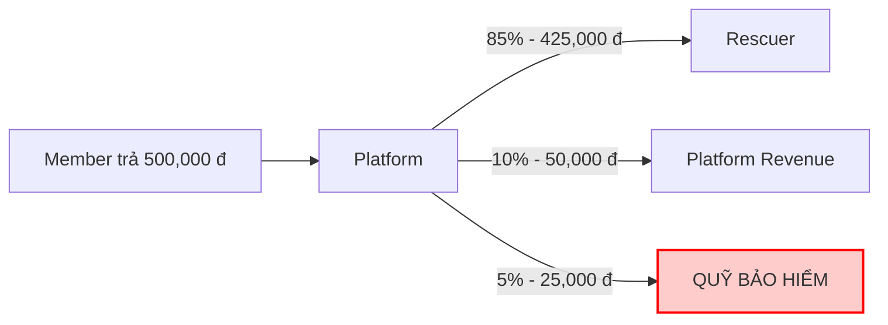
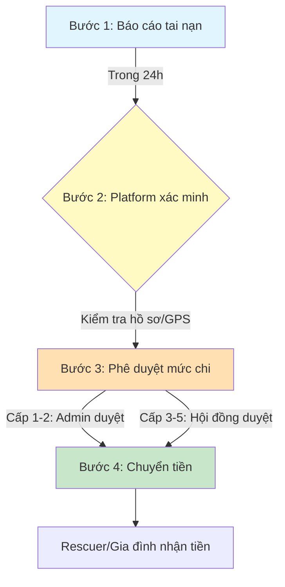

# QUỸ BẢO HIỂM TAI NẠN - SNAKEAID

**Phiên bản:** 1.0
**Ngày:** 14/12/2025
**Mục đích:** Chi tiết về quỹ bảo hiểm 5% cho Rescuer

---

## 1. TỔNG QUAN

### 1.1. Nguồn thu

> [!NOTE]
> **Cơ chế:** Mỗi đơn cứu hộ → **5%** vào quỹ bảo hiểm

**Ví dụ:**


### 1.2. Quản lý

*   **Người quản lý:** Platform (Admin)
*   **Minh bạch:** Công khai số dư hàng tháng
*   **Kiểm toán:** Quý/năm bởi đơn vị độc lập

---

## 2. MỨC BỒI THƯỜNG

### 2.1. Bảng mức chi trả

| Mức Độ | Triệu Chứng | Bồi Thường | Thời Gian Chi |
| :--- | :--- | :--- | :--- |
| **Cấp 1** | Cắn nhẹ, không nhập viện | **2,000,000 đ** | 24h |
| **Cấp 2** | Nhập viện 1-3 ngày | **5,000,000 đ** | 48h |
| **Cấp 3** | Nhập viện > 3 ngày | **10,000,000 đ** | 72h |
| **Cấp 4** | Di chứng lâu dài | **20,000,000 đ** | 7 ngày |
| **Cấp 5** | Tử vong | **50,000,000 đ** | Gia đình nhận |

### 2.2. Chi phí được chi trả

> [!TIP]
> **✅ ĐƯỢC HỖ TRỢ**
> *   Viện phí, thuốc men
> *   Huyết thanh kháng nọc độc (1-2 triệu/lọ)
> *   Chi phí cấp cứu, xe cứu thương
> *   Phục hồi chức năng
> *   Bồi thường nghỉ việc (theo mức độ)

> [!WARNING]
> **❌ KHÔNG ĐƯỢC HỖ TRỢ**
> *   Rescuer không tuân thủ quy trình an toàn
> *   Không mặc đồ bảo hộ
> *   Say xỉn khi làm việc
> *   Cố ý gây nguy hiểm

---

## 3. QUY TRÌNH GIẢI NGÂN

### 3.1. Bước xử lý



1.  **[Bước 1] Rescuer/gia đình báo tai nạn (24h)**
2.  **[Bước 2] Platform xác minh (48h)**
    *   Kiểm tra hồ sơ y tế
    *   Xác nhận Rescuer đang làm việc
    *   Xem camera/GPS nếu cần
3.  **[Bước 3] Phê duyệt mức chi (24h)**
    *   Cấp 1-2: Admin duyệt
    *   Cấp 3-5: Hội đồng duyệt
4.  **[Bước 4] Chuyển tiền (24h)**
    *   Vào tài khoản Rescuer/gia đình

### 3.2. Thời gian giải ngân

*   **Cấp 1-2:** Trong 24-48 giờ
*   **Cấp 3-4:** Trong 72 giờ - 7 ngày
*   **Cấp 5:** Trong 7-14 ngày (xác minh kỹ)

---

## 4. TÍNH TOÁN QUỸ

### 4.1. Dự toán thu nhập quỹ

**Giả định:** 100 ca/ngày × 500K × 5% = 2,500,000 đ/ngày

| Thời Gian | Thu Nhập Quỹ | Ghi Chú |
| :--- | :--- | :--- |
| **Ngày** | 2,500,000 đ | 100 ca × 25K |
| **Tháng** | 75,000,000 đ | 30 ngày |
| **Năm** | 900,000,000 đ | 12 tháng |

### 4.2. Dự toán chi phí

**Theo thống kê ngành:**
*   Tỷ lệ tai nạn: 2-3% Rescuer/năm
*   100 Rescuer → 2-3 ca tai nạn/năm
*   Chi phí trung bình: 5-10 triệu/ca

**Tính toán:**
*   Thu: 900 triệu/năm
*   Chi: 15-30 triệu/năm (2-3 ca × 10 triệu)
*   **Dư:** 870-885 triệu/năm

### 4.3. Sử dụng tiền dư

> [!NOTE]
> **✅ ĐƯỢC PHÉP**
> *   Mua huyết thanh dự trữ (300-500 triệu)
> *   Bảo hiểm bổ sung cho Rescuer
> *   Đào tạo an toàn lao động
> *   Nâng cấp trang thiết bị bảo hộ

> [!CAUTION]
> **❌ KHÔNG ĐƯỢC**
> *   Chi cho mục đích khác ngoài an toàn Rescuer
> *   Platform không được "vay mượn" quỹ này

---

## 5. CÁC TÌNH HUỐNG THỰC TẾ

### Tình huống 1: Cắn nhẹ

> **Rescuer Nguyễn Văn A bị rắn lục đuôi đỏ cắn vào tay**
> *   **Triệu chứng:** Sưng, đau, không nguy hiểm
> *   **Điều trị:** Ngoại trú, uống thuốc 3 ngày
> *   **Chi phí:** 800,000 đ
> *   **👉 Quỹ chi trả:** **2,000,000 đ** (bao gồm tiền công nghỉ việc 2 ngày)

### Tình huống 2: Cắn nặng

> **Rescuer Trần Văn B bị rắn hổ mang cắn**
> *   **Triệu chứng:** Nguy kịch, khó thở
> *   **Điều trị:** Nhập viện 5 ngày, dùng huyết thanh
> *   **Chi phí:** 8,500,000 đ (viện phí + huyết thanh)
> *   **👉 Quỹ chi trả:** **10,000,000 đ** (đủ chi phí + bồi thường nghỉ việc 2 tuần)

### Tình huống 3: Tử vong

> **Rescuer Lê Văn C (33 tuổi, 2 con nhỏ) bị rắn hổ chúa cắn tử vong**
> *   **Hoàn cảnh:** Trụ cột gia đình
> *   **👉 Quỹ chi trả:** **50,000,000 đ** cho vợ và 2 con
> *   **Thêm:** Platform hỗ trợ thêm 20 triệu (tự nguyện)
> *   **TỔNG:** **70,000,000 đ**

---

## 6. GIÁM SÁT & BÁO CÁO

### 6.1. Báo cáo công khai

**Hàng tháng (trên app):**
*   Số dư quỹ đầu tháng
*   Thu trong tháng (số ca × 25K)
*   Chi trong tháng (số tai nạn × mức chi)
*   Số dư cuối tháng

**Ví dụ báo cáo tháng 12/2025:**
```text
┌─────────────────────────────────────────┐
│      QUỸ BẢO HIỂM - THÁNG 12/2025       │
├─────────────────────────────────────────┤
│ Số dư đầu tháng:        850,000,000 đ   │
│ Thu trong tháng:         75,000,000 đ   │
│   (3,000 ca × 25,000đ)                  │
│ Chi trong tháng:        -10,000,000 đ   │
│   - 1 ca cấp 3 (Anh Minh): 10M          │
│ Số dư cuối tháng:       915,000,000 đ   │
│                                         │
│ Huyết thanh dự trữ: 50 lọ (80M)         │
└─────────────────────────────────────────┘
```

### 6.2. Kiểm toán độc lập

*   **Quý:** Kiểm toán nội bộ
*   **Năm:** Công ty kiểm toán bên ngoài
*   **Báo cáo:** Công khai 100% trên website

---

## 7. CAM KẾT PLATFORM

> [!IMPORTANT]
> **✅ Platform cam kết:**
> 1.  **100%** tiền 5% vào quỹ bảo hiểm (không giữ lại)
> 2.  Không sử dụng quỹ cho mục đích khác
> 3.  Công khai minh bạch hàng tháng
> 4.  Giải ngân nhanh chóng (24-72h)
> 5.  Hỗ trợ tối đa khi Rescuer gặp nạn

> **✅ Rescuer được quyền:**
> 1.  Xem báo cáo quỹ bất cứ lúc nào
> 2.  Khiếu nại nếu không được chi trả
> 3.  Đề xuất cải thiện quy trình

---

## 8. SO SÁNH THỊ TRƯỜNG

| Platform | Bảo Hiểm | Mức Chi | Độ Minh Bạch |
| :--- | :--- | :--- | :--- |
| **SnakeAid** | ✅ 5% quỹ riêng | 2M - 50M | ⭐⭐⭐⭐⭐ Công khai |
| **Grab** | ✅ BHTN riêng | Theo hợp đồng | ⭐⭐⭐ Ít công khai |
| **Thợ tự do** | ❌ Không có | 0đ | ❌ Không |

**Ưu điểm SnakeAid:**
*   Quỹ riêng, không phụ thuộc bảo hiểm bên ngoài
*   Chi trả nhanh (24-72h vs 30-60 ngày BHTN)
*   Minh bạch 100%

---

## 9. CÂU HỎI THƯỜNG GẶP

**Q1: Nếu quỹ không đủ chi thì sao?**
A: Platform bù từ ngân sách riêng. Rescuer luôn được bảo vệ 100%.

**Q2: Rescuer mới có được bảo hiểm không?**
A: Có, ngay từ ca đầu tiên.

**Q3: Tiền dư quỹ có được chia cho Rescuer không?**
A: Không. Dùng để mua huyết thanh dự trữ và đào tạo an toàn.

**Q4: Nếu Rescuer làm sai quy trình thì sao?**
A: Vẫn được hỗ trợ y tế, nhưng mức bồi thường giảm 50%.

**Q5: Gia đình có được hỗ trợ không?**
A: Có, trong trường hợp tử vong hoặc di chứng nặng.

---

**📞 Liên Hệ Khẩn Cấp:**
Hotline Bảo Hiểm: **1900-xxxx-99** (24/7)

**Cập nhật:** 14/12/2025
