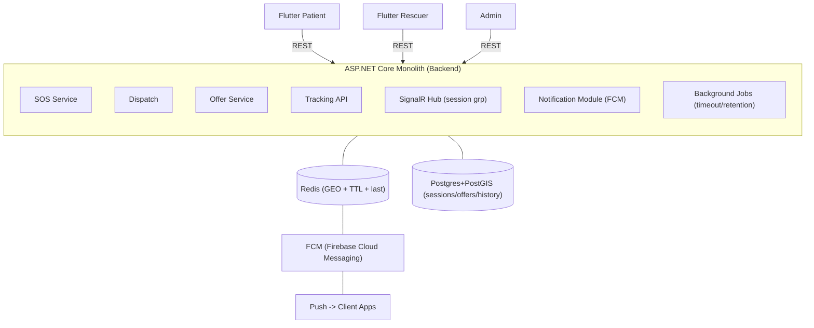

# SnakeAid – Live Location Tracking (LLT) Design & Tech Stack

Tài liệu này tổng hợp toàn bộ quyết định kỹ thuật và cách triển khai **In-app Live Location Tracking** cho SnakeAid (ASP.NET monolith + Flutter), bao gồm realtime streaming, dispatch cứu hộ, map visualization, push fallback, audit/history và geo-analytics.

---

## 1. Mục tiêu nghiệp vụ

### 1.1 Các vai trò

* **Patient**: báo SOS, theo dõi rescuer đang tới, xem route/ETA, nhận thông báo trạng thái.
* **Rescuer**: nhận “cuốc” cứu hộ, chấp nhận/từ chối, chia sẻ vị trí realtime, điều hướng tới hiện trường.
* **Admin**: giám sát các rescue đang diễn ra, xem phân bố ca rắn theo vùng, heatmap.

### 1.2 Kết quả cần đạt

* Realtime tracking ổn định trong phiên cứu hộ.
* Dispatch nhanh: tìm rescuer gần nhất, push popup như Grab.
* Fallback khi realtime socket không tới.
* Lưu được lịch sử và phục vụ phân tích không gian.

---

## 2. Nguyên lý kiến trúc cốt lõi

### 2.1 Phân tách NOW và PAST

* **Redis = NOW**

  * Dữ liệu volatile, realtime, có TTL.
  * Geo query nhanh để matching.
  * Lưu last-known + presence.
* **PostgreSQL + PostGIS = PAST**

  * Lưu bền vững incident/session/offer.
  * Lưu lịch sử location_events (audit/replay).
  * Geo-analytics: heatmap, polygon zone, clustering.

### 2.2 Realtime transport và Push

* **SignalR**: realtime streaming trong app khi đang mở.
* **FCM**: push notification cho các tình huống SignalR không “với tới” (app bị kill, network drop, OS throttling, không ở foreground).

---

## 3. Tech stack cho LLT

### 3.1 Client

* **Flutter**

  * GPS capture: `geolocator`.
  * Map: Google Maps / Mapbox / MapTiler (tuỳ lựa chọn), hiển thị marker, polyline, heatmap layer.
  * Realtime: SignalR client.
  * Push: Firebase Cloud Messaging.
  * State: Riverpod.

### 3.2 Backend

* **ASP.NET Core Monolith**

  * REST APIs: CRUD + snapshot map.
  * SignalR Hub: streaming location, group broadcast.
  * Notification module: gửi FCM.
  * Background jobs: Hangfire hoặc Quartz.NET.
  * Auth: JWT + Authorization Policies; RBAC bằng Roles/Claims.
  * Rate limit: .NET built-in hoặc AspNetCoreRateLimit.

### 3.3 Data

* **Redis**

  * GEO: proximity search, shard theo geohash prefix.
  * TTL/presence.
  * Atomic logic: Lua script (EVAL) cho lock/accept.
* **PostgreSQL + PostGIS**

  * Incident/session/offer.
  * Location history.
  * Spatial analytics.

### 3.4 Observability

* Serilog (logs), Prometheus + Grafana (metrics), dashboard admin.

---

## 4. Backend modules trong monolith

Trong khung `ASP.NET Web API`, tách theo nghiệp vụ:

1. **SOS / Incident Service**

   * Tạo incident khi patient báo SOS.
   * Tạo rescue_session.

2. **Dispatch / Matching Service**

   * Query Redis GEO để tìm rescuer gần nhất.
   * Filter theo availability/presence.
   * Ranking theo rule (rating, distance, workload).

3. **Offer Service**

   * Tạo offer pending.
   * Nhận accept/reject.
   * Timeout → redispatch.
   * Quyết định fallback FCM.

4. **Tracking API**

   * `GET snapshot`: lấy last-known từ Redis, fallback PostGIS.
   * `GET history`: lấy location_events từ PostGIS.

5. **SignalR Hub**

   * Nhận publish location.
   * Broadcast tới group theo session.
   * Update Redis last-known + presence TTL.

6. **Notification Module**

   * Gửi push qua FCM.

7. **Background Jobs**

   * Offer timeout.
   * Aggregation/retention.
   * ETA recompute (tuỳ chọn).

---

## 5. Hai flow runtime bắt buộc

### 5.1 Flow A – Dispatch cuốc cứu hộ

Mục tiêu: tìm rescuer phù hợp, bật popup nhận cuốc, fallback push.

**Trình tự**

1. Patient gọi REST `CreateSOS`.
2. `SOS Service` ghi Postgres: incident + session.
3. `Dispatch Service` query Redis GEO (radius tăng dần).
4. `Offer Service` tạo offer pending (Postgres).
5. `Offer Service` push `NewOffer` qua SignalR tới rescuer.
6. Rescuer accept/reject.
7. Nếu accept → set lock, assign session.
8. Nếu không ACK/không online → `Notification Module` gửi FCM.

**Điểm nhấn**

* Offer Service là “nút giao” giữa Redis geo, Postgres state, SignalR transport, FCM fallback.

### 5.2 Flow B – Live Tracking trong session

Mục tiêu: rescuer stream location realtime, patient/admin xem map.

**Trình tự**

1. Rescuer publish location qua SignalR `PublishLocation`.
2. Hub update Redis:

   * `last-known`
   * `presence TTL`
3. Hub broadcast `LocationUpdated` tới group `session:{id}`.
4. Patient/Admin mở map:

   * REST snapshot trước.
   * join SignalR group để nhận stream.
5. Optional: backend append location_event vào PostGIS theo nhịp thưa.

---

## 6. Khi nào SignalR không tới và cần FCM

Dù rescuer “đang bật app”, vẫn có nhiều tình huống realtime socket fail:

* App bị OS kill/low memory.
* Network chuyển Wi-Fi ↔ 4G, NAT đổi, websocket drop.
* App vào background, OS throttling.
* Người dùng bật chế độ tiết kiệm pin.
* Proxy/captive portal.

Nguyên tắc:

* **SignalR = kênh chính** (nếu kết nối còn sống).
* **FCM = kênh dự phòng** cho event quan trọng: `NewOffer`, `OfferExpiring`, `SessionCancelled`, `RescuerAssigned`.

---

## 7. Data model trong Postgres

### 7.1 DBML schema (tối thiểu cho LLT)

```dbml
Enum user_role { PATIENT RESCUER EXPERT ADMIN }
Enum incident_status { CREATED DISPATCHING RESCUER_ASSIGNED IN_PROGRESS COMPLETED CANCELLED EXPIRED }
Enum session_status { PENDING OFFERING ACCEPTED EN_ROUTE ARRIVED COMPLETED CANCELLED EXPIRED }
Enum offer_status { PENDING ACKED ACCEPTED REJECTED EXPIRED CANCELLED }
Enum location_role { PATIENT RESCUER }
Enum location_source { GPS NETWORK MANUAL }

Table users {
  id uuid [pk]
  full_name varchar
  role user_role
  is_active boolean
  created_at timestamptz
}

Table device_tokens {
  id bigserial [pk]
  user_id uuid [ref: > users.id]
  platform varchar
  fcm_token varchar [unique]
  is_active boolean
  last_seen_at timestamptz
}

Table incidents {
  id uuid [pk]
  patient_id uuid [ref: > users.id]
  created_at timestamptz
  status incident_status
  location geography [note: "PostGIS: geography(Point,4326)"]
  address_text varchar
  severity int
}

Table rescue_sessions {
  id uuid [pk]
  incident_id uuid [ref: > incidents.id]
  patient_id uuid [ref: > users.id]
  assigned_rescuer_id uuid [ref: > users.id, null]
  status session_status
  created_at timestamptz
  accepted_at timestamptz
  completed_at timestamptz
  eta_seconds int
}

Table rescue_offers {
  id uuid [pk]
  session_id uuid [ref: > rescue_sessions.id]
  rescuer_id uuid [ref: > users.id]
  attempt_no int
  status offer_status
  sent_at timestamptz
  expires_at timestamptz
  acked_at timestamptz
  responded_at timestamptz
}

Table location_events {
  id bigserial [pk]
  session_id uuid [ref: > rescue_sessions.id]
  user_id uuid [ref: > users.id]
  role location_role
  ts timestamptz
  geom geography [note: "PostGIS: geography(Point,4326)"]
  seq int
  source location_source
  speed_mps real
  heading_deg real
  accuracy_m real
}

Table notification_log {
  id bigserial [pk]
  user_id uuid [ref: > users.id]
  session_id uuid [ref: > rescue_sessions.id, null]
  offer_id uuid [ref: > rescue_offers.id, null]
  type varchar
  channel varchar
  payload_json jsonb
  status varchar
  created_at timestamptz
  sent_at timestamptz
}
```

### 7.2 PostGIS và NetTopologySuite

* Entity dùng `NetTopologySuite.Geometries.Point` map tới `geography(Point,4326)`.
* EF Core + Npgsql NetTopologySuite plugin dịch LINQ → các hàm ST_*.
* Các hàm PostGIS nâng cao (heatmap/cluster/MVT) vẫn có thể dùng raw SQL hoặc Dapper cho admin analytics.

---

## 8. Redis design cho LLT

### 8.1 Key schema tối thiểu

1. Presence

* Key: `presence:rescuer:{rescuerId}`
* Value: `1`
* TTL: 60–120s
* Update mỗi lần rescuer gửi location hoặc heartbeat.

2. Last-known

* Key: `loc:last:rescuer:{rescuerId}`
* Value: JSON nhỏ `{lat,lng,ts,acc,spd,heading}`
* TTL: 60–120s

3. Geo index theo shard

* Key: `geo:rescuer:shard:{prefix}` (Sorted Set GEO)
* Member: `rescuer:{id}`

4. Offer lock

* Key: `lock:offer:session:{sessionId}`
* SET NX EX để tránh 2 rescuer nhận cùng cuốc.

### 8.2 Geo Sharding pattern

* Tạo shard key bằng geohash prefix (ví dụ 4–6 ký tự) từ location của incident.
* Query shard chính trước, nếu thiếu candidate thì mở rộng sang shard lân cận hoặc tăng radius.

### 8.3 Atomic logic

Redis hỗ trợ “stored procedure kiểu Redis” bằng:

* **Lua scripts**: EVAL/EVALSHA để gộp nhiều lệnh thành 1 transaction logic.

Ví dụ use case:

* Accept offer: check offer status, set lock, update assigned rescuer, trả kết quả atomic.

### 8.4 .NET NuGet cho Redis

* **StackExchange.Redis** cover đầy đủ:

  * String/Hash/SortedSet
  * GEO commands
  * TTL
  * PubSub
  * Lua script

---

## 9. API contract gợi ý

### 9.1 REST endpoints

* `POST /incidents/sos` tạo SOS
* `POST /sessions/{id}/dispatch` bắt đầu matching
* `POST /offers/{id}/accept` rescuer accept
* `POST /offers/{id}/reject` rescuer reject
* `GET /sessions/{id}/tracking/snapshot` snapshot map
* `GET /sessions/{id}/tracking/history?from=&to=` replay
* `POST /devices/fcm-token` register token

### 9.2 SignalR Hub methods

Client → Server

* `JoinSession(sessionId)`
* `LeaveSession(sessionId)`
* `PublishLocation(sessionId, lat, lng, ts, acc, spd, heading, seq)`
* `AckOffer(offerId)`

Server → Client events

* `NewOffer(offerPayload)`
* `OfferCancelled(offerId)`
* `OfferAccepted(sessionId, rescuer)`
* `LocationUpdated(sessionId, rescuerLocation)`
* `SessionStatusChanged(sessionId, status)`

---

## 10. Flutter rendering strategy

### 10.1 Khi mở map trong session

1. Gọi REST snapshot để có marker ban đầu.
2. Kết nối SignalR, join `session:{id}`.
3. Update marker theo `LocationUpdated`.

### 10.2 Tối ưu trải nghiệm

* Throttle publish từ rescuer: 1–3s/điểm tuỳ chất lượng mạng.
* Server-side debounce/broadcast: 1–2s để tránh spam UI.
* Payload tối giản: chỉ gửi lat/lng/ts/speed/heading.

---

## 11. Performance techniques học từ app location-based

Các kỹ thuật đã được bàn:

* Giảm payload trả về.
* Gzip.
* Redis GeoHash + Geo Sharding.
* Window cache loading (admin query theo bbox/zoom).
* Bỏ bớt proxy/overhead cho endpoint geo query (tuỳ mức chấp nhận rủi ro).

Áp dụng cho SnakeAid:

* Realtime path ưu tiên tối giản.
* Admin analytics tách khỏi realtime (cache + pagination + bbox).

---

## 12. Heatmap và polygon cho admin

### 12.1 Heatmap

* Query PostGIS theo grid/cluster, trả về list điểm trọng số `{lat,lng,weight}`.
* Flutter/Next.js render heatmap layer.

### 12.2 Polygon zones

* Lưu polygon nguy hiểm trong PostGIS.
* Backend trả GeoJSON FeatureCollection.
* Client render polygon.

---

## 13. Deployment gợi ý

* Backend + Postgres + Redis chạy Docker.
* Nếu dùng managed Redis, đảm bảo hỗ trợ lệnh GEO.
* Secrets qua `.env`/Docker secrets.
* Scale:

  * API stateless có thể nhân bản.
  * SignalR scale cần sticky session hoặc backplane.

---

## 14. Checklist triển khai MVP

1. Implement SOS + session + offer state machine.
2. Redis GEO index + presence TTL.
3. SignalR Hub publish/broadcast.
4. Snapshot endpoint Redis-first, PostGIS fallback.
5. FCM fallback cho NewOffer.
6. Persist location_events thưa để audit.
7. Admin map: incidents points + heatmap.

---

## 15. Architecture overview


