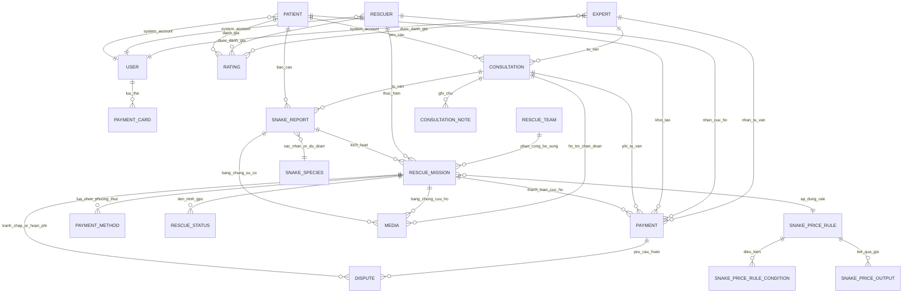

# Snake Catching Business ERD

## ERD Diagram

## Explanation
- **Báo cáo & xác định loài**: `PATIENT` tạo `SNAKE_REPORT`; hệ thống xác nhận/ước đoán `SNAKE_SPECIES` và lưu `MEDIA` chứng cứ sự cố.
- **Kích hoạt cứu hộ**: `SNAKE_REPORT` kích hoạt `RESCUE_MISSION`; `RESCUER` thực hiện, `RESCUE_TEAM` bổ sung; theo dõi `RESCUE_STATUS`; lưu `MEDIA` cứu hộ; chọn `PAYMENT_METHOD`; `PAYMENT` thanh toán nhiệm vụ; `DISPUTE` xử lý tranh chấp/hoàn phí.
- **Tư vấn từ xa**: `PATIENT` yêu cầu `CONSULTATION`; `EXPERT` tư vấn; `MEDIA` hỗ trợ chẩn đoán; `CONSULTATION_NOTE` ghi chú phiên; `PAYMENT` giữ/giải phóng phí tư vấn; `DISPUTE` cho yêu cầu hoàn.
- **Thanh toán & thẻ**: `PATIENT` khởi tạo `PAYMENT`; `RESCUER` nhận phí cứu hộ, `EXPERT` nhận phí tư vấn; `USER` liên kết nhiều `PAYMENT_CARD` để lưu phương thức thanh toán.
- **Đánh giá**: `PATIENT` tạo `RATING` cho `RESCUER` và `EXPERT` sau dịch vụ để phục vụ xếp hạng.
- **Tài khoản hệ thống**: `PATIENT`, `RESCUER`, `EXPERT` đều gắn `USER` cho quản lý đăng nhập/phân quyền.
- **Bảng giá linh hoạt**:
  - `SNAKE_PRICE_RULE`: khai báo quy tắc định giá (tên, ưu tiên, chiến lược chọn).
  - `SNAKE_PRICE_RULE_CONDITION`: các điều kiện (loài, môi trường, chiều dài, số lượng, mức nguy hiểm…) để rule khớp.
  - `SNAKE_PRICE_OUTPUT`: kết quả giá khi rule khớp (base_fee, per_snake_fee/per_cm_fee, surcharge, min/max fee, currency, notes).
  - `RESCUE_MISSION` lưu rule áp dụng (`ap_dung_rule`) để truy vết.

### Ví dụ quy tắc giá (bảng)
| Rule                    | Điều kiện chính                                             | Output giá                                                     |
| ----------------------- | ----------------------------------------------------------- | -------------------------------------------------------------- |
| Cobras-small-home       | species = Naja kaouthia; environment = home; length 0–150 cm; quantity 1–2 | base_fee 1,500,000; per_snake_fee 100,000; max_fee 2,000,000 VND |
| Water-snakes-outdoor    | species ∈ {Enhydris plumbea, Enhydris spp.}; environment ∈ {garden, pond}; length 0–200 cm; quantity 1–5 | base_fee 800,000; per_snake_fee 50,000; surcharge_pct 10; max_fee 1,200,000 VND |
| Unknown-warehouse-large | species = unknown; environment ∈ {warehouse, factory}; length 150–300 cm | base_fee 2,000,000; surcharge_pct 25; max_fee 3,000,000 VND     |

### Ví dụ thực tế (1 nhiệm vụ) theo bảng
| Dữ liệu thực tế | Giá trị |
| -------------- | ------- |
| Loài           | Naja kaouthia |
| Môi trường     | home |
| Chiều dài      | 120 cm |
| Số lượng       | 1 |
| Rule áp dụng   | Cobras-small-home |
| Output áp dụng | base_fee 1,500,000 + per_snake_fee 100,000 = 1,600,000 VND (<= max_fee 2,000,000) |
| Ghi vào mission | `RESCUE_MISSION.ap_dung_rule` = id của “Cobras-small-home”; lưu tổng phí đã tính |

### Flow backend áp dụng 3 bảng giá
1) Thu thập dữ liệu đầu vào từ `SNAKE_REPORT`/AI/Rescuer: species, environment, length, quantity, severity…
2) Chọn các `SNAKE_PRICE_RULE` active, sắp theo priority; kiểm tra `SNAKE_PRICE_RULE_CONDITION` cho từng rule (all match).
3) Rule đầu tiên khớp (hoặc best-match theo strategy) → lấy `SNAKE_PRICE_OUTPUT`:
   - Tính phí: `base_fee` + (`per_snake_fee` × quantity nếu có) + (`per_cm_fee` × length nếu cấu hình), áp `surcharge_pct/amount`, kẹp `min_fee/max_fee` nếu có.
4) Lưu `ap_dung_rule` vào `RESCUE_MISSION`; lưu chi tiết tính phí vào `PAYMENT` hoặc trường phụ của mission để hiển thị/đối soát.
5) Nếu giá thay đổi do cập nhật rule, giữ log/applied_rule để truy vết; không phụ thuộc vào rule hiện tại.

### 3 bảng nối với nhau (schema rút gọn)
| Bảng | Vai trò | Quan hệ |
| --- | --- | --- |
| `SNAKE_PRICE_RULE` | Khai báo rule (tên, ưu tiên, strategy, active) | `RESCUE_MISSION` }o--|| `SNAKE_PRICE_RULE` (ap_dung_rule) |
| `SNAKE_PRICE_RULE_CONDITION` | Điều kiện để rule khớp (species/environment/length/quantity…) | `SNAKE_PRICE_RULE` ||--o{ `SNAKE_PRICE_RULE_CONDITION` |
| `SNAKE_PRICE_OUTPUT` | Kết quả giá khi rule khớp (base_fee, per_snake_fee/per_cm_fee, surcharge, min/max, currency, notes) | `SNAKE_PRICE_RULE` ||--o{ `SNAKE_PRICE_OUTPUT` |

## References
- [README.md](README.md)
- [Docs/00-Introduction/Introduction.md](Docs/00-Introduction/Introduction.md)
- [Docs/02-Architecture-Design/Context-Diagram.md](Docs/02-Architecture-Design/Context-Diagram.md)
