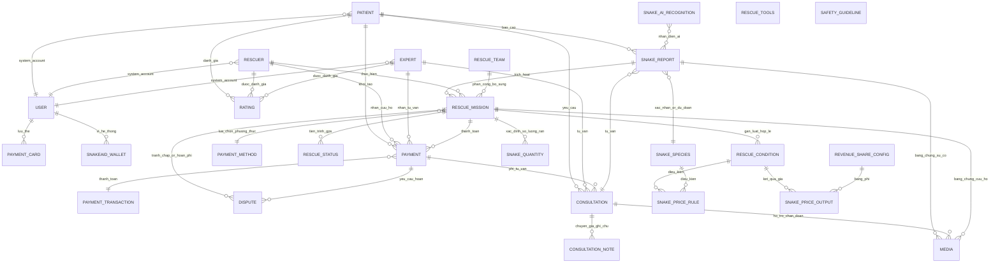

# Snake Catching Business ERD

## ERD Diagram

## Explanation
- **Báo cáo & xác định loài**: `PATIENT` tạo `SNAKE_REPORT`; hệ thống xác nhận/ước đoán `SNAKE_SPECIES` và lưu `MEDIA` chứng cứ sự cố (có thể kèm `SNAKE_AI_RECOGNITION`).
- **Kích hoạt cứu hộ**: `SNAKE_REPORT` kích hoạt `RESCUE_MISSION`; `RESCUER` thực hiện, `RESCUE_TEAM` bổ sung; theo dõi `RESCUE_STATUS`; lưu `MEDIA` cứu hộ; chọn `PAYMENT_METHOD`; `PAYMENT` thanh toán nhiệm vụ; `DISPUTE` xử lý tranh chấp/hoàn phí; `SNAKE_QUANTITY` ghi nhận số lượng thực tế; `RESCUE_TOOLS` và `SAFETY_GUIDELINE` gắn hướng dẫn/dụng cụ.
- **Tư vấn từ xa**: `PATIENT` yêu cầu `CONSULTATION`; `EXPERT` tư vấn; `MEDIA` hỗ trợ chẩn đoán; `CONSULTATION_NOTE` ghi chú phiên; `PAYMENT` giữ/giải phóng phí tư vấn.
- **Thanh toán & ví**: `USER` liên kết `PAYMENT_CARD` và `SNAKEAID_WALLET`; `PAYMENT_TRANSACTION` ghi giao dịch, gắn với `PAYMENT` và `RESCUE_MISSION`.
- **Đánh giá**: `PATIENT` tạo `RATING` cho `RESCUER` và `EXPERT` sau dịch vụ.
- **Bảng giá linh hoạt**: `SNAKE_PRICE_RULE` + `RESCUE_CONDITION` + `SNAKE_PRICE_OUTPUT`, áp dụng cho `RESCUE_MISSION`; tỷ lệ chia doanh thu cấu hình trong `REVENUE_SHARE_CONFIG`.

## References
- [README.md](README.md)
- [Docs/00-Introduction/Introduction.md](Docs/00-Introduction/Introduction.md)
- [Docs/02-Architecture-Design/Context-Diagram.md](Docs/02-Architecture-Design/Context-Diagram.md)
