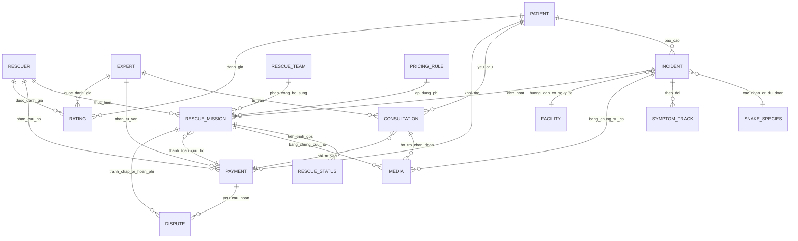

# Snake Catching Business ERD

## ERD Diagram

## Explanation
- **Báo sự cố & xác định loài**: `PATIENT` tạo `INCIDENT`; hệ thống xác nhận/ước đoán `SNAKE_SPECIES`, kèm `MEDIA` (ảnh/video) và `SYMPTOM_TRACK` để theo dõi diễn biến; `FACILITY` gợi ý cơ sở y tế phù hợp.
- **Kích hoạt và điều phối cứu hộ**: `INCIDENT` kích hoạt `RESCUE_MISSION`; `RESCUER` là người chính, `RESCUE_TEAM` bổ sung khi cần; `RESCUE_STATUS` ghi nhận tiến trình/tọa độ GPS; `MEDIA` lưu bằng chứng cứu hộ; `PRICING_RULE` áp dụng phí; `PAYMENT` xử lý thanh toán; `DISPUTE` mở khi có tranh chấp hoặc hoàn phí.
- **Tư vấn chuyên gia từ xa**: `PATIENT` yêu cầu `CONSULTATION`; `EXPERT` cung cấp tư vấn; `MEDIA` hỗ trợ chẩn đoán; `PAYMENT` giữ và giải phóng phí tư vấn; `DISPUTE` dùng chung cho yêu cầu hoàn/điều chỉnh.
- **Thanh toán & hoàn phí**: `PATIENT` khởi tạo `PAYMENT`; `RESCUER` nhận phí cứu hộ, `EXPERT` nhận phí tư vấn; `DISPUTE` cho phép yêu cầu hoàn hoặc điều chỉnh khi phát sinh khiếu nại.
- **Đánh giá chất lượng**: `PATIENT` tạo `RATING` cho `RESCUER` và `EXPERT` sau khi dịch vụ hoàn tất để phục vụ xếp hạng và ưu tiên điều phối.

## References
- [README.md](README.md)
- [Docs/00-Introduction/Introduction.md](Docs/00-Introduction/Introduction.md)
- [Docs/02-Architecture-Design/Context-Diagram.md](Docs/02-Architecture-Design/Context-Diagram.md)
