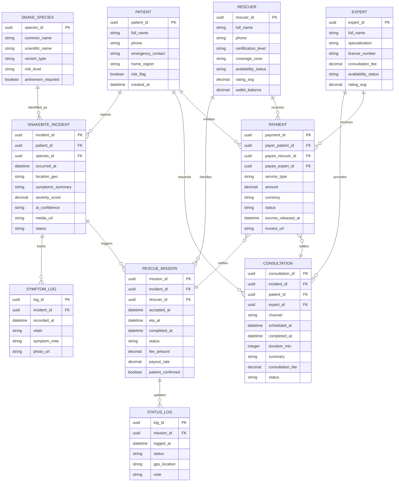

# Snake Catching Business ERD

## ERD Diagram

## Explanation
- **Patient**: Lưu thông tin cá nhân, liên hệ khẩn cấp và vùng cư trú để ưu tiên cứu hộ. Thuộc tính `risk_flag` dùng cho bệnh nhân có tiền sử dị ứng/ bệnh nền cần chú ý khi xử lý nọc.
- **Rescuer**: Hồ sơ người bắt rắn, trạng thái sẵn sàng và vùng hoạt động (`coverage_zone`) giúp thuật toán ghép nhiệm vụ gần nhất. `wallet_balance` hỗ trợ tạm giữ và chi trả sau khi hoàn tất nhiệm vụ.
- **Expert**: Thông tin chuyên môn, giấy phép và mức phí mặc định cho tư vấn. `availability_status` giúp hiển thị chuyên gia sẵn sàng nhận ca.
- **Snake_Species**: CSDL chuẩn về loài rắn (độc tính, yêu cầu huyết thanh) phục vụ gợi ý sơ cứu và hướng xử lý.
- **Snakebite_Incident**: Sự cố do bệnh nhân báo, bao gồm thời gian, vị trí, tóm tắt triệu chứng, mức độ nghiêm trọng và kết quả nhận dạng/độ tin cậy của AI. Trạng thái (open/in_progress/resolved) điều phối cứu hộ và tư vấn.
- **Symptom_Log**: Nhật ký theo dõi diễn biến triệu chứng/vital theo thời gian để chuyên gia đánh giá mức độ nặng và quyết định ưu tiên cứu hộ.
- **Rescue_Mission**: Phiên bản hóa từng nhiệm vụ bắt rắn, liên kết sự cố và rescuer, trạng thái tiến trình (accepted/en_route/arrived/completed/cancelled), ETA và dấu mốc hoàn tất. `fee_amount` + `payout_rate` dùng cho tính phí và chia sẻ doanh thu.
- **Status_Log**: Lịch sử cập nhật trạng thái nhiệm vụ kèm tọa độ, phục vụ truy vết, SLA và hiển thị lộ trình thời gian thực cho bệnh nhân.
- **Consultation**: Phiên tư vấn chuyên gia (chat/video), có thể gắn với sự cố hiện tại. Lưu thời lượng, tóm tắt và phí để lập hóa đơn/đánh giá.
- **Payment**: Giao dịch do bệnh nhân khởi tạo, phân biệt dịch vụ (`service_type = rescue|consultation`). Dùng hai khóa payee (rescuer/expert) để đảm bảo nhất quán dù loại dịch vụ khác nhau; trạng thái hỗ trợ escrow (pending/held/released/refunded). `invoice_url` giữ liên kết hóa đơn điện tử.
- **Quan hệ chính**:
  - Một Patient có nhiều Incident; mỗi Incident có thể gắn loài rắn dự đoán/xác thực.
  - Incident tạo Rescue_Mission; mỗi Mission gắn một Rescuer và nhiều Status_Log để theo dõi thời gian thực.
  - Patient có thể mở nhiều Consultation; mỗi Consultation gắn Expert và (tuỳ chọn) Incident để giữ ngữ cảnh lâm sàng.
  - Payment được khởi tạo bởi Patient và được phân bổ cho Rescuer hoặc Expert; liên kết thanh toán đến Mission/Consultation bảo đảm chỉ giải ngân khi hoàn tất (qua `patient_confirmed` hoặc `completed_at`).
- **Ràng buộc & logic nghiệp vụ**:
  - Một Incident chỉ mở nhiều Mission trong trường hợp tái phân công; trạng thái của Mission phải tương thích (ví dụ nếu Mission hoàn tất thì Incident chuyển `resolved`).
  - Payment cho Rescue_Mission chỉ được release khi `patient_confirmed = true` và Mission `status = completed`.
  - Consultation có thể tạo Payment trước (escrow) và release khi `status = completed`.
  - Symptom_Log bắt buộc thuộc Incident để duy trì dòng thời gian diễn biến.
  - Status_Log bắt buộc thuộc Mission để dựng tuyến di chuyển và SLA.
- **Giả định**:
  - Một Mission gán cho một Rescuer đơn lẻ (có thể mở rộng thêm bảng nhóm nếu có đội).
  - Một Payment chỉ gắn với một dịch vụ tại một thời điểm; các khoản phí nền tảng được tính qua `payout_rate` và không cần bảng riêng.
  - Hóa đơn điện tử được lưu qua URL, không lưu file nhị phân trong DB.
  - Không thiết kế chi tiết bảng người dùng chung; Patient/Rescuer/Expert đã tách vì yêu cầu nghiệp vụ khác nhau.
- **Câu hỏi mở**:
  - Có cần mô hình đội cứu hộ nhiều người trên một Mission hay chỉ cá nhân?
  - Có cần bảng phản hồi/đánh giá riêng cho Rescuer/Expert để xếp hạng không?
  - Có cần liên kết Incident với cơ sở y tế gần nhất để theo dõi chuyển viện (facility_referral)?
  - SLA thanh toán: thời gian tự động release nếu Patient không xác nhận?

## References
- [README.md](README.md)
- [Docs/00-Introduction/Introduction.md](Docs/00-Introduction/Introduction.md)
- [Docs/02-Architecture-Design/Context-Diagram.md](Docs/02-Architecture-Design/Context-Diagram.md)
