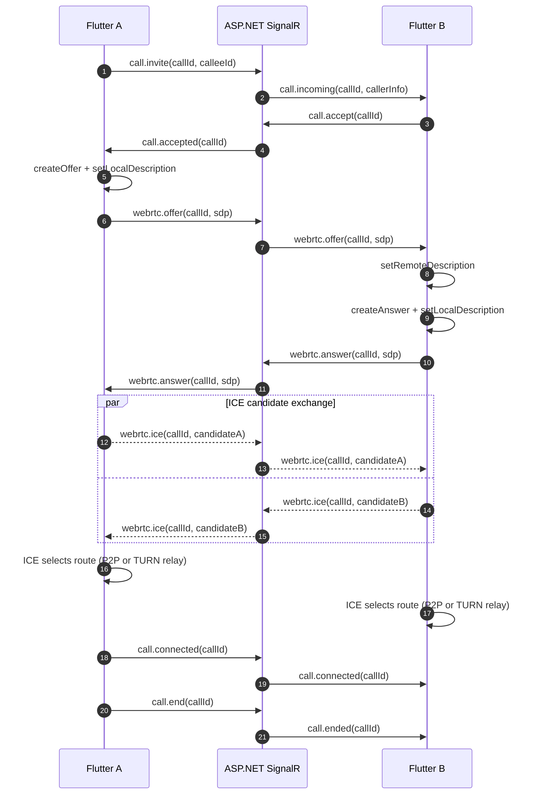
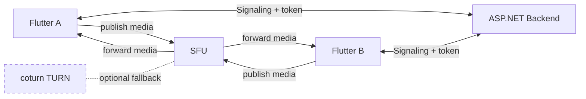

# In-app Video Call (Flutter + ASP.NET SignalR + WebRTC + coturn)

> Mục tiêu: Tài liệu tham chiếu lâu dài để thiết kế & triển khai video call **1-1 (hiện tại)** nhưng **sẵn đường nâng cấp** (group/SFU) về sau.

---

## 0) Bức tranh tổng thể

### 0.1 Thành phần chính

* **Flutter Client (WebRTC Engine)**: thu camera/mic, mã hoá/giải mã, gửi/nhận media.
* **ASP.NET Backend (SignalR)**: chỉ làm **signaling** + **call state** + **auth** + **logs/presence**.
* **STUN/TURN Server (coturn)**: hỗ trợ vượt NAT/firewall.
* **(Tuỳ chọn) SFU**: khi cần group call hoặc muốn ổn định hơn P2P.

### 0.2 Media đi đâu?

* Mặc định (1-1): **media đi P2P** giữa 2 client.
* Nếu P2P không khả thi: media **relay qua TURN** (coturn).
* **Media không đi qua ASP.NET** trong kiến trúc chuẩn.

---

## 1) Glossary theo “aspect” (khái niệm + chức năng + nằm ở đâu trong flow)

> Mục tiêu phần này: đọc xong bạn biết **mỗi khái niệm làm gì**, **xuất hiện ở bước nào**, và **ai chịu trách nhiệm** (Flutter/WebRTC, ASP.NET/SignalR, coturn).

### 1.1 WebRTC (Media layer) — “chở âm thanh + hình ảnh”

**WebRTC** là bộ chuẩn/protocol + API để truyền **audio/video realtime**.

**Thành phần chính**

* **RTCPeerConnection**: “đường hầm” media giữa 2 thiết bị.

  * Nhiệm vụ: thương lượng kết nối, mã hoá, gửi/nhận audio/video, xử lý network changes.
* **MediaStream / Track**

  * `getUserMedia()` (concept) lấy camera/mic → tạo track video/audio.
  * Track được “add” vào `RTCPeerConnection` để gửi đi.
* **Codec + Encoding**

  * Nén video/audio (ví dụ VP8/H.264/Opus) để truyền được qua mạng.

> Lưu ý: WebRTC **không tự tìm nhau**. Nó cần một kênh khác để “hẹn gặp” (đó là signaling).

### 1.2 Signaling — “kênh điều phối để 2 bên bắt tay”

**Signaling** không phải chuẩn cố định. Bạn có thể dùng WebSocket, SignalR, MQTT… miễn là chuyển được message.

**Signaling làm gì?**

* Tạo “room/call session”
* Gửi lời mời gọi (incoming call)
* Trao đổi thông tin thương lượng WebRTC:

  * **SDP offer/answer**
  * **ICE candidates**

**Vì sao dùng SignalR (ASP.NET)?**

* ASP.NET làm backend rất hợp
* Realtime tốt, có group/room, tự handle reconnect nhiều thứ

> Nói đơn giản: **SignalR chỉ gửi JSON message**, còn video/audio **không** đi qua SignalR.

### 1.3 SDP (Offer/Answer) — “bản hợp đồng kết nối”

**SDP (Session Description Protocol)** là text mô tả:

* tôi có audio/video không?
* tôi hỗ trợ codec nào?
* tôi dùng port/transport kiểu gì?
* thông tin key để setup kết nối bảo mật

**Offer / Answer là gì?**

* **Offer**: bên gọi tạo “đề nghị kết nối” (tôi muốn gọi video + audio)
* **Answer**: bên nhận trả lời “tôi đồng ý và đây là config của tôi”

> Offer/Answer được gửi qua signaling.

### 1.4 ICE — “cơ chế tìm đường đi qua mạng”

**ICE (Interactive Connectivity Establishment)** là quá trình **tìm cách kết nối** giữa 2 thiết bị trong điều kiện NAT/firewall.

**ICE làm gì?**

* Thu thập các “địa chỉ có thể dùng để kết nối” gọi là **ICE candidates**
* Test từng candidate để tìm đường nhanh/ổn nhất

> ICE candidates được gửi qua signaling giống SDP. Bạn **không implement ICE bằng tay** (WebRTC engine làm).

### 1.5 STUN — “hỏi xem IP/Port public của tôi là gì”

**STUN server** giúp thiết bị sau NAT biết:

* IP public của mình
* port public mà NAT đang map

STUN chỉ “trợ giúp khám phá”, **không relay media**.

STUN đủ tốt khi:

* NAT nhẹ
* firewall không chặn UDP quá gắt

### 1.6 TURN — “chuyển phát media khi không thể P2P”

**TURN server** (ví dụ coturn) là “trạm trung chuyển”. Khi 2 bên **không thể kết nối trực tiếp** (NAT khó, firewall chặn), thì:

* media/audio/video sẽ chạy qua TURN (relay)

**Vì sao TURN gần như bắt buộc?**

* mạng 4G/5G carrier NAT
* wifi công cộng
* doanh nghiệp chặn UDP
  → P2P fail khá thường xuyên nếu không có TURN.

> TURN tốn băng thông server (vì relay media).

### 1.7 NAT traversal — “vượt NAT”

Đây là “combo” của **ICE + STUN + TURN**.

* ICE: cơ chế tổng
* STUN: giúp tìm public mapping
* TURN: fallback relay

### 1.8 Security — “bảo mật đường truyền và truy cập”

**Media encryption**

* WebRTC mặc định mã hoá media bằng **SRTP (DTLS-SRTP)**.

**API/Auth**

* **JWT**: user đăng nhập, server tin rằng bạn là ai
* SignalR thường dùng JWT (header/query) để authenticate connection

**TLS**

* Signaling nên chạy qua HTTPS/WSS (đặc biệt quan trọng trên web; với mobile cũng nên dùng WSS/HTTPS).

### 1.9 Presence + Call state — “ai online, ai đang gọi”

Vì WebRTC là P2P, backend thường giữ:

* ai đang online (mapping userId → connectionId)
* call state: ringing/accepted/ended/missed
* room membership

Thường lưu:

* realtime state: Redis/memory
* call log lâu dài: PostgreSQL

### 1.10 Room / Session — “cuộc gọi là một thực thể”

Bạn sẽ có khái niệm:

* **RoomId / CallId**: định danh cuộc gọi
* **Participants**: 2 người (hoặc nhiều)
* **Lifecycle**: created → ringing → accepted → connected → ended

Backend quản lý lifecycle để:

* gửi đúng event tới đúng người
* log đúng dữ liệu

### 1.11 SFU (tuỳ chọn) — “nâng cấp từ P2P lên multi-user ổn định”

Nếu 1-1: **P2P + TURN** là ok.

Nếu nhóm hoặc muốn “ổn định + tiết kiệm upload client”:

* **SFU (Selective Forwarding Unit)** nhận stream từ mỗi người rồi forward cho người khác.
* Ví dụ: mediasoup, LiveKit self-host

Lợi:

* call nhóm ổn
* client chỉ upload 1 stream

Nhược:

* phức tạp hơn (infra + routing + scaling)

### 1.12 Flow đầy đủ (tóm tắt theo bước)

1. User A bấm Call → backend tạo CallId/RoomId
2. Backend gửi “IncomingCall” cho User B (SignalR)
3. A tạo SDP Offer → gửi offer qua SignalR
4. B nhận offer → setRemoteDescription → tạo Answer → gửi answer
5. Hai bên liên tục gửi ICE candidates qua SignalR
6. ICE chọn được đường:

   * P2P direct (tốt nhất) hoặc
   * Relay qua TURN
7. Media chạy trực tiếp (không đi qua backend)
8. End call → backend update trạng thái + log

---

## 2) Components: chức năng từng thành phần

### 2.1 Flutter Client (WebRTC)

**Vai trò**

* Lấy camera/mic → tạo track
* Tạo `RTCPeerConnection`
* Thực hiện SDP Offer/Answer
* Thu thập ICE candidates (`onIceCandidate`)
* Thêm ICE candidates nhận được (`addCandidate`)
* Render video local/remote

**Những thứ client chịu trách nhiệm**

* UI/UX cuộc gọi
* Permissions camera/mic
* Network switching (Wi-Fi/4G) và reconnection strategy

### 2.2 ASP.NET Backend (SignalR + Control Plane)

**Vai trò**

* Authentication (JWT)
* Signaling Hub: relay các message
* Call lifecycle: create → ringing → accepted → connected → ended
* Presence: ai online, routing userId → connectionId
* Logging: call history, duration, status

**Nguyên tắc**

* Backend **không** xử lý/encode/decode media.
* Backend chỉ xử lý **metadata** và **message**.

### 2.3 coturn (STUN/TURN Server)

**Vai trò**

* Cung cấp STUN để hỗ trợ P2P
* Cung cấp TURN relay khi P2P fail (NAT khó, firewall chặn UDP, carrier NAT…)

**Lưu ý vận hành**

* TURN tốn băng thông → cần giới hạn port range, rate limit, và monitoring.

### 2.4 (Optional) SFU (khi nâng cấp)

**Khi nào cần**

* Group call (>= 3 participants)
* Muốn ổn định hơn P2P (đặc biệt mobile)
* Muốn tối ưu upload của client

**SFU làm gì**

* Nhận stream từ client và forward cho người khác.
* Backend ASP.NET vẫn làm control-plane (auth, room, token), còn media đi qua SFU.

---

## 3) End-to-end Flow (1-1): step-by-step

### 3.1 Các trạng thái (state machine) gợi ý

* `Created` → `Ringing` → `Accepted` → `Connecting` → `Connected` → `Ended`
* Nhánh phụ: `Rejected`, `Missed`, `Failed`

### 3.2 Sequence: signaling + webrtc negotiation



### 3.3 Media path: P2P-first, TURN fallback

```mermaid
flowchart LR
  subgraph Signaling
    A[Flutter A] <-->|SDP/ICE via SignalR| S[ASP.NET SignalR] <-->|SDP/ICE via SignalR| B[Flutter B]
  end

  subgraph Media
    A ---|P2P media (best case)| B
    A -.->|TURN relay (fallback)| T[coturn TURN]
    T -.->|TURN relay (fallback)| B
  end
```

### 3.4 Tại sao TURN quan trọng cho mobile?

* 4G/5G thường gặp NAT khó → P2P tỉ lệ fail cao.
* TURN giúp “always-connect” (đổi lại chi phí băng thông).

---

## 4) NuGet / pub.dev Cover Map

### 4.1 Bảng mapping theo aspect

| Aspect                  | Chạy ở đâu        | Package/Service cover                                                      | Ghi chú                      |
| ----------------------- | ----------------- | -------------------------------------------------------------------------- | ---------------------------- |
| WebRTC media engine     | Flutter           | **pub.dev:** `flutter_webrtc`                                              | Bao gồm ICE/DTLS/SRTP nội bộ |
| Signaling realtime      | ASP.NET + Flutter | **NuGet:** SignalR server; **pub.dev:** `signalr_core`                     | Backend relay message        |
| Auth (JWT)              | ASP.NET + Flutter | **NuGet:** JwtBearer middleware; Flutter dùng HTTP client + secure storage | Token dùng cho API & SignalR |
| ICE                     | Flutter           | (nằm trong WebRTC engine)                                                  | Bạn chỉ relay candidates     |
| STUN/TURN               | Infra + Flutter   | **Service:** coturn; Flutter cấu hình `iceServers`                         | Bắt buộc TURN để ổn định     |
| Call state + logs       | ASP.NET           | EF Core + DB provider                                                      | Business logic               |
| Presence/online routing | ASP.NET           | SignalR lifecycle + (optional) Redis                                       | Scale-out cần backplane      |
| Group call (tương lai)  | SFU + Flutter     | **Service:** SFU (LiveKit/mediasoup/Janus)                                 | ASP.NET vẫn control-plane    |

### 4.2 NuGet: những mảng ASP.NET cover mạnh

* Signaling Hub (SignalR)
* Auth/JWT + authorization
* Persistence (logs, sessions)
* Presence/routing + rate-limit + observability

### 4.3 pub.dev: những mảng Flutter cover mạnh

* WebRTC: capture/render/negotiation
* SignalR client
* Push notifications (incoming call) nếu cần UX “app-like”

---

## 5) Deployment coturn: checklist vận hành

### 5.1 Mục tiêu deploy

* Client có thể dùng:

  * `stun:turn.yourdomain.com:3478`
  * `turn:turn.yourdomain.com:3478?transport=udp`
  * `turn:turn.yourdomain.com:3478?transport=tcp`
  * `turns:turn.yourdomain.com:5349?transport=tcp` (khi cần TLS)

### 5.2 Firewall / Security Group

* Mở **3478/UDP** (TURN/STUN)
* Mở **3478/TCP** (fallback)
* (Khuyến nghị) **5349/TCP** (TURN over TLS)
* Mở **relay port range UDP** (vd 10000–20000) theo `min-port/max-port`

### 5.3 Cấu hình cốt lõi (concept)

* `realm`: domain của TURN
* `lt-cred-mech`: long-term credentials
* `min-port/max-port`: thu hẹp range
* TLS cert nếu dùng `turns:`
* Rate limit/deny-lists nếu public

---

## 6) Nhánh nâng cấp: từ P2P sang SFU

### 6.1 Kiến trúc thay đổi thế nào?



### 6.2 Điều giữ nguyên vs đổi

**Giữ nguyên**

* Auth/JWT, CallSession/Participants model, logs

**Đổi/điều chỉnh**

* Client join SFU room, publish/subscribe thay vì P2P offer/answer trực tiếp
* Backend có thể phát hành SFU token

---

## 7) Anti-pitfalls (những lỗi thiết kế hay gặp)

* Nhầm rằng media phải đi qua backend ASP.NET → dẫn tới tốn băng thông và khó scale.
* Không có TURN → call lúc được lúc không, đặc biệt mobile.
* Quên mở relay port range cho TURN → stuck ở “connecting”.
* Thiết kế DB chỉ cho 2 người → sau này lên group đập lại.

---

## 8) Checklist “Definition of Done” (phiên bản 1-1)

* [ ] Flutter gọi 1-1 P2P được trong cùng LAN
* [ ] Gọi được khác mạng (Wi-Fi vs 4G) nhờ TURN fallback
* [ ] Signaling events đầy đủ (invite/accept/reject/end + offer/answer/ice)
* [ ] Call logs ghi đúng trạng thái (missed/rejected/ended)
* [ ] Presence online đúng để route incoming call

---

## 9) Gợi ý cấu trúc Notion database (tuỳ chọn)

* Database: `Call Sessions` (callId, createdAt, endedAt, status, mode, duration)
* Database: `Participants` (callId, userId, state, join/leave time)
* Page: `Runbook - coturn` (ports, config, incident checklist)
