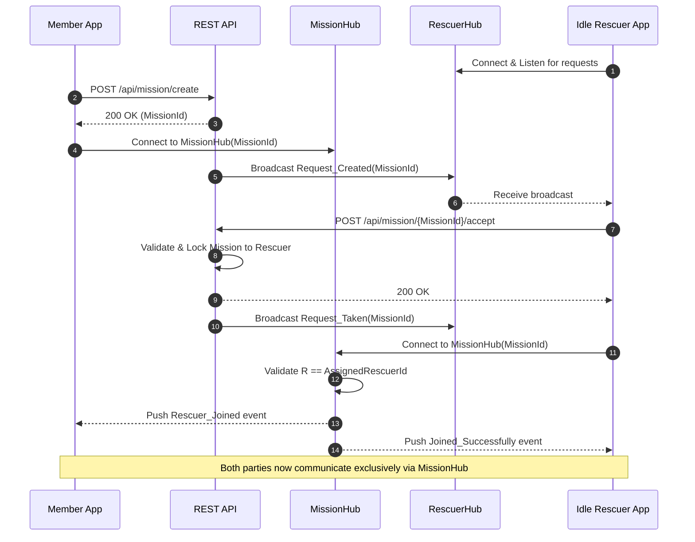
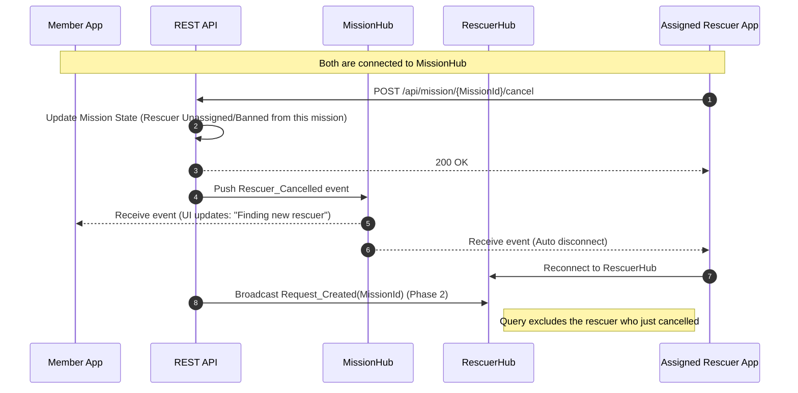
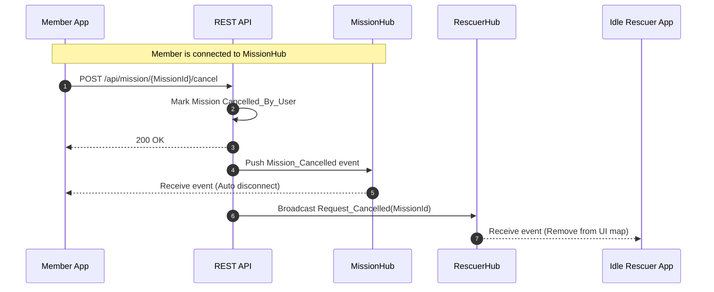
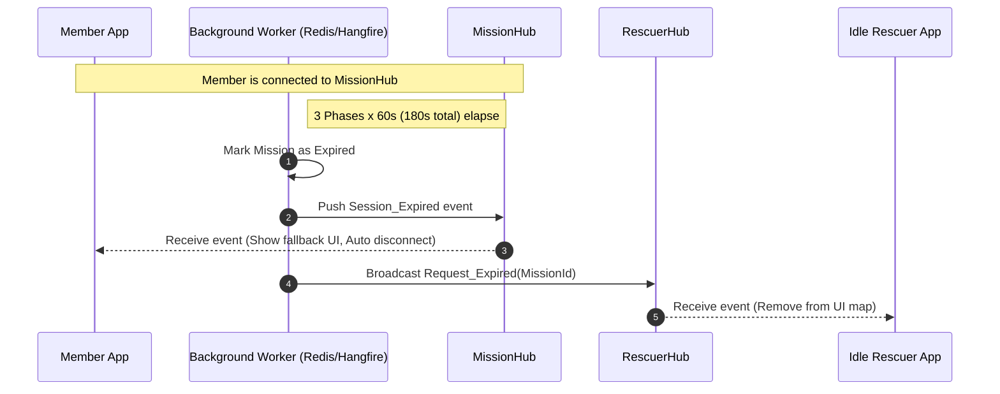

# Sequence Flows: Asymmetric Hub Connection

This document visualizes the exact API and SignalR interactions between the Mobile Apps (Member & Rescuer), the REST API, the `RescuerHub`, and the `MissionHub`.

## 1. Happy Path: Broadcast & Accept

The member creates an incident and waits in `MissionHub`. A rescuer receives the broadcast on `RescuerHub`, accepts it, and joins the `MissionHub`.

## 2. Edge Case: Rescuer Cancels Before EnRoute

The rescuer accepts, joins the `MissionHub`, but then cancels. The member remains safely in `MissionHub` while the system re-broadcasts.

## 3. Edge Case: Member Cancels While Waiting

The member creates the incident but cancels before anyone accepts.

## 4. Edge Case: Timeout (No Rescuer Accepts)

After 3 phases (180 seconds), no rescuer accepts. The mission expires.

