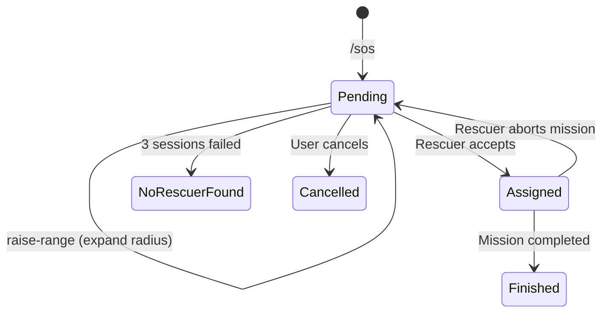

# 📄 Rescue Trigger Introduction

> **Context**: This module handles the critical transition from "Incident Identified" to "Rescue Active".

## 1. Overview
Once a snakebite incident is identified (either via AI diagnosis or manual report), the system must immediately:
1.  **Persist the Incident**: Save the location, user details, and initial status to the database.
2.  **Initialize Rescue Session**: Create a dynamic "Rescue Session" with an initial search radius (10km).
3.  **Broadcast SOS**: Notify all available rescuers within that radius via SignalR/Push Notifications.

## 2. Key Features
*   **One-Step SOS**: A single API call (`/sos`) creates the incident and triggers the first search wave.
*   **Dynamic Range Expansion**: If no rescuers accept within a timeout, the system can expand the search radius (10km -> 20km -> 30km).
*   **Dual-Phase Execution**: Separation of concerns between `Incident` (Record keeping) and `Session` (Real-time coordination).

## 3. Business Rules & Constants
*   **Radius Progression**: The search radius expands in fixed steps: **10km -> 20km -> 30km**.
*   **Session Timeout**: Each session lasts exactly **60 seconds**. If no rescuer accepts, it expires.
*   **Max Sessions**: The system attempts a maximum of **3 sessions** (up to 30km) before declaring "No Rescuer Found".
*   **First-to-Claim**: The rescue mission is assigned to the *first* rescuer who accepts. All other pending requests are immediately marked as `Taken`.
*   **Rescuer Eligibility**: Only rescuers who are:
    1.  **Online** (IsOnline = true)
    2.  **Connected** (SignalR connection active)
    3.  **In Range** (Distance <= Radius)
    4.  **Emergency Type** (Type = Emergency or Both)
    ...are pinged.

## 4. Actors
*   **Victim/Reporter**: Initiates SOS.
*   **System (Orchestrator)**: Manages state, timeouts (via specific service), and radius expansion.
*   **Rescuers**: Receive real-time SignalR alerts.

## 5. State Transitions

## 6. Cross-References
*   **Source Code**: [rescue-trigger.sourcecode.md](./rescue-trigger.sourcecode.md)
*   **Usage Guide**: [rescue-trigger.usageguide.md](./rescue-trigger.usageguide.md)
