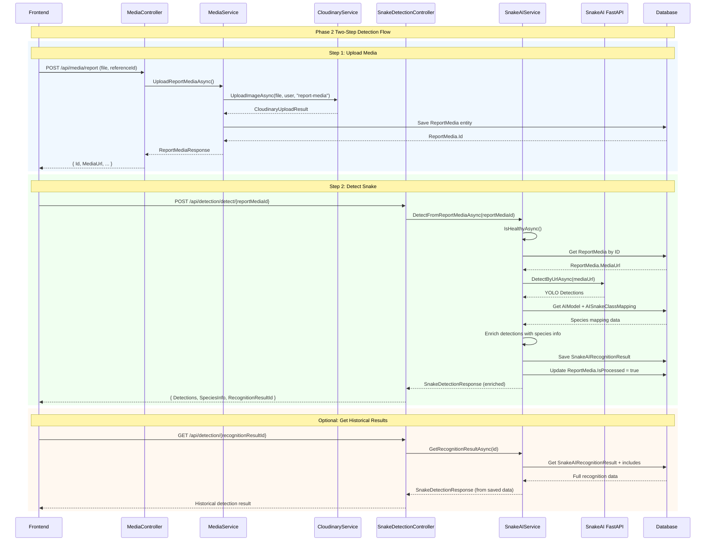

# Snake Detection - Usage Guide Status

> **Loại file:** `sourcecode.md` - Thể hiện trạng thái codebase sau khi implement  
> **Timeline:** Phase 2 Implementation ✅ COMPLETED  
> **Context doc:** `snake-detection.plan.md`

---

## ✅ IMPLEMENTATION SUMMARY

Phase 2 Snake Detection đã được implement thành công với:
- **Service Layer Pattern**: Controller → Service → Repository/UOW
- **Two-Step Flow**: Upload Media → Detect with Species Mapping
- **Database Persistence**: SnakeAIRecognitionResult với species mapping
- **Error Handling**: NullReferenceException fixes và proper user context

---

## 📁 CODE STRUCTURE

### **1. API Controllers**

#### **MediaController.cs**
```csharp
[Route("api/media")]
public class MediaController : BaseController<MediaController>
{
    private readonly IMediaService _mediaService;
    
    [HttpPost("report")]
    [ValidateFile(maxSizeInMB: 10, allowedExtensions: new[] { ".jpg", ".jpeg", ".png", ".webp" })]
    public async Task<IActionResult> UploadReportMedia(
        [FromQuery] MediaReferenceType type,
        [FromForm] UploadReportMediaRequest request,
        [FromQuery] MediaPurpose purpose = MediaPurpose.SnakeIdentification,
        CancellationToken ct = default)
    {
        var result = await _mediaService.UploadReportMediaAsync(request, type, purpose, User, ct);
        return StatusCode(result.StatusCode, result);
    }
}
```

#### **SnakeDetectionController.cs**
```csharp
[Route("api/detection")]
public class SnakeDetectionController : BaseController<SnakeDetectionController>
{
    private readonly ISnakeAIService _snakeAIService;
    
    [HttpPost("detect/{reportMediaId:guid}")]
    public async Task<IActionResult> Detect([FromRoute] Guid reportMediaId, CancellationToken ct = default)
    {
        var result = await _snakeAIService.DetectFromReportMediaAsync(reportMediaId, ct);
        return StatusCode(result.StatusCode, result);
    }

    [HttpGet("{id:guid}")]
    public async Task<IActionResult> GetDetectionResult(Guid id, CancellationToken ct = default)
    {
        var result = await _snakeAIService.GetRecognitionResultAsync(id, ct);
        return StatusCode(result.StatusCode, result);
    }
}
```

---

### **2. Service Layer**

#### **IMediaService.cs**
```csharp
public interface IMediaService
{
    Task<ApiResponse<ReportMediaResponse>> UploadReportMediaAsync(
        UploadReportMediaRequest request,
        MediaReferenceType referenceType,
        MediaPurpose purpose,
        ClaimsPrincipal user,
        CancellationToken ct = default);
}
```

#### **MediaService.cs**
```csharp
public class MediaService : IMediaService
{
    private readonly IUnitOfWork<SnakeAidDbContext> _unitOfWork;
    private readonly ICloudinaryService _cloudinaryService;
    private readonly ILogger<MediaService> _logger;

    public async Task<ApiResponse<ReportMediaResponse>> UploadReportMediaAsync(
        UploadReportMediaRequest request,
        MediaReferenceType referenceType,
        MediaPurpose purpose,
        ClaimsPrincipal user,
        CancellationToken ct = default)
    {
        // 1. Upload file to Cloudinary with user context
        var uploadResult = await _cloudinaryService.UploadImageAsync(request.File, user, "report-media", ct);

        // 2. Save media record to database with transaction
        return await _unitOfWork.ExecuteInTransactionAsync(async () =>
        {
            var reportMedia = new ReportMedia
            {
                Id = Guid.NewGuid(),
                FileName = request.File.FileName,
                MediaUrl = uploadResult.SecureUrl,
                ContentType = request.File.ContentType,
                FileSize = request.File.Length,
                ReferenceId = request.ReferenceId,
                ReferenceType = referenceType,
                Purpose = purpose,
                RequiresAIProcessing = purpose == MediaPurpose.SnakeIdentification,
                IsProcessed = false,
                CreatedAt = DateTime.UtcNow,
                UpdatedAt = DateTime.UtcNow
            };

            await _unitOfWork.GetRepository<ReportMedia>().InsertAsync(reportMedia);
            await _unitOfWork.CommitAsync();

            var response = new ReportMediaResponse
            {
                Id = reportMedia.Id,
                MediaUrl = reportMedia.MediaUrl,
                FileName = reportMedia.FileName,
                ContentType = reportMedia.ContentType,
                FileSize = reportMedia.FileSize,
                ReferenceType = reportMedia.ReferenceType,
                Purpose = reportMedia.Purpose,
                RequiresAIProcessing = reportMedia.RequiresAIProcessing
            };

            return ApiResponseBuilder.BuildSuccessResponse(response, "Report media uploaded successfully.");
        });
    }
}
```

#### **ISnakeAIService.cs**
```csharp
public interface ISnakeAIService
{
    Task<ApiResponse<SnakeDetectionResponse>> DetectFromReportMediaAsync(Guid reportMediaId, CancellationToken ct = default);
    Task<ApiResponse<SnakeDetectionResponse>> GetRecognitionResultAsync(Guid recognitionResultId, CancellationToken ct = default);
    Task<ApiResponse<SnakeDetectionResponse>> DetectAsync(string imageUrl, Guid reportMediaId, CancellationToken ct = default); // Internal helper
    Task<bool> IsHealthyAsync();
}
```

#### **SnakeAIService.cs - Core Logic**
```csharp
public class SnakeAIService : ISnakeAIService
{
    // Main entry point for Phase 2 detection
    public async Task<ApiResponse<SnakeDetectionResponse>> DetectFromReportMediaAsync(Guid reportMediaId, CancellationToken ct = default)
    {
        // 1. Health check AI service
        if (!await IsHealthyAsync())
            return ServiceUnavailable;

        // 2. Validate ReportMedia exists
        var reportMedia = await _unitOfWork.GetRepository<ReportMedia>()
            .FirstOrDefaultAsync(predicate: m => m.Id == reportMediaId, cancellationToken: ct);
        
        if (reportMedia == null)
            return NotFound;

        // 3. Call main detection with imageUrl
        return await DetectAsync(reportMedia.MediaUrl, reportMediaId, ct);
    }

    // Core AI processing with species mapping (V3 Logic)
    public async Task<ApiResponse<SnakeDetectionResponse>> DetectAsync(string imageUrl, Guid reportMediaId, CancellationToken ct = default)
    {
        try
        {
            // 1. Call AI Service
            var result = await _api.DetectByUrlAsync(request);

            // 2. Get Active AI Model
            var activeModel = await _unitOfWork.GetRepository<AIModel>()
                .FirstOrDefaultAsync(predicate: m => m.IsActive && m.IsDefault, cancellationToken: ct);

            // 3. Species Mapping Logic (V3)
            var results = new List<DetectionResult>();
            foreach (var detection in result.Detections)
            {
                var detectionResult = new DetectionResult
                {
                    Ai = new AiDetection
                    {
                        ClassId = detection.ClassId,
                        ClassName = detection.ClassName,
                        Confidence = detection.Confidence,
                        BBox = new SnakeBBox { ... }
                    }
                };

                // Map YOLO class to SnakeSpecies
                if (activeModel != null)
                {
                    var mapping = await _unitOfWork.GetRepository<AISnakeClassMapping>()
                        .FirstOrDefaultAsync(
                            predicate: m => m.AIModelId == activeModel.Id && 
                                          m.YoloClassName == detection.ClassName && 
                                          m.IsActive,
                            include: q => q.Include(m => m.SnakeSpecies)
                                            .ThenInclude(s => s.SpeciesVenoms)
                                                .ThenInclude(v => v.FirstAidGuideline),
                            cancellationToken: ct);

                    if (mapping?.SnakeSpecies != null)
                    {
                        var species = mapping.SnakeSpecies;
                        // Fallback logic for FirstAidGuidelineOverride...
                        detectionResult.Snake = species;
                    }
                }
                results.Add(detectionResult);
            }

            // 4. Persist Recognition Result (Logic kept similar...)
            // ...

            // 5. Return enriched response (V3 Structure)
            var response = new SnakeDetectionResponse
            {
                Metadata = new AiMetadata
                {
                    ModelVersion = result.ModelVersion,
                    DetectionCount = result.Detections.Count,
                    // ...
                },
                Results = results,
                RecognitionResultId = recognitionResultId
            };

            return ApiResponseBuilder.BuildSuccessResponse(response, "Snake detection completed successfully.");
        }
        catch (Exception ex)
        {
            // Error handling...
            return ApiResponseBuilder.CreateResponse<SnakeDetectionResponse>(...);
        }
    }

    // Get historical recognition results
    public async Task<ApiResponse<SnakeDetectionResponse>> GetRecognitionResultAsync(Guid recognitionResultId, CancellationToken ct = default)
    {
        var recognitionResult = await _unitOfWork.GetRepository<SnakeAIRecognitionResult>()
            .FirstOrDefaultAsync(
                predicate: r => r.Id == recognitionResultId,
                include: query => query
                    .Include(r => r.ReportMedia)
                    .Include(r => r.AIModel)
                    .Include(r => r.DetectedSpecies),
                cancellationToken: ct);

        if (recognitionResult == null)
            return NotFound;

        // Build response from saved data
        var response = new SnakeDetectionResponse
        {
            Metadata = new AiMetadata { ... },
            RecognitionResultId = recognitionResult.Id,
            Results = new List<DetectionResult>
            {
                new DetectionResult
                {
                    Ai = new AiDetection { ClassName = recognitionResult.YoloClassName, ... },
                    Snake = recognitionResult.DetectedSpecies
                }
            }
        };

        return ApiResponseBuilder.BuildSuccessResponse(response, "Recognition result retrieved successfully.");
    }
}
```

---

### **3. Request/Response Models**

#### **UploadReportMediaRequest.cs**
```csharp
public class UploadReportMediaRequest
{
    [Required]
    public IFormFile File { get; set; } = default!;

    [Required]
    public Guid ReferenceId { get; set; }
}
```

// SnakeDetectionRequest.cs (Removed - moved to Path Param)

#### **ReportMediaResponse.cs**
```csharp
public class ReportMediaResponse
{
    public Guid Id { get; set; }
    public string MediaUrl { get; set; } = string.Empty;
    public string FileName { get; set; } = string.Empty;
    public string ContentType { get; set; } = string.Empty;
    public long FileSize { get; set; }
    public MediaReferenceType ReferenceType { get; set; }
    public MediaPurpose Purpose { get; set; }
    public bool RequiresAIProcessing { get; set; }
}
```

#### **SnakeDetectionResponse.cs**
```csharp
public class SnakeDetectionResponse
{
    [JsonPropertyName("ai_metadata")]
    public AiMetadata Metadata { get; set; }

    [JsonPropertyName("results")]
    public List<DetectionResult> Results { get; set; } = new();

    [JsonPropertyName("recognition_result_id")]
    public Guid? RecognitionResultId { get; set; }
}

public class AiMetadata
{
    [JsonPropertyName("model_version")]
    public string? ModelVersion { get; set; }
    // ... ImageWidth, ImageHeight, DetectionCount, Warnings
}

public class DetectionResult
{
    [JsonPropertyName("ai_detection")]
    public AiDetection Ai { get; set; }

    [JsonPropertyName("snake")]
    public SnakeSpecies? Snake { get; set; }
}

public class AiDetection
{
    [JsonPropertyName("class_id")]
    public int ClassId { get; set; }
    // ... ClassName, Confidence, BBox
}
```

---

## 🔄 FLOW DIAGRAM



---

## ✅ KEY IMPROVEMENTS

### **1. Service Layer Pattern Compliance**
- **Before**: Controllers directly injected `IUnitOfWork`
- **After**: Controllers only inject `IMediaService` và `ISnakeAIService`
- **Benefit**: Proper separation of concerns, better testability

### **2. Two-Step Flow Implementation**
- **Step 1**: Upload Media → Create ReportMedia entity
- **Step 2**: Detect Snake → Reference existing ReportMedia
- **Benefit**: All detection results are properly tracked in database

### **3. Species Mapping Integration**
- **YOLO Detection**: Raw class names from AI model
- **Species Enrichment**: Mapped to SnakeSpecies with Vietnamese names, venom info, risk level
- **Database Persistence**: SnakeAIRecognitionResult với full mapping info

### **4. Error Handling & User Context**
- **Fixed NullReferenceException**: CloudinaryService now receives proper `ClaimsPrincipal`
- **Transaction Management**: Atomic operations with proper rollback
- **Failed Recognition Tracking**: Even failed detections are persisted for analysis

### **5. Historical Results Query**
- **Endpoint**: `GET /api/detection/{recognitionResultId}`
- **Use Case**: Retrieve previously saved detection results
- **Data**: Full species information từ database relationships

---

## 🏗️ ARCHITECTURE BENEFITS

1. **Scalability**: Service layer có thể extend với business logic phức tạp
2. **Maintainability**: Clear separation giữa API, Business Logic, và Data Access
3. **Testability**: Services có thể mock independent từ controllers
4. **Traceability**: Mọi detection đều có audit trail trong database
5. **Performance**: Species mapping chỉ thực hiện một lần và cache trong SnakeAIRecognitionResult

**Next Phase Readiness**: Codebase đã sẵn sàng cho Phase 3 development với proper foundation.