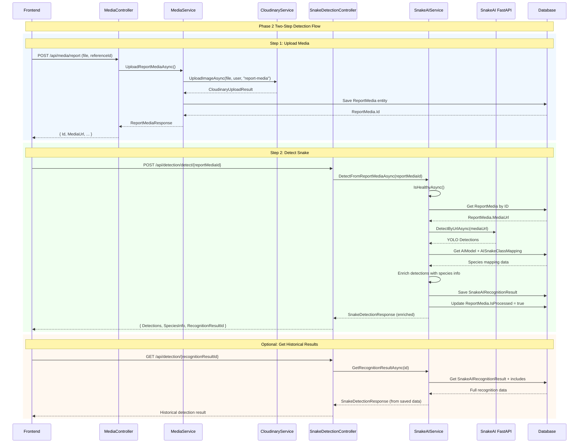

# Snake Detection Module - Source Code Status

> **Loại file:** `sourcecode.md` - Thể hiện trạng thái codebase sau khi implement  
> **Timeline:** Phase 2 Implementation ✅ COMPLETED  
> **Context doc:** `snake-detection.plan.md`

---

## ✅ IMPLEMENTATION SUMMARY

Phase 2 Snake Detection đã được implement thành công với:
- **Service Layer Pattern**: Controller → Service → Repository/UOW
- **Two-Step Flow**: Upload Media → Detect with Species Mapping
- **Database Persistence**: SnakeAIRecognitionResult với species mapping
- **Error Handling**: NullReferenceException fixes và proper user context

---

## 📁 CODE STRUCTURE

### **1. API Controllers**

#### **MediaController.cs**
```csharp
[ApiController]
[Authorize]
[Route("api/media")]
public class MediaController : BaseController<MediaController>
{
    private readonly ICloudinaryService _cloudinaryService;
    private readonly IMediaService _mediaService;

    public MediaController(ILogger<MediaController> logger, IHttpContextAccessor httpContextAccessor, IMapper mapper, ICloudinaryService cloudinaryService, IMediaService mediaService)
        : base(logger, httpContextAccessor, mapper)
    {
        _cloudinaryService = cloudinaryService;
        _mediaService = mediaService;
    }

    [HttpPost("report")]
    [Consumes("multipart/form-data")]
    [ValidateFile(maxSizeInMB: 10, allowedExtensions: new[] { ".jpg", ".jpeg", ".png", ".webp" }, formFieldName: "file")]
    public async Task<IActionResult> UploadReportMedia(
        [FromQuery] MediaReferenceType type,
        [FromForm] UploadReportMediaRequest request,
        [FromQuery] MediaPurpose purpose = MediaPurpose.SnakeIdentification,
        CancellationToken ct = default)
    {
        var result = await _mediaService.UploadReportMediaAsync(request, type, purpose, User, ct);
        return Ok(ApiResponseBuilder.BuildSuccessResponse(result, "Report media uploaded successfully."));
    }
}
```

#### **SnakeDetectionController.cs**
```csharp
[ApiController]
[Route("api/detection")]
[Authorize]
public class SnakeDetectionController : BaseController<SnakeDetectionController>
{
    private readonly ISnakeAIService _snakeAIService;

    public SnakeDetectionController(ILogger<SnakeDetectionController> logger, IHttpContextAccessor httpContextAccessor, IMapper mapper, ISnakeAIService snakeAIService)
        : base(logger, httpContextAccessor, mapper)
    {
        _snakeAIService = snakeAIService;
    }

    [HttpPost("detect/{reportMediaId:guid}")]
    public async Task<IActionResult> Detect([FromRoute] Guid reportMediaId, CancellationToken ct = default)
    {
        var result = await _snakeAIService.DetectFromReportMediaAsync(reportMediaId, ct);
        return Ok(ApiResponseBuilder.BuildSuccessResponse(result, "Snake detection completed successfully."));
    }

    [HttpGet("{id:guid}")]
    public async Task<IActionResult> GetDetectionResult(Guid id, CancellationToken ct = default)
    {
        var result = await _snakeAIService.GetRecognitionResultAsync(id, ct);
        return Ok(ApiResponseBuilder.BuildSuccessResponse(result, "Recognition result retrieved successfully."));
    }
}
```

---

### **2. Service Layer**

#### **IMediaService.cs**
```csharp
public interface IMediaService
{
    Task<ReportMediaResponse> UploadReportMediaAsync(
        UploadReportMediaRequest request,
        MediaReferenceType referenceType,
        MediaPurpose purpose,
        ClaimsPrincipal user,
        CancellationToken ct = default);
}
```

#### **MediaService.cs**
```csharp
public class MediaService : IMediaService
{
    private readonly IUnitOfWork<SnakeAidDbContext> _unitOfWork;
    private readonly ICloudinaryService _cloudinaryService;
    private readonly ILogger<MediaService> _logger;

    public MediaService(IUnitOfWork<SnakeAidDbContext> unitOfWork, ICloudinaryService cloudinaryService, ILogger<MediaService> logger)
    {
        _unitOfWork = unitOfWork;
        _cloudinaryService = cloudinaryService;
        _logger = logger;
    }

    public async Task<ReportMediaResponse> UploadReportMediaAsync(
        UploadReportMediaRequest request,
        MediaReferenceType referenceType,
        MediaPurpose purpose,
        ClaimsPrincipal user,
        CancellationToken ct = default)
    {
        _logger.LogInformation("Uploading report media for reference {ReferenceId}, type: {Type}, purpose: {Purpose}", request.ReferenceId, referenceType, purpose);

        // Upload file to Cloudinary first
        var uploadResult = await _cloudinaryService.UploadImageAsync(request.File, user, "report-media", ct);

        // Save media record to database
        return await _unitOfWork.ExecuteInTransactionAsync(async () =>
        {
            var reportMedia = new ReportMedia
            {
                Id = Guid.NewGuid(), FileName = request.File.FileName, MediaUrl = uploadResult.SecureUrl,
                ContentType = request.File.ContentType, FileSize = request.File.Length, ReferenceId = request.ReferenceId,
                ReferenceType = referenceType, Purpose = purpose, RequiresAIProcessing = purpose == MediaPurpose.SnakeIdentification,
                IsProcessed = false, CreatedAt = DateTime.UtcNow, UpdatedAt = DateTime.UtcNow
            };

            await _unitOfWork.GetRepository<ReportMedia>().InsertAsync(reportMedia);
            await _unitOfWork.CommitAsync();

            var response = new ReportMediaResponse
            {
                Id = reportMedia.Id, MediaUrl = reportMedia.MediaUrl, FileName = reportMedia.FileName,
                ContentType = reportMedia.ContentType, FileSize = reportMedia.FileSize,
                ReferenceType = reportMedia.ReferenceType, Purpose = reportMedia.Purpose, RequiresAIProcessing = reportMedia.RequiresAIProcessing
            };

            _logger.LogInformation("Successfully uploaded report media with ID: {MediaId}", reportMedia.Id);
            return response;
        });
    }
}
```

#### **ISnakeAIService.cs**
```csharp
public interface ISnakeAIService
{
    Task<ApiResponse<SnakeDetectionResponse>> DetectFromReportMediaAsync(Guid reportMediaId, CancellationToken ct = default);
    Task<ApiResponse<SnakeDetectionResponse>> GetRecognitionResultAsync(Guid recognitionResultId, CancellationToken ct = default);
    Task<ApiResponse<SnakeDetectionResponse>> DetectAsync(string imageUrl, Guid reportMediaId, CancellationToken ct = default); // Internal helper
    Task<bool> IsHealthyAsync();
}
```

#### **SnakeAIService.cs - Core Logic**
```csharp
public class SnakeAIService : ISnakeAIService
{
    private readonly ISnakeAIApi _api;
    private readonly ILogger<SnakeAIService> _logger;
    private readonly SnakeAISettings _settings;
    private readonly IUnitOfWork<SnakeAidDbContext> _unitOfWork;

    public SnakeAIService(ISnakeAIApi api, ILogger<SnakeAIService> logger, SnakeAISettings settings, IUnitOfWork<SnakeAidDbContext> unitOfWork)
    {
        _api = api;
        _logger = logger;
        _settings = settings;
        _unitOfWork = unitOfWork;
    }

    public async Task<SnakeDetectionResponse> DetectFromReportMediaAsync(Guid reportMediaId, CancellationToken ct = default)
    {
        // 1. Health check
        if (!await IsHealthyAsync())
        {
            _logger.LogWarning("SnakeAI server is unavailable");
            throw new ApiException("Snake detection server is currently unavailable. Please try again later.",
                System.Net.HttpStatusCode.ServiceUnavailable);
        }

        // 2. Validate ReportMedia exists
        var reportMedia = await _unitOfWork.GetRepository<ReportMedia>()
            .FirstOrDefaultAsync(
                predicate: m => m.Id == reportMediaId,
                cancellationToken: ct);

        if (reportMedia == null)
        {
            _logger.LogWarning("ReportMedia not found: {MediaId}", reportMediaId);
            throw new NotFoundException("ReportMedia not found.");
        }

        // 3. Call detection with imageUrl
        return await DetectAsync(reportMedia.MediaUrl, reportMediaId, ct);
    }

    public async Task<SnakeDetectionResponse> DetectAsync(string imageUrl, Guid reportMediaId, CancellationToken ct = default)
    {
        var request = new SnakeAIDetectRequest
        {
            ImageUrl = imageUrl,
            Confidence = _settings.Confidence,
            ImageSize = _settings.ImageSize,
            Iou = _settings.IouThreshold,
            TopK = _settings.TopK,
            SaveImage = _settings.SaveImage
        };

        _logger.LogInformation("Calling SnakeAI detect for ReportMediaId: {MediaId}, URL: {Url} with confidence: {Confidence}",
            reportMediaId, imageUrl, _settings.Confidence);

        try
        {
            // 1. Call AI Service
            var result = await _api.DetectByUrlAsync(request);

            // 2. Get Active AI Model
            var activeModel = await _unitOfWork.GetRepository<AIModel>()
                .FirstOrDefaultAsync(m => m.IsActive && m.IsDefault, cancellationToken: ct)
                ?? _logger.LogWarning("No active/default AI model found in database");

            // 3. Process detections and enrich with species info
            var results = new List<DetectionResult>();
            SnakeAIRecognitionResult? savedRecognitionResult = null;
            var topDetection = result.Detections.OrderByDescending(d => d.Confidence).FirstOrDefault();

            foreach (var detection in result.Detections)
            {
                var detectionResult = new DetectionResult
                {
                    Ai = new AiDetection
                    {
                        ClassId = detection.ClassId,
                        ClassName = detection.ClassName,
                        Confidence = detection.Confidence,
                        BBox = new SnakeBBox { X1=detection.Bbox.X1, Y1=detection.Bbox.Y1, X2=detection.Bbox.X2, Y2=detection.Bbox.Y2 }
                    }
                };

                // 4. Map to SnakeSpecies if model exists
                if (activeModel != null)
                {
                    var mapping = await _unitOfWork.GetRepository<AISnakeClassMapping>()
                        .FirstOrDefaultAsync(
                            predicate: m => m.AIModelId == activeModel.Id && m.YoloClassName == detection.ClassName && m.IsActive,
                            include: q => q.Include(m => m.SnakeSpecies).ThenInclude(s => s.SpeciesVenoms).ThenInclude(sv => sv.VenomType).ThenInclude(v => v.FirstAidGuideline), 
                            cancellationToken: ct);

                    if (mapping?.SnakeSpecies != null)
                    {
                        var species = mapping.SnakeSpecies;
                        // -- FALLBACK LOGIC FOR FIRST AID --
                        if (species.FirstAidGuidelineOverride == null && species.SpeciesVenoms.Any())
                        {
                            var venomWithGuide = species.SpeciesVenoms.Select(sv => sv.VenomType).FirstOrDefault(v => v.FirstAidGuideline != null);
                            if (venomWithGuide != null)
                            {
                                species.FirstAidGuidelineOverride = new FirstAidOverride
                                {
                                    Mode = OverrideMode.Append, 
                                    Steps = venomWithGuide.FirstAidGuideline.Content?.Steps?.Select(s => s.Text).ToList() ?? new List<string>()
                                };
                            }
                        }
                        detectionResult.Snake = species;
                        _logger.LogInformation("Mapped YOLO class '{YoloClass}' to species '{Species}'", detection.ClassName, species.CommonName);
                    }
                    else
                        _logger.LogWarning("No mapping found for YOLO class '{YoloClass}' with AIModel ID: {ModelId}", detection.ClassName, activeModel.Id);
                }
                results.Add(detectionResult);
            }

            // 5. Save Recognition Result for top detection
            if (topDetection != null && activeModel != null)
            {
                var topEnriched = results.FirstOrDefault(r => r.Ai.ClassName == topDetection.ClassName && r.Ai.Confidence == topDetection.Confidence);
                var recognitionResult = new SnakeAIRecognitionResult
                {
                    Id = Guid.NewGuid(),
                    ReportMediaId = reportMediaId,
                    AIModelId = activeModel.Id,
                    YoloClassName = topDetection.ClassName,
                    Confidence = (decimal)topDetection.Confidence,
                    DetectedSpeciesId = topEnriched?.Snake?.Id,
                    IsMapped = topEnriched?.Snake != null,
                    AllDetections = JsonSerializer.Serialize(result.Detections),
                    Status = RecognitionStatus.Completed
                };
                await _unitOfWork.GetRepository<SnakeAIRecognitionResult>().InsertAsync(recognitionResult, ct);

                var reportMedia = await _unitOfWork.GetRepository<ReportMedia>().FirstOrDefaultAsync(m => m.Id == reportMediaId, asNoTracking: false, cancellationToken: ct);
                if (reportMedia != null)
                {
                    reportMedia.IsProcessed = true;
                    reportMedia.ProcessedAt = DateTime.UtcNow;
                    _unitOfWork.GetRepository<ReportMedia>().Update(reportMedia);
                }
                await _unitOfWork.CommitAsync();
                savedRecognitionResult = recognitionResult;
                _logger.LogInformation("Saved recognition result {ResultId} for ReportMedia {MediaId}. Mapped: {IsMapped}", recognitionResult.Id, reportMediaId, recognitionResult.IsMapped);
            }

            _logger.LogInformation("SnakeAI detected {Count} objects. Top: {TopClass} ({TopConfidence:P0})", result.Detections.Count, topDetection?.ClassName ?? "none", topDetection?.Confidence ?? 0);

            return new SnakeDetectionResponse
            {
                Metadata = new AiMetadata
                {
                    ModelVersion = result.ModelVersion,
                    ImageWidth = result.ImageWidth,
                    ImageHeight = result.ImageHeight,
                    DetectionCount = result.Detections.Count,
                    Warnings = result.Warnings != null ? new SnakeAIWarnings { Blur = result.Warnings.Blur, Brightness = result.Warnings.Brightness, TooSmall = result.Warnings.TooSmall } : null
                },
                Results = results,
                RecognitionResultId = savedRecognitionResult?.Id
            };
        }
        catch (Exception ex)
        {
            _logger.LogError(ex, "SnakeAI detection failed for ReportMediaId: {MediaId}", reportMediaId, imageUrl);
            // Save failed recognition result
            try
            {
                var activeModel = await _unitOfWork.GetRepository<AIModel>().FirstOrDefaultAsync(m => m.IsActive && m.IsDefault, cancellationToken: ct);
                if (activeModel != null)
                {
                    var failedResult = new SnakeAIRecognitionResult { Id = Guid.NewGuid(), ReportMediaId = reportMediaId, AIModelId = activeModel.Id, YoloClassName = "ERROR", Confidence = 0, IsMapped = false, Status = RecognitionStatus.Failed };
                    await _unitOfWork.GetRepository<SnakeAIRecognitionResult>().InsertAsync(failedResult, ct);
                    await _unitOfWork.CommitAsync();
                }
            }
            catch (Exception saveEx)
            {
                _logger.LogError(saveEx, "Failed to save error recognition result for ReportMediaId: {MediaId}", reportMediaId);
            }
            throw new ApiException("Snake detection failed. Please try again later.", System.Net.HttpStatusCode.InternalServerError);
        }
    }

    public async Task<bool> IsHealthyAsync()
    {
        try
        {
            var health = await _api.HealthCheckAsync();
            var isHealthy = health.Status == "ok" && health.ModelLoaded;
            if (!isHealthy) _logger.LogWarning("SnakeAI unhealthy. Status: {Status}, ModelLoaded: {ModelLoaded}", health.Status, health.ModelLoaded);
            return isHealthy;
        }
        catch (Exception ex)
        {
            _logger.LogWarning(ex, "SnakeAI health check failed");
            return false;
        }
    }

    public async Task<SnakeDetectionResponse> GetRecognitionResultAsync(Guid recognitionResultId, CancellationToken ct = default)
    {
        var recognitionResult = await _unitOfWork.GetRepository<SnakeAIRecognitionResult>()
            .FirstOrDefaultAsync(
                predicate: r => r.Id == recognitionResultId,
                include: query => query.Include(r => r.ReportMedia).Include(r => r.AIModel).Include(r => r.DetectedSpecies).ThenInclude(s => s.SpeciesVenoms).ThenInclude(sv => sv.VenomType).ThenInclude(v => v.FirstAidGuideline), // Include for Fallback
                cancellationToken: ct);

        if (recognitionResult == null)
        {
            _logger.LogWarning("Recognition result not found: {ResultId}", recognitionResultId);
            throw new NotFoundException("Recognition result not found.");
        }

        // Restore species logic if available
        if (recognitionResult.DetectedSpecies != null)
        {
            var species = recognitionResult.DetectedSpecies;
            // -- FALLBACK LOGIC --
            if (species.FirstAidGuidelineOverride == null && species.SpeciesVenoms.Any())
            {
                var venomWithGuide = species.SpeciesVenoms.Select(sv => sv.VenomType).FirstOrDefault(v => v.FirstAidGuideline != null);
                if (venomWithGuide != null)
                {
                    species.FirstAidGuidelineOverride = new FirstAidOverride
                    {
                        Mode = OverrideMode.Append,
                        Steps = venomWithGuide.FirstAidGuideline.Content?.Steps?.Select(s => s.Text).ToList() ?? new List<string>()
                    };
                }
            }
        }

        _logger.LogInformation("Retrieved recognition result: {ResultId}", recognitionResultId);

        // Build response from saved data (matching V3 strict structure)
        return new SnakeDetectionResponse
        {
            Metadata = new AiMetadata
            {
                ModelVersion = recognitionResult.AIModel?.Version,
                ImageWidth = 0, // Not stored
                ImageHeight = 0,
                DetectionCount = 1,
                Warnings = null
            },
            RecognitionResultId = recognitionResult.Id,
            Results = new List<DetectionResult>
            {
                new DetectionResult
                {
                    Ai = new AiDetection
                    {
                        ClassId = 0,
                        ClassName = recognitionResult.YoloClassName,
                        Confidence = (float)recognitionResult.Confidence,
                        BBox = new SnakeBBox() // BBox data not stored efficiently yet
                    },
                    Snake = recognitionResult.DetectedSpecies
                }
            }
        };
    }
}
```

---

### **3. Request/Response Models**

#### **UploadReportMediaRequest.cs**
```csharp
public class UploadReportMediaRequest
{
    [Required] public IFormFile File { get; set; } = default!;
    [Required] public Guid ReferenceId { get; set; }
}
```

// SnakeDetectionRequest.cs (Removed - moved to Path Param)

#### **ReportMediaResponse.cs**
```csharp
public class ReportMediaResponse
{
    public Guid Id { get; set; }
    public string MediaUrl { get; set; } = string.Empty;
    public string FileName { get; set; } = string.Empty;
    public string ContentType { get; set; } = string.Empty;
    public long FileSize { get; set; }
    public MediaReferenceType ReferenceType { get; set; }
    public MediaPurpose Purpose { get; set; }
    public bool RequiresAIProcessing { get; set; }
}
```

#### **SnakeDetectionResponse.cs**
```csharp
public class SnakeDetectionResponse
{
    [JsonPropertyName("ai_metadata")] public AiMetadata Metadata { get; set; }
    [JsonPropertyName("results")] public List<DetectionResult> Results { get; set; } = new();
    [JsonPropertyName("recognition_result_id")] public Guid? RecognitionResultId { get; set; }
}

public class AiMetadata
{
    [JsonPropertyName("model_version")] public string? ModelVersion { get; set; }
    [JsonPropertyName("image_width")] public int ImageWidth { get; set; }
    [JsonPropertyName("image_height")] public int ImageHeight { get; set; }
    [JsonPropertyName("detection_count")] public int DetectionCount { get; set; }
    [JsonPropertyName("warnings")] public SnakeAIWarnings? Warnings { get; set; }
}

public class DetectionResult
{
    [JsonPropertyName("ai_detection")] public AiDetection Ai { get; set; }
    [JsonPropertyName("snake")] public SnakeSpecies? Snake { get; set; }
}

public class AiDetection
{
    [JsonPropertyName("class_id")] public int ClassId { get; set; }
    [JsonPropertyName("class_name")] public string? ClassName { get; set; }
    [JsonPropertyName("confidence")] public float Confidence { get; set; }
    [JsonPropertyName("bbox")] public SnakeBBox BBox { get; set; }
}

public class SnakeBBox
{
    [JsonPropertyName("x1")] public float X1 { get; set; }
    [JsonPropertyName("y1")] public float Y1 { get; set; }
    [JsonPropertyName("x2")] public float X2 { get; set; }
    [JsonPropertyName("y2")] public float Y2 { get; set; }
}

public class SnakeAIWarnings
{
    [JsonPropertyName("blur")] public float Blur { get; set; }
    [JsonPropertyName("brightness")] public float Brightness { get; set; }
    [JsonPropertyName("too_small")] public float TooSmall { get; set; }
}
```

---

## 🔄 FLOW DIAGRAM



---

## ✅ KEY IMPROVEMENTS

### **1. Service Layer Pattern Compliance**
- **Before**: Controllers directly injected `IUnitOfWork`
- **After**: Controllers only inject `IMediaService` và `ISnakeAIService`
- **Benefit**: Proper separation of concerns, better testability

### **2. Two-Step Flow Implementation**
- **Step 1**: Upload Media → Create ReportMedia entity
- **Step 2**: Detect Snake → Reference existing ReportMedia
- **Benefit**: All detection results are properly tracked in database

### **3. Species Mapping Integration**
- **YOLO Detection**: Raw class names from AI model
- **Species Enrichment**: Mapped to SnakeSpecies with Vietnamese names, venom info, risk level
- **Database Persistence**: SnakeAIRecognitionResult với full mapping info

### **4. Error Handling & User Context**
- **Fixed NullReferenceException**: CloudinaryService now receives proper `ClaimsPrincipal`
- **Transaction Management**: Atomic operations with proper rollback
- **Failed Recognition Tracking**: Even failed detections are persisted for analysis

### **5. Historical Results Query**
- **Endpoint**: `GET /api/detection/{recognitionResultId}`
- **Use Case**: Retrieve previously saved detection results
- **Data**: Full species information từ database relationships

---

## 🏗️ ARCHITECTURE BENEFITS

1. **Scalability**: Service layer có thể extend với business logic phức tạp
2. **Maintainability**: Clear separation giữa API, Business Logic, và Data Access
3. **Testability**: Services có thể mock independent từ controllers
4. **Traceability**: Mọi detection đều có audit trail trong database
5. **Performance**: Species mapping chỉ thực hiện một lần và cache trong SnakeAIRecognitionResult

**Next Phase Readiness**: Codebase đã sẵn sàng cho Phase 3 development với proper foundation.