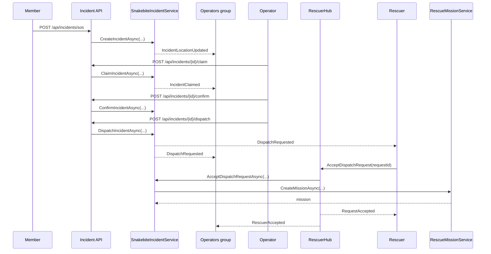
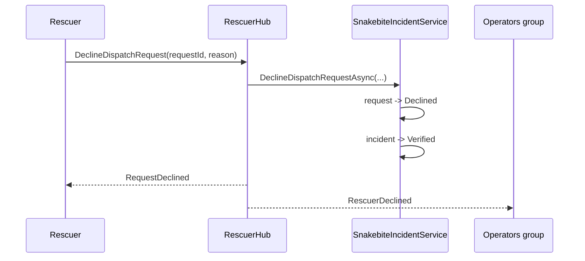

# Sequence Flows - Core Operator Dispatch

## 1. Happy path

```mermaid
sequenceDiagram
    participant Member
    participant API as Incident API
    participant IncidentSvc as SnakebiteIncidentService
    participant Operators as Operators group
    participant Operator
    participant RescuerHub
    participant Rescuer
    participant MissionSvc as RescueMissionService

    Member->>API: POST /api/incidents/sos
    API->>IncidentSvc: CreateIncidentAsync(...)
    IncidentSvc-->>Operators: IncidentLocationUpdated

    Operator->>API: POST /api/incidents/{id}/claim
    API->>IncidentSvc: ClaimIncidentAsync(...)
    IncidentSvc-->>Operators: IncidentClaimed

    Operator->>API: POST /api/incidents/{id}/confirm
    API->>IncidentSvc: ConfirmIncidentAsync(...)

    Operator->>API: POST /api/incidents/{id}/dispatch
    API->>IncidentSvc: DispatchIncidentAsync(...)
    IncidentSvc-->>Rescuer: DispatchRequested
    IncidentSvc-->>Operators: DispatchRequested

    Rescuer->>RescuerHub: AcceptDispatchRequest(requestId)
    RescuerHub->>IncidentSvc: AcceptDispatchRequestAsync(...)
    IncidentSvc->>MissionSvc: CreateMissionAsync(...)
    MissionSvc-->>IncidentSvc: mission
    RescuerHub-->>Rescuer: RequestAccepted
    RescuerHub-->>Operators: RescuerAccepted
```

## 2. Decline path

```mermaid
sequenceDiagram
    participant Rescuer
    participant RescuerHub
    participant IncidentSvc as SnakebiteIncidentService
    participant Operators as Operators group

    Rescuer->>RescuerHub: DeclineDispatchRequest(requestId, reason)
    RescuerHub->>IncidentSvc: DeclineDispatchRequestAsync(...)
    IncidentSvc->>IncidentSvc: request -> Declined
    IncidentSvc->>IncidentSvc: incident -> Verified
    RescuerHub-->>Rescuer: RequestDeclined
    RescuerHub-->>Operators: RescuerDeclined
```
