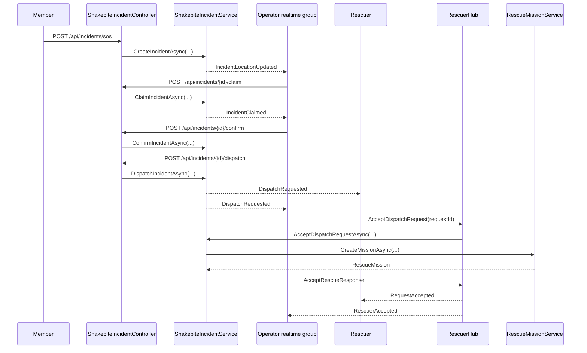
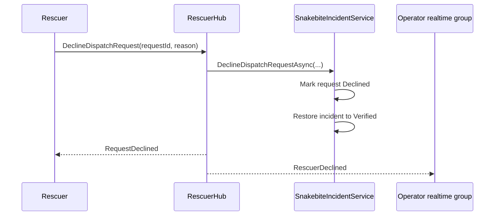

# Operator Dispatch Refactor - Source Code

## Status

- Module status: partially implemented
- Last verified against code: 2026-03-14
- Implementation style: operator-first dispatch layered on top of existing emergency and mission services

## Current implementation summary

The current codebase has already moved part of emergency SOS handling into an operator-driven dispatch model:

1. Incident enters `Pending`.
2. Operator claims it.
3. Operator confirms it.
4. Operator dispatches a chosen rescuer.
5. Rescuer accepts or declines.
6. Acceptance creates `RescueMission` and marks incident `Assigned`.

The implementation is functional, but the final target state described in refactor planning has not been fully reached.

## Key files

### Controllers

- `SnakeAid.Api/Controllers/SnakebiteIncidentController.cs`
- `SnakeAid.Api/Controllers/RescuerController.cs`
- `SnakeAid.Api/Controllers/ShiftController.cs`
- `SnakeAid.Api/Controllers/OperatorController.cs`

Important note:

`OperatorController` currently exposes the snapshot route under `/api/monitoring/on-duty`.
The code is operator-oriented, but the public route name still reflects an older monitoring-oriented naming choice.

### Hubs and notifications

- `SnakeAid.Api/Hubs/RescuerHub.cs`
- `SnakeAid.Api/Hubs/MissionHub.cs`
- `SnakeAid.Api/Services/SignalROperatorRealtimeNotificationService.cs`
- `SnakeAid.Api/Services/SignalRRescueNotificationService.cs`

### Services

- `SnakeAid.Service/Implements/SnakebiteIncidentService.cs`
- `SnakeAid.Service/Implements/RescueMissionService.cs`
- `SnakeAid.Service/Implements/OperatorSnapshotService.cs`
- `SnakeAid.Service/Implements/ShiftService.cs`

### Domains

- `SnakeAid.Core/Domains/SnakebiteIncident.cs`
- `SnakeAid.Core/Domains/RescuerRequest.cs`
- `SnakeAid.Core/Domains/RescueMission.cs`
- `SnakeAid.Core/Domains/OperatorProfile.cs`
- `SnakeAid.Core/Domains/WorkShift.cs`
- `SnakeAid.Core/Domains/ShiftAssignment.cs`
- `SnakeAid.Core/Domains/IncidentCallLog.cs`

## Current public API surface

### Incident handling

- `POST /api/incidents/sos`
- `POST /api/incidents/{incidentId}/claim`
- `POST /api/incidents/{incidentId}/confirm`
- `POST /api/incidents/{incidentId}/dispatch`

### Snapshot / availability

- `GET /api/rescuers/on-duty`
- `GET /api/monitoring/on-duty`

Current auth caveat:

- `GET /api/rescuers/on-duty` is protected for `Operator,Admin`
- `GET /api/monitoring/on-duty` currently exposes the same snapshot service without the same role guard in controller code
- treat these routes as behaviorally similar in payload shape, but not equivalent in access control

### Shift management

- `GET /api/shifts`
- `GET /api/shifts/{id}`
- `POST /api/shifts`
- `PUT /api/shifts/{id}`
- `DELETE /api/shifts/{id}`
- `POST /api/shifts/{id}/assign`
- `PATCH /api/shifts/assignments/{assignmentId}/checkin`
- `PATCH /api/shifts/assignments/{assignmentId}/checkout`
- `GET /api/shifts/assignments`

## Current state model in code

### SnakebiteIncident states relevant to this flow

Currently implemented as states in the domain model, with the following states actively used by the operator-dispatch path:

- `Pending`
- `OperatorContacting`
- `Verified`
- `Assigned`

Also present in the enum but not yet fully established as active operator-dispatch runtime states:

- `FalseAlarm`
- `Cancelled`
- `Finished`
- `NoRescuerFound`

Important note:

The code currently uses `Verified` as the practical state for "confirmed and waiting to dispatch".
The target refactor language often mentions `Confirmed` and `Dispatched`, but those are not the current dominant runtime states.

### RescuerRequest states

- `Pending`
- `Accepted`
- `Declined`
- `Cancelled`

### RescueMission states used after dispatch acceptance

- `Preparing`
- `EnRoute`
- `RescuerArrived`
- `MissionCompleted`
- `MissionAborted`
- `Cancelled`

## Data model implemented for this refactor

### OperatorProfile

Implemented with:

- `AccountId`
- `IsOnDuty`
- `CurrentCaseCount`
- `MaxConcurrentCases`
- `IsAcceptingNew`

### SnakebiteIncident fields added for operator dispatch

Implemented fields include:

- `HandlingOperatorId`
- `OperatorNotes`
- `DispatchedAt`
- `ConfirmedAt`
- `AssignedAt`
- `AssignedRescuerId`

### RescuerRequest

Current dispatch request model includes:

- `IncidentId`
- `RescuerId`
- `OperatorId`
- `Status`
- `DispatchedAt`
- `ResponseAt`
- `DeclineReason`

### Shift model

Implemented:

- `WorkShift`
- `ShiftAssignment`

Used to filter rescuer candidates by on-duty schedule in operator snapshot and dispatch validation.

### IncidentCallLog

Entity exists in schema and model.

Current limitation:

- the entity is present
- full operator call-outcome workflow is not yet wired as a complete production path

## Current dispatch invariants

The backend currently enforces these main rules:

- only a pending incident can be claimed
- only the handling operator can confirm or dispatch
- rescuer must be online to be dispatched
- rescuer must be available to be dispatched
- rescuer must be on duty for the target date / shift window
- accepting a dispatch creates a mission and marks the rescuer unavailable
- declining a dispatch returns the incident to `Verified`

## Realtime implementation status

There is no dedicated `OperatorHub` class yet.

Current implementation uses:

- group `Operators`
- mostly wired through `RescuerHub`
- operator notification fan-out through `SignalROperatorRealtimeNotificationService`

Implemented operator-facing events include:

- `IncidentLocationUpdated`
- `IncidentClaimed`
- `DispatchRequested`
- `RescuerDispatched`
- `RescuerDeclined`
- `RescuerAccepted`
- `RescuerOnlineStatus`
- `OperatorOnlineStatus`
- `RescuerIdleLocationUpdated`

Important note:

- `SignalROperatorRealtimeNotificationService` still contains a `NotifyOperatorContactingAsync(...)` method
- but the current `IOperatorRealtimeNotificationService` contract and `SnakebiteIncidentService` flow do not wire that event into the active operator-dispatch runtime path
- treat `OperatorContacting` as planned or legacy-capable infrastructure, not as a confirmed current event contract

## Current implementation gaps

The following items are still not fully implemented as production truth:

- dedicated false-alarm command flow and API surface
- explicit redispatch API
- operator disconnect release / reclaim flow
- background escalation for stale `Pending` incidents
- final operator workload policy enforcement using `CurrentCaseCount` and `MaxConcurrentCases`
- dedicated `OperatorHub` separation

## Runtime Interaction Flows

### 1. Operator dispatch happy path

### 2. Rescuer declines and incident returns to operator

