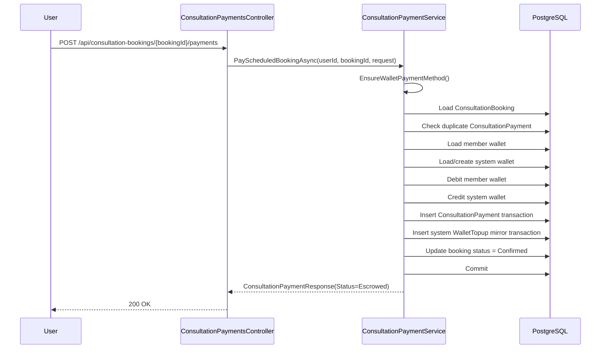
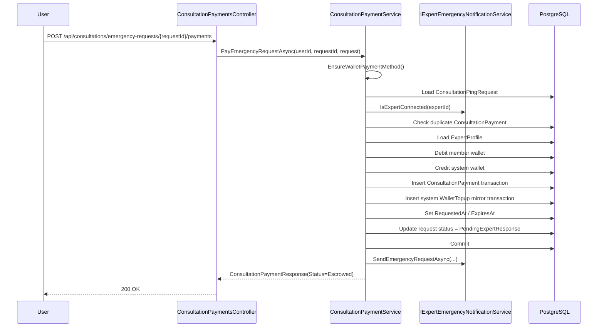
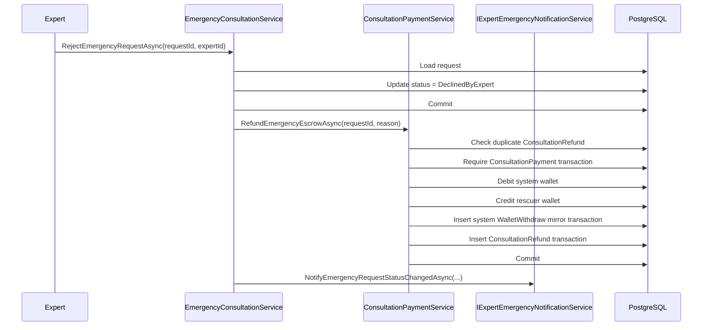
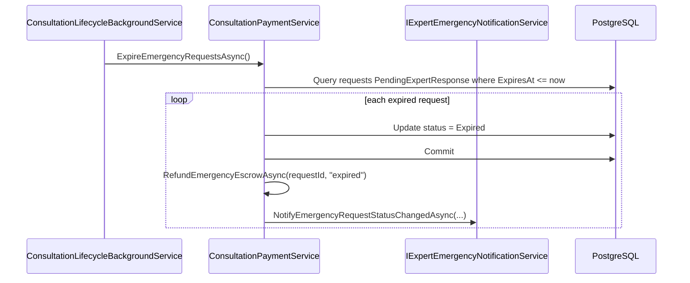
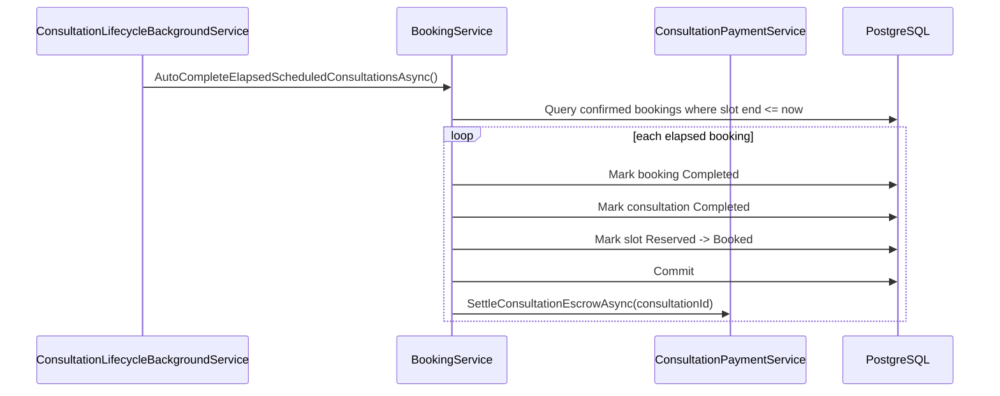

# Consultation Payment Sequence Flows

## 1. Scheduled Consultation Wallet Payment



## 2. Emergency Consultation Wallet Payment



## 3. Emergency Reject -> Refund



## 4. Emergency Expire -> Refund



## 5. Explicit End Consultation -> Settle Escrow

```mermaid
sequenceDiagram
    participant Actor
    participant Svc as ConsultationService
    participant Pay as ConsultationPaymentService
    participant DB as PostgreSQL

    Actor->>Svc: EndConsultationAsync(consultationId, actorId)
    Svc->>DB: Load consultation
    Svc->>DB: Mark consultation Completed
    Svc->>DB: Update booking Completed if scheduled
    Svc->>DB: Update slot Reserved -> Booked if needed
    Svc->>DB: Commit
    Svc->>Pay: SettleConsultationEscrowAsync(consultationId)
    Pay->>DB: Check duplicate ExpertPayout
    Pay->>DB: Resolve scheduled booking or emergency request by consultationId
    Pay->>DB: Require ConsultationPayment transaction
    Pay->>DB: Debit system wallet
    Pay->>DB: Credit expert wallet
    Pay->>DB: Insert system WalletWithdraw mirror transaction
    Pay->>DB: Insert ExpertPayout transaction
    Pay->>DB: Commit
```

## 6. Auto Complete Scheduled Consultation -> Settle Escrow



## 7. PayOS Readiness Observation

Chỗ duy nhất hợp lý để cắm PayOS cho consultation là thay đoạn:

- `EnsureWalletPaymentMethod`
- `MoveMoneyToEscrowAsync`

bằng nhánh external intent + verified settlement.

Không nên chạm vào:

- `RefundEmergencyEscrowAsync`
- `SettleConsultationEscrowAsync`

trừ khi muốn đổi toàn bộ escrow materialization model.
