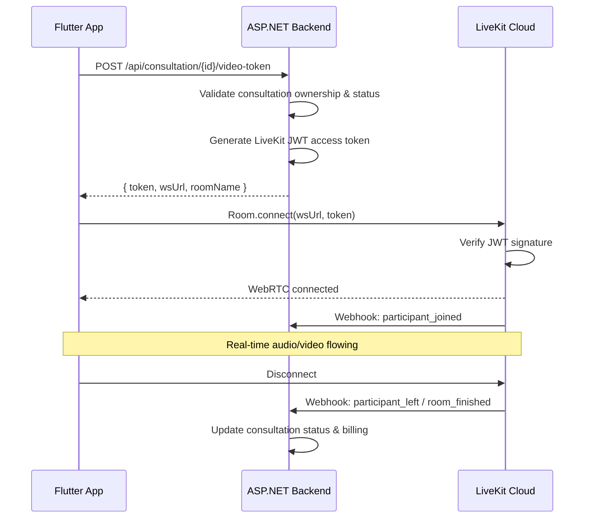

# LiveKit Cloud — Video Call for Expert Consultation

## 1. Domain Context

SnakeAid provides remote expert consultation via real-time video call.
Two primary scenarios require video call capability:

| Scenario             | Participants           | Trigger                                                                          |
| -------------------- | ---------------------- | -------------------------------------------------------------------------------- |
| **Patient → Expert** | Patient + Snake Expert | Patient requests immediate consultation or scheduled appointment (Flow 3.1, 3.3) |
| **Rescuer → Expert** | Rescuer + Snake Expert | Rescuer at scene needs urgent species identification from Expert (Flow 3.2)      |

Video call is an integral part of the consultation lifecycle:
**Request → Payment (escrow) → Video Call Session → Expert Marks Complete → Billing Settlement → Rating**

## 2. Technology Choice: LiveKit Cloud

**LiveKit** is an open-source WebRTC framework and managed cloud platform for real-time audio, video, and data.

### Why LiveKit Cloud

| Factor              | Assessment                                                               |
| ------------------- | ------------------------------------------------------------------------ |
| **Architecture**    | WebRTC SFU (Selective Forwarding Unit) — low-latency, scalable           |
| **Managed service** | LiveKit Cloud at `cloud.livekit.io` — zero-ops SFU infrastructure        |
| **Flutter SDK**     | Official `livekit_client` package on pub.dev (mature, multi-platform)    |
| **Auth model**      | Standard JWT access tokens — compatible with any backend language        |
| **HIPAA-capable**   | Supports healthcare-grade video (DTLS-SRTP encrypted media)              |
| **Cost model**      | Per participant-minute billing — aligned with consultation fee structure |

### SDK Landscape

| Component              | Available SDK             | Notes                                      |
| ---------------------- | ------------------------- | ------------------------------------------ |
| **Flutter Client**     | `livekit_client ^2.6.3`   | Official, supports Android/iOS/Web/Desktop |
| **Flutter Components** | `livekit_components`      | Prebuilt UI widgets (optional)             |
| **.NET Server SDK**    | ❌ None official          | Manual JWT + REST API approach required    |
| **Server SDKs**        | Go, Node.js, Python, Ruby | Reference implementations for token gen    |

> [!IMPORTANT]
> There is **no official LiveKit Server SDK for .NET/C#**. The backend must generate LiveKit-compatible JWT access tokens using `System.IdentityModel.Tokens.Jwt` and interact with the LiveKit Server API via HTTP.

## 3. Core Concepts

### Rooms, Participants, and Tracks

```
┌─────────────────────────────────────────┐
│              LiveKit Room               │
│         "consultation-{uuid}"           │
│                                         │
│  ┌──────────────┐  ┌──────────────────┐ │
│  │ Participant A │  │ Participant B    │ │
│  │ (Patient)     │  │ (Expert)         │ │
│  │               │  │                  │ │
│  │ Tracks:       │  │ Tracks:          │ │
│  │  📹 Camera    │  │  📹 Camera       │ │
│  │  🎤 Mic       │  │  🎤 Mic          │ │
│  │               │  │  🖥 Screen Share │ │
│  └──────────────┘  └──────────────────┘ │
└─────────────────────────────────────────┘
```

- **Room**: Container for a consultation video session. 1 room per consultation.
- **Participant**: A user (Patient/Rescuer/Expert) who joins a room using a JWT token.
- **Track**: Individual media stream (camera video, microphone audio, screen share).

### Authentication Flow



### LiveKit JWT Token Structure

The access token is a standard JWT signed with the LiveKit API Secret:

```json
{
  "exp": 1621657263,
  "iss": "{{LIVEKIT_API_KEY}}",
  "sub": "user-{userId}",
  "nbf": 1619065263,
  "video": {
    "room": "consultation-{consultationId}",
    "roomJoin": true,
    "canPublish": true,
    "canSubscribe": true,
    "canPublishData": true
  },
  "metadata": "{\"role\":\"expert\",\"name\":\"Dr. Nguyen\"}"
}
```

Key claims:

- `iss` — LiveKit API Key (identifies the project)
- `sub` — Participant identity (must be unique per room)
- `video` — Grant object controlling room permissions
- `metadata` — Optional JSON string for participant display info

### Video Grant Permissions by Role

| Role        | canPublish | canSubscribe | canPublishData | canPublishSources                |
| ----------- | ---------- | ------------ | -------------- | -------------------------------- |
| **Expert**  | true       | true         | true           | camera, microphone, screen_share |
| **Patient** | true       | true         | true           | camera, microphone               |
| **Rescuer** | true       | true         | true           | camera, microphone               |

## 4. Business Rules

| Rule     | Description                                                                        |
| -------- | ---------------------------------------------------------------------------------- |
| **BR-1** | A video room is only created for a consultation that has been paid (escrow)        |
| **BR-2** | Room name follows convention: `consultation-{consultationId}`                      |
| **BR-3** | Token TTL: 10 minutes (for join window); session duration unlimited once connected |
| **BR-4** | Only the two designated participants (Patient/Rescuer + Expert) may join a room    |
| **BR-5** | Expert can share screen; Patient/Rescuer cannot                                    |
| **BR-6** | When Expert marks consultation "completed", backend closes the room                |
| **BR-7** | Room duration is tracked for billing (per-minute consultation fee)                 |
| **BR-8** | Webhook events are recorded for audit trail                                        |

## 5. Backend Integration Pattern

Since no official .NET SDK exists, the backend implements:

### `ILiveKitService` Interface

```
ILiveKitService
├── GenerateAccessToken(identity, roomName, grants) → string (JWT)
├── CreateRoom(roomName, maxParticipants, emptyTimeout) → RoomInfo
├── DeleteRoom(roomName) → void
├── ListRooms() → List<RoomInfo>
└── ValidateWebhook(body, authHeader) → WebhookEvent
```

### Implementation Approach

1. **Token Generation**: `System.IdentityModel.Tokens.Jwt` with HMAC-SHA256 signing
2. **Room Management**: HTTP calls to LiveKit Twirp API (`/twirp/livekit.RoomService/*`)
3. **Webhook Validation**: JWT signature verification on incoming webhook requests

### Webhook Events Handled

| Event                | Backend Action                                                |
| -------------------- | ------------------------------------------------------------- |
| `room_started`       | Log room creation timestamp                                   |
| `participant_joined` | Update consultation status to "in_progress"                   |
| `participant_left`   | Check if room is empty → prepare for closure                  |
| `room_finished`      | Calculate duration, trigger billing settlement, update status |

## 6. Scope

### In Scope

- JWT token generation for LiveKit access
- Room lifecycle management (create, close, track duration)
- Webhook ingestion and processing
- Integration with existing consultation and billing flows
- Flutter client connection and media control

### Out of Scope

- Recording/Egress (future enhancement)
- SIP/PSTN telephony integration
- AI agent integration in video calls
- Group calls (>2 participants)
- Chat within video call (uses existing consultation chat)

## 7. Non-Functional Requirements

| NFR                     | Requirement                                                               |
| ----------------------- | ------------------------------------------------------------------------- |
| **Latency**             | Video call setup < 3 seconds after user taps "Join"                       |
| **Availability**        | LiveKit Cloud SLA — managed infrastructure                                |
| **Security**            | DTLS-SRTP media encryption; JWT tokens are short-lived (10 min TTL)       |
| **Privacy**             | API keys/secrets stored in backend config only; never exposed to mobile   |
| **Cost tracking**       | Per participant-minute usage logged for internal cost reconciliation      |
| **Reconnection**        | SDK-level automatic reconnection with UI feedback                         |
| **Dual event tracking** | Webhook + client-side reporting for session end (prevents missed billing) |

## 8. Dependencies

| Dependency                        | Type             | Notes                         |
| --------------------------------- | ---------------- | ----------------------------- |
| LiveKit Cloud account             | External service | API Key + Secret required     |
| `System.IdentityModel.Tokens.Jwt` | NuGet package    | JWT creation                  |
| Consultation module (P3)          | Internal         | Session ownership validation  |
| Payment/Escrow module             | Internal         | Billing settlement after call |
| `livekit_client`                  | pub.dev package  | Flutter client SDK            |

## 9. Risks & Mitigations

| Risk                      | Severity | Mitigation                                                                |
| ------------------------- | -------- | ------------------------------------------------------------------------- |
| No .NET SDK — API changes | Medium   | `ILiveKitService` interface isolation; swap implementation if SDK emerges |
| Webhook delivery failure  | Medium   | Dual tracking (webhook + client); reconciliation scheduled job            |
| Vietnam region latency    | Low      | LiveKit Cloud uses global edge network; verify with connection test       |
| Token leakage             | Low      | Short TTL (10min), room-scoped, identity-bound tokens                     |
