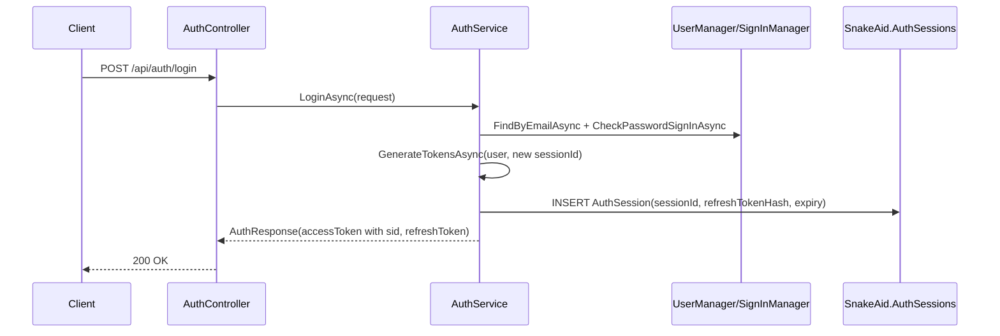
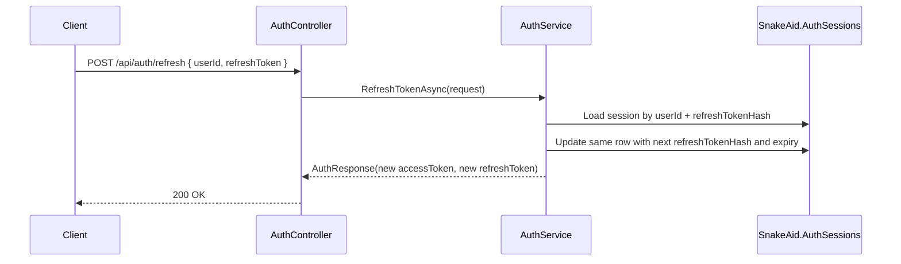
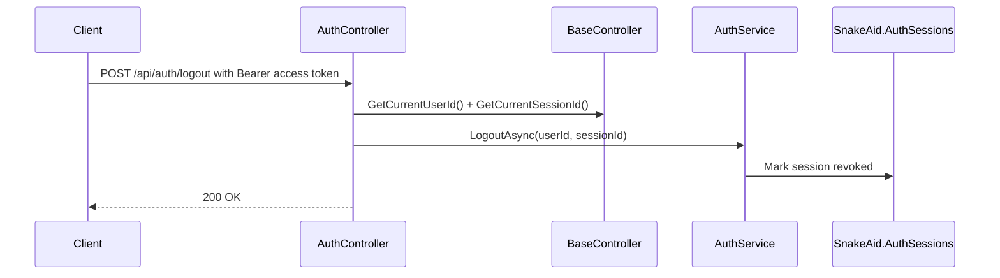
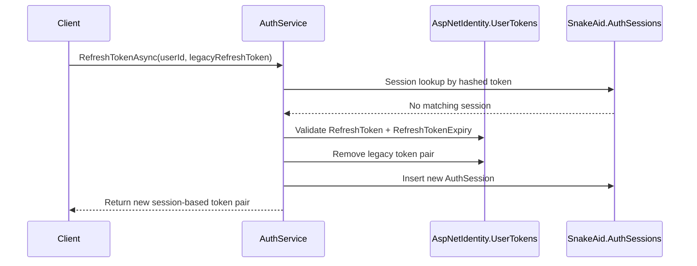

# Refresh Token Per Devices - Source Code

## Overview
SnakeAid uses ASP.NET Core Identity for user authentication, but refresh-token session state is implemented in a dedicated `SnakeAid.AuthSessions` table.

Identity is still used for:
- `UserManager<Account>`
- `SignInManager<Account>`
- password validation
- account lookup and lockout handling

The per-device/session behavior is implemented in `AuthService`, not via built-in Identity bearer-token endpoints.

## Main Code Locations
- `SnakeAid.Service/Implements/AuthService.cs`
- `SnakeAid.Api/Controllers/AuthController.cs`
- `SnakeAid.Api/Controllers/BaseController.cs`
- `SnakeAid.Core/Domains/AuthSession.cs`
- `SnakeAid.Repository/Data/Configurations/AuthSessionConfiguration.cs`
- `SnakeAid.Repository/Data/SnakeAidDbContext.cs`

## Data Model

### AuthSession
Location: `SnakeAid.Core/Domains/AuthSession.cs`

Represents one login session.

Fields:
- `Id: Guid`
- `UserId: Guid`
- `RefreshTokenHash: string`
- `RefreshTokenExpiresAt: DateTime`
- `LastUsedAt: DateTime?`
- `RevokedAt: DateTime?`
- `RevokedReason: string?`
- `CreatedAt: DateTime`
- `UpdatedAt: DateTime`

Semantics:
- `Id` is the stable session identifier
- `RefreshTokenHash` stores SHA-256 of the current refresh token
- `RevokedAt != null` means the session can no longer refresh

### EF Configuration
Location: `SnakeAid.Repository/Data/Configurations/AuthSessionConfiguration.cs`

Behavior:
- table name: `SnakeAid.AuthSessions`
- unique index on `RefreshTokenHash`
- index on `UserId`
- composite index on `{ UserId, RevokedAt, RefreshTokenExpiresAt }`
- foreign key to `AspNetIdentity.Accounts`
- `RefreshTokenHash` is marked as a concurrency token

## Public API Surface

### AuthController
Location: `SnakeAid.Api/Controllers/AuthController.cs`

Endpoints relevant to this layer:
- `POST /api/auth/login`
- `POST /api/auth/login/v2`
- `POST /api/auth/google`
- `POST /api/auth/register`
- `POST /api/auth/verify-account`
- `POST /api/auth/refresh`
- `POST /api/auth/logout`

Request contracts for `login` and `refresh` are unchanged by this layer.

## AuthService Behavior
Location: `SnakeAid.Service/Implements/AuthService.cs`

### Session Creation
`GenerateTokensAsync(Account user, Guid? sessionId = null)`

Used by:
- register
- login
- login/v2
- google login
- verify-account
- legacy refresh fallback path

Behavior:
1. create or reuse a session id
2. generate access token
3. generate random refresh token
4. hash refresh token with SHA-256
5. insert `AuthSession`
6. commit
7. return `AuthResponse`

### Access Token Claims
`GenerateAccessToken(Account user, Guid sessionId, DateTime expiresAt)`

Important claims:
- `sub`
- `email`
- `unique_name`
- `sid`
- `jti`
- `nameidentifier`
- `name`
- `email`
- `role`
- `full_name`
- `avatar_url`
- `is_active`

The `sid` claim is the key that allows current-session logout.

### Refresh
`RefreshTokenAsync(RefreshTokenRequest request)`

Primary path:
1. load user by `request.UserId`
2. verify account is active
3. call `TryRefreshSessionTokenAsync`
4. if session token is valid, rotate only that session and return new tokens

Legacy fallback path:
1. validate token from `AspNetIdentity.UserTokens`
2. remove legacy `RefreshToken` and `RefreshTokenExpiry`
3. issue a new session-based token pair through `GenerateTokensAsync`

### Session Rotation
`TryRefreshSessionTokenAsync(Account user, string refreshToken)`

Behavior:
1. hash incoming refresh token
2. load matching `AuthSession`
3. reject when revoked or expired
4. generate next refresh token and hash
5. update the tracked session row
6. commit
7. if EF concurrency update fails, treat as already-rotated/already-revoked

Concurrency guarantee:
- only one concurrent refresh attempt for the same refresh token can win
- losing attempts receive unauthorized failure

### Logout
`LogoutAsync(Guid userId, Guid? sessionId = null)`

Behavior:
- if `sessionId` is present:
  - load active session by `{ sessionId, userId }`
  - set `RevokedAt`, `RevokedReason = "logout"`, `LastUsedAt`, `UpdatedAt`
  - commit
- if `sessionId` is absent:
  - remove legacy refresh token pair from Identity token store

Current session id is extracted by `BaseController.GetCurrentSessionId()` from the JWT `sid` claim.

## Legacy Identity Integration
Identity token store is no longer the primary refresh-token store for new sessions.

Legacy constants still present in `AuthService`:
- `RefreshTokenProvider = "SnakeAid"`
- `RefreshTokenName = "RefreshToken"`
- `RefreshTokenExpiryName = "RefreshTokenExpiry"`

They are now used only for compatibility with previously-issued refresh tokens.

## Runtime Interaction Flows

### 1. Login Creates Independent Session

### 2. Refresh Rotates One Session Only

### 3. Logout Revokes Current Session Only

### 4. Legacy Refresh Migration

## Guarantees
- multiple active devices per user are supported
- refresh token rotation is session-scoped
- logout is session-scoped when access token contains `sid`
- old legacy refresh tokens can be migrated on first successful refresh
- refresh token plaintext is not persisted in the session table

## Known Limits Of Current Implementation
- request contract still requires `userId` in `POST /api/auth/refresh`
- logout cannot revoke already-issued access tokens before their expiry
- a legacy access token without `sid` falls back to legacy logout behavior
