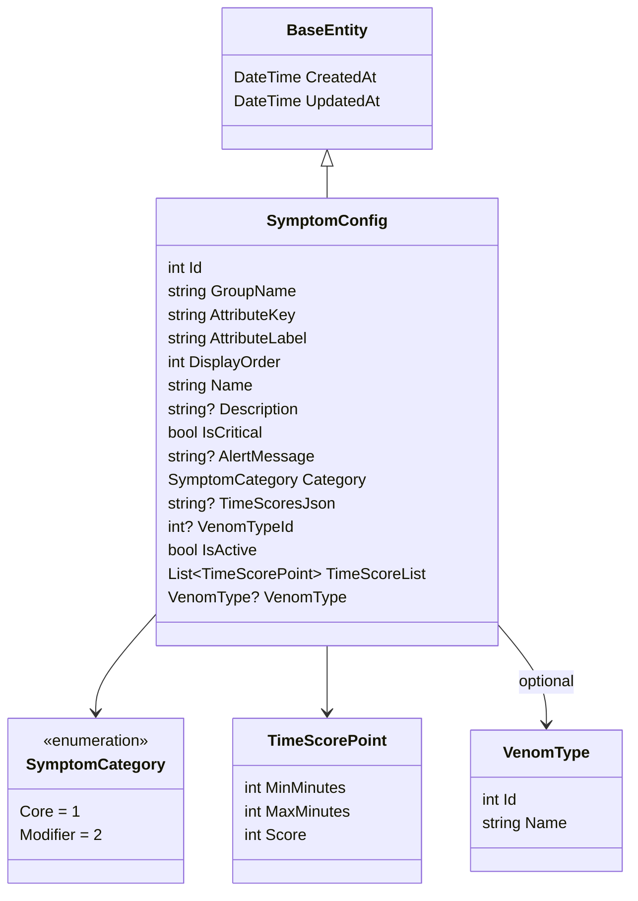
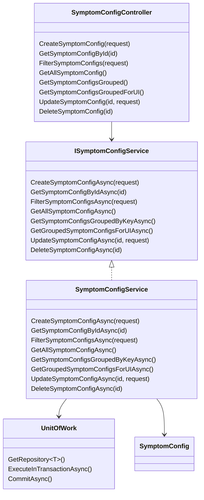
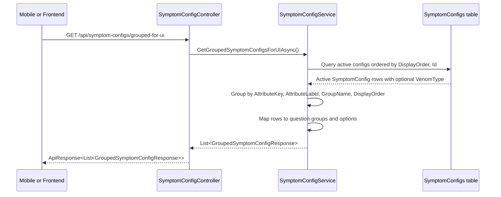
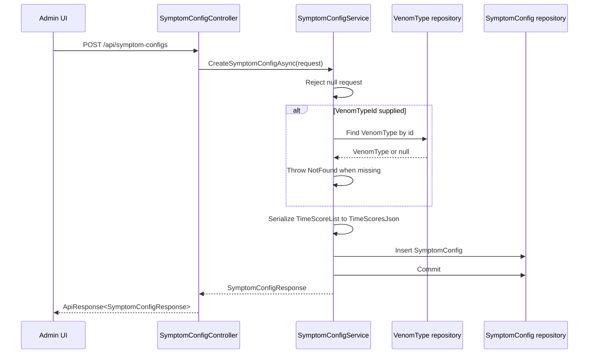
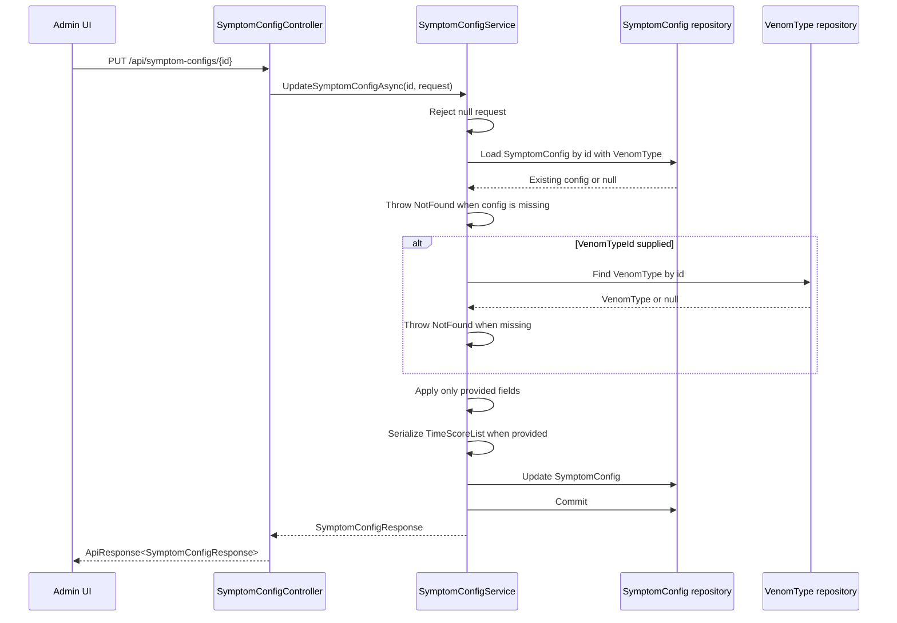
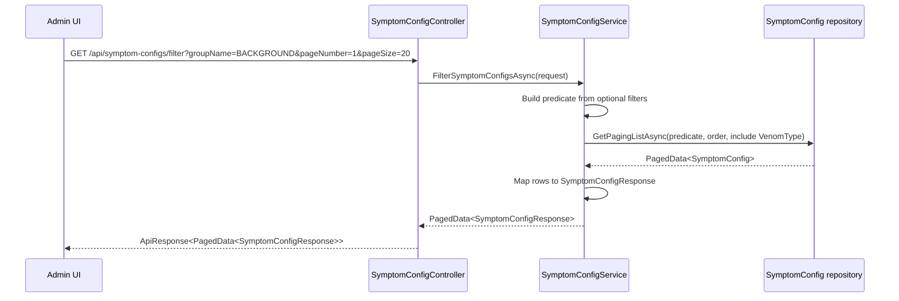
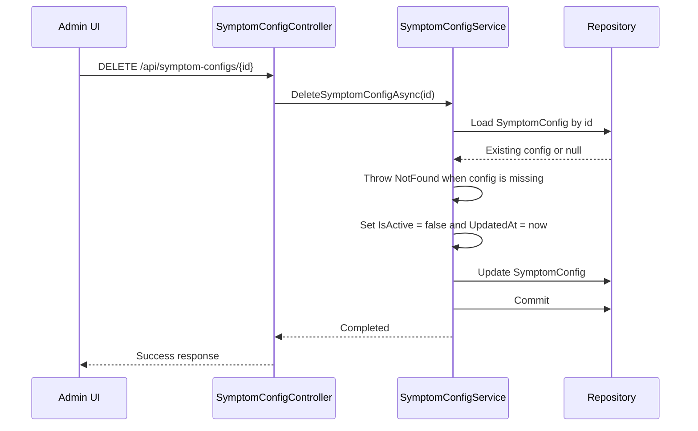

# Symptom Config Source Code Map

## Code-Verified Files

| Area | File | Responsibility |
|---|---|---|
| Domain | `SnakeAid.Core/Domains/SymptomConfig.cs` | Entity, `SymptomCategory`, `TimeScorePoint` |
| Requests | `SnakeAid.Core/Requests/SymptomConfig/CreateSymptomConfigRequest.cs` | Create request contract |
| Requests | `SnakeAid.Core/Requests/SymptomConfig/UpdateSymptomConfigRequest.cs` | Update request contract |
| Requests | `SnakeAid.Core/Requests/SymptomConfig/GetSymptomConfigRequest.cs` | Filter request contract |
| Responses | `SnakeAid.Core/Responses/SymptomConfig/SymptomConfigResponse.cs` | Flat config response |
| Responses | `SnakeAid.Core/Responses/SymptomConfig/GroupedSymptomConfigResponse.cs` | Grouped UI response |
| API | `SnakeAid.Api/Controllers/SymptomConfigController.cs` | HTTP endpoints |
| Service | `SnakeAid.Service/Interfaces/ISymptomConfigService.cs` | Service interface |
| Service | `SnakeAid.Service/Implements/SymptomConfigService.cs` | CRUD and grouped query implementation |
| Repository | `SnakeAid.Repository/Data/Configurations/SymptomConfigConfiguration.cs` | EF table, enum conversion, indexes, optional venom relation |

## Domain Class Diagram

## API And Service Class Diagram

## Grouped UI Read Sequence

## Create Sequence

## Update Sequence

## Filter Sequence

## Current Implementation Notes

- `GetGroupedSymptomConfigsForUIAsync()` filters `IsActive = true`.
- `GetSymptomConfigsGroupedByKeyAsync()` also filters `IsActive = true`.
- `FilterSymptomConfigsAsync()` can return active and inactive rows depending on query filters.
- `GetAllSymptomConfigAsync()` currently has no `IsActive` predicate, so `GET /api/symptom-configs` returns active and inactive rows.
- `GetAllSymptomConfigAsync()` orders the flat all-data list by `DisplayOrder`, then `Id`.
- `DeleteSymptomConfigAsync()` soft-deletes by setting `IsActive = false` and refreshing `UpdatedAt`.
- `UpdateSymptomConfigAsync()` only applies fields supplied in the request.
- `VenomTypeId` is validated only when a non-null value is supplied.
- The requested group/key matrix is intentionally not enforced in the service for this scope; frontend/admin UI owns that validation.
- Admin read/write actions are protected with `[Authorize(Roles = "Admin")]`.
- `GetSymptomConfigsGrouped()` and `GetSymptomConfigsGroupedForUI()` remain public active-only read actions.

## Soft Delete Sequence

