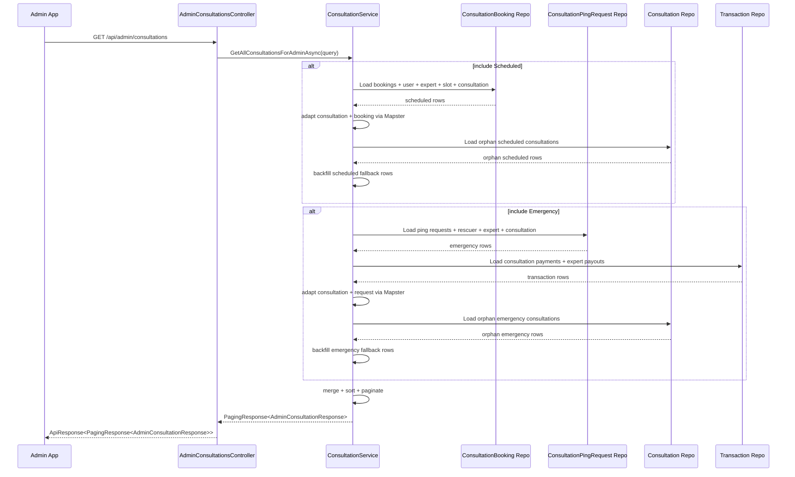
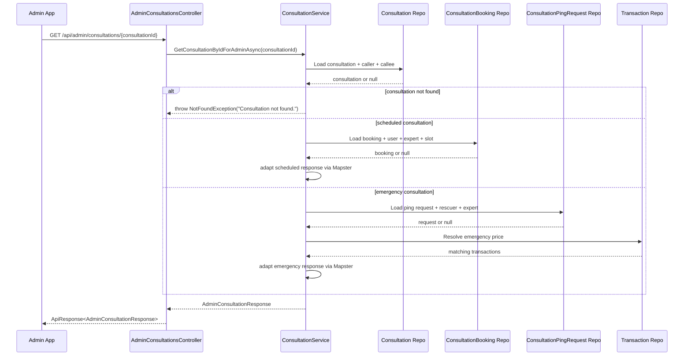

# Admin Consultation History Sourcecode

## 1. Relevant Classes

- `AdminConsultationsController`
- `IConsultationService`
- `ConsultationService`
- `AdminConsultationsQueryRequest`
- `AdminConsultationResponse`
- `AdminConsultationMapper`
- `Consultation`
- `ConsultationBooking`
- `ConsultationPingRequest`
- `ExpertTimeSlot`
- `Transaction`
- `AdminConsultationHistoryIntegrationTests`
- `AdminConsultationsControllerTests`

## 2. Implemented Backend Surface

### Controller

- `GET /api/admin/consultations`
- `GET /api/admin/consultations/{consultationId}`

### Service

- `GetAllConsultationsForAdminAsync(AdminConsultationsQueryRequest query)`
- `GetConsultationByIdForAdminAsync(Guid consultationId)`

### Mapping

- `AdminConsultationMapper`
- `MapsterConfig.RegisterMappings()`

### Shared Response Contract

Both endpoints use:

- `AdminConsultationResponse`

The difference is only payload cardinality:

- list endpoint:
  - `ApiResponse<PagingResponse<AdminConsultationResponse>>`
- single-item endpoint:
  - `ApiResponse<AdminConsultationResponse>`

## 3. Class Diagram

```mermaid
classDiagram
    class AdminConsultationsController {
        +GetAllConsultations(query)
        +GetConsultationById(consultationId)
    }

    class IConsultationService {
        +GetAllConsultationsForAdminAsync(query)
        +GetConsultationByIdForAdminAsync(consultationId)
    }

    class ConsultationService {
        -IUnitOfWork _unitOfWork
        -ILogger _logger
        +GetAllConsultationsForAdminAsync(query)
        +GetConsultationByIdForAdminAsync(consultationId)
    }

    class AdminConsultationsQueryRequest {
        +int PageNumber
        +int PageSize
        +string? Status
        +string? Type
    }

    class AdminConsultationResponse {
        +Guid ConsultationId
        +string Type
        +string Status
        +Guid UserId
        +string? UserName
        +Guid ExpertId
        +string? ExpertName
        +string? RoomId
        +DateTime? StartTime
        +DateTime? EndTime
        +decimal? Price
        +string? ProblemDescription
        +Guid? BookingId
        +string? BookingStatus
        +DateTime? BookedAt
        +DateTime? PaymentDeadline
        +DateTime? CancelledAt
        +string? CancellationReason
        +Guid? EmergencyRequestId
        +string? EmergencyRequestStatus
        +DateTime? RequestedAt
        +DateTime? RespondedAt
        +DateTime? ExpiresAt
        +DateTime? SlotStartTime
        +DateTime? SlotEndTime
    }

    class Consultation {
        +Guid Id
        +Guid CallerId
        +Guid CalleeId
        +string RoomId
        +DateTime StartTime
        +DateTime? EndTime
        +ConsultationStatus Status
        +ConsultationType Type
    }

    class ConsultationBooking {
        +Guid Id
        +Guid UserId
        +Guid ExpertId
        +decimal Price
        +DateTime BookedAt
        +DateTime? PaymentDeadline
        +BookingStatus Status
        +DateTime? CancelledAt
        +string? CancellationReason
        +string? ProblemDescription
        +Guid? ConsultationId
        +Guid TimeSlotId
    }

    class ConsultationPingRequest {
        +Guid Id
        +Guid RescuerId
        +Guid ExpertId
        +ConsultationPingStatus Status
        +DateTime RequestedAt
        +DateTime? RespondedAt
        +DateTime? ExpiresAt
        +Guid? ConsultationId
    }

    class ExpertTimeSlot {
        +Guid Id
        +DateTime StartTime
        +DateTime EndTime
    }

    class Transaction {
        +Guid ReferenceId
        +TransactionType TransactionType
        +decimal Amount
        +DateTime CreatedAt
    }

    AdminConsultationsController --> IConsultationService
    ConsultationService ..|> IConsultationService
    ConsultationService --> Consultation
    ConsultationService --> ConsultationBooking
    ConsultationService --> ConsultationPingRequest
    ConsultationService --> ExpertTimeSlot
    ConsultationService --> Transaction
    ConsultationService --> AdminConsultationMapper
    AdminConsultationsController --> AdminConsultationsQueryRequest
    ConsultationService --> AdminConsultationResponse
```

## 4. Retrieval Flows

### 4.1 List Flow

### 4.2 Single-Item Flow

## 5. Mapping Rules

### 5.1 Shared Base Fields

All admin responses normalize these fields from `Consultation` plus related records:

- `ConsultationId`
- `Type`
- `Status`
- `UserId`
- `UserName`
- `ExpertId`
- `ExpertName`
- `RoomId`
- `StartTime`
- `EndTime`
- `Price`

### 5.2 Scheduled Consultation

Sources:

- `Consultation`
- `ConsultationBooking`
- `Account User`
- `Account Expert`
- `ExpertTimeSlot`

Primary mapping:

- `ProblemDescription` <- `ConsultationBooking.ProblemDescription`
- `BookingId` <- `ConsultationBooking.Id`
- `BookingStatus` <- `ConsultationBooking.Status.ToString()`
- `BookedAt` <- `ConsultationBooking.BookedAt`
- `PaymentDeadline` <- `ConsultationBooking.PaymentDeadline`
- `CancelledAt` <- `ConsultationBooking.CancelledAt`
- `CancellationReason` <- `ConsultationBooking.CancellationReason`
- `SlotStartTime` <- `ExpertTimeSlot.StartTime`
- `SlotEndTime` <- `ExpertTimeSlot.EndTime`
- `Price` <- `ConsultationBooking.Price`

Fallback behavior:

- if `ConsultationBooking` is missing, the consultation is still returned
- booking-related fields become `null`

### 5.3 Emergency Consultation

Sources:

- `Consultation`
- `ConsultationPingRequest`
- `Account Rescuer`
- `Account Expert`
- `Transaction`

Primary mapping:

- `EmergencyRequestId` <- `ConsultationPingRequest.Id`
- `EmergencyRequestStatus` <- `ConsultationPingRequest.Status.ToString()`
- `RequestedAt` <- `ConsultationPingRequest.RequestedAt`
- `RespondedAt` <- `ConsultationPingRequest.RespondedAt`
- `ExpiresAt` <- `ConsultationPingRequest.ExpiresAt`

Emergency price resolution:

1. prefer latest `TransactionType = ConsultationPayment` by `ConsultationPingRequest.Id`
2. fallback latest `TransactionType = ExpertPayout` by `Consultation.Id`
3. otherwise `Price = null`

Fallback behavior:

- if `ConsultationPingRequest` is missing, the consultation is still returned
- emergency-request-related fields become `null`

## 6. Implementation Notes

1. The controller is separate from `ConsultationsController`
   - consistent with the existing `api/admin/...` module style
2. The admin contract is intentionally actor-neutral
   - unlike `MyConsultationResponse` and `ExpertConsultationResponse`
3. List and single-item endpoints now share one DTO
   - frontend can reuse one model for list rows and detail views
4. List and single-item retrieval strategies are different
   - list is merged-source-first
   - single item is consultation-first
5. The API contract stays normalized even though source systems differ
6. Base and enrichment field mapping are registered in `SnakeAid.Core/Mappings/AdminConsultationMapper.cs`
   - `ConsultationService` still owns fallback logic and emergency price resolution
   - Mapster is used to reduce property-assignment boilerplate, not to replace business branching

## 7. Code-Verified Tests

- `AdminConsultationHistoryIntegrationTests`
  - merged list is sorted by `StartTime desc`
  - scheduled list mapping includes booking and slot fields
  - emergency list mapping includes request fields and price fallback
  - orphan emergency consultations are still returned
  - pagination metadata is correct
  - invalid type throws validation error
  - scheduled single-item mapping includes booking detail fields
  - emergency single-item mapping includes request detail fields
  - missing consultation throws `NotFoundException`

- `AdminConsultationsControllerTests`
  - route is `api/admin/consultations`
  - controller requires role `Admin`
  - list action exposes `HttpGet`
  - list action returns `ApiResponse<PagingResponse<AdminConsultationResponse>>`
  - detail action exposes `HttpGet("{consultationId:guid}")`
  - detail action returns `ApiResponse<AdminConsultationResponse>`
    class AdminConsultationMapper {
        +Register(config)
    }
