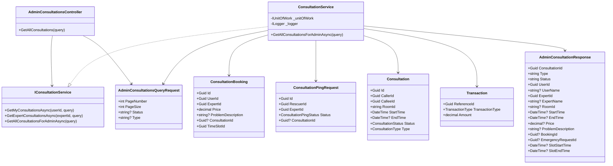
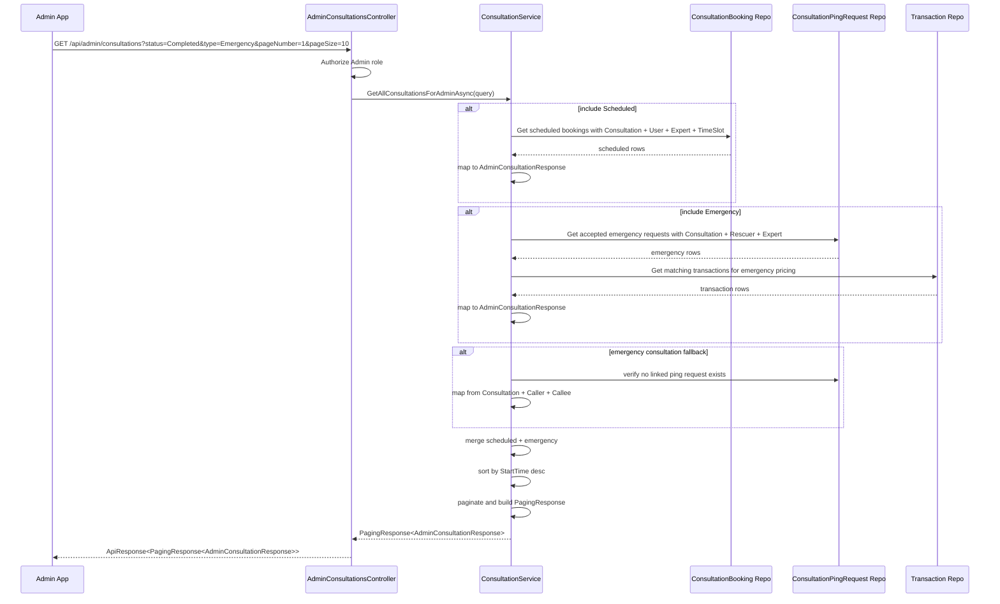

# Admin Consultation History Sourcecode

## 1. Relevant Classes

- `ConsultationsController`
- `ExpertController`
- `IConsultationService`
- `ConsultationService`
- `Consultation`
- `ConsultationBooking`
- `ConsultationPingRequest`
- `Transaction`
- `MyConsultationsQueryRequest`
- `MyConsultationResponse`
- `ExpertConsultationResponse`
- `AdminConsultationsController`
- `AdminConsultationsQueryRequest`
- `AdminConsultationResponse`
- `AdminConsultationHistoryIntegrationTests`
- `AdminConsultationsControllerTests`

## 2. Implemented New Classes

- `AdminConsultationsController`
- `AdminConsultationsQueryRequest`
- `AdminConsultationResponse`

## 3. Target Class Diagram

## 4. Admin List Sequence Diagram

## 5. Mapping Rules

### Scheduled Consultation

Sources:
- `ConsultationBooking`
- `Consultation`
- `Account User`
- `Account Expert`
- `ExpertTimeSlot`

Primary mapping:
- `ConsultationId` <- `ConsultationBooking.ConsultationId`
- `Type` <- `"Scheduled"`
- `Status` <- `Consultation.Status.ToString()`
- `UserId` <- `ConsultationBooking.UserId`
- `UserName` <- `ConsultationBooking.User.FullName`
- `ExpertId` <- `ConsultationBooking.ExpertId`
- `ExpertName` <- `ConsultationBooking.Expert.FullName`
- `Price` <- `ConsultationBooking.Price`
- `ProblemDescription` <- `ConsultationBooking.ProblemDescription`
- `BookingId` <- `ConsultationBooking.Id`
- `SlotStartTime` <- `TimeSlot.StartTime`
- `SlotEndTime` <- `TimeSlot.EndTime`

### Emergency Consultation

Sources:
- `ConsultationPingRequest`
- `Consultation`
- `Account Rescuer`
- `Account Expert`
- `Transaction`

Primary mapping:
- `ConsultationId` <- `Consultation.Id`
- `Type` <- `"Emergency"`
- `Status` <- `Consultation.Status.ToString()`
- `UserId` <- `ConsultationPingRequest.RescuerId`
- `UserName` <- `ConsultationPingRequest.Rescuer.FullName`
- `ExpertId` <- `ConsultationPingRequest.ExpertId`
- `ExpertName` <- `ConsultationPingRequest.Expert.FullName`
- `EmergencyRequestId` <- `ConsultationPingRequest.Id`
- `Price` <- first matching transaction by rule:
  - prefer `TransactionType = ConsultationPayment`, `ReferenceId = ConsultationPingRequest.Id`
  - fallback `TransactionType = ExpertPayout`, `ReferenceId = Consultation.Id`

### Orphan Scheduled Consultation

Sources:
- `Consultation`
- `Account Caller`
- `Account Callee`

Primary mapping:
- included only when `Consultation.Type = Scheduled`
- included only when there is no matching `ConsultationBooking`
- `Price` <- `null`
- `BookingId` <- `null`

### Orphan Emergency Consultation

Sources:
- `Consultation`
- `Account Caller`
- `Account Callee`
- `Transaction`

Primary mapping:
- included only when `Consultation.Type = Emergency`
- included only when there is no matching `ConsultationPingRequest`
- `EmergencyRequestId` <- `null`
- `Price` <- latest `ExpertPayout` by `Consultation.Id` when available, otherwise `null`

## 6. Implementation Notes

1. The new controller does not need to be added into `ConsultationsController`
   - existing admin modules in the repo prefer separate controllers such as `AdminWithdrawalsController`
2. Admin response should not be forced into an actor-specific shape
   - that would lose half of the context
3. Status filter should parse from the domain enum `ConsultationStatus`
4. Type filter should parse from `ConsultationType`
5. Pagination should continue to use `PaginationRequest`
6. Pagination helper and status parsing are shared across admin/user/expert history methods in `ConsultationService`

## 7. Code-Verified Tests

- `AdminConsultationHistoryIntegrationTests`
  - scheduled item maps `BookingId`, slot times, and problem description correctly
  - emergency item maps `EmergencyRequestId` correctly
  - emergency price prefers `ConsultationPayment` and falls back to `ExpertPayout`
  - orphan emergency consultation is still returned through `Consultation` fallback
  - no duplicate item is returned when a consultation already exists in the main path
  - sort uses `StartTime desc`
  - `PageNumber`, `PageSize`, `TotalItems`, `TotalPages` are correct
- `AdminConsultationsControllerTests`
  - route is `api/admin/consultations`
  - controller requires role `Admin`
  - action exposes `HttpGet`
  - action returns `ApiResponse<PagingResponse<AdminConsultationResponse>>`
