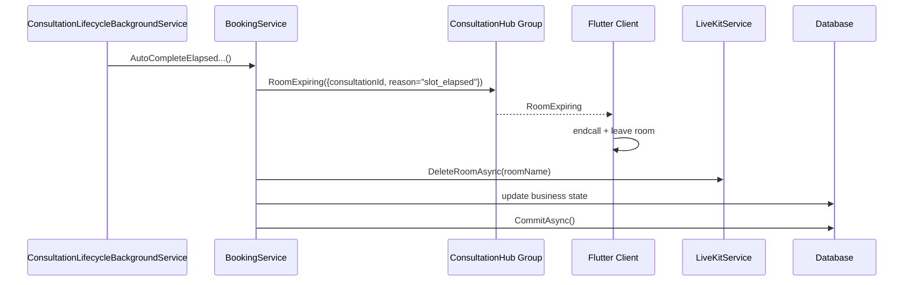
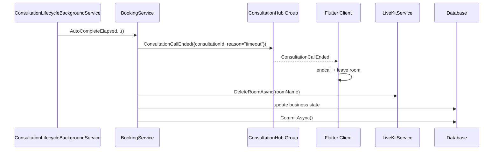
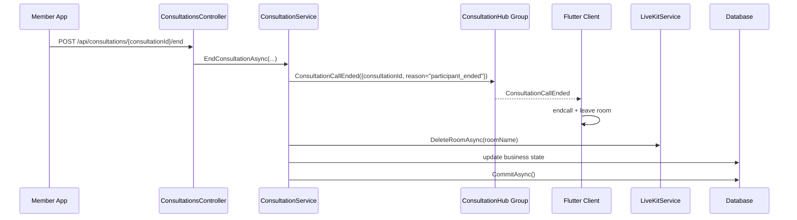

# Consultation EndCall SignalR Sourcecode

## 1. Relevant Classes

### Backend

- `ConsultationsController`
- `ConsultationService`
- `BookingService`
- `ConsultationLifecycleBackgroundService`
- `ConsultationHub`
- `ConsultationRealtimeEvents`
- `LiveKitService`

### Mobile

- `ConsultationChatSignalRService`
- `ConsultationRoomExpiringEvent`
- `VideoConsultationScreen`
- `ExpertWaitingRoomScreen`
- router path `/video-consultation/:consultationId`

## 2. Code-Verified Current Backend Surface

### HTTP

- `POST /api/consultations/{consultationId}/end`
- `POST /api/consultations/{consultationId}/video-token`

### SignalR

- hub route: `/hubs/consultation`
- consultation group format: `consultation:{consultationId}`
- current event name: `RoomExpiring`

### Current Timeout Emission

`RoomExpiring` is currently emitted by:

- `BookingService.AutoCompleteElapsedScheduledConsultationsAsync(...)`
- `BookingService.AutoCompleteElapsedEmergencyConsultationsAsync(...)`

Current code-verified timeout payload:

- `ConsultationId`
- `Reason = "slot_elapsed"`

### Current Manual-End Status

`ConsultationService.EndConsultationAsync(...)` currently:

- emits `RoomExpiring` to consultation group `consultation:{consultationId}`
- uses manual-end reason `participant_ended`
- attempts `DeleteRoomAsync(...)` for the LiveKit room
- validates actor participation
- completes consultation state
- completes booking and slot state when applicable
- commits business state
- settles escrow

## 3. Code-Verified Current Mobile Surface

### SignalR Service

`ConsultationChatSignalRService` currently:

- exposes `roomExpiringStream`
- parses direct `RoomExpiring`
- also maps `SignalReceived` with `roomexpiring` to the same event path

Current typed event:

```dart
class ConsultationRoomExpiringEvent {
  final String consultationId;
  final String reason;
}
```

### Active-Call Screen

`VideoConsultationScreen` currently:

- subscribes to `roomExpiringStream`
- uses `_handleRoomExpiringEvent(...)`
- is shared by both member and expert active-call flows

Expert mode reaches this same screen through:

- `ExpertWaitingRoomScreen`
- router path `/video-consultation/:consultationId`
- `isExpertMode: true`

### Current Flutter Behavior On `RoomExpiring`

Code-verified active-call behavior:

1. validate current consultation id
2. block duplicate handling with `_isHandlingRoomExpiry`
3. show snackbar
4. wait `350ms`
5. disconnect LiveKit room
6. call backend `endConsultation(...)`
7. navigate to completion screen

This means Flutter already treats `RoomExpiring` as a hard termination event.

## 4. Target Naming Surface

The target naming surface after migration is:

### Backend

- SignalR event name: `ConsultationCallEnded`
- DTO/model: `ConsultationCallEndedEvent`
- optional notifier method: `NotifyConsultationCallEndedAsync(...)`
- reason type: `ConsultationCallEndReason`

### Mobile

- model: `ConsultationCallEndedEvent`
- stream: `consultationCallEndedStream`
- parser helper: `_emitConsultationCallEndedFromMap(...)`
- handler: `_handleConsultationCallEndedEvent(...)`

### Reason Values

- timeout: `timeout`
- manual end: `participant_ended`

## 5. Migration Notes

This migration is full-cutover and coordinated.

Rules:

- do not keep `RoomExpiring` as a compatibility alias
- do not dual-emit both event names
- do not leave backend and Flutter on different contracts between commits intended for release

Implication:

- backend and Flutter patches must be prepared together and validated together

## 6. Reported Runtime Finding

Reported runtime finding that must remain visible in this document:

- when a user triggers manual end, expert may still fail to automatically leave the room

Interpretation rule for future readers:

- this is a reported runtime finding
- it is separate from the naming problem
- it must be re-verified after the full rename is complete

## 7. Diagrams

### 7.1 Current Timeout Flow



### 7.2 Target Timeout Flow



### 7.3 Target Manual-End Flow



## 8. Design Notes

1. The current behavior is already correct enough for a termination event.
2. The main remaining problem is domain naming consistency across backend and Flutter.
3. The migration should also normalize timeout reason naming.
4. The expert-side runtime issue still requires verification after rename.

## 9. Test Focus

- backend emits `ConsultationCallEnded`
- backend no longer emits `RoomExpiring`
- timeout reason uses `timeout`
- manual-end reason uses `participant_ended`
- Flutter member active-call client leaves room on `ConsultationCallEnded`
- Flutter expert active-call client leaves room on `ConsultationCallEnded`
- reported runtime issue is either reproduced or closed with evidence
