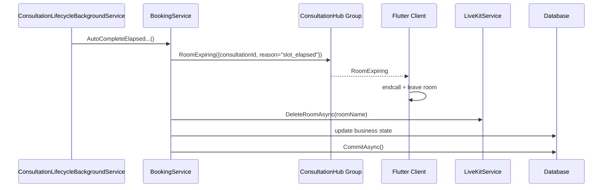
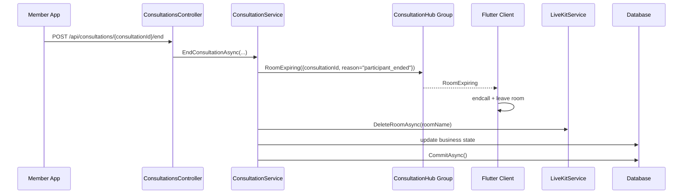

# Consultation EndCall SignalR Sourcecode

## 1. Relevant Classes

### Backend

- `ConsultationsController`
- `ConsultationService`
- `BookingService`
- `ConsultationLifecycleBackgroundService`
- `ConsultationHub`
- `LiveKitService`

### Mobile

- `ConsultationChatSignalRService`
- `ConsultationRoomExpiringEvent`
- `VideoConsultationScreen`
- `ExpertWaitingRoomScreen`
- router path `/video-consultation/:consultationId`

## 2. Code-Verified Current Backend Surface

### HTTP

- `POST /api/consultations/{consultationId}/end`
- `POST /api/consultations/{consultationId}/video-token`

### SignalR

- hub route: `/hubs/consultation`
- consultation group format: `consultation:{consultationId}`
- timeout event name: `RoomExpiring`

### Current Timeout Emission

`RoomExpiring` is emitted by:

- `BookingService.AutoCompleteElapsedScheduledConsultationsAsync(...)`
- `BookingService.AutoCompleteElapsedEmergencyConsultationsAsync(...)`

Current code-verified timeout payload:

- `ConsultationId`
- `Reason = "slot_elapsed"`

### Current Manual-End Status

`ConsultationService.EndConsultationAsync(...)` currently:

- emits `RoomExpiring` to consultation group `consultation:{consultationId}`
- uses manual-end reason `participant_ended`
- attempts `DeleteRoomAsync(...)` for the LiveKit room
- validates actor participation
- completes consultation state
- completes booking and slot state when applicable
- commits business state
- settles escrow

Current implementation notes:

- `IHubContext<ConsultationHub>` is injected into `ConsultationService`
- `ILiveKitService` is injected into `ConsultationService`
- SignalR send and room deletion are both best-effort with logging

## 3. Code-Verified Current Mobile Surface

### SignalR Service

`ConsultationChatSignalRService` currently:

- exposes `roomExpiringStream`
- parses direct `RoomExpiring`
- also maps `SignalReceived` with `roomexpiring` to the same event path

Current typed event:

```dart
class ConsultationRoomExpiringEvent {
  final String consultationId;
  final String reason;
}
```

### Active-Call Screen

`VideoConsultationScreen` currently:

- subscribes to `roomExpiringStream`
- uses `_handleRoomExpiringEvent(...)`
- is shared by both member and expert active-call flows

Expert mode reaches this same screen through:

- `ExpertWaitingRoomScreen`
- router path `/video-consultation/:consultationId`
- `isExpertMode: true`

### Current Flutter Behavior On `RoomExpiring`

Code-verified active-call behavior:

1. validate current consultation id
2. block duplicate handling with `_isHandlingRoomExpiry`
3. show snackbar
4. wait `350ms`
5. disconnect LiveKit room
6. call backend `endConsultation(...)`
7. navigate to completion screen

This means Flutter already treats `RoomExpiring` as a termination event, not as a soft warning.

## 4. Reported Runtime Finding

Reported runtime finding that must remain visible in this document:

- when a user calls `{consultationId}/end`, SignalR may emit `RoomExpiring`, but expert does not automatically leave the room

Interpretation rule for future readers:

- this is a reported runtime finding
- it is not yet explained by the current checked-out backend code alone
- it must now be re-verified against the patched backend workspace

## 5. Planned Backend Surface

The planned backend surface is intentionally conservative:

- keep event name: `RoomExpiring`
- add manual-end emission to `ConsultationService.EndConsultationAsync(...)`
- optionally introduce a notifier abstraction to avoid duplicating SignalR send logic across `BookingService` and `ConsultationService`

Planned `RoomExpiring` payload:

- `consultationId`
- `reason`

Reason values:

- current timeout value: `slot_elapsed`
- current manual-end value: `participant_ended`

## 6. Diagrams

### 6.1 Current Timeout Flow



### 6.2 Current Manual-End Flow



## 7. Design Notes

1. The main issue is not event naming anymore.
2. Flutter already provides the correct termination behavior for `RoomExpiring`.
3. The backend manual-end path is now aligned with the timeout path at the event-contract level.
4. The next unknown is whether the reported expert-side issue is delivery, subscription, group-membership, or navigation failure.

## 8. Test Focus

- backend manual-end emission exists
- backend manual-end attempts LiveKit room deletion
- backend manual-end emission reaches the consultation group
- backend timeout and manual-end use one event name
- member active-call client leaves room on `RoomExpiring`
- expert active-call client leaves room on `RoomExpiring`
- reported runtime issue is either reproduced or closed with evidence
