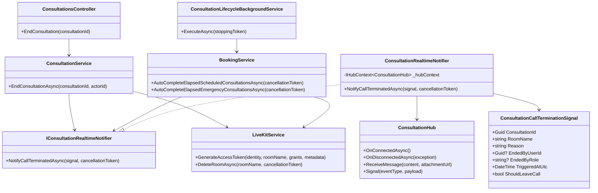
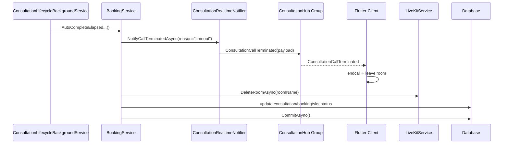
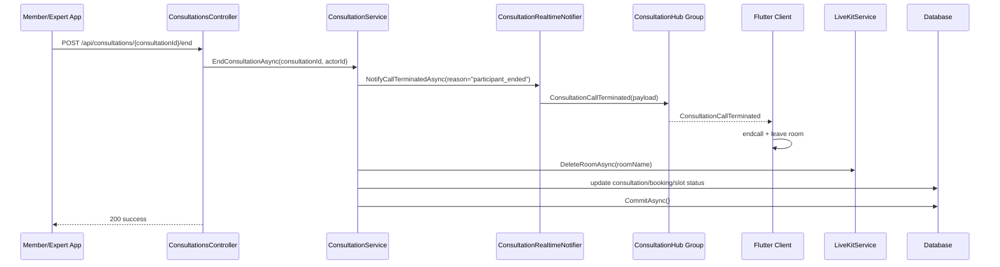

# Consultation EndCall SignalR Sourcecode

## 1. Relevant Classes

Current code-verified classes:

- `ConsultationHub`
- `ConsultationLifecycleBackgroundService`
- `BookingService`
- `ConsultationService`
- `ConsultationsController`
- `VideoCallController`
- `LiveKitService`
- `RoomCleanupTests`
- `ScheduledConsultationIntegrationTests`

Planned classes and contracts:

- `IConsultationRealtimeNotifier`
- `ConsultationRealtimeNotifier`
- `ConsultationCallTerminationSignal`

## 2. Current Backend Surface

### HTTP

- `POST /api/consultations/{consultationId}/end`
- `POST /api/consultations/{consultationId}/video-token`

### SignalR Hub

- hub route: `/hubs/consultation`
- group format: `consultation:{consultationId}`

### Current Server-To-Client Events

- `ReceiveMessage`
- `Signal`
- `RoomExpiring`

`RoomExpiring` is currently emitted only by the timeout flow inside `BookingService`.

## 3. Planned Backend Surface

### Shared Realtime Contract

- `ConsultationCallTerminated`

Proposed payload:

- `consultationId`
- `roomName`
- `reason`
- `endedByUserId`
- `endedByRole`
- `triggeredAtUtc`
- `shouldLeaveCall`

## 4. Class Diagram

## 5. Sequence Diagram

### 5.1 Timeout Flow

### 5.2 Manual End Flow

## 6. Current Code-Verified Observations

### Timeout Path

- the timeout path already depends on `IHubContext<ConsultationHub>` inside `BookingService`
- the current event name is `RoomExpiring`
- the current payload is:
  - `ConsultationId`
  - `Reason = "slot_elapsed"`
- room deletion is already tested with the format `consultation-{consultationId}`

### Manual End Path

- `ConsultationService` does not currently inject `IHubContext<ConsultationHub>`
- no SignalR event is currently emitted when calling `POST /api/consultations/{consultationId}/end`
- `DeleteRoomAsync(...)` is not currently part of the manual-end path

## 7. Design Notes

1. `BookingService` and `ConsultationService` should not each build separate anonymous termination payloads because both pushes are meant to trigger the same Flutter endcall behavior.
2. A typed payload is preferable because it makes payload-shape testing easier.
3. The existing hub route and group format should remain unchanged so Flutter does not need a new connection strategy.
4. If rollout safety is required, the notifier can support:
   - only the new event
   - or the new event plus `RoomExpiring` for a short transition period

## 8. Test Focus

- ordering:
  - signal before `DeleteRoomAsync`
  - `DeleteRoomAsync` before `CommitAsync`
- payload:
  - `consultationId`
  - `roomName`
  - `reason`
  - `endedByRole`
- resiliency:
  - SignalR failure must not block DB completion
  - room-deletion failure must not roll back business completion if the flow remains best-effort
