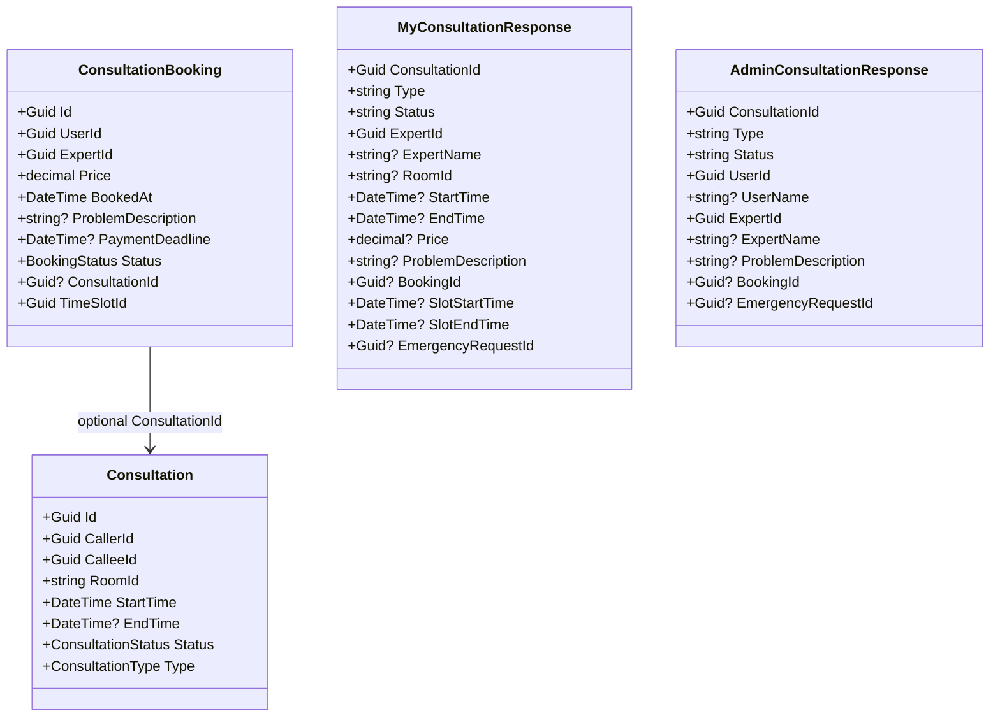
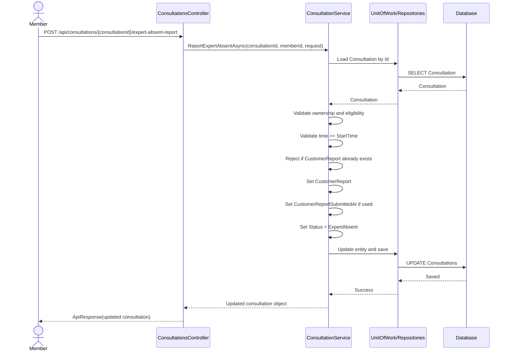
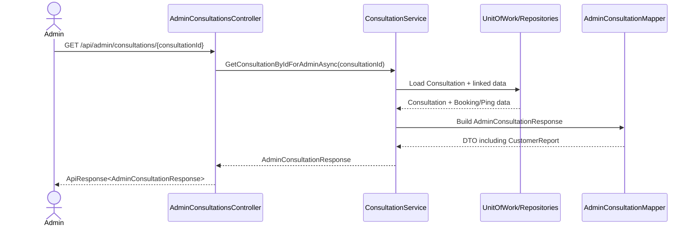

# Consultation Expert Absent Sourcecode Notes

## Overview

This file captures:

- the current code-verified structure
- the recommended target structure
- the sequence of the planned member absent-report flow

## Current Code-Verified Structure

Relevant code-verified facts:

- `Consultation` owns:
  - `Id`
  - `CallerId`
  - `CalleeId`
  - `RoomId`
  - `StartTime`
  - `EndTime`
  - `Status`
  - `Type`
- `ConsultationBooking` owns scheduled-only booking details
- `MyConsultationResponse` is the current member history DTO
- `AdminConsultationResponse` is the current admin history/detail DTO
- `ConsultationService` owns member history and admin history logic
- `ConsultationsController` owns member consultation endpoints

## Current Class Diagram



## Recommended Target Class Diagram

Recommended direction:

- add `CustomerReport` to `Consultation`
- optionally add `CustomerReportSubmittedAt` in v1
- project that field into member and admin DTOs
- add one request DTO for the member command endpoint

```mermaid
classDiagram
    class Consultation {
        +Guid Id
        +Guid CallerId
        +Guid CalleeId
        +string RoomId
        +DateTime StartTime
        +DateTime? EndTime
        +ConsultationStatus Status
        +ConsultationType Type
        +string? CustomerReport
        +DateTime? CustomerReportSubmittedAt
    }

    class ReportExpertAbsentRequest {
        +string CustomerReport
    }

    class MyConsultationResponse {
        +Guid ConsultationId
        +string Type
        +string Status
        +string? CustomerReport
    }

    class AdminConsultationResponse {
        +Guid ConsultationId
        +string Type
        +string Status
        +string? CustomerReport
    }

    class IConsultationService {
        +ReportExpertAbsentAsync(Guid consultationId, Guid memberId, ReportExpertAbsentRequest request)
        +GetMyConsultationsAsync(Guid userId, MyConsultationsQueryRequest query)
        +GetAllConsultationsForAdminAsync(AdminConsultationsQueryRequest query)
        +GetConsultationByIdForAdminAsync(Guid consultationId)
    }

    class ConsultationsController {
        +POST /api/consultations/{consultationId}/expert-absent-report
        +GET /api/users/me/consultations
    }

    ConsultationsController --> IConsultationService
    IConsultationService --> Consultation
    IConsultationService --> MyConsultationResponse
    IConsultationService --> AdminConsultationResponse
```

## Planned Sequence Diagram

This sequence is proposed, not yet implemented.



## Admin Read Sequence After Implementation



## Notes For Resume

If implementation resumes later, inspect these code areas first:

- `SnakeAid.Core/Domains/Consultation.cs`
- `SnakeAid.Core/Responses/Consultation/MyConsultationResponse.cs`
- `SnakeAid.Core/Responses/Consultation/AdminConsultationResponse.cs`
- `SnakeAid.Core/Mappings/AdminConsultationMapper.cs`
- `SnakeAid.Service/Interfaces/IConsultationService.cs`
- `SnakeAid.Service/Implements/ConsultationService.cs`
- `SnakeAid.Api/Controllers/ConsultationsController.cs`

## Metadata Recommendation

For v1, the preferred model is:

- `CustomerReport`
- `CustomerReportSubmittedAt`

Avoid putting admin-resolution fields into `Consultation` until there is an actual admin resolution workflow.
