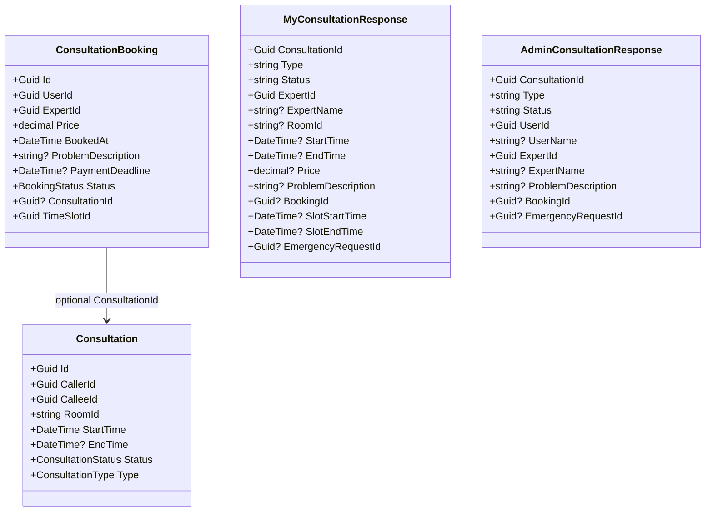
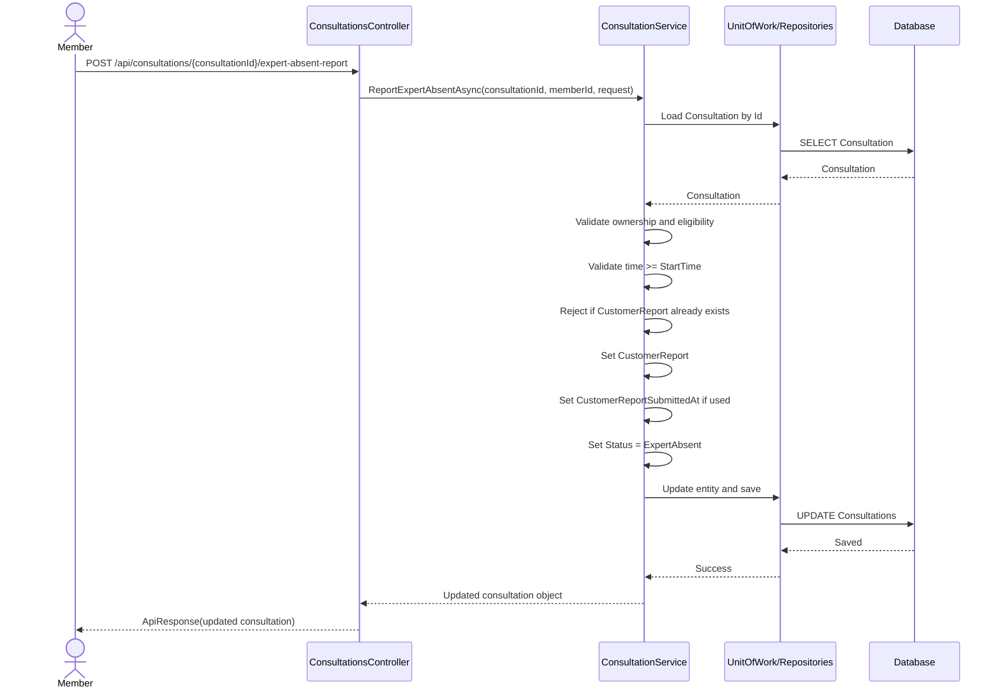
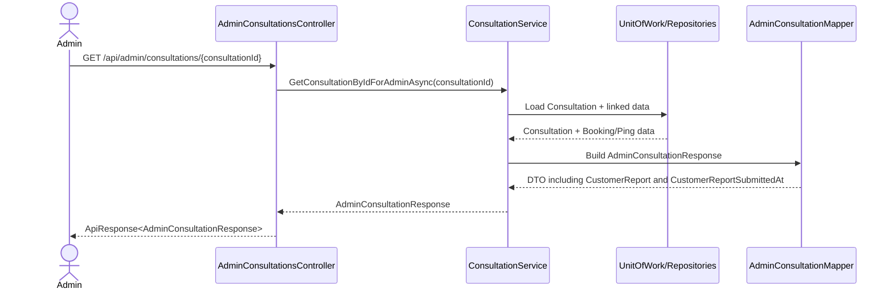
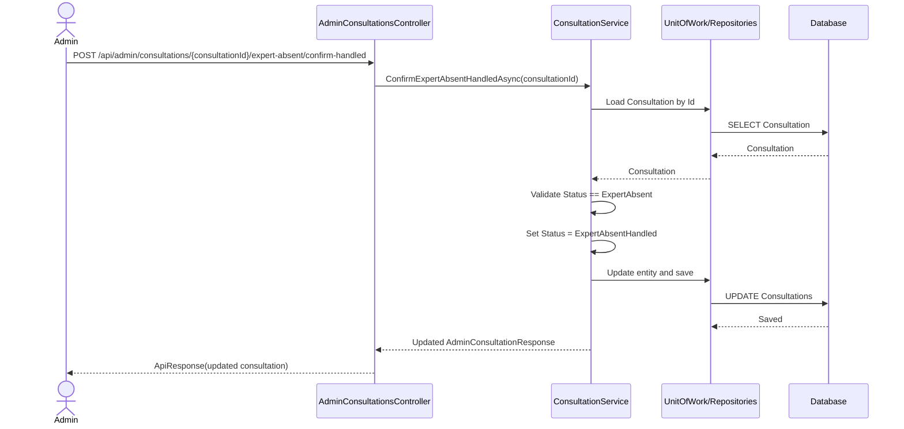
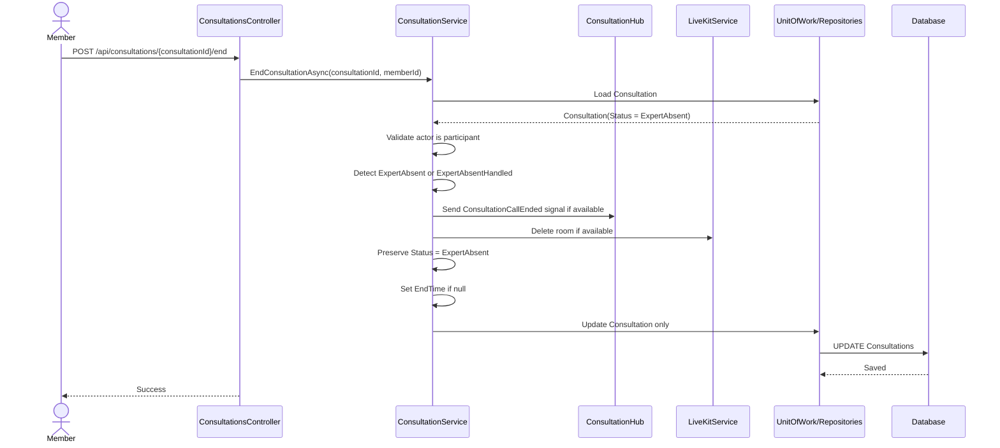
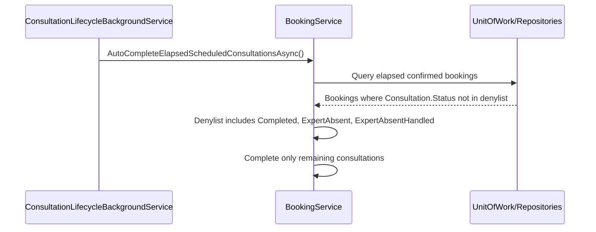

# Consultation Expert Absent Sourcecode Notes

## Overview

This file captures:

- the current code-verified structure
- the recommended target structure
- the sequence of the planned member absent-report flow
- the follow-up implementation target for end-flow protection

## Current Code-Verified Structure

Relevant code-verified facts:

- `Consultation` owns:
  - `Id`
  - `CallerId`
  - `CalleeId`
  - `RoomId`
  - `StartTime`
  - `EndTime`
  - `Status`
  - `Type`
- `ConsultationBooking` owns scheduled-only booking details
- `MyConsultationResponse` is the current member history DTO
- `AdminConsultationResponse` is the current admin history/detail DTO
- `ConsultationService` owns member history and admin history logic
- `ConsultationsController` owns member consultation endpoints
- `AdminConsultationsController` owns admin consultation endpoints

## Current Class Diagram



## Recommended Target Class Diagram

Recommended direction:

- add `CustomerReport` to `Consultation`
- add `CustomerReportSubmittedAt` in v1
- project that field into member and admin DTOs
- add one request DTO for the member command endpoint
- add one admin command endpoint to mark the case as handled

```mermaid
classDiagram
    class Consultation {
        +Guid Id
        +Guid CallerId
        +Guid CalleeId
        +string RoomId
        +DateTime StartTime
        +DateTime? EndTime
        +ConsultationStatus Status
        +ConsultationType Type
        +string? CustomerReport
        +DateTime? CustomerReportSubmittedAt
    }

    class ReportExpertAbsentRequest {
        +string CustomerReport
    }

    class MyConsultationResponse {
        +Guid ConsultationId
        +string Type
        +string Status
        +string? CustomerReport
        +DateTime? CustomerReportSubmittedAt
    }

    class AdminConsultationResponse {
        +Guid ConsultationId
        +string Type
        +string Status
        +string? CustomerReport
        +DateTime? CustomerReportSubmittedAt
    }

    class IConsultationService {
        +ReportExpertAbsentAsync(Guid consultationId, Guid memberId, ReportExpertAbsentRequest request)
        +ConfirmExpertAbsentHandledAsync(Guid consultationId)
        +GetMyConsultationsAsync(Guid userId, MyConsultationsQueryRequest query)
        +GetAllConsultationsForAdminAsync(AdminConsultationsQueryRequest query)
        +GetConsultationByIdForAdminAsync(Guid consultationId)
    }

    class ConsultationsController {
        +POST /api/consultations/{consultationId}/expert-absent-report
        +GET /api/users/me/consultations
    }

    class AdminConsultationsController {
        +POST /api/admin/consultations/{consultationId}/expert-absent/confirm-handled
        +GET /api/admin/consultations
        +GET /api/admin/consultations/{consultationId}
    }

    ConsultationsController --> IConsultationService
    AdminConsultationsController --> IConsultationService
    IConsultationService --> Consultation
    IConsultationService --> MyConsultationResponse
    IConsultationService --> AdminConsultationResponse
```

## Planned Sequence Diagram

This sequence is implemented.



## Admin Read Sequence After Implementation



## Admin Resolution Sequence



## Follow-up Sequence: Mobile Ends Call After Expert-Absent Report

This sequence is implemented and code-verified.



Implementation notes:

- do not set `Consultation.Status = Completed` when current status is `ExpertAbsent` or `ExpertAbsentHandled`
- do set `EndTime` for expert-absent calls when the call is ended
- do not set `ConsultationBooking.Status = Completed` from this expert-absent end-call path
- do not call `SettleConsultationEscrowAsync(...)` from this expert-absent end-call path
- keep room cleanup behavior separate from business completion

### Important Extension Point For Future Side-effect Work

The implemented guard in `ConsultationService.EndConsultationAsync(...)` is the intentional extension point for future expert-absent side effects.

Current shape:

```csharp
if (consultation.Status is ConsultationStatus.ExpertAbsent or ConsultationStatus.ExpertAbsentHandled)
{
    consultation.EndTime ??= DateTime.UtcNow;
    consultationRepo.Update(consultation);
    await _unitOfWork.CommitAsync();
    return;
}
```

When the open side-effect research is closed, update this branch directly.

Do:

- add the approved expert-absent payment or booking-state handling inside this branch or delegate from this branch to a clearly named helper
- keep the normal `Completed` path below this branch reserved for successful consultation completion
- keep tests that prove `ExpertAbsent` and `ExpertAbsentHandled` are not overwritten by `Completed`
- add new tests for any approved refund, settlement, booking-status, or admin-resolution side effect

Do not:

- remove the guard and rely on later code to undo `Completed`
- let execution fall through into the normal `Completed` flow for expert-absent cases
- add an outer workaround in the controller to compensate for service behavior
- create a second end-call path that duplicates room cleanup
- settle escrow or mutate booking state from `/end` unless that exact behavior has been approved by the follow-up research

Reason:

- this branch separates runtime call cleanup from business completion
- future side effects must preserve that boundary instead of patching over it later

## Follow-up Sequence: Scheduled Auto-complete Denylist

This sequence is planned for the follow-up implementation.



Implementation notes:

- keep the existing denylist style
- extend the current denylist from `Completed` to include `ExpertAbsent` and `ExpertAbsentHandled`
- do not auto-complete expert-absent cases
- do not settle expert-absent escrow from scheduled auto-complete

## Notes For Resume

If implementation resumes later, inspect these code areas first:

- `SnakeAid.Core/Domains/Consultation.cs`
- `SnakeAid.Core/Responses/Consultation/MyConsultationResponse.cs`
- `SnakeAid.Core/Responses/Consultation/AdminConsultationResponse.cs`
- `SnakeAid.Core/Mappings/AdminConsultationMapper.cs`
- `SnakeAid.Service/Interfaces/IConsultationService.cs`
- `SnakeAid.Service/Implements/ConsultationService.cs`
- `SnakeAid.Api/Controllers/ConsultationsController.cs`
- `SnakeAid.Service/Implements/BookingService.cs`
- `SnakeAid.Service/Implements/ConsultationLifecycleBackgroundService.cs`

## Metadata Recommendation

For v1, the preferred model is:

- `CustomerReport`
- `CustomerReportSubmittedAt`

Avoid putting admin-resolution fields into `Consultation` until there is an actual admin resolution workflow.

Current implemented admin resolution is intentionally minimal:

- status-only resolution through `ExpertAbsentHandled`
- no extra admin note field
- no handled-by / handled-at metadata yet

## Follow-up Open Research

These topics are intentionally not part of the end-flow protection patch:

- whether `ConfirmExpertAbsentHandledAsync(...)` should also refund the member, settle the expert, or accept an admin-selected payment outcome
- whether `ConsultationBooking.Status` should remain `Confirmed` for expert-absent cases or move to a future dedicated terminal status
- whether a dedicated payment-dispute state is needed for scheduled consultation escrow

Track these questions in `consultation-expert-absent.hallucination.md` before implementing payment or booking-status changes.
