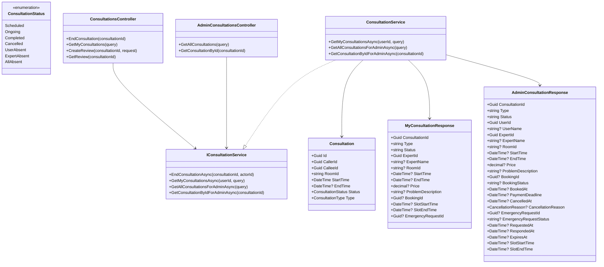
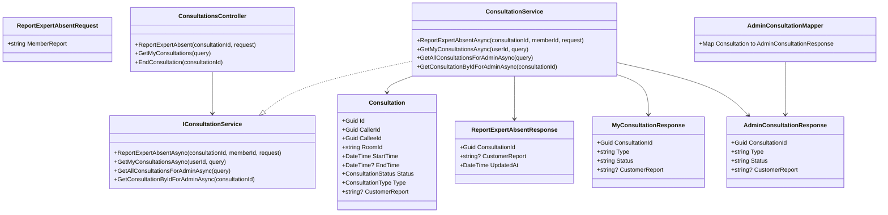
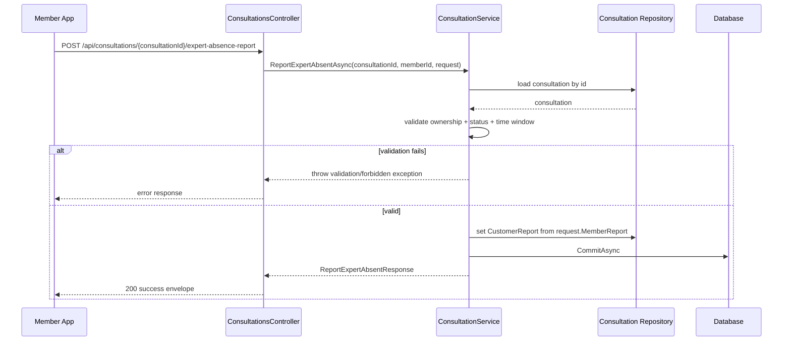
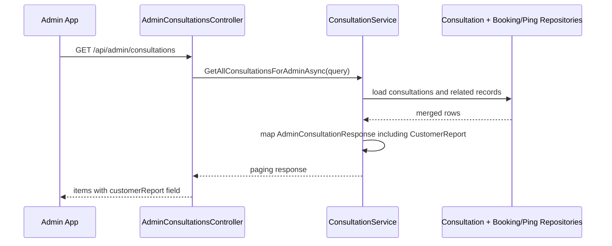
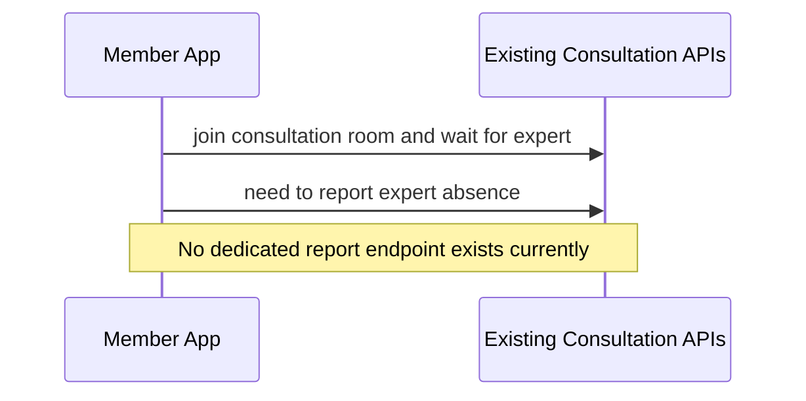

# Consultation Expert Absent Sourcecode

## 1. Relevant Classes and Files

### Current Backend Classes

- `Consultation`
- `ConsultationStatus`
- `ConsultationsController`
- `AdminConsultationsController`
- `IConsultationService`
- `ConsultationService`
- `MyConsultationResponse`
- `AdminConsultationResponse`
- `AdminConsultationMapper`
- `BookingService`
- `ConsultationLifecycleBackgroundService`
- `VideoCallController`

### Planned Additions

- report request DTO for member submission
- report response projection updates for member/admin contracts
- service method to persist absent report

## 2. Code-Verified Current Surface

### Current HTTP Endpoints (Relevant)

Member-facing:

- `GET /api/users/me/consultations`
- `POST /api/consultations/{consultationId}/video-token`
- `POST /api/consultations/{consultationId}/end`

Admin-facing:

- `GET /api/admin/consultations`
- `GET /api/admin/consultations/{consultationId}`

Current gap:

- no endpoint to submit absent-expert report
- no report field in current member/admin consultation response DTOs

### Current Lifecycle Behavior

- elapsed scheduled consultation -> `Completed`
- elapsed emergency consultation -> `Completed`
- no active path currently sets `ExpertAbsent`

## 3. As-Is Class Diagram

## 4. Planned To-Be Class Diagram

## 5. Sequence Diagrams

### 5.1 Planned Member Report Flow (Task2)

### 5.2 Planned Admin Visibility Flow (Task3)

### 5.3 Current Gap Flow (As-Is)

## 6. Task-to-Code Impact Map

### Task1 - Add `CustomerReport`

- `Consultation` domain: add nullable report field
- EF configuration: set column constraint
- migration: add new column in `SnakeAid.Consultations`
- member/admin response contracts: include report output

### Task2 - Build member report API

- request DTO
- new controller action in `ConsultationsController`
- new service method in `IConsultationService` and `ConsultationService`
- validation and persistence logic

### Task3 - Update admin endpoints

- `AdminConsultationResponse` adds `CustomerReport`
- `AdminConsultationMapper` updates mapping
- list/detail methods include and preserve report value

## 7. Test Focus

- report submit success for valid member
- report submit forbidden for non-owner/non-participant
- report submit rejected for invalid status/time window
- admin list/detail include report value
- member consultation list includes report value
- existing mapping fields and price behavior unchanged
