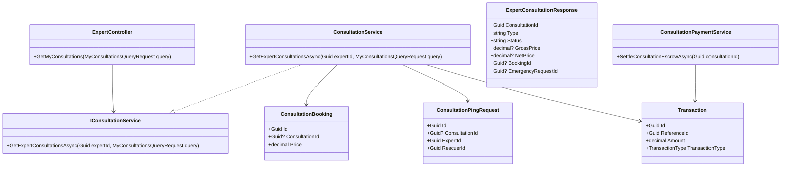
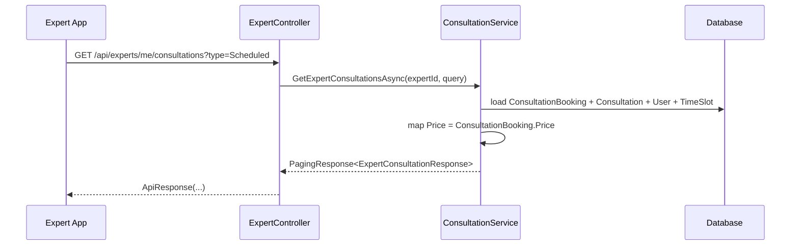
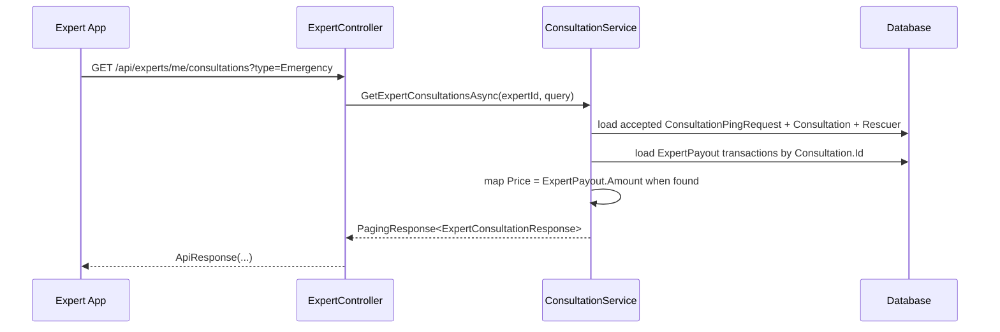
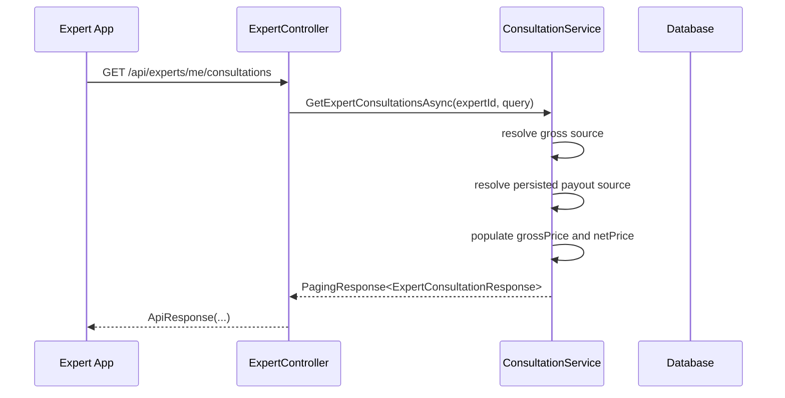

# Consultation Information Response Sourcecode

## 1. Relevant Classes

- `ExpertController`
- `IConsultationService`
- `ConsultationService`
- `ExpertConsultationResponse`
- `ConsultationBooking`
- `ConsultationPingRequest`
- `Transaction`
- `ConsultationPaymentService`

## 2. Code-Verified Current Surface

### HTTP

Current affected route:

- `GET /api/experts/me/consultations`

### DTO

Current response class:

- `ExpertConsultationResponse`

Current money fields:

- `GrossPrice`
- `NetPrice`

### Persistence Inputs Used By The Current Mapper

Current scheduled sources:

- `ConsultationBooking.Price`
- `ExpertPayout.Amount` by `Consultation.Id` when payout exists

Current emergency sources:

- latest gross transaction where:
  - `TransactionType = ConsultationPayment`
  - `ReferenceId = ConsultationPingRequest.Id`
- latest net transaction where:
  - `TransactionType = ExpertPayout`
  - `ReferenceId = Consultation.Id`

Related settlement behavior:

- consultation settlement already produces:
  - `PlatformFee`
  - `ExpertPayout`

## 3. Current Mapping Flow

### 3.1 Scheduled Expert History

Current scheduled branch in `ConsultationService.GetExpertConsultationsAsync(...)`:

1. query `ConsultationBooking` by `ExpertId`
2. include `User`, `TimeSlot`, `Consultation`
3. map each item to `ExpertConsultationResponse`
4. assign `GrossPrice = ConsultationBooking.Price`
5. assign `NetPrice = ExpertPayout.Amount` by `Consultation.Id` when payout exists, otherwise `null`

### 3.2 Emergency Expert History

Current emergency branch in `ConsultationService.GetExpertConsultationsAsync(...)`:

1. query accepted `ConsultationPingRequest` by `ExpertId`
2. include `Rescuer`, `Consultation`
3. batch-load gross `Transaction` rows where:
   - `TransactionType = ConsultationPayment`
   - `ReferenceId in ConsultationPingRequest.Id`
4. batch-load net `Transaction` rows where:
   - `TransactionType = ExpertPayout`
   - `ReferenceId in ConsultationIds`
5. assign `GrossPrice = ConsultationPayment.Amount` when found, otherwise `null`
6. assign `NetPrice = ExpertPayout.Amount` when found, otherwise `null`

## 4. Implemented Target Shape

Locked response direction:

- remove legacy `price`
- add:
  - `grossPrice`
  - `netPrice`

Locked money-source direction:

- `grossPrice` = gross consultation amount before platform fee
- `netPrice` = persisted `ExpertPayout.Amount`
- if persisted payout is absent, `netPrice = null`

## 5. Class Diagram

## 6. Sequence Diagram

### 6.1 Current Scheduled History Mapping

### 6.2 Current Emergency History Mapping

### 6.3 Implemented Contract Direction

## 7. Test Focus

- scheduled history returns explicit gross source from booking
- emergency history returns explicit net source from payout
- missing payout behavior returns `netPrice = null`
- client no longer needs hardcoded fee subtraction
- docs/examples stay aligned with final implemented DTO
