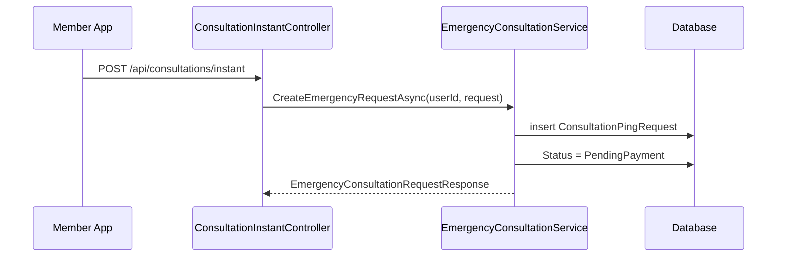
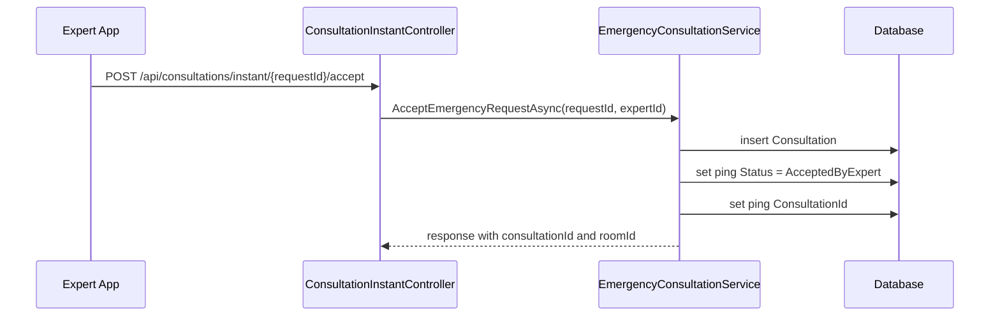
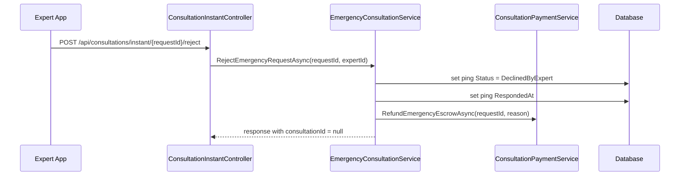
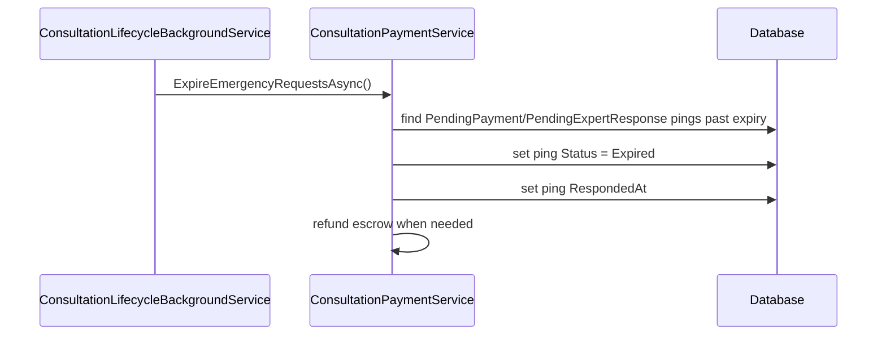
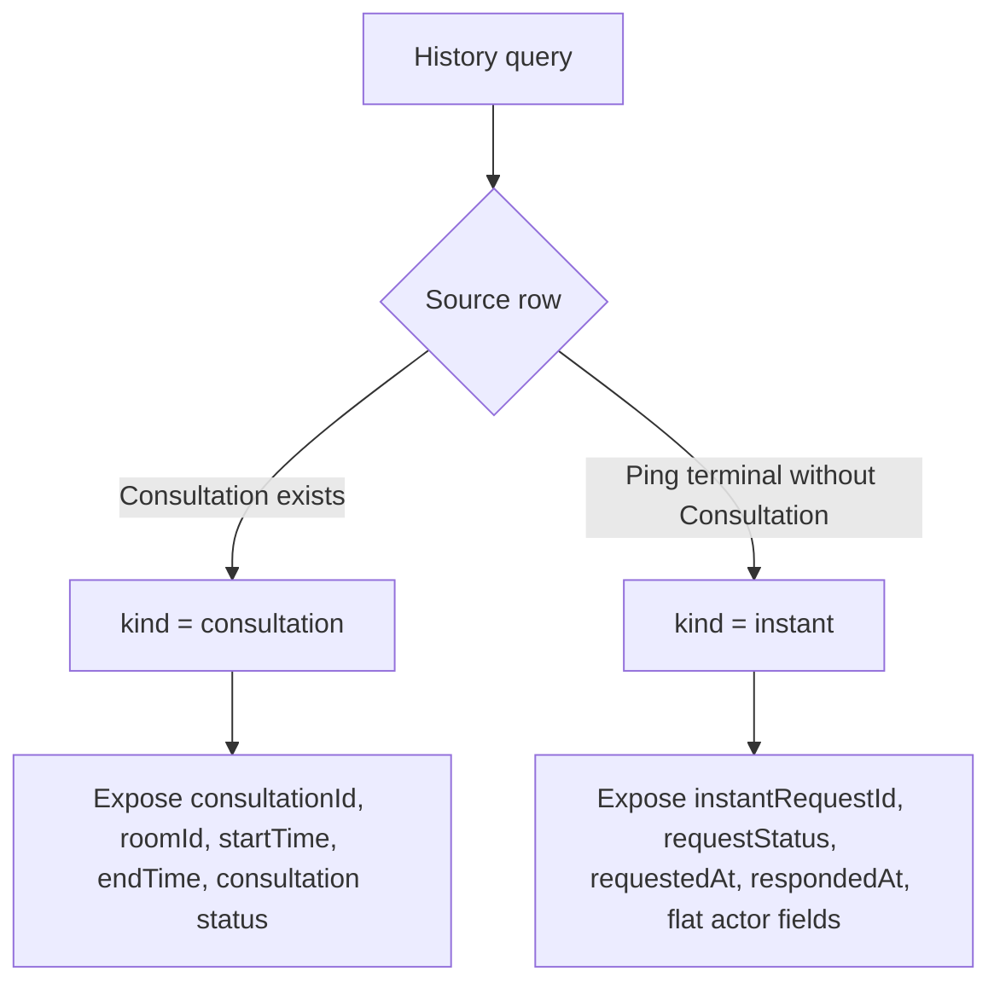

# Consultation Instant Booking Cancel Sourcecode

## 1. Relevant Classes

Active backend surface:

- `ConsultationInstantController`
- `EmergencyConsultationService`
- `ConsultationPaymentService`
- `ConsultationService`
- `ConsultationPingRequest`
- `Consultation`
- `MyConsultationResponse` for expert absent response, unchanged by history union
- `ExpertConsultationResponse` for existing expert consultation row contracts, not used as request-level DTO

Implemented response surface:

- `Responses/Consultation/History/MyConsultationHistoryUnionResponse.cs`
- `Responses/Consultation/History/MyConsultationHistoryResponse.cs`
- `Responses/Consultation/History/MyInstantConsultationRequestHistoryResponse.cs`
- `Responses/Consultation/History/ExpertConsultationHistoryUnionResponse.cs`
- `Responses/Consultation/History/ExpertConsultationHistoryResponse.cs`
- `Responses/Consultation/History/ExpertInstantConsultationRequestHistoryResponse.cs`
- no `object` / `dynamic` public response contracts
- no `JsonIgnore(WhenWritingNull)` for shaping history DTOs

## 2. Current HTTP Surface

Current verified endpoints:

- `POST /api/consultations/instant`
- `POST /api/consultations/instant/{requestId}/accept`
- `POST /api/consultations/instant/{requestId}/reject`
- `POST /api/consultations/instant/{requestId}/payments`
- `GET /api/users/me/consultations`
- `GET /api/experts/me/consultations`

## 3. Observed Current Code

### Instant Request Creation



### Expert Accept Flow



### Expert Reject Flow



### Expiration Flow



### Previous History Query Behavior

Current member history emergency branch:

- filters by `p.RescuerId == userId`
- requires `p.ConsultationId.HasValue`
- requires `p.Status == AcceptedByExpert`
- maps from linked `Consultation`

Current expert history emergency branch:

- filters by `p.ExpertId == expertId`
- requires `p.ConsultationId.HasValue`
- requires `p.Status == AcceptedByExpert`
- maps from linked `Consultation`

Previous result:

- accepted instant/emergency requests appear in history
- expert-rejected instant/emergency requests did not appear in history
- expired instant/emergency requests did not appear in history

## 4. Implemented Code

The implementation uses a typed union dedicated to the History usecase.

### Implemented Union Mapping



### `kind = consultation`

Rows with real `Consultation` records remain consultation rows.

Includes:

- scheduled consultations
- accepted instant/emergency requests linked by `ConsultationPingRequest.ConsultationId`

### `kind = instant`

Rows without `Consultation` are request-level rows.

Currently covered statuses:

- `ConsultationPingStatus.DeclinedByExpert`
- `ConsultationPingStatus.Expired`

Not currently covered:

- `PendingPayment`: active request state
- `PendingExpertResponse`: active request state
- `AcceptedByExpert`: has linked `Consultation`
- `RescuerCancelled`: enum value exists, but no production flow currently sets it

### Implemented Member DTO Shape For `kind = instant`

```csharp
new MyInstantConsultationRequestHistoryResponse
{
    InstantRequestId = ping.Id,
    Type = "Emergency",
    RequestStatus = ping.Status.ToString(),
    RequestedAt = ping.RequestedAt,
    RespondedAt = ping.RespondedAt,
    ExpertId = ping.ExpertId,
    ExpertName = ping.Expert?.FullName,
    ExpertAvatarUrl = ping.Expert?.AvatarUrl
}
```

### Implemented Expert DTO Shape For `kind = instant`

```csharp
new ExpertInstantConsultationRequestHistoryResponse
{
    InstantRequestId = ping.Id,
    Type = "Emergency",
    RequestStatus = ping.Status.ToString(),
    RequestedAt = ping.RequestedAt,
    RespondedAt = ping.RespondedAt,
    UserId = ping.RescuerId,
    UserName = ping.Rescuer?.FullName,
    UserAvatarUrl = ping.Rescuer?.AvatarUrl
}
```

### Fields Not Exposed By `kind = instant`

Do not expose these fields for request-level rows:

- `consultationId`
- `roomId`
- `startTime`
- `endTime`
- `rescueMissionId`
- `expiresAt`
- `price`
- `grossPrice`
- `netPrice`

### Implemented Service Contracts

```csharp
Task<PagingResponse<MyConsultationHistoryUnionResponse>> GetMyConsultationsAsync(...)
Task<PagingResponse<ExpertConsultationHistoryUnionResponse>> GetExpertConsultationsAsync(...)
Task<MyConsultationResponse> ReportExpertAbsentAsync(...)
```

## 5. Code Decision Status

No open product decision remains for member/expert history.

The H-003 DTO boundary has been implemented:

- history has typed union DTOs
- expert absent remains `Task<MyConsultationResponse>`
- existing `MyConsultationResponse` and `ExpertConsultationResponse` remain free of `kind` and instant request fields

H-002 is closed with conservative behavior:

- `status` filters `kind = consultation` rows only.
- `kind = instant` rows are returned only when `status` is omitted.
- Future request-level filtering should use a separate contract such as `requestStatus`.

## 6. Test Focus

- member history includes `DeclinedByExpert` instant request as `kind = instant`
- expert history includes `DeclinedByExpert` instant request as `kind = instant`
- member history includes `Expired` instant request as `kind = instant`
- expert history includes `Expired` instant request as `kind = instant`
- accepted instant request behavior remains unchanged as `kind = consultation`
- selected contract behavior is explicit and tested
- paging and sorting handle `respondedAt` for `kind = instant`
- status filtering follows H-002
- `kind = instant` DTOs do not define consultation-scoped fields
- `MyConsultationResponse` remains unchanged for expert absent
- serialization test proves derived history DTO fields appear in JSON

Verification commands:

```bash
dotnet test SnakeAid.Tests\SnakeAid.Tests.csproj --no-restore --filter ConsultationInstantHistoryIntegrationTests
dotnet test SnakeAid.Tests\SnakeAid.Tests.csproj --no-restore --filter "ConsultationPriceBugConditionTests|ConsultationPricePreservationTests|ExpertConsultationPriceResponseTests|ConsultationExpertAbsentIntegrationTests|ConsultationPropertyTests"
```
