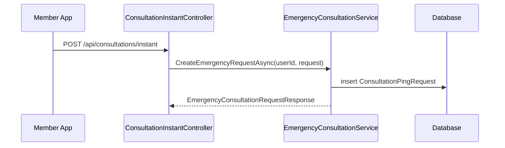
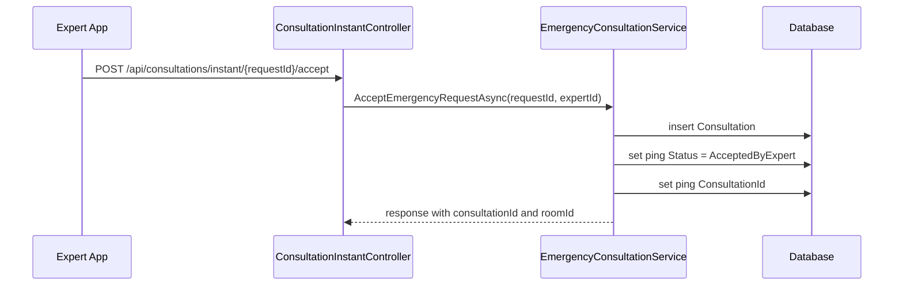
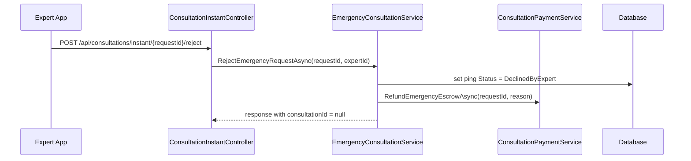

# Consultation Instant Booking Cancel Sourcecode

## 1. Relevant Classes

Active backend surface:

- `ConsultationInstantController`
- `EmergencyConsultationService`
- `ConsultationService`
- `ConsultationPingRequest`
- `Consultation`
- `MyConsultationResponse`
- `ExpertConsultationResponse`
- `ConsultationPaymentService`

## 2. Current HTTP Surface

Current verified endpoints:

- `POST /api/consultations/instant`
- `POST /api/consultations/instant/{requestId}/accept`
- `POST /api/consultations/instant/{requestId}/reject`
- `POST /api/consultations/instant/{requestId}/payments`
- `GET /api/users/me/consultations`
- `GET /api/experts/me/consultations`

## 3. Current Instant Request Flow



## 4. Current Expert Accept Flow



## 5. Current Expert Reject Flow



## 6. Current History Query Behavior

Current member history emergency branch:

- filters by `p.RescuerId == userId`
- requires `p.ConsultationId.HasValue`
- requires `p.Status == AcceptedByExpert`
- maps from linked `Consultation`

Current expert history emergency branch:

- filters by `p.ExpertId == expertId`
- requires `p.ConsultationId.HasValue`
- requires `p.Status == AcceptedByExpert`
- maps from linked `Consultation`

Result:

- accepted instant/emergency requests appear in history
- expert-rejected instant/emergency requests do not appear in history

## 7. Desired/Planned Code For Option 2

If Option 2B is chosen:

- update history response DTOs to allow `ConsultationId` to be null
- add `RecordKind`
- add `RequestStatus`
- include rejected pings in emergency history queries
- map rejected pings as request-only rows
- keep accepted pings mapped from linked `Consultation`

Planned request-only mapping:

```csharp
new MyConsultationResponse
{
    RecordKind = "EmergencyRequest",
    ConsultationId = null,
    EmergencyRequestId = ping.Id,
    Type = "Emergency",
    Status = "Cancelled",
    RequestStatus = ping.Status.ToString(),
    ExpertId = ping.ExpertId,
    ExpertName = ping.Expert?.FullName,
    RoomId = null,
    StartTime = ping.RespondedAt ?? ping.RequestedAt,
    EndTime = ping.RespondedAt,
    Price = ResolveLookupAmount(paymentLookup, ping.Id)
}
```

## 8. Test Focus

- rejected instant request appears in member history
- rejected instant request appears in expert history
- rejected row has `consultationId = null`
- rejected row has `emergencyRequestId`
- rejected row has `roomId = null`
- accepted instant request behavior remains unchanged
- paging and sorting handle request-only rows
- status filtering follows the chosen contract
