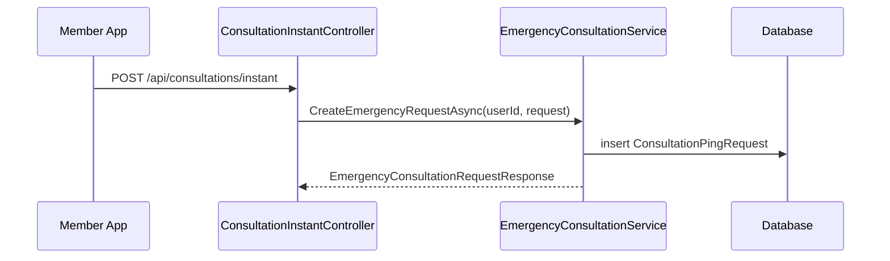
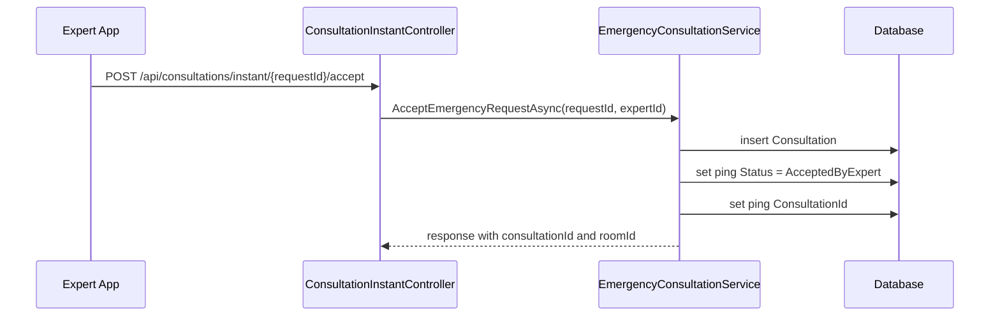
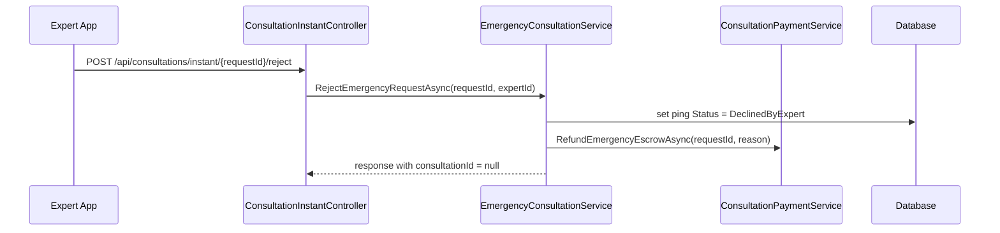

# Consultation Instant Booking Cancel Sourcecode

## 1. Relevant Classes

Active backend surface:

- `ConsultationInstantController`
- `EmergencyConsultationService`
- `ConsultationService`
- `ConsultationPingRequest`
- `Consultation`
- `MyConsultationResponse`
- `ExpertConsultationResponse`
- `ConsultationPaymentService`

## 2. Current HTTP Surface

Current verified endpoints:

- `POST /api/consultations/instant`
- `POST /api/consultations/instant/{requestId}/accept`
- `POST /api/consultations/instant/{requestId}/reject`
- `POST /api/consultations/instant/{requestId}/payments`
- `GET /api/users/me/consultations`
- `GET /api/experts/me/consultations`

## 3. Current Instant Request Flow



## 4. Current Expert Accept Flow



## 5. Current Expert Reject Flow



## 6. Current History Query Behavior

Current member history emergency branch:

- filters by `p.RescuerId == userId`
- requires `p.ConsultationId.HasValue`
- requires `p.Status == AcceptedByExpert`
- maps from linked `Consultation`

Current expert history emergency branch:

- filters by `p.ExpertId == expertId`
- requires `p.ConsultationId.HasValue`
- requires `p.Status == AcceptedByExpert`
- maps from linked `Consultation`

Result:

- accepted instant/emergency requests appear in history
- expert-rejected instant/emergency requests do not appear in history

## 7. Desired/Planned Code By Candidate Approach

No implementation approach is locked yet.

### Approach 1: Split The Contract And Force Mobile To Build Two History Screens

Planned code shape:

- update member/expert history response DTOs or introduce a new row model that can represent both `Consultation` and `ConsultationPingRequest`
- add a row discriminator, for example `RecordKind`
- allow request-level rows to have no `ConsultationId`
- add exact request status, for example `RequestStatus`
- document that mobile must build separate consultation history and instant request history screens/sections
- include rejected pings in member/expert emergency history queries
- map rejected pings as request-level rows
- keep accepted pings mapped from linked `Consultation`

Example request-level mapping:

```csharp
new MyConsultationResponse
{
    RecordKind = "EmergencyRequest",
    ConsultationId = null,
    EmergencyRequestId = ping.Id,
    Type = "Emergency",
    Status = "Cancelled",
    RequestStatus = ping.Status.ToString(),
    ExpertId = ping.ExpertId,
    ExpertName = ping.Expert?.FullName,
    RoomId = null,
    StartTime = ping.RespondedAt ?? ping.RequestedAt,
    EndTime = ping.RespondedAt,
    Price = ResolveLookupAmount(paymentLookup, ping.Id)
}
```

### Approach 2: Keep The Old Contract And Force `ConsultationPingRequest` Rows Into Consultation History

Planned code shape:

- leave existing history DTOs as close as possible to their current shape
- query `DeclinedByExpert` pings for member/expert history
- map rejected pings into the current consultation history response
- choose a concrete representation for missing `ConsultationId`
- choose concrete semantics for `RoomId`, `StartTime`, `EndTime`, and `Status`

High-risk mapping choices:

- `ConsultationId = Guid.Empty`
- `ConsultationId = ping.Id`
- `ConsultationId = null` while the old contract still documents it as non-null
- `Status = "Cancelled"` even though the source enum is `ConsultationPingStatus.DeclinedByExpert`

### Approach 3: Keep The Old Contract By Creating A Fake `Consultation`

Planned code shape:

- update `EmergencyConsultationService.RejectEmergencyRequestAsync(...)`
- create a Fake cancelled emergency `Consultation` when the expert rejects the request
- set `ConsultationPingRequest.ConsultationId` to the new consultation id
- make member/expert history pick up the row through the existing accepted-linked-consultation path or a modified emergency query
- add guards so consultation-scoped flows do not treat the Fake `Consultation` as a real call session

Fake `Consultation` creation sketch:

```csharp
var consultation = new Consultation
{
    Id = Guid.NewGuid(),
    CallerId = ping.RescuerId,
    CalleeId = ping.ExpertId,
    RoomId = /* synthesized value */,
    StartTime = ping.RespondedAt ?? ping.RequestedAt,
    EndTime = ping.RespondedAt,
    Status = ConsultationStatus.Cancelled,
    Type = ConsultationType.Emergency
};
```

## 8. Test Focus

- rejected instant request appears in member history
- rejected instant request appears in expert history
- accepted instant request behavior remains unchanged
- selected contract behavior is explicit and tested
- paging and sorting handle the selected representation
- status filtering follows the selected contract
- consultation-scoped actions are blocked or hidden for non-real consultation rows or Fake `Consultation` rows
- admin/reporting/payment/cleanup side effects are covered if Approach 3 is selected
