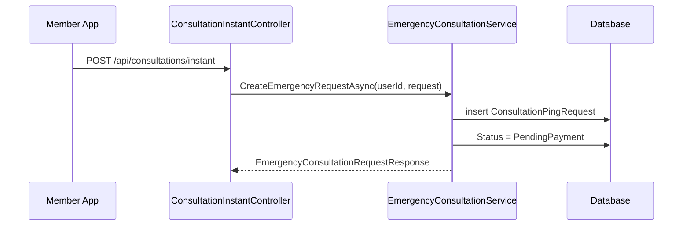
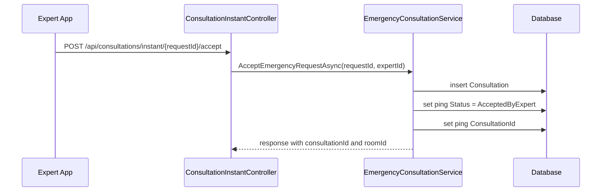
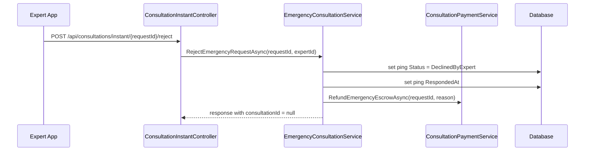
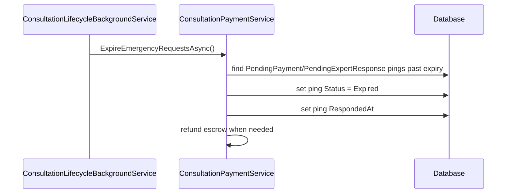
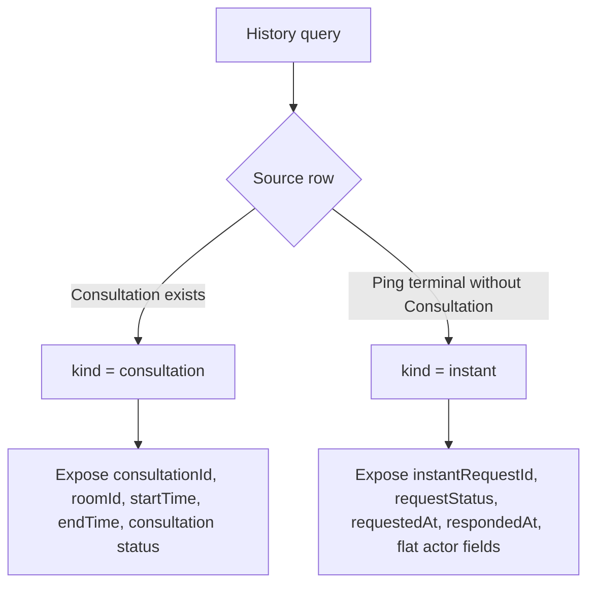

# Consultation Instant Booking Cancel Sourcecode

## 1. Relevant Classes

Active backend surface:

- `ConsultationInstantController`
- `EmergencyConsultationService`
- `ConsultationPaymentService`
- `ConsultationService`
- `ConsultationPingRequest`
- `Consultation`
- `MyConsultationResponse`
- `ExpertConsultationResponse`

Planned response surface:

- member history union row: `kind = consultation | instant`
- expert history union row: `kind = consultation | instant`
- `kind = instant` DTO is separate from the current consultation response DTOs

## 2. Current HTTP Surface

Current verified endpoints:

- `POST /api/consultations/instant`
- `POST /api/consultations/instant/{requestId}/accept`
- `POST /api/consultations/instant/{requestId}/reject`
- `POST /api/consultations/instant/{requestId}/payments`
- `GET /api/users/me/consultations`
- `GET /api/experts/me/consultations`

## 3. Observed Current Code

### Instant Request Creation



### Expert Accept Flow



### Expert Reject Flow



### Expiration Flow



### Current History Query Behavior

Current member history emergency branch:

- filters by `p.RescuerId == userId`
- requires `p.ConsultationId.HasValue`
- requires `p.Status == AcceptedByExpert`
- maps from linked `Consultation`

Current expert history emergency branch:

- filters by `p.ExpertId == expertId`
- requires `p.ConsultationId.HasValue`
- requires `p.Status == AcceptedByExpert`
- maps from linked `Consultation`

Result:

- accepted instant/emergency requests appear in history
- expert-rejected instant/emergency requests do not appear in history
- expired instant/emergency requests do not appear in history

## 4. Desired/Planned Code

The selected implementation direction is a union response contract.

### Planned Union Mapping



### `kind = consultation`

Rows with real `Consultation` records remain consultation rows.

Includes:

- scheduled consultations
- accepted instant/emergency requests linked by `ConsultationPingRequest.ConsultationId`

### `kind = instant`

Rows without `Consultation` are request-level rows.

Currently covered statuses:

- `ConsultationPingStatus.DeclinedByExpert`
- `ConsultationPingStatus.Expired`

Not currently covered:

- `PendingPayment`: active request state
- `PendingExpertResponse`: active request state
- `AcceptedByExpert`: has linked `Consultation`
- `RescuerCancelled`: enum value exists, but no production flow currently sets it

### Planned Member DTO Shape For `kind = instant`

```csharp
new MemberInstantHistoryResponse
{
    Kind = "instant",
    InstantRequestId = ping.Id,
    Type = "Emergency",
    RequestStatus = ping.Status.ToString(),
    RequestedAt = ping.RequestedAt,
    RespondedAt = ping.RespondedAt,
    ExpertId = ping.ExpertId,
    ExpertName = ping.Expert?.FullName,
    ExpertAvatarUrl = ping.Expert?.AvatarUrl
}
```

### Planned Expert DTO Shape For `kind = instant`

```csharp
new ExpertInstantHistoryResponse
{
    Kind = "instant",
    InstantRequestId = ping.Id,
    Type = "Emergency",
    RequestStatus = ping.Status.ToString(),
    RequestedAt = ping.RequestedAt,
    RespondedAt = ping.RespondedAt,
    UserId = ping.RescuerId,
    UserName = ping.Rescuer?.FullName,
    UserAvatarUrl = ping.Rescuer?.AvatarUrl
}
```

### Fields Not Exposed By `kind = instant`

Do not expose these fields for request-level rows:

- `consultationId`
- `roomId`
- `startTime`
- `endTime`
- `rescueMissionId`
- `expiresAt`
- `price`
- `grossPrice`
- `netPrice`

## 5. Open Code Decision

Status filter mapping is still open.

The implementation must not guess whether `status=Cancelled` includes `requestStatus=DeclinedByExpert`, or how `Expired` should be filtered, until H-002 is closed.

## 6. Test Focus

- member history includes `DeclinedByExpert` instant request as `kind = instant`
- expert history includes `DeclinedByExpert` instant request as `kind = instant`
- member history includes `Expired` instant request as `kind = instant`
- expert history includes `Expired` instant request as `kind = instant`
- accepted instant request behavior remains unchanged as `kind = consultation`
- selected contract behavior is explicit and tested
- paging and sorting handle `respondedAt` for `kind = instant`
- status filtering follows H-002 after it is closed
- consultation-scoped actions are hidden or unavailable for `kind = instant`
