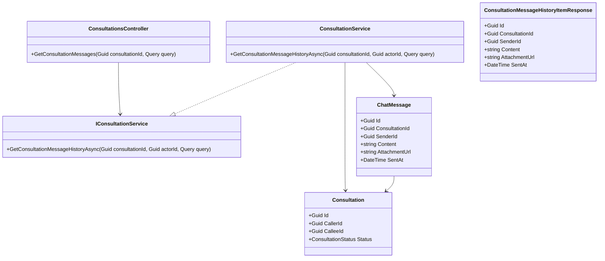
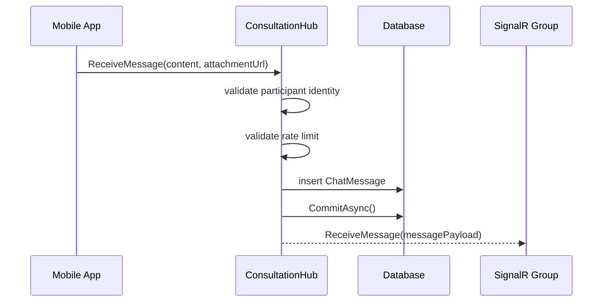
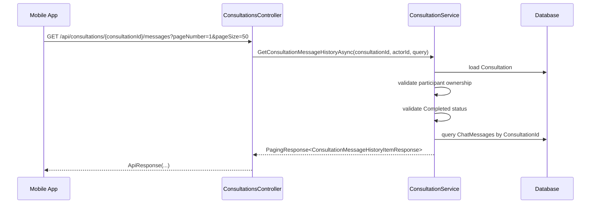

# Consultation Message History Sourcecode

## 1. Relevant Classes

### Backend

- `ConsultationsController`
- `IConsultationService`
- `ConsultationService`
- `ConsultationHub`
- `Consultation`
- `ChatMessage`
- `ChatMessageConfiguration`
- `SnakeAidDbContext`

## 2. Code-Verified Current Backend Surface

### HTTP

Current related consultation routes:

- `POST /api/consultations/{consultationId}/end`
- `GET /api/users/me/consultations`
- `POST /api/consultations/{consultationId}/expert-absent-report`
- `POST /api/consultations/{consultationId}/reviews`
- `GET /api/consultations/{consultationId}/reviews`

Current verified gap:

- there is no `GET /api/consultations/{consultationId}/messages`

### SignalR

Current messaging surface:

- hub route: `/hubs/consultation`
- connection query: `consultationId=<guid>`
- client method to server: `ReceiveMessage(content, attachmentUrl)`
- server event to group: `ReceiveMessage`

### Persistence

Current message persistence:

- entity: `ChatMessage`
- table: `ChatMessages`
- foreign key to `Consultation`
- foreign key to `Account` as sender
- indexes on `ConsultationId`, `SenderId`, `SentAt`

## 3. Code-Verified Current Flow

### Current Realtime Send Flow

`ConsultationHub.ReceiveMessage(...)` currently:

1. extracts `consultationId` from query string
2. extracts current user id from JWT
3. checks in-memory rate limit
4. validates that message has content or attachment
5. inserts `ChatMessage`
6. commits to database
7. broadcasts `ReceiveMessage` to SignalR group `consultation:{consultationId}`

### Current Participation Check

`ConsultationHub.OnConnectedAsync(...)` currently:

1. loads the consultation
2. rejects missing consultation
3. rejects users who are neither caller nor callee
4. adds valid participant to SignalR group

This is the cleanest existing authorization rule to reuse for history reads.

## 4. Planned Backend Surface

Recommended planned surface:

- controller route: `GET /api/consultations/{consultationId}/messages`
- service method on `IConsultationService`
- response DTO dedicated to consultation message history
- optional paging request DTO under `SnakeAid.Core/Requests/Consultation`

## 5. Planned Class Diagram

## 6. Planned Sequence Diagram

### 6.1 Current Send Flow

### 6.2 Planned History Read Flow

## 7. Test Focus

- consultation participants can read completed-history messages
- non-participants cannot read them
- ordering matches the locked contract
- attachment-only messages remain renderable
- the endpoint stays read-only and does not alter realtime messaging behavior
