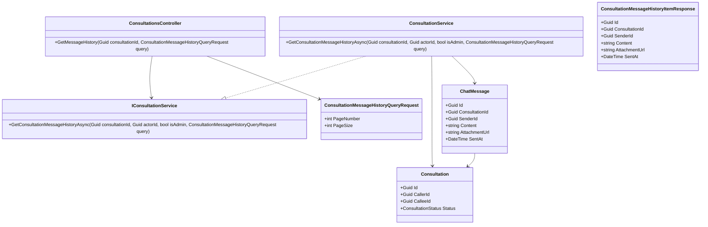
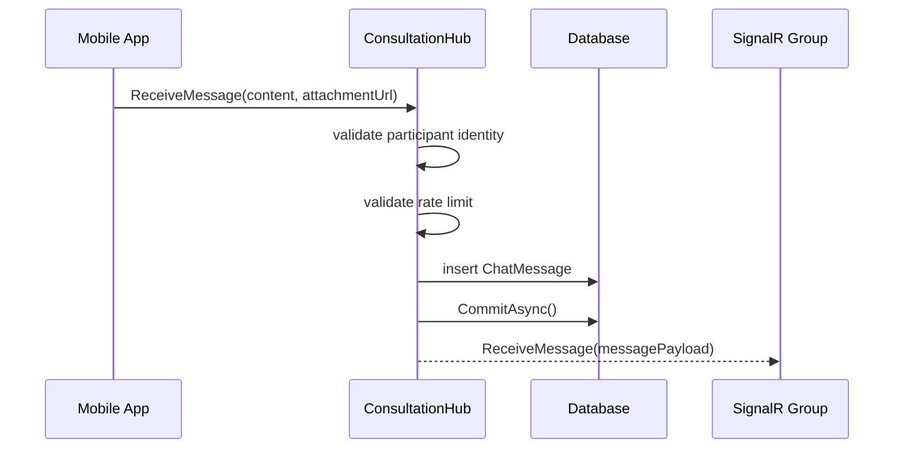
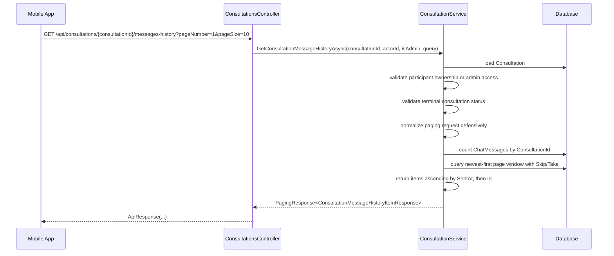

# Consultation Message History Sourcecode

## 1. Relevant Classes

### Backend

- `ConsultationsController`
- `IConsultationService`
- `ConsultationService`
- `ConsultationHub`
- `Consultation`
- `ChatMessage`
- `ChatMessageConfiguration`
- `SnakeAidDbContext`

## 2. Code-Verified Current Backend Surface

### HTTP

Current related consultation routes:

- `POST /api/consultations/{consultationId}/end`
- `GET /api/users/me/consultations`
- `POST /api/consultations/{consultationId}/expert-absent-report`
- `POST /api/consultations/{consultationId}/reviews`
- `GET /api/consultations/{consultationId}/reviews`

- `GET /api/consultations/{consultationId}/messages-history`

### SignalR

Current messaging surface:

- hub route: `/hubs/consultation`
- connection query: `consultationId=<guid>`
- client method to server: `ReceiveMessage(content, attachmentUrl)`
- server event to group: `ReceiveMessage`

### Persistence

Current message persistence:

- entity: `ChatMessage`
- table: `ChatMessages`
- foreign key to `Consultation`
- foreign key to `Account` as sender
- indexes on `ConsultationId`, `SenderId`, `SentAt`

## 3. Code-Verified Current Flow

### Current Realtime Send Flow

`ConsultationHub.ReceiveMessage(...)` currently:

1. extracts `consultationId` from query string
2. extracts current user id from JWT
3. checks in-memory rate limit
4. validates that message has content or attachment
5. inserts `ChatMessage`
6. commits to database
7. broadcasts `ReceiveMessage` to SignalR group `consultation:{consultationId}`

### Current Participation Check

`ConsultationHub.OnConnectedAsync(...)` currently:

1. loads the consultation
2. rejects missing consultation
3. rejects users who are neither caller nor callee
4. adds valid participant to SignalR group

This is the cleanest existing authorization rule to reuse for history reads.

## 4. Implemented Backend Surface

Implemented surface:

- controller route: `GET /api/consultations/{consultationId}/messages-history`
- controller action: `ConsultationsController.GetMessageHistory(...)`
- service method: `IConsultationService.GetConsultationMessageHistoryAsync(...)`
- service implementation: `ConsultationService.GetConsultationMessageHistoryAsync(...)`
- response DTO: `ConsultationMessageHistoryItemResponse`
- query DTO: `ConsultationMessageHistoryQueryRequest`
- terminal-state validation for:
  - `Cancelled`
  - `Completed`
  - `UserAbsent`
  - `ExpertAbsent`
  - `AllAbsent`
- access rule:
  - participant
  - or admin
- DB-side paging:
  - `CountAsync()` on the newest-first query
  - `Skip(...)` and `Take(...)` on the same query
- service-level paging normalization:
  - `pageNumber < 1` becomes `1`
  - `pageSize < 1` becomes `10`
- newest-window-first page selection with ascending item order inside each page
- `pageNumber = 1` means newest history batch

## 5. Class Diagram

## 6. Sequence Diagram

### 6.1 Current Send Flow

### 6.2 Implemented History Read Flow

## 7. Test Focus

- consultation participants can read history for `Cancelled`, `Completed`, `UserAbsent`, `ExpertAbsent`, and `AllAbsent`
- admin can read history even when not a participant
- non-participants cannot read them
- ordering matches the locked contract
- attachment-only messages remain renderable
- page `1` returns the newest message window while preserving ascending order inside the page
- page `2` returns the next older message window without overlap or reversal
- paging is executed at DB level rather than materializing the whole consultation history
- the endpoint stays read-only and does not alter realtime messaging behavior
