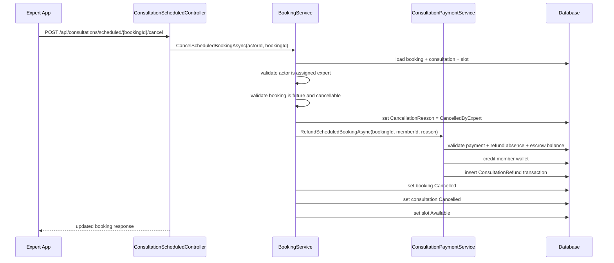
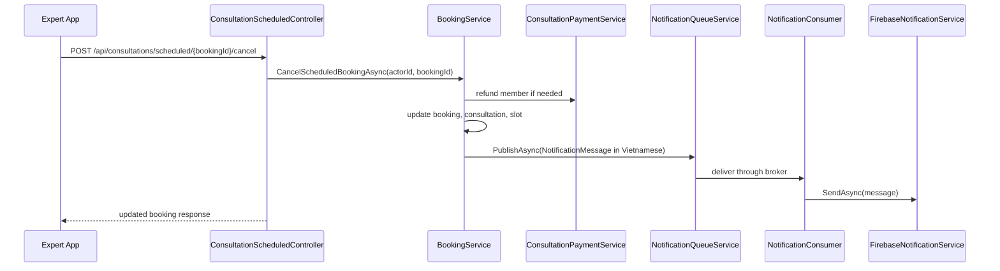
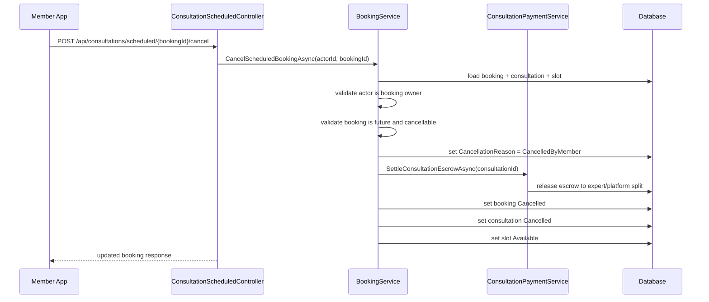

# Scheduled Booking Cancel Sourcecode

## 1. Relevant Classes

### Active backend surface

- `ConsultationScheduledController`
- `BookingService`
- `ConsultationPaymentService`
- `NotificationQueueService`
- `NotificationConsumer`
- `FirebaseNotificationService`
- `ConsultationService`
- `ConsultationBooking`
- `Consultation`
- `ExpertTimeSlot`
- `Transaction`

### Implemented additions

- `IBookingService.CancelScheduledBookingAsync(...)`
- `BookingService.CancelScheduledBookingAsync(...)`
- `IConsultationPaymentService.RefundScheduledBookingAsync(...)`
- `ConsultationPaymentService.RefundScheduledBookingAsync(...)`
- `IConsultationPaymentService.CancelPendingScheduledBookingPaymentAsync(...)`
- `ConsultationPaymentService.CancelPendingScheduledBookingPaymentAsync(...)`

## 2. Code-Verified Current Surface

### HTTP

- `POST /api/consultations/scheduled`
- `GET /api/users/me/consultations/scheduled`
- `GET /api/experts/me/consultations/scheduled`
- `POST /api/consultations/scheduled/{bookingId}/cancel`
- `POST /api/consultations/scheduled/{bookingId}/payments`
- `POST /api/consultations/payments/confirm`

### Booking lifecycle

- create booking -> `PendingPayment`
- pay booking -> `Confirmed`
- cancel booking -> `Cancelled`
- end/elapsed booking -> `Completed`

### Refund lifecycle

- emergency consultation rejection can call `RefundEmergencyEscrowAsync(...)`
- scheduled expert-cancel can call `RefundScheduledBookingAsync(...)`
- refund uses existing escrow balance checks
- refund credits the receiver wallet
- refund creates `TransactionType.ConsultationRefund`

## 3. Implemented Class Responsibilities

### `ConsultationScheduledController`

Current role:

- create booking
- list bookings for member
- list bookings for expert
- cancel scheduled booking

### `BookingService`

Current role:

- create scheduled booking
- cancel scheduled booking
- publish member push notification when expert cancels
- read member/expert booking lists
- auto-complete elapsed scheduled bookings

### `ConsultationPaymentService`

Current role:

- move scheduled booking payment into escrow
- create scheduled booking PayOs intent
- confirm scheduled booking PayOs payment
- refund scheduled booking escrow
- cancel pending scheduled booking payment intent
- settle consultation escrow
- refund emergency escrow

### `NotificationQueueService`

Current researched role:

- persist `AppNotification`
- publish `NotificationMessage` via `MassTransit`
- tolerate broker-delivery failure without rolling back the stored notification

### `NotificationConsumer`

Current researched role:

- consume queued `NotificationMessage`
- delegate to `FirebaseNotificationService.SendAsync(...)`

### `FirebaseNotificationService`

Current researched role:

- read the user `FcmToken`
- build Firebase push payload
- deliver mobile push notification

## 4. Final Design Notes

Implemented orchestration split:

- `BookingService.CancelScheduledBookingAsync(...)`
  - validate actor and booking state
  - decide whether pending-payment cleanup, refund, or escrow settlement is needed
  - persist actor-centric reason into `ConsultationBooking.CancellationReason`
  - update booking, consultation, and slot
  - call payment service for refund, escrow settlement, or pending-payment cleanup when needed

- `ConsultationPaymentService.RefundScheduledBookingAsync(...)`
  - locate the successful consultation payment by `bookingId`
  - validate the refund recipient matches the booking owner
  - block duplicate refund
  - reuse escrow refund helper to restore wallet balance
  - create refund transaction using the existing refund infrastructure

- `ConsultationPaymentService.CancelPendingScheduledBookingPaymentAsync(...)`
  - find pending scheduled booking payment transaction
  - fail explicitly if the external payment has already been confirmed
  - delete the local pending transaction
  - best-effort cancel the PayOs payment link when the pending payment uses `PayOs`

Implemented notification split:

- `BookingService.CancelScheduledBookingAsync(...)`
  - after successful expert-cancel commit
  - publish a member-targeted notification through `INotificationQueueService`

Cancellation-reason direction:

- `ConsultationBooking.CancellationReason` is a nullable enum-backed field
- enum values:
  - `CancelledByMember = 1`
  - `CancelledByExpert = 2`
  - `CancelledByAdmin = 3`
  - `CancelledBySystem = 4`
- persistence follows project convention and stores the enum as numeric value
- response models expose typed enum values; API JSON serialization renders enum names as strings

## 5. Class Diagram

```mermaid
classDiagram
    class ConsultationScheduledController {
        +CreateBooking(request)
        +GetMyBookings()
        +GetExpertBookings()
        +CancelScheduledBooking(bookingId)
    }

    class IBookingService {
        +CreateScheduledBookingAsync(userId, request)
        +GetMyBookingsAsync(userId)
        +GetExpertBookingsAsync(expertId)
        +CancelScheduledBookingAsync(actorId, bookingId)
    }

    class BookingService {
        +CreateScheduledBookingAsync(userId, request)
        +GetMyBookingsAsync(userId)
        +GetExpertBookingsAsync(expertId)
        +CancelScheduledBookingAsync(actorId, bookingId)
        +AutoCompleteElapsedScheduledConsultationsAsync()
    }

    class IConsultationPaymentService {
        +PayScheduledBookingAsync(userId, bookingId, request)
        +ConfirmConsultationPaymentAsync(transactionId)
        +ConfirmConsultationPaymentByOrderCodeAsync(orderCode)
        +RefundScheduledBookingAsync(bookingId, receiverId, reason)
        +CancelPendingScheduledBookingPaymentAsync(bookingId, reason)
        +SettleConsultationEscrowAsync(consultationId)
    }

    class ConsultationPaymentService {
        +PayScheduledBookingAsync(userId, bookingId, request)
        +CreateScheduledBookingPayOsIntentAsync(userId, bookingId, request, cancellationToken)
        +RefundScheduledBookingAsync(bookingId, receiverId, reason)
        +CancelPendingScheduledBookingPaymentAsync(bookingId, reason, cancellationToken)
        -RefundFromEscrowAsync(receiverId, referenceId, amount, description, cancellationToken)
    }
```

## 6. Sequence Diagram: Expert Cancel With Refund

## 6A. Sequence Diagram: Expert Cancel With Push Notification

## 6B. Current Vietnamese Push Copy

Current active copy:

- title:
  - `Lịch tư vấn đã bị chuyên gia hủy`
- body:
  - `Chuyên gia đã hủy lịch tư vấn của bạn. Vui lòng kiểm tra lại lịch hẹn trong ứng dụng.`

## 7. Sequence Diagram: Member Cancel Without Refund

## 8. Test Focus

- `PendingPayment` cancellation releases slot and updates state
- `PendingPayment` PayOs cancellation deletes the local pending payment transaction
- `PendingPayment` cancellation fails explicitly if the payment already has an external confirmation id
- expert-cancel of paid booking creates one refund transaction
- expert-cancel queues one member-targeted notification with Vietnamese copy
- member-cancel of paid booking creates no refund transaction
- member-cancel of paid booking settles escrow instead of leaving confirmed funds stranded
- paid booking cancelled after PayOs confirmation follows the same refund rule as wallet payment
- duplicate cancel or duplicate refund is blocked
- started or completed booking cancellation is rejected
