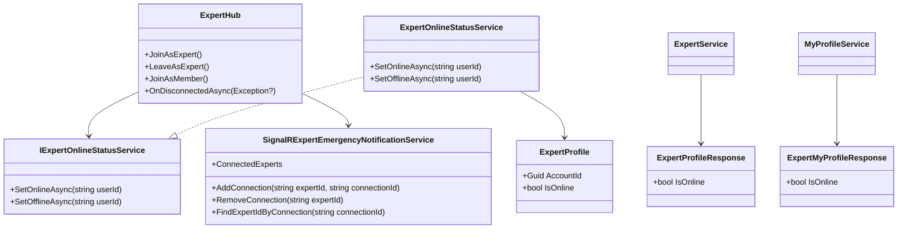
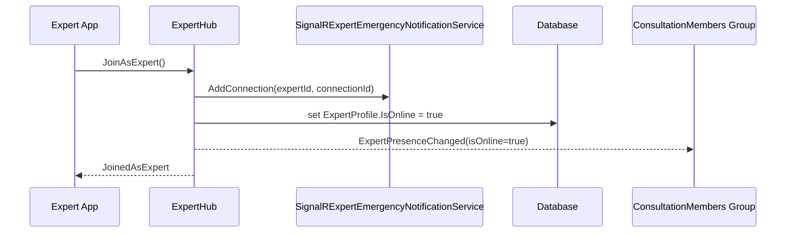
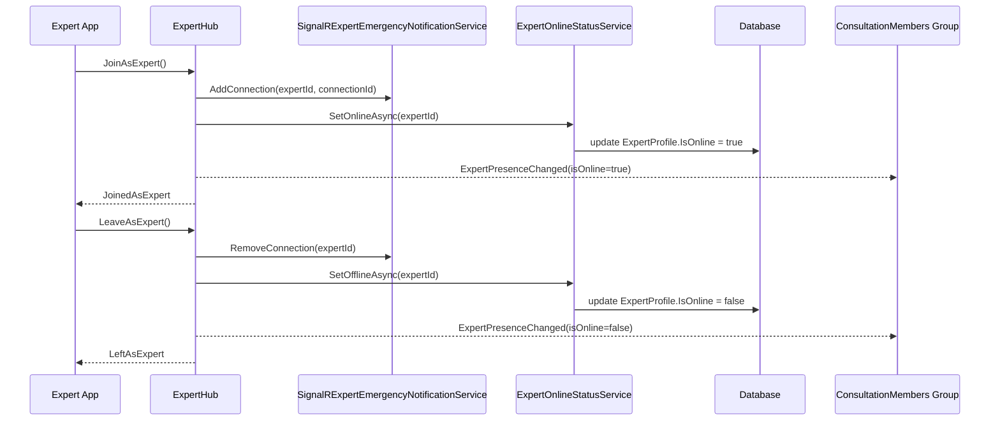

# Expert Availability Sourcecode

## 1. Relevant Classes

### Current backend surface

- `ExpertHub`
- `SignalRExpertEmergencyNotificationService`
- `ExpertProfile`
- `ExpertProfileResponse`
- `ExpertMyProfileResponse`
- `ExpertService`
- `MyProfileService`

### Planned additions

- `IExpertOnlineStatusService`
- `ExpertOnlineStatusService`

## 2. Code-Verified Current Backend Surface

### HTTP

Current related HTTP routes:

- `GET /api/experts`
- `GET /api/experts/{id}`
- `GET /api/experts/me/profile`

These routes already expose `IsOnline` in response data.

### SignalR

Current related SignalR route:

- `/hubs/expert`

Current code-verified client-to-server methods:

- `JoinAsExpert()`
- `JoinAsMember()`
- `JoinEmergencyRequestRoom(Guid requestId)`

Current code-verified server-to-client events:

- `JoinedAsExpert`
- `OnlineExpertsSnapshot`
- `ExpertPresenceChanged`
- `JoinedEmergencyRequestRoom`

## 3. Code-Verified Current Flow

### Current expert online flow

`ExpertHub.JoinAsExpert()` currently:

1. validates the current user role is `Expert`
2. resolves the current expert id from JWT claims
3. stores `expertId -> connectionId` inside `ConnectedExperts`
4. updates `ExpertProfile.IsOnline = true`
5. broadcasts `ExpertPresenceChanged` with `isOnline = true`
6. replies to caller with `JoinedAsExpert`

### Current expert offline flow

`ExpertHub.OnDisconnectedAsync(...)` currently:

1. finds the expert id by current `connectionId`
2. removes the tracked connection from `ConnectedExperts`
3. updates `ExpertProfile.IsOnline = false`
4. broadcasts `ExpertPresenceChanged` with `isOnline = false`

### Current structural gap

The current expert availability flow works, but it differs from the rescuer structure because:

- expert status persistence is inside a private hub helper
- there is no explicit reusable expert online-status service
- there is no explicit intentional offline method for the app

## 4. Planned Backend Surface

Planned additions:

- `IExpertOnlineStatusService.SetOnlineAsync(string userId)`
- `IExpertOnlineStatusService.SetOfflineAsync(string userId)`
- `ExpertHub.LeaveAsExpert()`

Planned refactor:

- replace `ExpertHub.SetExpertOnlineFlagAsync(...)` with the service

## 5. Class Diagram

## 6. Sequence Diagram

### 6.1 Current Online Flow

### 6.2 Planned Final Toggle Flow

