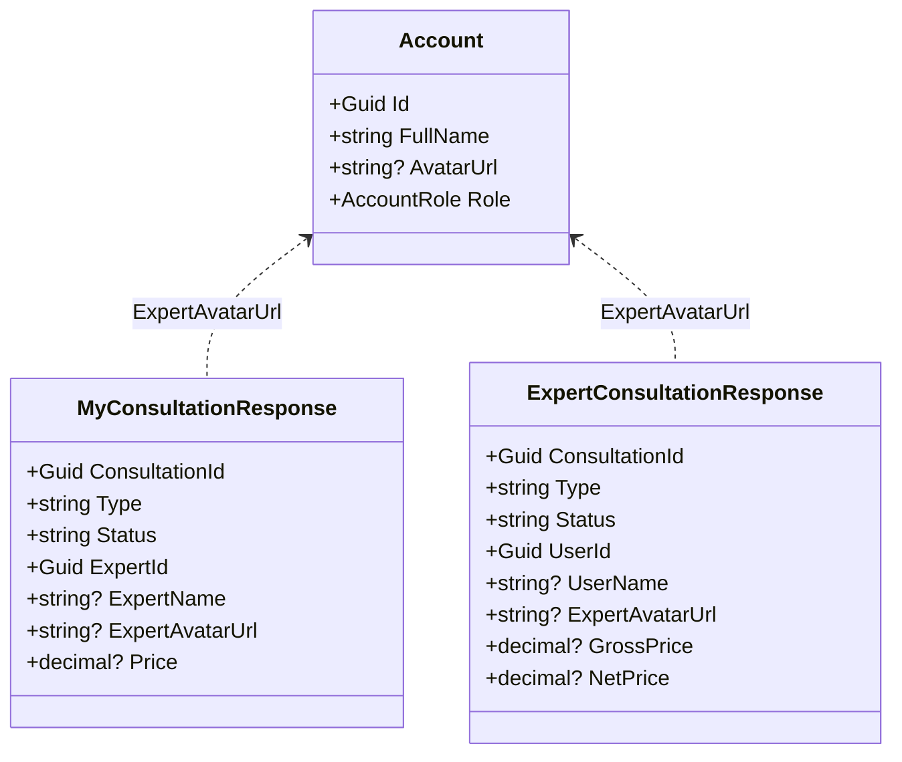
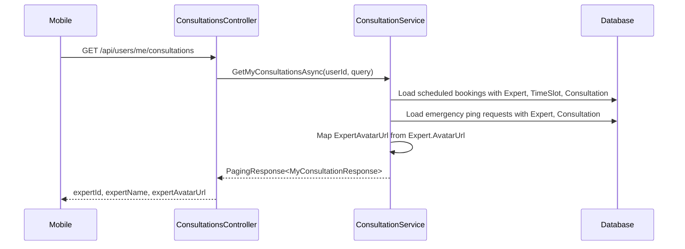
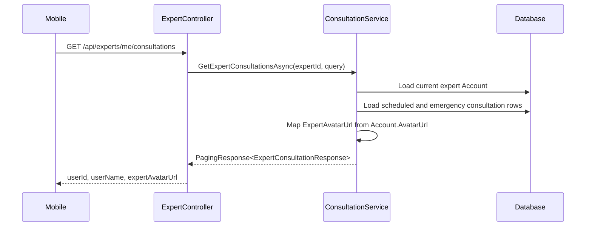

# Expert Avatar Source Code Notes

## Implemented Class Diagram

## Sequence: User Consultation History

## Sequence: Expert Consultation History

## Implementation Hotspots

Use these code locations during implementation:

- `SnakeAid.Core/Responses/Consultation/MyConsultationResponse.cs`
- `SnakeAid.Core/Responses/Consultation/ExpertConsultationResponse.cs`
- `SnakeAid.Service/Implements/ConsultationService.cs`
