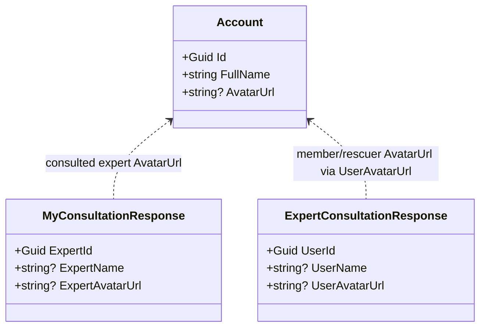
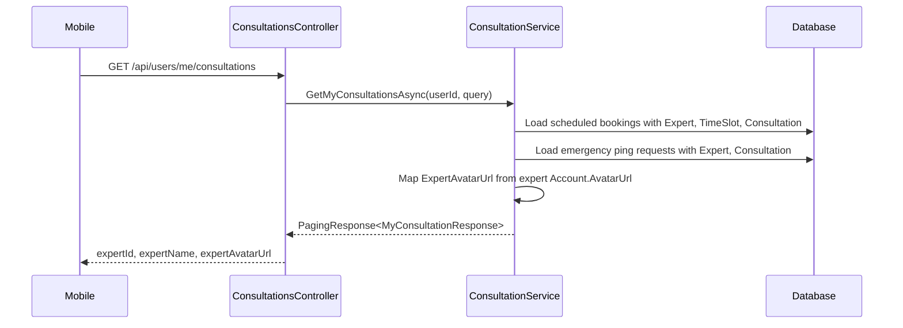
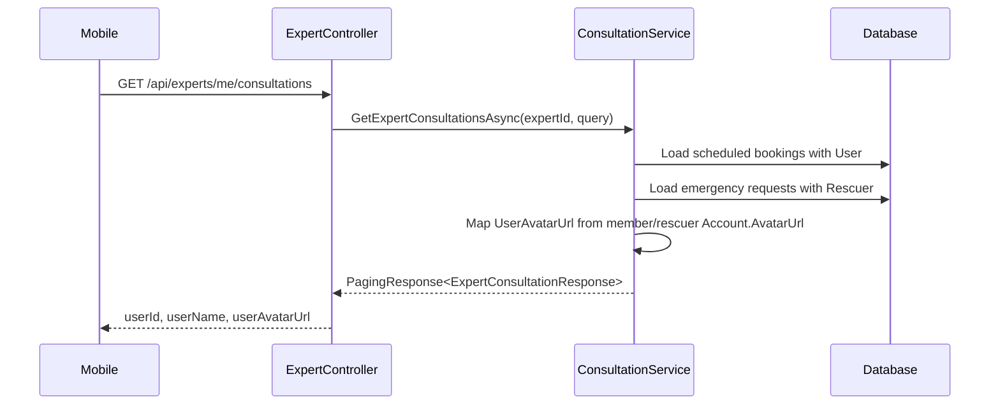

# Expert Avatar Source Code Notes

## Implemented Class Diagram

## Current Implemented Sequence: Member Consultation History

## Implemented Sequence: Expert Consultation History

## Implementation Hotspots

- `SnakeAid.Core/Responses/Consultation/ExpertConsultationResponse.cs`
- `SnakeAid.Service/Implements/ConsultationService.cs`
- `SnakeAid.Tests/Integration/ExpertConsultationPriceResponseTests.cs`

Member endpoint is already correct:

- `SnakeAid.Core/Responses/Consultation/MyConsultationResponse.cs`
- `SnakeAid.Tests/Integration/ConsultationPriceBugConditionTests.cs`
