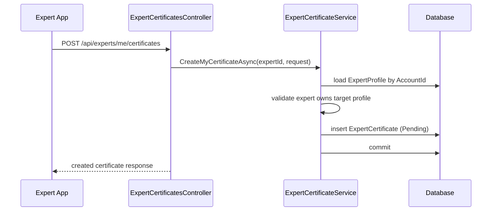
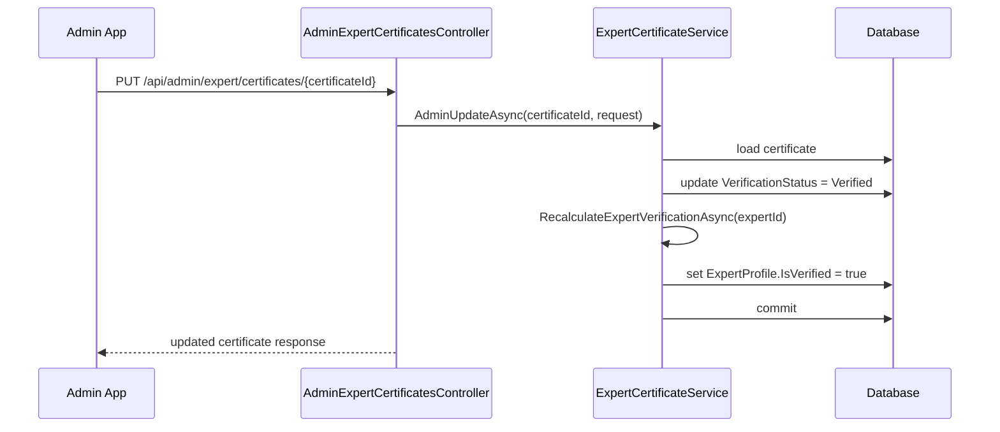

# Expert Certificates Sourcecode

## 1. Relevant Classes

### Current code-verified surface

- `ExpertCertificate`
- `ExpertProfile`
- `ExpertService`
- `MyProfileService`
- `ExpertController`
- `MyProfileController`
- `MediaController`
- `MediaService`
- `SnakeAidDbContext`
- `ReportMedia`

### Planned additions

- `IExpertCertificateService`
- `ExpertCertificateService`
- `ExpertCertificatesController` for expert self-service
- `AdminExpertCertificatesController`
- certificate request/response DTOs
- integration tests for certificate flow

## 2. Code-Verified Current Surface

### Domain

Current `ExpertCertificate` fields:

- `Id`
- `ExpertId`
- `CertificateName`
- `IssuingOrganization`
- `IssueDate`
- `ExpiryDate`
- `CertificateUrl`
- `VerificationStatus`
- `RejectionReason`

Current `ExpertProfile` fields do not include:

- `IsVerified`

### Service behavior

Current `ExpertService`:

- builds public `ExpertProfileResponse`
- currently sets `IsVerified = false`

Current `MyProfileService`:

- reads and updates expert profile basics
- has no certificate-related orchestration
- currently returns `ExpertMyProfileResponse` without `IsVerified`

### Media behavior

Current `MediaService.UploadReportMediaAsync(...)`:

- uploads a file to Cloudinary
- creates a `ReportMedia` row
- stores `ReferenceId`, `ReferenceType`, and `Purpose`
- sets `RequiresAIProcessing = true` only for `SnakeIdentification`

Current `MediaReferenceType` does not yet support:

- `CertExpert`

## 3. Planned Responsibilities

### `ExpertCertificateService`

Planned role:

- own certificate CRUD orchestration
- enforce expert ownership checks
- enforce admin global-access checks through controller/auth layer
- recalculate `ExpertProfile.IsVerified` after certificate state changes

### `ExpertCertificatesController`

Planned role:

- expose expert self-service certificate CRUD
- keep route style aligned with `/api/experts/me/...`

### `AdminExpertCertificatesController`

Planned role:

- expose admin CRUD and review operations for certificates
- allow global filtering/listing by expert and verification status
- follow route style `/api/admin/expert/certificates`

## 4. Planned Synchronization Rule

`ExpertProfile.IsVerified` should be treated as derived persisted state.

Planned recalculation logic:

- `true` when at least one certificate for the expert is `Verified`
- `false` when zero verified certificates remain

Recalculation should run after:

- create
- update that changes verification state
- delete
- admin verification or rejection

## 5. Class Diagram

```mermaid
classDiagram
    class ExpertProfile {
        +Guid AccountId
        +string Biography
        +bool IsOnline
        +decimal ConsultationFee
        +decimal? EmergencyConsultationFee
        +decimal Rating
        +int RatingCount
        +bool IsVerified
    }

    class ExpertCertificate {
        +Guid Id
        +Guid ExpertId
        +string CertificateName
        +string IssuingOrganization
        +DateTime IssueDate
        +DateTime? ExpiryDate
        +string CertificateUrl
        +VerificationStatus VerificationStatus
        +string RejectionReason
    }

    class IExpertCertificateService {
        +CreateMyCertificateAsync(expertId, request)
        +GetMyCertificatesAsync(expertId)
        +GetMyCertificateDetailAsync(expertId, certificateId)
        +UpdateMyCertificateAsync(expertId, certificateId, request)
        +DeleteMyCertificateAsync(expertId, certificateId)
        +AdminCreateAsync(request)
        +AdminGetListAsync(request)
        +AdminGetDetailAsync(certificateId)
        +AdminUpdateAsync(certificateId, request)
        +AdminDeleteAsync(certificateId)
    }

    class ExpertCertificateService {
        -RecalculateExpertVerificationAsync(expertId)
    }

    class ExpertCertificatesController {
        +POST /api/experts/me/certificates
        +GET /api/experts/me/certificates
        +GET /api/experts/me/certificates/{certificateId}
        +PUT /api/experts/me/certificates/{certificateId}
        +DELETE /api/experts/me/certificates/{certificateId}
    }

    class AdminExpertCertificatesController {
        +POST /api/admin/expert/certificates
        +GET /api/admin/expert/certificates
        +GET /api/admin/expert/certificates/{certificateId}
        +PUT /api/admin/expert/certificates/{certificateId}
        +DELETE /api/admin/expert/certificates/{certificateId}
    }

    ExpertProfile "1" <-- "*" ExpertCertificate : ExpertId/AccountId
    IExpertCertificateService <|.. ExpertCertificateService
    ExpertCertificatesController --> IExpertCertificateService
    AdminExpertCertificatesController --> IExpertCertificateService
```

## 6. Sequence Diagram: Expert Creates Certificate



## 7. Sequence Diagram: Admin Verifies Certificate



## 8. Sequence Diagram: Verified Certificate Removed

```mermaid
sequenceDiagram
    participant Actor as Expert/Admin
    participant Api as Certificates API
    participant Service as ExpertCertificateService
    participant DB as Database

    Actor->>Api: DELETE certificate
    Api->>Service: Delete...Async(...)
    Service->>DB: delete certificate
    Service->>Service: RecalculateExpertVerificationAsync(expertId)
    Service->>DB: query remaining verified certificates
    Service->>DB: set ExpertProfile.IsVerified = false when none remain
    Service->>DB: commit
    Api-->>Actor: success response
```

## 9. Test Focus

- `Expert` can CRUD only own certificates
- `Admin` can CRUD certificates globally
- public expert profile stops hardcoding `false`
- self profile exposes verification state if the response contract is extended
- deleting or rejecting the last verified certificate resets `ExpertProfile.IsVerified`
- expert edits do not silently keep stale verification if the business rule requires re-review
