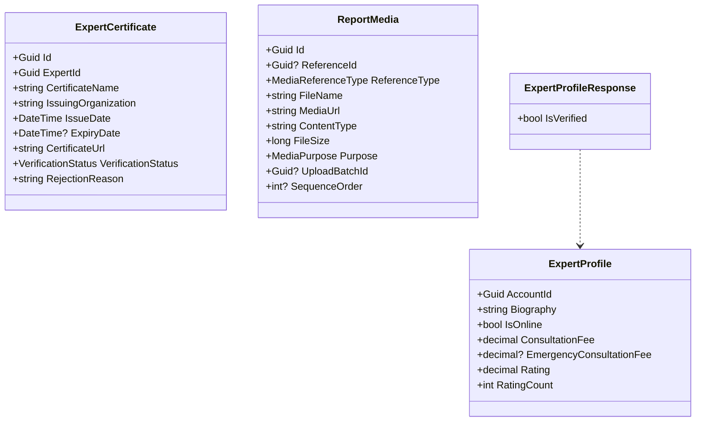
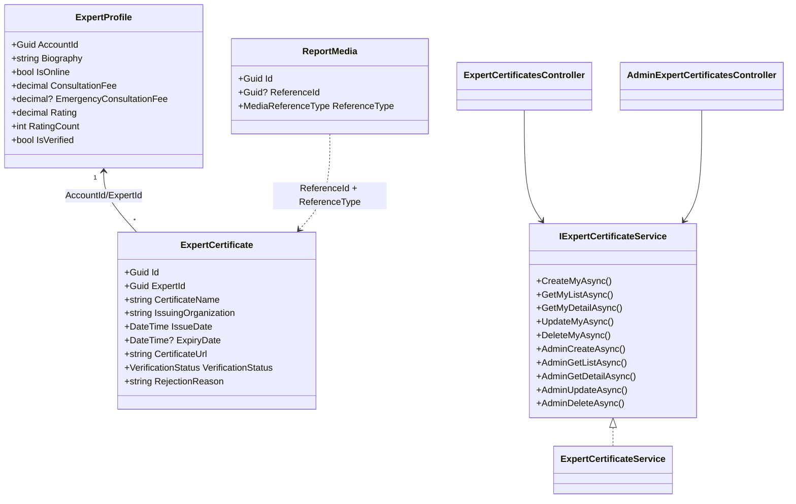
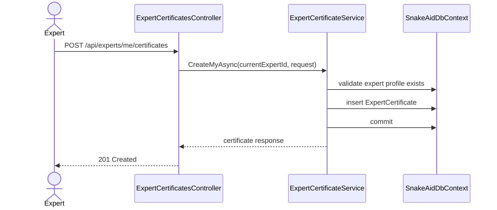
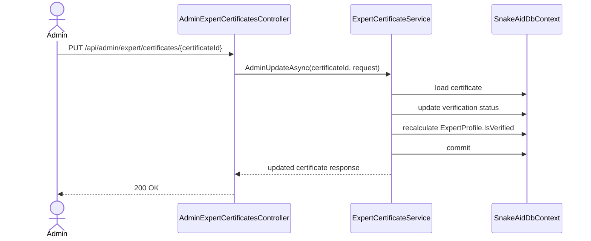
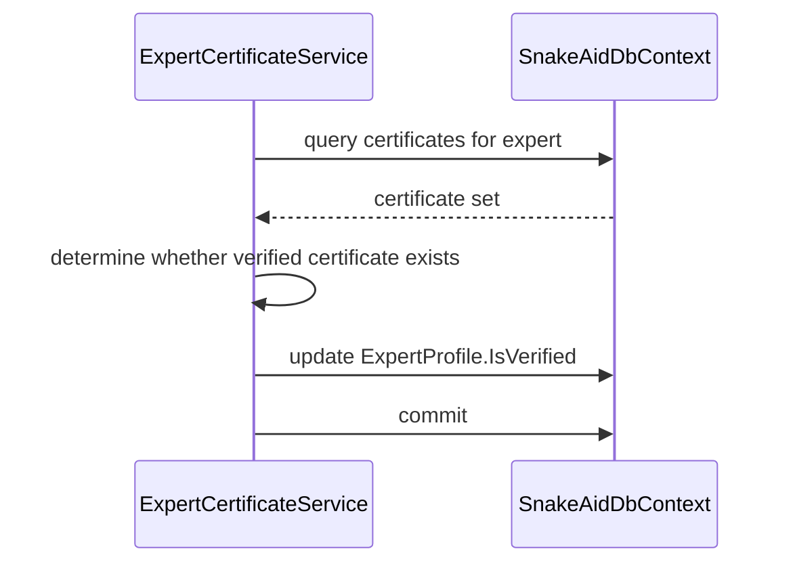

# Expert Certificates Sourcecode Notes

## Verified Existing Code Elements

### Domain and Persistence

- `SnakeAid.Core/Domains/ExpertCertificate.cs`
- `SnakeAid.Core/Domains/ExpertProfile.cs`
- `SnakeAid.Core/Domains/ReportMedia.cs`
- `SnakeAid.Repository/Data/SnakeAidDbContext.cs`

### Existing Service Touchpoints

- `SnakeAid.Service/Implements/ExpertService.cs`
- `SnakeAid.Service/Implements/MyProfileService.cs`
- `SnakeAid.Service/Implements/AdminUserService.cs`
- `SnakeAid.Service/Implements/MediaService.cs`
- `SnakeAid.Service/Extensions/NoSqlReportMediaExtensions.cs`

## Current Structural Observations

- `ExpertCertificate` is currently standalone and not wired into any application flow
- `ReportMedia` is intentionally polymorphic and attachment-like, not a normal FK-bound relational child
- `ExpertProfile` is the correct place for a cached verification flag because multiple profile responses already need that state
- current public expert directory mapping is inconsistent because `IsVerified` exists in the response but is hard-coded to `false`

## Current Class Diagram

## Planned Target Class Diagram

## Sequence Diagram: Expert Creates Certificate

## Sequence Diagram: Admin Reviews Certificate

## Sequence Diagram: Verification Recalculation

## Code Notes For Future Implementation

### Mapping updates needed

- `ExpertService.MapExpertProfilesAsync` should read persisted `ExpertProfile.IsVerified`
- `MyProfileService.MapExpert` likely needs to expose the field if the contract is expanded
- `AdminUserService.GetAdminUserDetailAsync` likely needs to include it in `AdminExpertProfileResponse`

### Persistence updates needed

- add `IsVerified` column to `ExpertProfiles`
- update model snapshot and migration

### Media updates needed

- add a certificate-related `MediaReferenceType` value
- if certificate attachments use `ReportMedia`, query by `ReferenceId` plus `ReferenceType`

## Resume Pointers

When resuming implementation, inspect these first:

- `SnakeAid.Core/Domains/ExpertCertificate.cs`
- `SnakeAid.Core/Domains/ExpertProfile.cs`
- `SnakeAid.Core/Domains/ReportMedia.cs`
- `SnakeAid.Service/Implements/ExpertService.cs`
- `SnakeAid.Service/Implements/MyProfileService.cs`
- `SnakeAid.Service/Implements/AdminUserService.cs`
