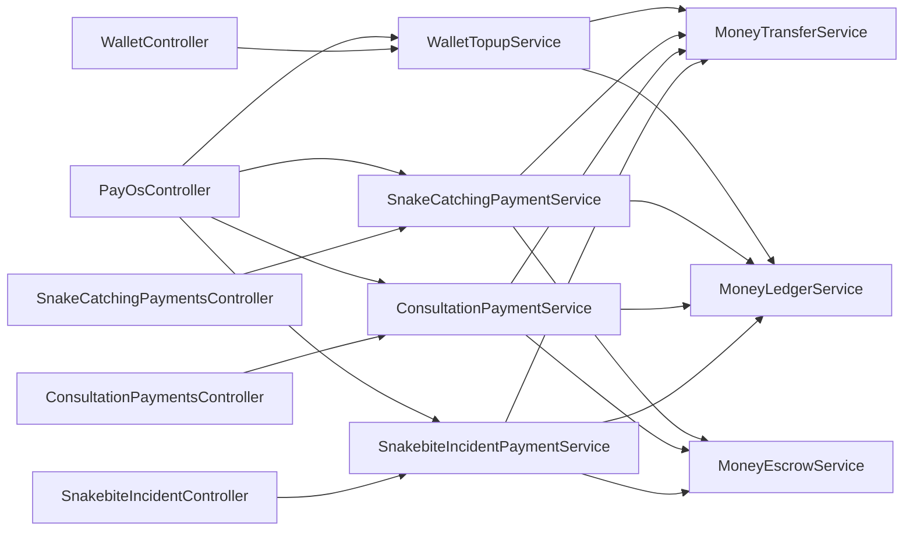
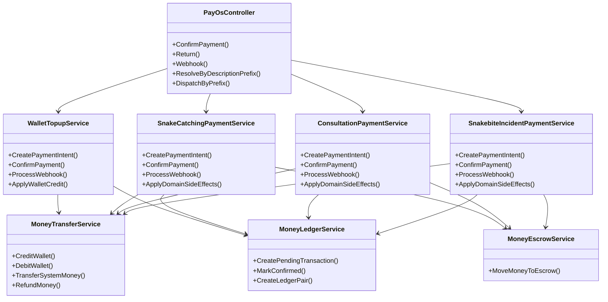
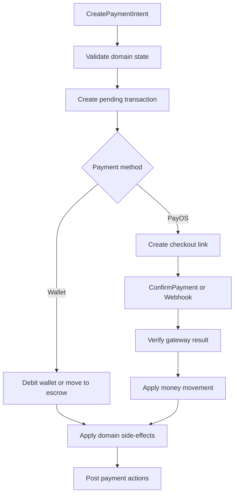
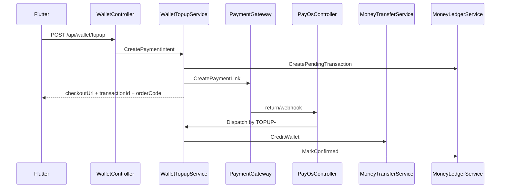
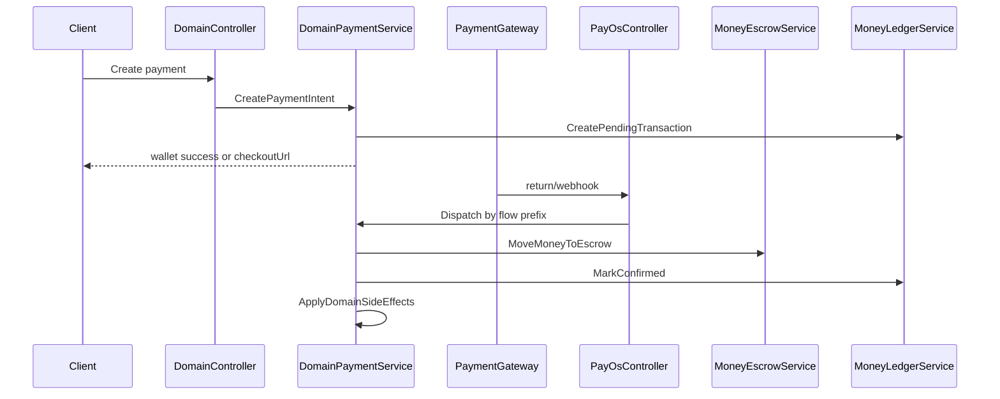

# Money Aspect Sourcemap

## Purpose

File này mô tả structure mục tiêu của money aspect sau refactor.

Mục đích:

- giúp dev đọc nhanh ownership mới
- giúp reviewer kiểm tra đúng ranh giới flow
- giúp agent resume với structural memory rõ ràng

## Document mode

File này là `decision-only`.

Quy ước sử dụng:

- các diagram trong file này luôn là `target-state`
- không sửa diagram để phản ánh implementation tạm thời giữa chừng
- tiến độ implementation được ghi bằng note, mô tả hệ thống hiện đã đi tới đâu so với target diagram
- nếu target diagram cần đổi, đó là thay đổi decision và phải được chốt trước khi sửa file này

## Flow Map

| Flow | Semantic | Owner service | Prefix | Domain side-effect |
|---|---|---|---|---|
| Wallet Topup | nạp tiền vào ví user | `WalletTopupService` | `TOPUP-` | credit user wallet |
| Snake Catching | thanh toán cho snake catching | `SnakeCatchingPaymentService` | `CATCHING-` | update catching payment/domain state |
| Consultation | thanh toán cho consultation | `ConsultationPaymentService` | `CONSULTPAY-` | update booking/request payment state |
| Snakebite Incident | thanh toán cho incident | `SnakebiteIncidentPaymentService` | `INCIDENT-` | update incident payment/domain state |

## Module Diagram

## Ownership Rules

- mỗi flow sở hữu `CreatePaymentIntent`
- mỗi flow sở hữu `ConfirmPayment`
- mỗi flow sở hữu `ApplyDomainSideEffects`
- money primitive được share qua service riêng
- `PayOsController` là callback entrypoint chung, chỉ nhận request và dispatch theo prefix
- `PayOsController` không apply domain side-effect
- `wallet topup` dùng prefix `TOPUP-`
- `snake catching` dùng prefix `CATCHING-`
- chấp nhận migration từ `SNAKEAID-` sang `CATCHING-` để đổi lấy routing trật tự theo flow
- manual confirm, return, webhook có thể nhận input khác nhau nhưng owner flow luôn được resolve bằng `description prefix`
- `manual confirm` tiếp tục nhận `transactionId`
- `return` tiếp tục nhận `orderCode`
- `manual confirm` và `return` phải hội tụ về cùng processing path sau bước lookup ban đầu

## Class Diagram

## Function Graph

## Sequence Diagram: Wallet Topup

## Sequence Diagram: Domain Payment Flow

## File Placement

Nếu phải tạo mới trong repo, vị trí mục tiêu là:

- `SnakeAid.Service/Interfaces/IWalletTopupService.cs`
- `SnakeAid.Service/Implements/WalletTopupService.cs`
- `SnakeAid.Service/Interfaces/IMoneyEscrowService.cs`
- `SnakeAid.Service/Implements/MoneyEscrowService.cs`
- `SnakeAid.Service/Interfaces/IMoneyTransferService.cs`
- `SnakeAid.Service/Implements/MoneyTransferService.cs`
- `SnakeAid.Service/Interfaces/IMoneyLedgerService.cs`
- `SnakeAid.Service/Implements/MoneyLedgerService.cs`

## Reading Order

Khi review hoặc resume:

1. đọc `money-aspect.refactoring.md` để biết phase và scope
2. đọc file này để biết structure mục tiêu
3. đối chiếu implementation thực tế với 3 câu hỏi:
   - flow owner đã đúng chưa
   - shared primitive đã tách khỏi domain side-effect chưa
   - callback/webhook đã không còn đi nhờ flow khác chưa

