# Money Aspect Sourcemap

## Purpose

File này mô tả structure mục tiêu của money aspect sau refactor.

Mục đích:

- giúp dev đọc nhanh ownership mới
- giúp reviewer kiểm tra đúng ranh giới flow
- giúp agent resume với structural memory rõ ràng

## Document mode

File này là `decision-only`.

Quy ước sử dụng:

- các diagram trong file này luôn là `target-state`
- không sửa diagram để phản ánh implementation tạm thời giữa chừng
- tiến độ implementation được ghi bằng note, mô tả hệ thống hiện đã đi tới đâu so với target diagram
- nếu target diagram cần đổi, đó là thay đổi decision và phải được chốt trước khi sửa file này

## Current Direction Summary

| Flow | Before | After |
|---|---|---|
| Consultation | escrow được hiểu qua `system wallet` balance và system-wallet side effect | escrow vẫn tồn tại, nhưng source of truth là `Transaction` |
| Snakebite Incident | từng đi gần pattern consultation và bị gọi như escrow flow | là ledger-only system revenue; admin đọc từ `Transaction`, không đọc từ `system.wallet` |
| Snake Catching | đang còn mixed semantics: payment, refund, `transfer-to-rescuer`, commission | đã khớp target-state: ledger-only system revenue; không escrow-to-rescuer |

## Flow Map

| Flow | Semantic | Owner service | Prefix | Domain side-effect |
|---|---|---|---|---|
| Wallet Topup | nạp tiền vào ví user | `WalletTopupService` | `TOPUP-` | credit user wallet |
| Snake Catching | thanh toán cho snake catching | `SnakeCatchingPaymentService` | `CATCHING-` | update catching payment/domain state |
| Consultation | thanh toán cho consultation | `ConsultationPaymentService` | `CONSULTPAY-` | update booking/request payment state |
| Snakebite Incident | thanh toán cho incident | `SnakebiteIncidentPaymentService` | `INCIDENT-` | update incident payment/domain state |

## Module Diagram

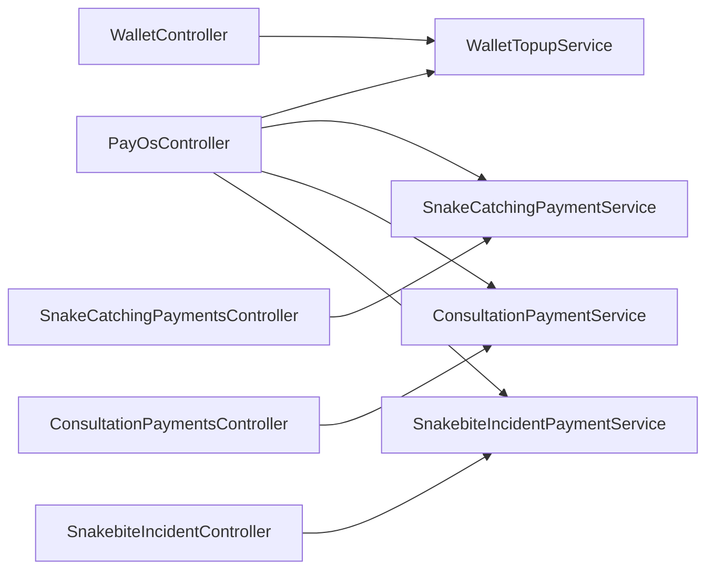

## Ownership Rules

- mỗi flow sở hữu `CreatePaymentIntent`
- mỗi flow sở hữu `ConfirmPayment`
- mỗi flow sở hữu `ApplyDomainSideEffects`
- consultation escrow target-state sau Phase 6 là transaction-sourced; `System Wallet` không còn là két sắt cố định để hold/release tiền cho consultation
- incident/catching target-state sau business correction 2026-04-08 là payment một chiều vào system/platform, không phải escrow-to-rescuer
- snake catching payment path (wallet + PayOS confirm/webhook) đã khớp target-state từ 2026-04-09
- snake catching `transfer-to-rescuer` endpoint đã bị deprecate thành compatibility no-op từ 2026-04-09; không còn là settlement owner của customer payment
- snake catching refund path đã khớp target-state từ 2026-04-09; refundability được suy ra từ `CatchingPayment + CatchingDeposit - CatchingRefund`, không từ `system.wallet`
- snake catching Phase 6D đạt trạng thái final: payment/refund là ledger-only system revenue semantics; deprecated payout endpoint chỉ còn để compatibility
- consultation held/released amount phải được suy ra từ `TransactionType` + `ReferenceId`, không từ balance của account `system.wallet`
- shared primitive boundary chưa được khóa trong target-state hiện tại; nếu phase cuối chứng minh là cần thì mới bổ sung vào sourcemap như một decision mới
- `PayOsController` là callback entrypoint chung, chỉ nhận request và dispatch theo prefix
- `PayOsController` không apply domain side-effect
- route leak `POST /api/wallet/payment` bị xóa khỏi target-state; snake catching wallet payment thuộc `SnakeCatchingPaymentsController`
- `wallet topup` dùng prefix `TOPUP-`
- `snake catching` dùng prefix `CATCHING-`
- chấp nhận migration từ `SNAKEAID-` sang `CATCHING-` để đổi lấy routing trật tự theo flow
- manual confirm, return, webhook có thể nhận input khác nhau nhưng owner flow luôn được resolve bằng `description prefix`
- `manual confirm` tiếp tục nhận `transactionId`
- `return` tiếp tục nhận `orderCode`
- `manual confirm` và `return` phải hội tụ về cùng processing path sau bước lookup ban đầu

## Class Diagram

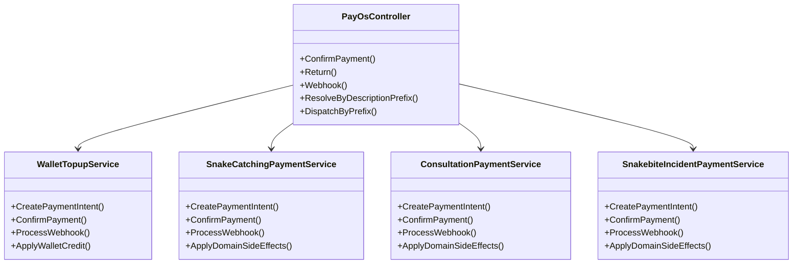

## Function Graph

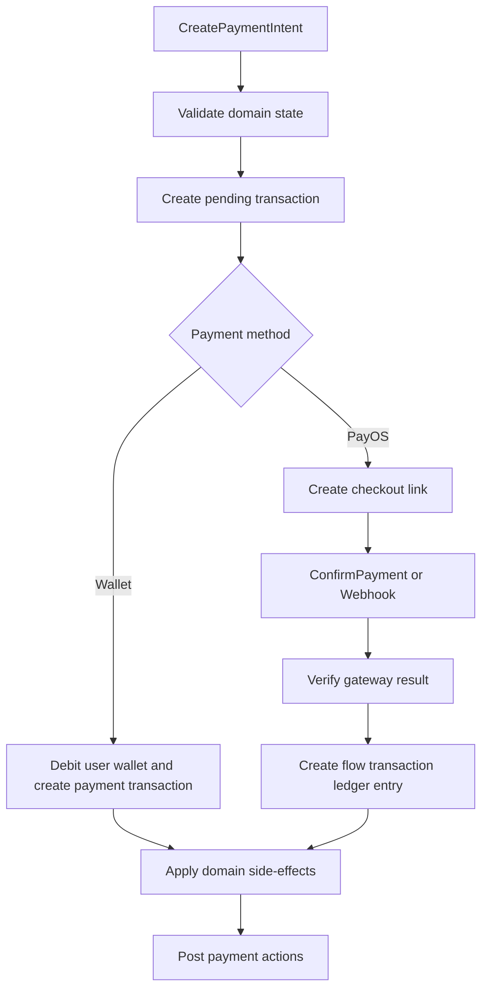

## Phase 6 Code-Change Trace

### Phase 6A — Regression / characterization freeze

Why this phase touched the graph:

- Phase 6A không đổi production flow; nó thêm regression/characterization coverage để freeze các controller/service entrypoints trước khi 6B/6C/6D đổi money semantics
- graph của 6A vì vậy là `test -> production touchpoints`, không phải redesign graph

Changed classes / services:

- `ConsultationPaymentIntegrationTests`
- `PayOsPreservationTests`
- `PayOsTopupRoutingTests`
- `PayOsController`
- `PayOsDescriptionLookup`
- `ConsultationPaymentService`
- `WalletTopupService`
- `SnakeCatchingPaymentService`
- `SnakebiteIncidentPaymentService`

Function anchors:

- `PayOsController.ConfirmPayment`
- `PayOsController.Webhook`
- `PayOsController.ConfirmByOrderCodeAsync`
- `ConsultationPaymentService.ConfirmConsultationPaymentAsync`
- `ConsultationPaymentService.ProcessConsultationWebhookAsync`
- `PayOsDescriptionLookup.ResolveFlowAsync`

#### Class Diagram

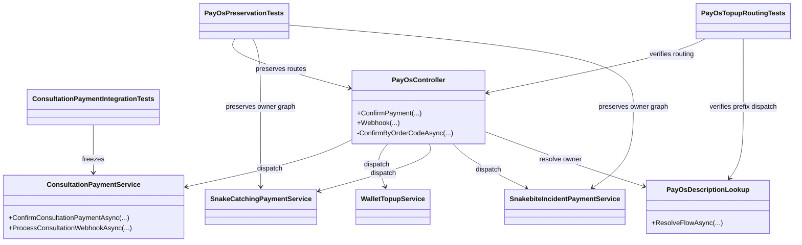

#### Sequence Diagram

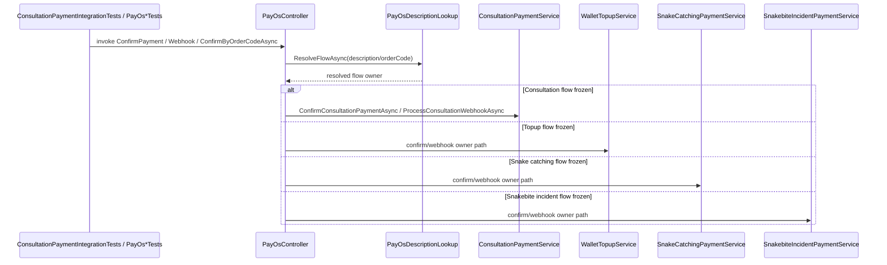

### Phase 6B — Consultation transaction-sourced escrow

Why this phase touched the graph:

- 6B đổi consultation từ `system.wallet` side-effect sang transaction-sourced escrow
- touched graph tập trung vào consultation payment owner service và các entrypoints hội tụ vào escrow primitive

Changed classes / services:

- `ConsultationPaymentsController`
- `PayOsController`
- `ConsultationPaymentService`
- `Transaction`
- `Wallet`
- `Booking`

Function anchors:

- `ConsultationPaymentService.CreateConsultationPaymentLinkAsync`
- `ConsultationPaymentService.CreateWalletPaymentAsync`
- `ConsultationPaymentService.ConfirmConsultationPaymentAsync`
- `ConsultationPaymentService.ProcessConsultationWebhookAsync`
- `ConsultationPaymentService.ProcessConfirmedPayOsPaymentAsync`
- `ConsultationPaymentService.MoveMoneyToEscrowAsync`
- `ConsultationPaymentService.SettleConsultationEscrowAsync`
- verification anchor: `ConsultationPaymentIntegrationTests`

#### Class Diagram

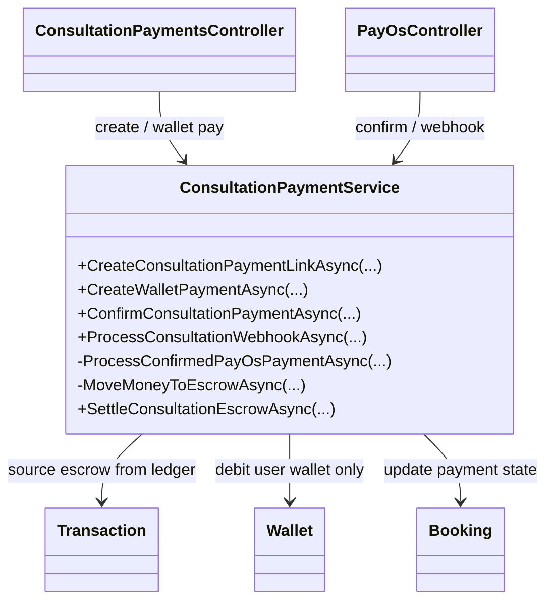

#### Sequence Diagram

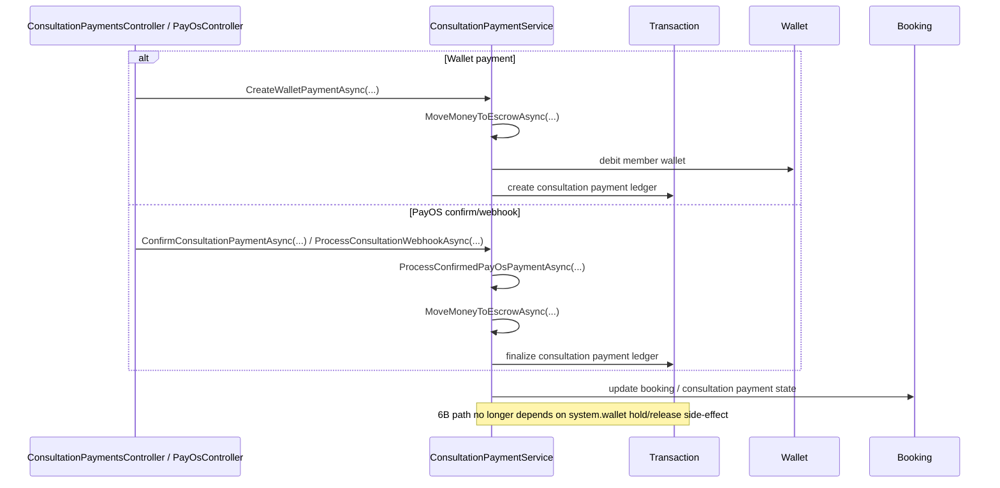

### Phase 6C — Snakebite incident ledger-only system revenue

Why this phase touched the graph:

- 6C corrective pass bỏ escrow semantics khỏi incident
- touched graph tập trung vào incident payment/refund owner service và revenue/refundable calculation functions

Changed classes / services:

- `SnakebiteIncidentController`
- `PayOsController`
- `SnakebiteIncidentPaymentService`
- `Transaction`
- `Wallet`
- `SnakebiteIncident`

Function anchors:

- `SnakebiteIncidentPaymentService.CreateSnakebiteIncidentPaymentLinkAsync`
- `SnakebiteIncidentPaymentService.CreateSnakebiteIncidentWalletPaymentAsync`
- `SnakebiteIncidentPaymentService.ProcessSnakebiteIncidentWebhookAsync`
- `SnakebiteIncidentPaymentService.ConfirmSnakebiteIncidentPaymentAsync`
- `SnakebiteIncidentPaymentService.ProcessConfirmedPayOsPaymentAsync`
- `SnakebiteIncidentPaymentService.PreparePendingPayOsTransactionAsync`
- `SnakebiteIncidentPaymentService.FindIncidentTransactionByOrderCodeAsync`
- `SnakebiteIncidentPaymentService.RecordSystemRevenuePaymentAsync`
- `SnakebiteIncidentPaymentService.RefundSnakebiteIncidentTransactionAsync`
- `SnakebiteIncidentPaymentService.GetRefundableSnakebiteIncidentRevenueAsync`

#### Class Diagram

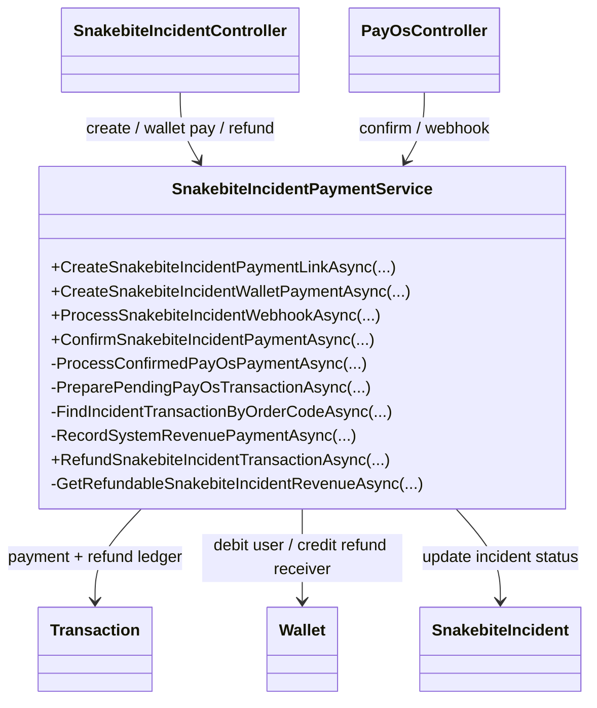

#### Sequence Diagram

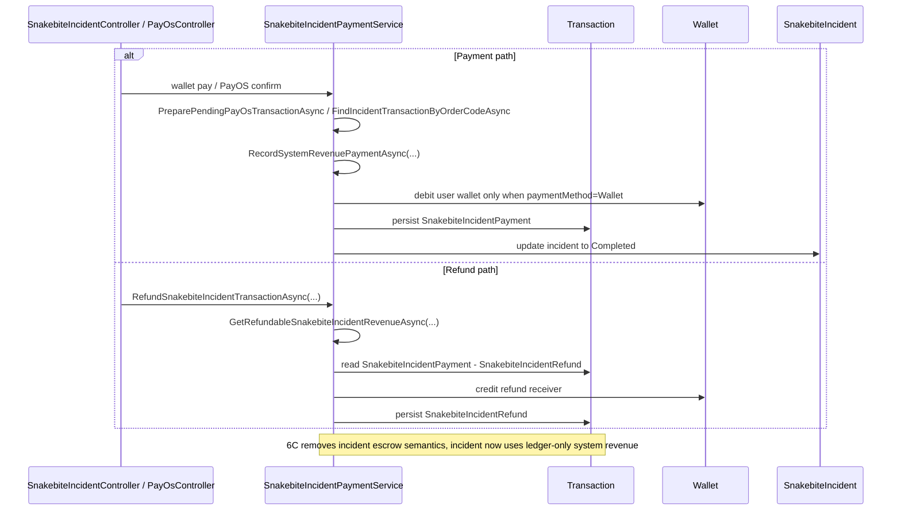

### Phase 6D — Snake catching system/platform revenue

Why this phase touched the graph:

- 6D redefine catching away from escrow-to-rescuer semantics
- only `6D1` is implemented in code today
- settlement/refund graph drift still exists in `6D2-6D4` pending paths

Changed classes / services:

- `SnakeCatchingPaymentsController`
- `PayOsController`
- `SnakeCatchingPaymentService`
- `SnakeCatchingMissionService`
- `Transaction`
- `Wallet`
- `SnakeCatchingRequest`

Function anchors:

- `SnakeCatchingPaymentService.CreateSnakeCatchingPaymentLinkAsync`
- `SnakeCatchingPaymentService.CreateWalletPaymentAsync`
- `SnakeCatchingPaymentService.ProcessSnakeCatchingWebhookAsync`
- `SnakeCatchingPaymentService.ConfirmSnakeCatchingPaymentAsync`
- `SnakeCatchingPaymentService.ConfirmSnakeCatchingPaymentByOrderCodeAsync`
- `SnakeCatchingPaymentService.ProcessWebhookCoreAsync`
- `SnakeCatchingPaymentService.RecordSystemRevenuePaymentAsync`
- `SnakeCatchingPaymentService.TransferSnakeCatchingFundsToRescuerAsync`
- `SnakeCatchingPaymentService.RefundSnakeCatchingTransactionAsync`

Implemented in 6D1:

- `CreateWalletPaymentAsync`
- `ProcessSnakeCatchingWebhookAsync`
- `ConfirmSnakeCatchingPaymentAsync`
- `ConfirmSnakeCatchingPaymentByOrderCodeAsync`
- `ProcessWebhookCoreAsync`
- `RecordSystemRevenuePaymentAsync`

Still pending in 6D2-6D4:

- `TransferSnakeCatchingFundsToRescuerAsync`
- `RefundSnakeCatchingTransactionAsync`
- cleanup of remaining settlement/refund graph drift

#### Class Diagram

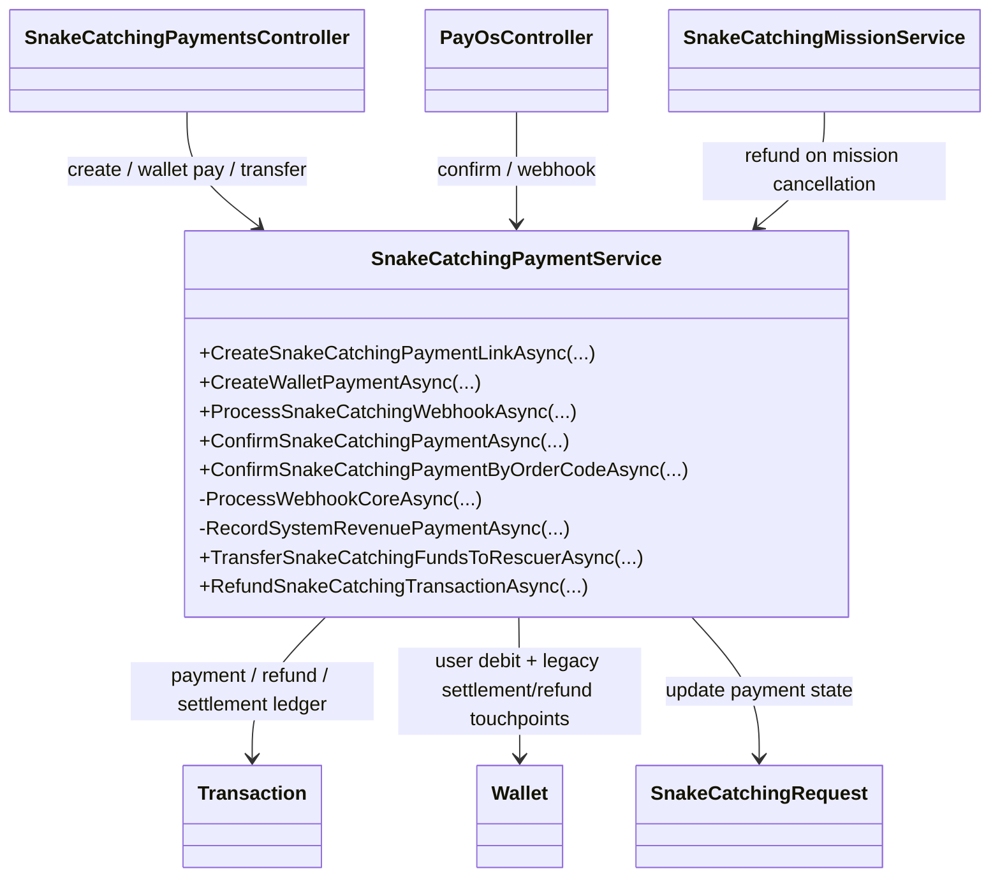

#### Sequence Diagram

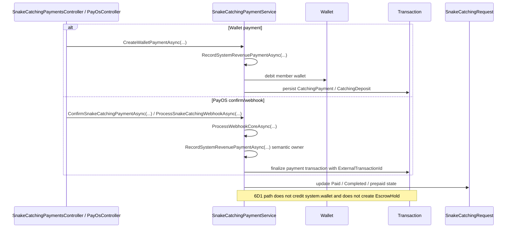

## Consultation Escrow Target

Target-state mới sau Money Aspect 6:

- business correction 2026-04-08: chỉ `consultation` dùng escrow + net payout + platform fee
- `snakebite incident` và `snake catching` là payment một chiều vào system/platform; không release qua rescuer vì rescuer là nhân viên system
- implementation decision: incident/catching dùng ledger-only system revenue transaction; admin analytics đọc từ `Transaction`, không từ `system.wallet` balance
- target escrow equation dưới đây chỉ áp dụng cho consultation
- không update balance của system wallet khi hold/release consultation escrow
- escrow hold được suy ra từ payment transaction thật của consultation:
  - `ConsultationPayment`
- escrow release/refund được suy ra từ sink transaction thật của consultation:
  - consultation: `ExpertPayout`, `ConsultationRefund`, `PlatformFee`
- `EscrowHold` / `EscrowRelease` là transitional transaction type từ Phase 5; sau Phase 6 sẽ xóa khi production logic không còn sử dụng
- `SystemWalletBalance*` trong response là front-facing transitional contract; nếu đổi/bỏ phải ghi vào `money-aspect.changelog.md`

## Consultation Platform Fee Target

Target-state mới sau Money Aspect 7:

- `SettleConsultationEscrowAsync` không payout 100% amount cho expert
- settlement consultation tạo `PlatformFee` và `ExpertPayout`
- expert wallet chỉ được cộng net amount sau khi trừ platform fee
- fee percent đi qua `SystemSettingKeys`, default `20%` nếu system setting chưa tồn tại
- rounding ưu tiên expert: làm tròn lên `expertNetAmount` theo đơn vị VND, rồi tính `platformFeeAmount = grossAmount - expertNetAmount`
- client cần thấy fee breakdown khi có response/contract liên quan consultation payout hoặc transaction detail

## Sequence Diagram: Wallet Topup

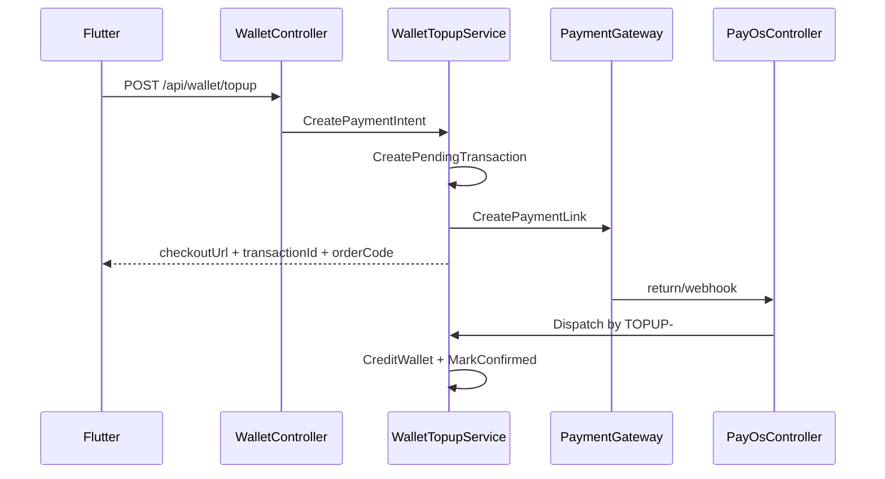

## Sequence Diagram: Domain Payment Flow

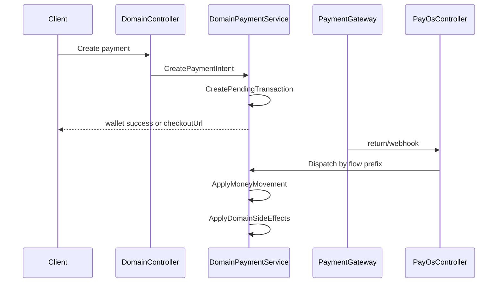

## File Placement

Placement target ưu tiên hiện tại chỉ khóa owner services và controller boundary:

- `SnakeAid.Service/Interfaces/IWalletTopupService.cs`
- `SnakeAid.Service/Implements/WalletTopupService.cs`
- `SnakeAid.Service/Interfaces/ISnakeCatchingPaymentService.cs`
- `SnakeAid.Service/Implements/SnakeCatchingPaymentService.cs`
- `SnakeAid.Service/Interfaces/IConsultationPaymentService.cs`
- `SnakeAid.Service/Implements/ConsultationPaymentService.cs`
- `SnakeAid.Service/Interfaces/ISnakebiteIncidentPaymentService.cs`
- `SnakeAid.Service/Implements/SnakebiteIncidentPaymentService.cs`

Shared service placement nếu có sẽ chỉ được khóa sau phase cuối.

## Reading Order

Khi review hoặc resume:

1. đọc `money-aspect.refactoring.md` để biết phase và scope
2. đọc file này để biết structure mục tiêu
3. đối chiếu implementation thực tế với 3 câu hỏi:
   - flow owner đã đúng chưa
   - shared primitive đã tách khỏi domain side-effect chưa
   - callback/webhook đã không còn đi nhờ flow khác chưa
