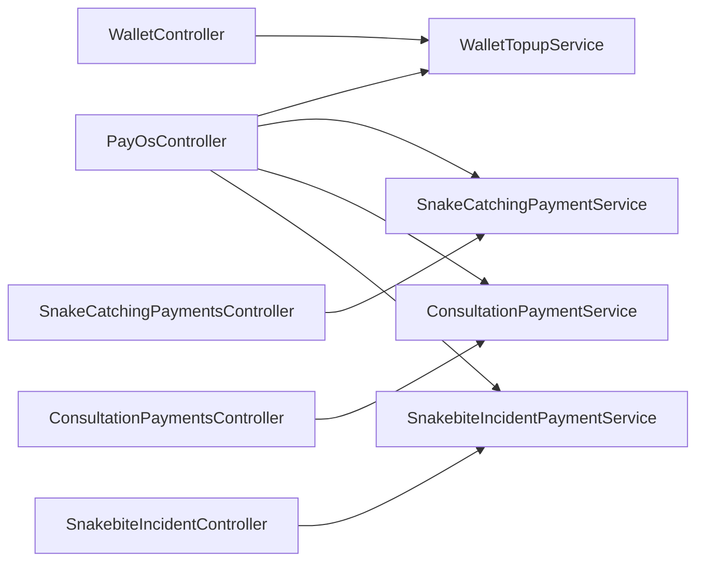
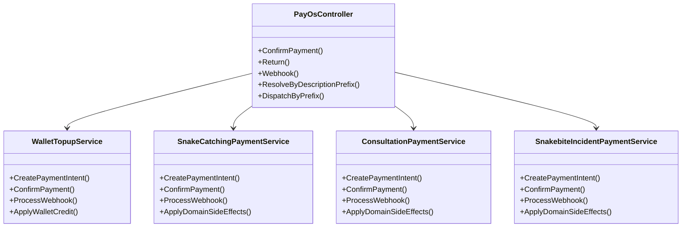
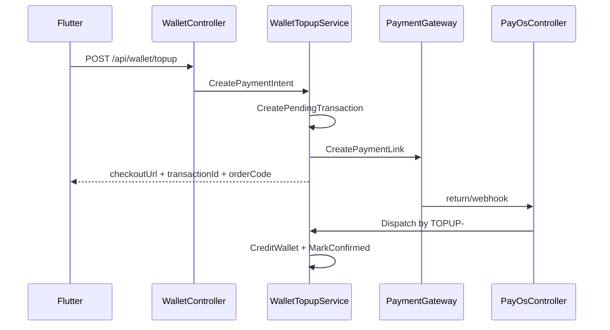
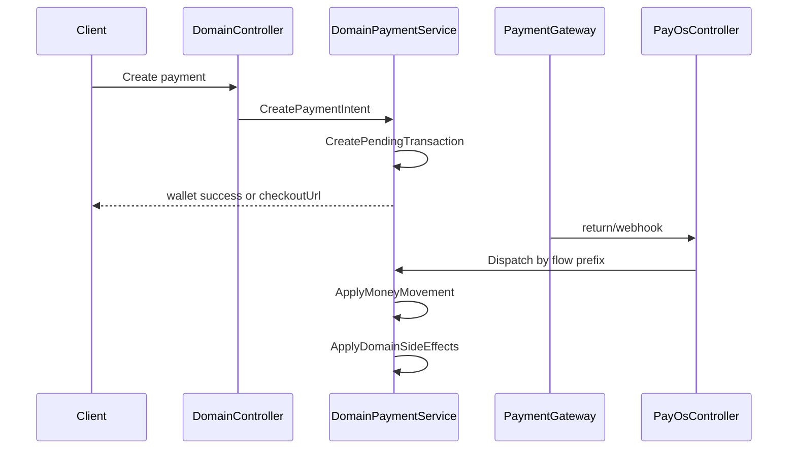

# Money Aspect Sourcemap

## Purpose

File này mô tả structure mục tiêu của money aspect sau refactor.

Mục đích:

- giúp dev đọc nhanh ownership mới
- giúp reviewer kiểm tra đúng ranh giới flow
- giúp agent resume với structural memory rõ ràng

## Document mode

File này là `decision-only`.

Quy ước sử dụng:

- các diagram trong file này luôn là `target-state`
- không sửa diagram để phản ánh implementation tạm thời giữa chừng
- tiến độ implementation được ghi bằng note, mô tả hệ thống hiện đã đi tới đâu so với target diagram
- nếu target diagram cần đổi, đó là thay đổi decision và phải được chốt trước khi sửa file này

## Flow Map

| Flow | Semantic | Owner service | Prefix | Domain side-effect |
|---|---|---|---|---|
| Wallet Topup | nạp tiền vào ví user | `WalletTopupService` | `TOPUP-` | credit user wallet |
| Snake Catching | thanh toán cho snake catching | `SnakeCatchingPaymentService` | `CATCHING-` | update catching payment/domain state |
| Consultation | thanh toán cho consultation | `ConsultationPaymentService` | `CONSULTPAY-` | update booking/request payment state |
| Snakebite Incident | thanh toán cho incident | `SnakebiteIncidentPaymentService` | `INCIDENT-` | update incident payment/domain state |

## Module Diagram

## Ownership Rules

- mỗi flow sở hữu `CreatePaymentIntent`
- mỗi flow sở hữu `ConfirmPayment`
- mỗi flow sở hữu `ApplyDomainSideEffects`
- escrow target-state sau Phase 6 là transaction-sourced; `System Wallet` không còn là két sắt cố định để hold/release tiền
- held/released amount phải được suy ra từ `TransactionType` + `ReferenceId`, không từ balance của account `system.wallet`
- shared primitive boundary chưa được khóa trong target-state hiện tại; nếu phase cuối chứng minh là cần thì mới bổ sung vào sourcemap như một decision mới
- `PayOsController` là callback entrypoint chung, chỉ nhận request và dispatch theo prefix
- `PayOsController` không apply domain side-effect
- route leak `POST /api/wallet/payment` bị xóa khỏi target-state; snake catching wallet payment thuộc `SnakeCatchingPaymentsController`
- `wallet topup` dùng prefix `TOPUP-`
- `snake catching` dùng prefix `CATCHING-`
- chấp nhận migration từ `SNAKEAID-` sang `CATCHING-` để đổi lấy routing trật tự theo flow
- manual confirm, return, webhook có thể nhận input khác nhau nhưng owner flow luôn được resolve bằng `description prefix`
- `manual confirm` tiếp tục nhận `transactionId`
- `return` tiếp tục nhận `orderCode`
- `manual confirm` và `return` phải hội tụ về cùng processing path sau bước lookup ban đầu

## Class Diagram

## Function Graph

## Transaction-Sourced Escrow Target

Target-state mới sau Money Aspect 6:

- không update balance của system wallet khi hold/release escrow
- escrow hold được suy ra từ payment transaction thật của từng flow:
  - `ConsultationPayment`
  - `CatchingPayment` / `CatchingDeposit`
  - `SnakebiteIncidentPayment`
- escrow release/refund được suy ra từ sink transaction thật của từng flow:
  - consultation: `ExpertPayout`, `ConsultationRefund`, `PlatformFee`
  - snake catching: `CatcherPayout`, `CatchingRefund`, `PlatformFee`
  - snakebite incident: `SnakebiteIncidentRefund`
- `EscrowHold` / `EscrowRelease` là transitional transaction type từ Phase 5; sau Phase 6 sẽ xóa khi production logic không còn sử dụng
- `SystemWalletBalance*` trong response là front-facing transitional contract; nếu đổi/bỏ phải ghi vào `money-aspect.changelog.md`

## Consultation Platform Fee Target

Target-state mới sau Money Aspect 7:

- `SettleConsultationEscrowAsync` không payout 100% amount cho expert
- settlement consultation tạo `PlatformFee` và `ExpertPayout`
- expert wallet chỉ được cộng net amount sau khi trừ platform fee
- fee percent đi qua `SystemSettingKeys`, default `20%` nếu system setting chưa tồn tại
- rounding ưu tiên expert: làm tròn lên `expertNetAmount` theo đơn vị VND, rồi tính `platformFeeAmount = grossAmount - expertNetAmount`
- client cần thấy fee breakdown khi có response/contract liên quan consultation payout hoặc transaction detail

## Sequence Diagram: Wallet Topup

## Sequence Diagram: Domain Payment Flow

## File Placement

Placement target ưu tiên hiện tại chỉ khóa owner services và controller boundary:

- `SnakeAid.Service/Interfaces/IWalletTopupService.cs`
- `SnakeAid.Service/Implements/WalletTopupService.cs`
- `SnakeAid.Service/Interfaces/ISnakeCatchingPaymentService.cs`
- `SnakeAid.Service/Implements/SnakeCatchingPaymentService.cs`
- `SnakeAid.Service/Interfaces/IConsultationPaymentService.cs`
- `SnakeAid.Service/Implements/ConsultationPaymentService.cs`
- `SnakeAid.Service/Interfaces/ISnakebiteIncidentPaymentService.cs`
- `SnakeAid.Service/Implements/SnakebiteIncidentPaymentService.cs`

Shared service placement nếu có sẽ chỉ được khóa sau phase cuối.

## Reading Order

Khi review hoặc resume:

1. đọc `money-aspect.refactoring.md` để biết phase và scope
2. đọc file này để biết structure mục tiêu
3. đối chiếu implementation thực tế với 3 câu hỏi:
   - flow owner đã đúng chưa
   - shared primitive đã tách khỏi domain side-effect chưa
   - callback/webhook đã không còn đi nhờ flow khác chưa

