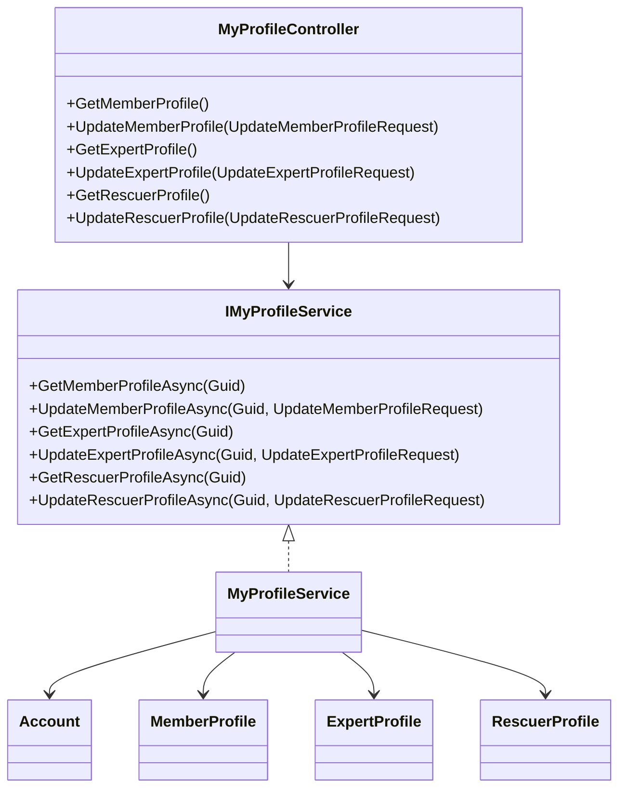
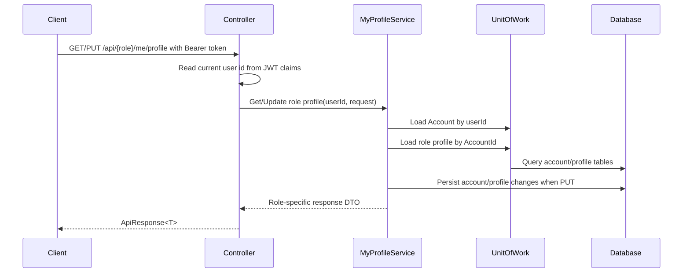
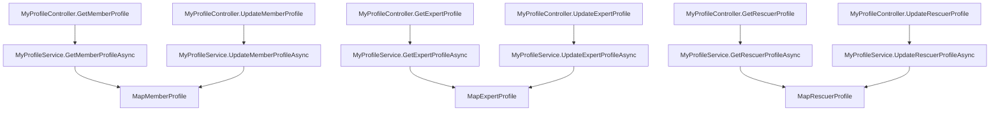

# MyProfile Source Map

## File-Level Mapping

Backend files:

| Layer | File | Purpose |
|---|---|---|
| API | `SnakeAid.Api/Controllers/MyProfileController.cs` | Consolidated self-profile controller for member, expert, and rescuer routes. |
| Core Request | `SnakeAid.Core/Requests/MyProfile/UpdateMemberProfileRequest.cs` | Member profile update contract. |
| Core Request | `SnakeAid.Core/Requests/MyProfile/UpdateExpertProfileRequest.cs` | Expert profile update contract. |
| Core Request | `SnakeAid.Core/Requests/MyProfile/UpdateRescuerProfileRequest.cs` | Rescuer profile update contract. |
| Core Response | `SnakeAid.Core/Responses/MyProfile/MemberMyProfileResponse.cs` | Member self-profile response contract. |
| Core Response | `SnakeAid.Core/Responses/MyProfile/ExpertMyProfileResponse.cs` | Expert self-profile response contract. |
| Core Response | `SnakeAid.Core/Responses/MyProfile/RescuerMyProfileResponse.cs` | Rescuer self-profile response contract. |
| Service Interface | `SnakeAid.Service/Interfaces/IMyProfileService.cs` | Service contract for role-specific self-profile reads/updates. |
| Service Implementation | `SnakeAid.Service/Implements/MyProfileService.cs` | Loads account + role profile, validates ownership by current user id, updates editable fields. |
| Tests | `SnakeAid.Tests/Integration/MyProfileServiceTests.cs` | Regression tests for update behavior and role/profile guardrails. |
| Tests | `SnakeAid.Tests/Unit/MyProfileRouteConventionTests.cs` | Route and role convention tests for the consolidated controller. |

## Class Diagram

## Sequence Diagram

## Function Calling Graph

