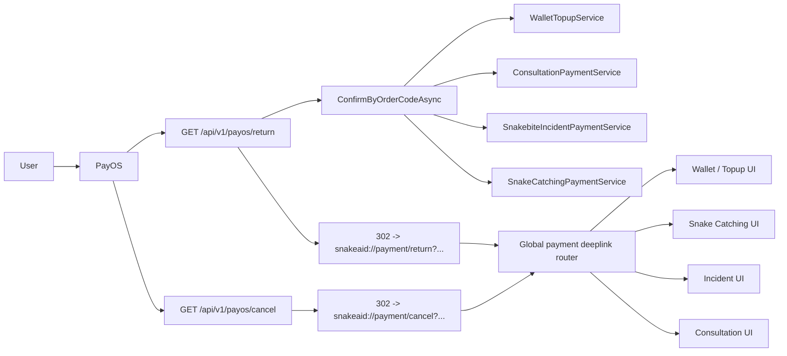

# Payment Deeplink Sourcecode Map

## Purpose

File này mô tả ownership và target structure của payment deeplink flow.

Mục đích:

- giúp dev đọc nhanh backend/mobile responsibility
- giúp reviewer kiểm tra đúng ranh giới redirect/confirm/router
- giúp agent resume với structural memory rõ ràng

## Document mode

File này là `decision-only`.

Quy ước sử dụng:

- diagram trong file này luôn là `target-state`
- implementation tạm thời giữa chừng không làm đổi target diagram
- tiến độ implementation được ghi bằng note

## Flow Map

| Segment | Owner | Responsibility |
|---|---|---|
| PayOS checkout return | `PayOsController.Return()` | nhận browser redirect, auto-confirm, redirect sang deeplink app |
| PayOS checkout cancel | `PayOsController.Cancel()` | nhận browser redirect cancel, redirect sang deeplink app |
| Confirm dispatch | `PayOsController.ConfirmByOrderCodeAsync()` và `ConfirmPayment()` | resolve flow theo prefix và gọi đúng owner service |
| Provider integration | `IPaymentGateway` / `PayOsGateway` | tạo link, cancel link, query link info, verify webhook |
| Global app deeplink entry | mobile global payment router | parse `snakeaid://payment/...`, publish payment result, điều hướng/reload |
| Flow-specific state refresh | topup/consultation/incident/catching screens | đọc result từ global router và refresh UI/domain state |

## Module Diagram

## Ownership Rules

- `PayOsController` là return/cancel bridge của browser redirect
- `PayOsController` không được trở thành nơi chứa mobile navigation logic ngoài việc dựng deeplink URL
- `PayOsController` vẫn là dispatcher chung cho confirm theo prefix
- `IPaymentGateway` tiếp tục chỉ là provider adapter, không biết gì về deeplink app
- mobile global router là entrypoint chính cho `snakeaid://payment/...`
- payment screens không còn được coi là source entrypoint duy nhất của callback handling
- deeplink router không được tự suy business success; nó phải tôn trọng cờ/kết quả mà backend đã chuẩn hóa

## Backend Sourcemap

### Current files already involved

- `SnakeAid.Api/Controllers/PayOsController.cs`
- `SnakeAid.Service/Interfaces/IPaymentGateway.cs`
- `SnakeAid.Service/Services/PayOs/PayOsGateway.cs`

### Expected backend responsibilities

#### `PayOsController`

- giữ `ConfirmPayment()` cho manual fallback path theo `transactionId`
- giữ `ConfirmByOrderCodeAsync()` cho return path theo `orderCode`
- đổi `Return()` từ HTML renderer sang deeplink redirect bridge
- đổi `Cancel()` từ HTML renderer sang deeplink redirect bridge
- có helper dựng URI cho:
  - success
  - cancel
  - confirm failed / return failed

#### `PayOsGateway`

- tiếp tục dùng `PayOsOptions.ReturnUrl`
- tiếp tục dùng `PayOsOptions.CancelUrl`
- không nhận mobile custom scheme trực tiếp trong lượt này

## Mobile Sourcemap

### Current files already involved

- `lib/core/handlers/deep_link_handler.dart`
- `lib/features/member/screens/deposit_money_screen.dart`
- `lib/features/member/screens/activity_detail_screen.dart`
- `lib/app/router.dart`

### Expected mobile responsibilities

#### Global payment deeplink router

- nhận `snakeaid://payment/return?...`
- nhận `snakeaid://payment/cancel?...`
- parse:
  - `success`
  - `orderCode`
  - `status`
  - `cancel`
  - `id`
  - `reason` nếu có
- publish state/event dùng chung để screen khác subscribe
- xử lý initial deeplink khi app cold start

#### Topup UI

- vẫn có thể dùng `transactionId` pending cục bộ để gọi manual confirm khi cần
- nhưng callback detection không còn được neo độc quyền vào `deposit_money_screen`
- sau success deeplink phải refresh wallet và clear pending topup state

#### Catching / Incident / Consultation UI

- không hardcode assumption “callback chỉ đến khi screen này đang active”
- phải nhận signal từ global payment router để reload request/detail/payment status

## Target Deep Link Contract

| Case | URI |
|---|---|
| Success | `snakeaid://payment/return?success=true&orderCode=...&status=PAID&cancel=false&id=...` |
| Cancel | `snakeaid://payment/cancel?success=false&orderCode=...&status=CANCELLED&cancel=true&id=...` |
| Error | `snakeaid://payment/return?success=false&orderCode=...&status=...&cancel=...&reason=...` |

## Notes

- `status` và `cancel` tiếp tục được giữ để tương thích với logic mobile hiện có
- `success` là cờ chuẩn hóa mới để app đọc đơn giản hơn
- source of truth vẫn là backend confirm/webhook, không phải bản thân deeplink
