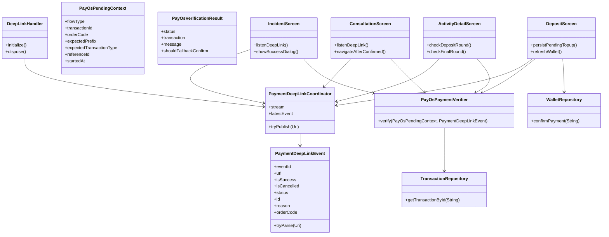
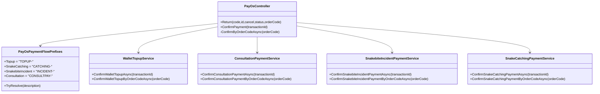
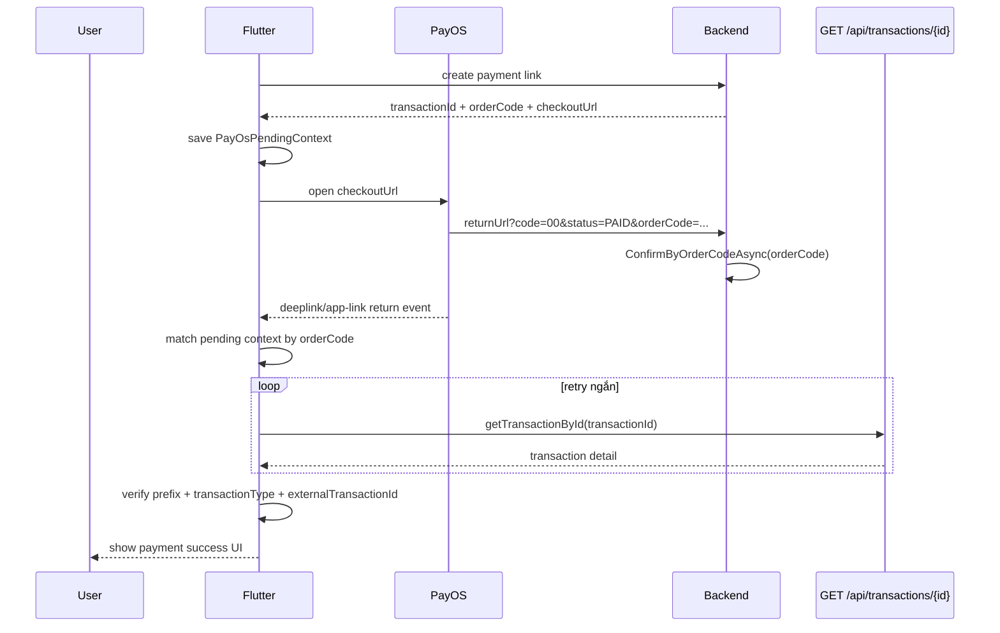
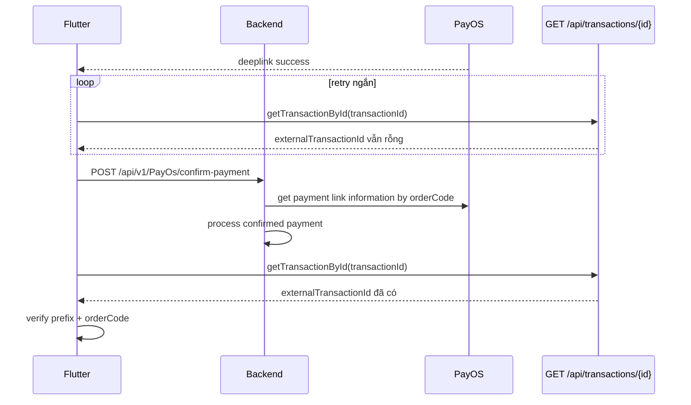
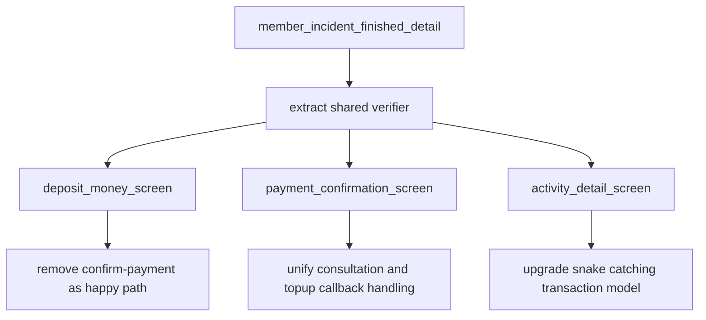

# PayOS Mobile Deeplink Sourcecode

## Class diagram

## Backend routing diagram

## Sequence diagram: target happy path

## Sequence diagram: fallback path

## Flow-specific verification matrix

| Flow | Prefix backend | Expected transaction type | Current mobile status | Ghi chú |
|---|---|---|---|---|
| Wallet topup | `TOPUP-` | topup transaction type ở wallet module | Sai hướng | đang gọi `confirm-payment` quá sớm |
| Consultation PayOS | `CONSULTPAY-` | consultation payment | Gần đúng | còn phụ thuộc domain confirm API |
| Snakebite incident | `INCIDENT-` | `SnakebiteIncidentPayment` | Gần đúng nhất | nên dùng `startsWith` |
| Snake catching deposit/final | `CATCHING-` | `CatchingDeposit` hoặc `CatchingPayment` | Thiếu dữ liệu verify | model hiện chưa có `externalTransactionId` |

## Refactor extraction order

