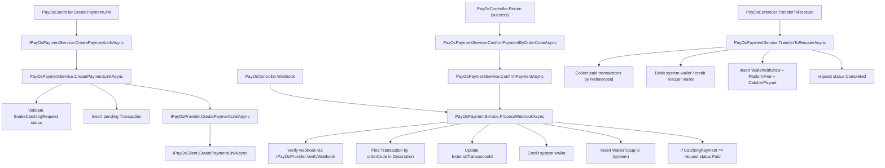
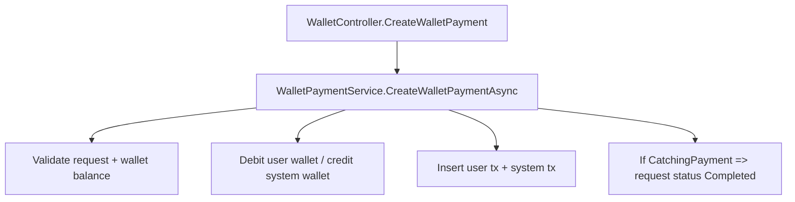
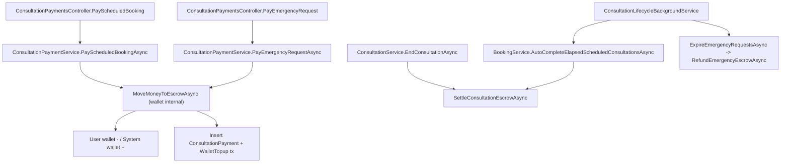

# PayOS Flow + Function Graph + Business Logic Anomaly Audit (Ops 1-4)

## 1) Scope kiểm tra
- Đọc requirement tổng: `Docs/00-General/Project-Overview.md`
- Đọc core flows: `Docs/01-Functional-Specs/01-Core-Flows/*`
- Đọc PayOS operation plan 01 -> 04
- Đối chiếu code runtime thực tế trong:
  - `SnakeAid.Api/Controllers/*`
  - `SnakeAid.Service/Services/PayOs/*`
  - `SnakeAid.Service/Implements/*`
  - `SnakeAid.Core/Domains/*`

Mục tiêu: dựng **as-is flow** + **function graph** + tìm điểm kì dị business logic.

---

## 2) As-is flow tổng quan (runtime)

### 2.1 Snake catching + PayOS (đang chạy)
1. Operator xác nhận + assign request:
   - `ConfirmSnakeCatchingRequestAsync` -> `RequestStatus.Confirmed`
   - `AssignSnakeCatchingRequestAsync` -> `RequestStatus.Assigned`, tạo `SnakeCatchingMission`.
2. Rescuer hoàn thành mission:
   - `CompleteMissionAsync` -> `MissionCompleted`, request -> `Finished`.
3. User tạo link thanh toán PayOS:
   - `POST /api/v1/PayOs/create-payment-link`
   - service tạo `Transaction` pending + tạo payment link.
4. PayOS callback:
   - webhook `POST /api/v1/PayOs/webhook`
   - hoặc browser return `GET /api/v1/PayOs/return` (auto confirm theo orderCode).
5. Xử lý thành công:
   - cập nhật `ExternalTransactionId`
   - cộng tiền vào system wallet
   - tạo thêm transaction `WalletTopup` cho system
   - nếu `CatchingPayment` thì request -> `Paid`.
6. Chuyển tiền cho rescuer:
   - `POST /api/v1/PayOs/transfer-to-rescuer`
   - trừ commission cố định, chuyển net sang rescuer wallet, request -> `Completed`.

### 2.2 Snake catching + Wallet nội bộ (đang chạy)
1. `POST /api/wallet/payment`
2. Trừ tiền user wallet + cộng system wallet.
3. Ghi transaction nội bộ.
4. Với `CatchingPayment`, request bị set thẳng -> `Completed`.

### 2.3 Consultation payment (đang chạy, nhưng không dùng PayOS)
1. Scheduled booking payment:
   - `POST /api/consultation-bookings/{bookingId}/payments`
2. Emergency payment:
   - `POST /api/consultations/emergency-requests/{requestId}/payments`
3. Chỉ hỗ trợ `WalletBalance` (escrow nội bộ system wallet).
4. Settlement escrow khi consultation kết thúc hoặc background job auto-complete.

### 2.4 Wallet top-up qua PayOS (code có, API chưa expose)
- `WalletTopupService` đã có `CreateWalletTopupAsync`.
- Đăng ký DI rồi, nhưng không có controller route gọi public.

---

## 3) Function graph (as-is)

### 3.1 PayOS snake-catching graph

### 3.2 Wallet internal snake-catching graph

### 3.3 Consultation escrow graph

---

## 4) Điểm kì dị business logic (ưu tiên theo rủi ro)

## Critical-1: Webhook/Return không idempotent -> có thể cộng tiền system wallet nhiều lần
- `Return` success sẽ auto-call confirm theo orderCode: `PayOsController.cs:219-226`.
- `ProcessWebhookCoreAsync` luôn cộng wallet + insert tx khi `webhook.Success`, không check đã xử lý trước đó:
  - set external ref: `PayOsPaymentService.cs:439`
  - cộng system wallet: `PayOsPaymentService.cs:466`
  - insert system tx: `PayOsPaymentService.cs:484`
- Nếu webhook retry hoặc return + webhook cùng tới, có nguy cơ double credit.

## Critical-2: Transfer-to-rescuer không idempotent + không chặn payout lặp
- `TransferToRescuerAsync` không kiểm tra đã payout trước đó theo `ReferenceId`.
- Mỗi lần gọi sẽ lại trừ system wallet và tạo payout mới.
- Dấu hiệu:
  - lấy paid tx theo reference: `PayOsPaymentService.cs:634`
  - tạo payout tx mới mỗi lần: `PayOsPaymentService.cs:750`

## Critical-3: Lẫn domain tài chính khi payout snake catching
- `TransferToRescuerAsync` tính tổng từ cả:
  - `ConsultationPayment`
  - `RescuerReward`
  - cùng với catching payment/deposit (`PayOsPaymentService.cs:639-640`)
- Điều này cho phép tiền domain khác bị kéo vào payout snake-catching.

## High-1: State machine không nhất quán giữa PayOS path và Wallet path
- PayOS path: `CatchingPayment` -> request `Paid` (`PayOsPaymentService.cs:490+`).
- Wallet path: `CatchingPayment` -> request `Completed` ngay (`WalletPaymentService.cs:238`).
- Cùng business action nhưng đi 2 luồng cho ra 2 trạng thái khác nhau, dễ làm sai dashboard/automation.

## High-2: Logic "rescuer online" có điều kiện sai
- Điều kiện hiện tại: `if (!IsOnline && IsAvailable)` (`SnakeCatchingRequestService.cs:470`).
- Trường hợp offline + unavailable lại không bị chặn.

## High-3: Commission cố định hard-code + không chặn net âm
- `commissionFee = 200000` (`PayOsPaymentService.cs:28`).
- `netAmountToRescuer = totalAmount - commissionFee` (`PayOsPaymentService.cs:652`) không chặn `< 0`.
- Với giao dịch nhỏ, logic payout có thể sai nghiệp vụ.

## High-4: Dùng `Description` làm key nghiệp vụ orderCode (fragile)
- find transaction theo prefix `SNAKEAID-{orderCode}`.
- description bị giới hạn/truncate và đang kiêm nhiều ý nghĩa nghiệp vụ.
- dấu hiệu:
  - generate + description: `PayOsPaymentService.cs:162-163`, `557+`
  - lookup theo description: nhiều nơi trong service.

## Medium-1: Mất audit trail khi payment fail/cancel
- Khi fail/cancel đang `Delete(transaction)`:
  - cancel: `PayOsPaymentService.cs:274`
  - failed webhook: `PayOsPaymentService.cs:525`
- Nghiệp vụ tài chính thường cần giữ bản ghi và chuyển trạng thái thay vì xóa.

## Medium-2: Overwrite `CreatedAt` bằng transaction time của gateway
- `transaction.CreatedAt = webhook.TransactionDateTime` (`PayOsPaymentService.cs:440`).
- `CreatedAt` đang bị dùng như thời điểm tạo bản ghi, việc overwrite làm mất ý nghĩa audit ban đầu.

## Medium-3: Wallet top-up via PayOS có service nhưng chưa có API route public
- Có `IWalletTopupService` + `WalletTopupService`, đã register DI (`Program.cs:137`).
- Không thấy controller endpoint tương ứng.
- Hệ quả: flow top-up qua PayOS chưa hoàn tất end-to-end.

## Medium-4: Operation 03 abstractions chưa được dùng runtime
- `IPaymentOrchestrator` register DI (`Program.cs:134`) nhưng không có consumer.
- `PaymentContextMapper` không có call-site runtime.
- Có file rỗng:
  - `PayOsPaymentRequests.cs` (0 bytes)
  - `PayOsPaymentResponses.cs` (0 bytes)
  - `SnakeAid.Service/Implements/PayOsClient.cs` (0 bytes)
- Tín hiệu refactor dở dang, dễ gây hiểu nhầm kiến trúc.

## Medium-5: Consultation payment vẫn chỉ wallet nội bộ, chưa dùng PayOS
- Request enum chỉ có `WalletBalance`:
  - `ProcessConsultationPaymentRequest.cs:13`
- Service chặn cứng phương thức khác:
  - `ConsultationPaymentService.cs:328`
- Không khớp hướng mở rộng "consultation payos integration".

---

## 5) Đánh giá theo operation 01->04
- **Op01 (init docs):** đã có baseline.
- **Op02 (provider core):** `IPayOsProvider` tách ra thành công.
- **Op03 (payment context contract):** tạo được model/interface nhưng chưa chạy trong luồng controller hiện tại.
- **Op04 (migrate snake catching):** chưa hoàn tất ở mức business consistency (idempotency, state machine, payout boundary).

Kết luận ngắn:
- Refactor kiến trúc lớp đã đi đúng hướng.
- Nhưng business logic tài chính runtime vẫn còn nhiều điểm rủi ro cao, đặc biệt ở **idempotency**, **state consistency**, và **domain boundary**.

