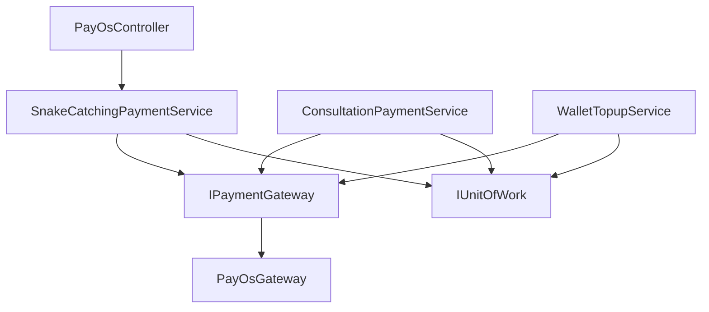
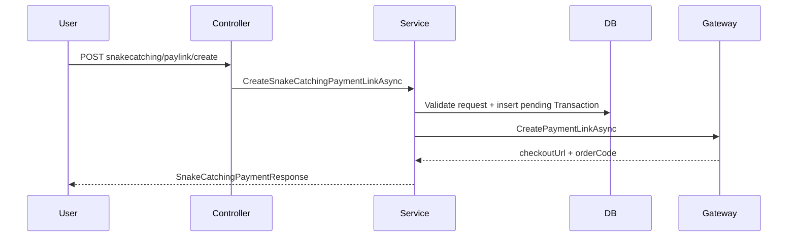
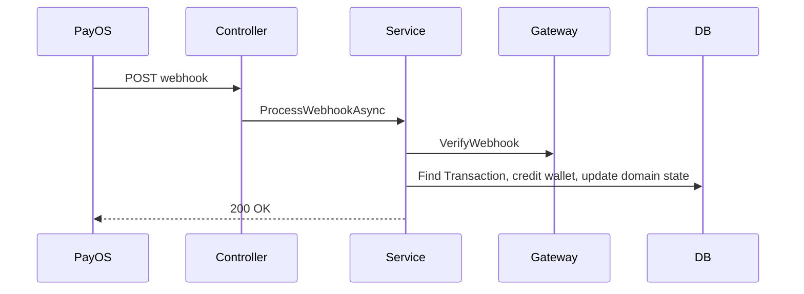
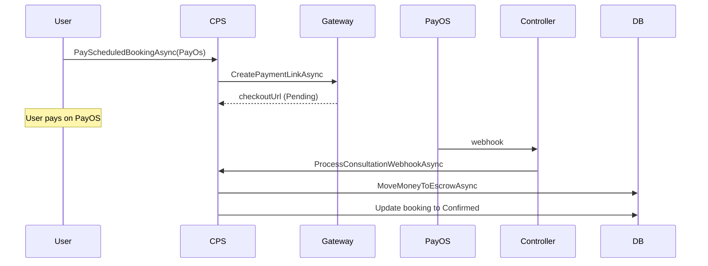

# PayOS Layer Source Code

## Current Architecture

Payment layer to chuc theo 2 truc:

1. **Domain payment services** — own business rules
2. **Gateway adapter** — own PayOS SDK integration

Khong co them Client/Provider/Orchestrator abstraction (da bi xoa intentionally).

## Components

### Controller

`PayOsController.cs` — gateway-facing controller, hien van snake-catching-centric:

- `POST /api/v1/PayOs/snakecatching/paylink/create`
- `POST /api/v1/PayOs/snakecatching/paylink/cancel/{orderCode}`
- `POST /api/v1/PayOs/confirm-payment`
- `GET /api/v1/PayOs/return`
- `GET /api/v1/PayOs/cancel`
- `POST /api/v1/PayOs/webhook`
- `POST /api/v1/PayOs/transfer-to-rescuer`

### Domain Services

**SnakeCatchingPaymentService**: create payment link, cancel, confirm, webhook processing, transfer to rescuer, refund. Core settlement logic trong `ProcessWebhookCoreAsync`.

**ConsultationPaymentService**: pay scheduled booking, pay emergency request, escrow movement, refund on reject/expire, settle on completion. Supports WalletBalance + PayOS dual-mode.

**WalletTopupService**: create wallet top-up payment link, persist pending transaction.

### Gateway

`IPaymentGateway` / `PayOsGateway`:
- `CreatePaymentLinkAsync`
- `CancelPaymentLinkAsync`
- `GetPaymentLinkInformationAsync`
- `VerifyWebhook`

### Shared Models

`SnakeAid.Service/Services/PayOs/Models/`:
- `PayOsCreatePaymentRequest`
- `PayOsPaymentLinkResult`
- `PayOsLinkInformation`
- `PayOsWebhookData`

Gateway-facing internal contracts, khong phai domain-level business contracts.

## Dependency Graph

## Key Sequence Flows

### Create Payment Link (Snake Catching)

### Webhook Settlement

### Consultation Escrow (PayOS path)

## Function Summary

### SnakeCatchingPaymentService

Public: `CreateSnakeCatchingPaymentLinkAsync`, `CancelSnakeCatchingPaymentLinkAsync`, `ProcessSnakeCatchingWebhookAsync`, `ConfirmSnakeCatchingPaymentAsync`, `ConfirmSnakeCatchingPaymentByOrderCodeAsync`, `TransferSnakeCatchingFundsToRescuerAsync`, `RefundSnakeCatchingTransactionAsync`

Core internal: `ProcessWebhookCoreAsync` (densest node — wallet settlement + webhook result application converge here)

### ConsultationPaymentService

Public: `PayScheduledBookingAsync`, `PayEmergencyRequestAsync`, `RefundEmergencyEscrowAsync`, `ExpireEmergencyRequestsAsync`, `SettleConsultationEscrowAsync`

Core internal: `MoveMoneyToEscrowAsync`, `RefundFromEscrowAsync`, `TransferEscrowToExpertAsync`

### WalletTopupService

Public: `CreateWalletTopupAsync`

## Boundaries

### Reusable

- `IPaymentGateway` / `PayOsGateway`
- PayOS gateway models

### Domain-specific (khong reuse cross-domain)

- `SnakeCatchingPaymentService`
- `ConsultationPaymentService`
- `WalletTopupService`

### Removed (intentionally)

- `IPaymentOrchestrator` / `PaymentOrchestrator`
- `IPayOsProvider` / `PayOsProvider`
- `IPayOsClient` / `PayOsClient`

## Risks

1. `PayOsController` van gateway-named nhung expose snake-catching business endpoints
2. Wallet top-up settlement partially coupled voi snake-catching qua shared transaction interpretation
3. Shared models van PayOS-shaped — future VNPay can contract cleanup
