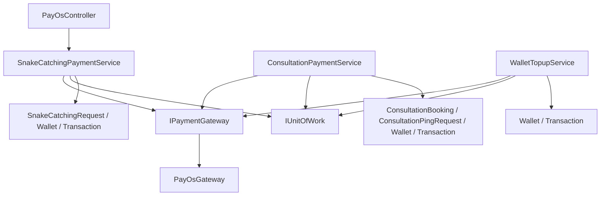
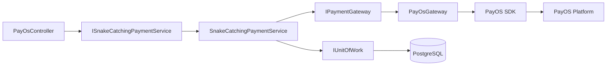
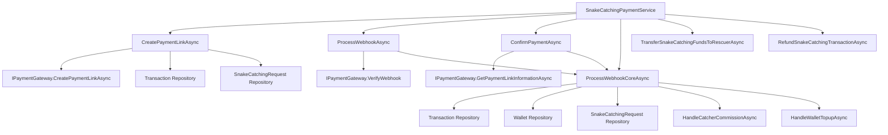
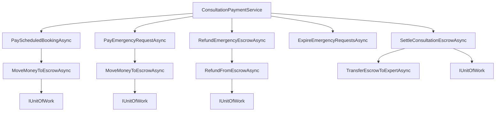
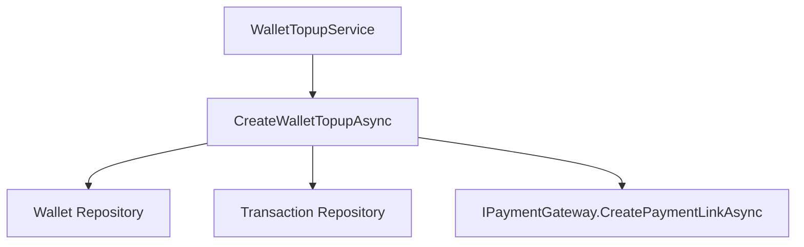
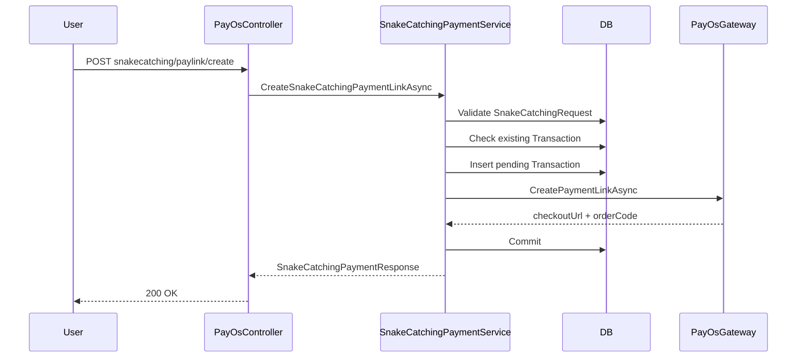
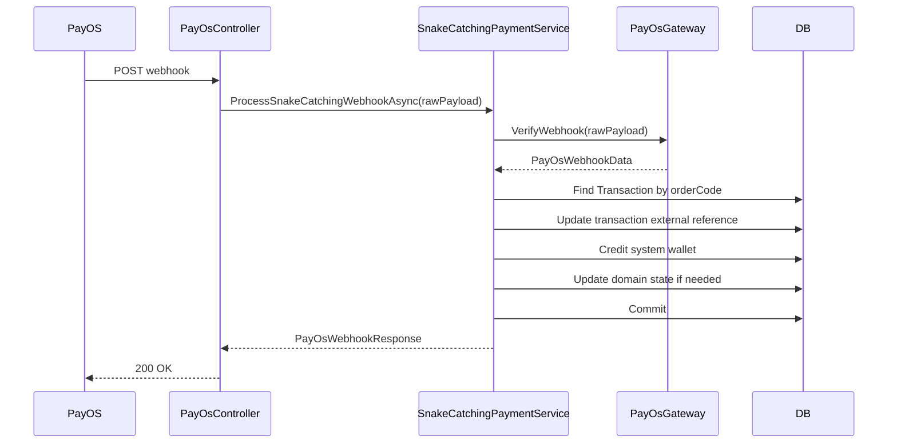
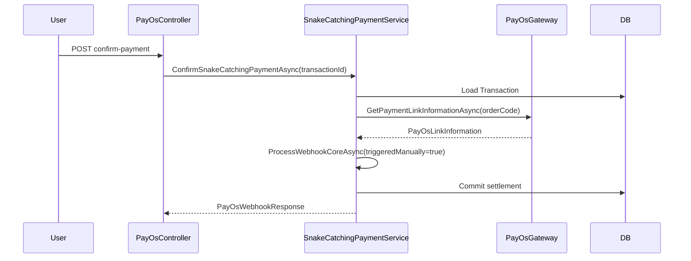
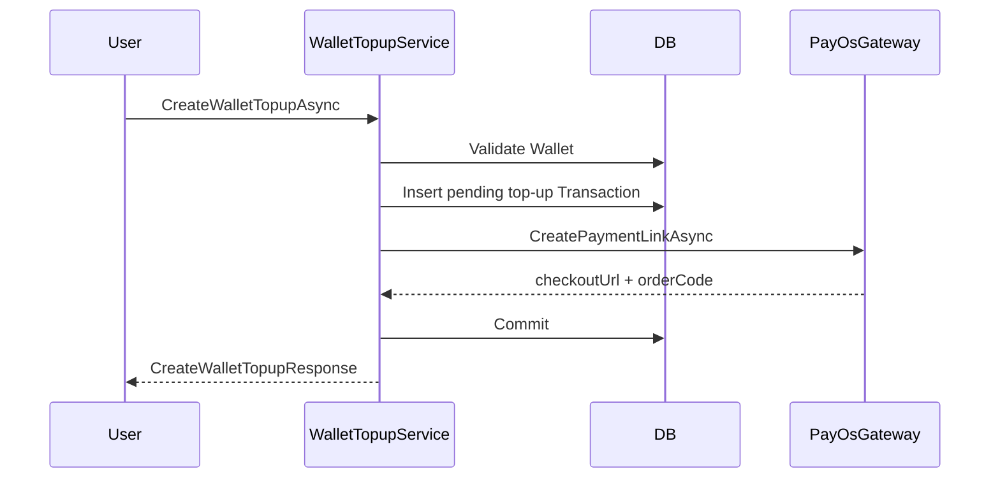
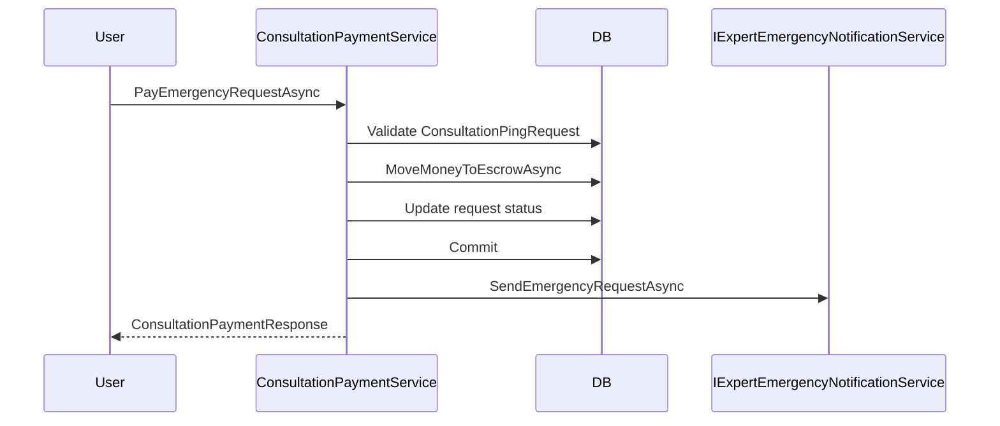

# PayOS Layer Source Code

## Mục tiêu tài liệu

Tài liệu này mô tả **current truth** của payment layer đang dùng PayOS sau đợt refactor:

- chuẩn hóa naming theo `*PaymentService`
- bỏ `Orchestrator` ở snake-catching flow
- bỏ chuỗi abstraction `Provider -> Client`
- dùng seam tối thiểu `IPaymentGateway -> PayOsGateway`

Tài liệu này mô tả **code đang chạy trong repo**, không mô tả kiến trúc lý tưởng trong tương lai.

## Current High-Level Shape

Payment layer hiện tại được tổ chức theo 2 trục:

1. **Domain payment service**
   - `SnakeCatchingPaymentService`
   - `ConsultationPaymentService`
   - `WalletTopupService`
2. **Gateway adapter**
   - `IPaymentGateway`
   - `PayOsGateway`

Nguyên tắc hiện tại:

- business rule nằm trong domain service
- tích hợp SDK PayOS nằm trong gateway
- chưa tách thêm `IntentService` hay `SettlementService` riêng để tránh over-abstraction

## Main Components

### 1. Controller Layer

- `SnakeAid.Api/Controllers/PayOsController.cs`

Current endpoints:

- `POST /api/v1/PayOs/snakecatching/paylink/create`
- `POST /api/v1/PayOs/snakecatching/paylink/cancel/{orderCode}`
- `POST /api/v1/PayOs/confirm-payment`
- `GET /api/v1/PayOs/return`
- `GET /api/v1/PayOs/cancel`
- `POST /api/v1/PayOs/webhook`
- `POST /api/v1/PayOs/transfer-to-rescuer`

Controller này hiện vẫn là gateway-facing controller cho snake-catching payment flow.

### 2. Domain Payment Services

#### Snake Catching

- `SnakeAid.Service/Interfaces/ISnakeCatchingPaymentService.cs`
- `SnakeAid.Service/Implements/SnakeCatchingPaymentService.cs`

Responsibilities:

- create snake-catching payment link
- cancel payment link
- confirm payment manually
- process PayOS webhook
- transfer funds to rescuer
- refund snake-catching transaction
- update `SnakeCatchingRequest` and related wallet/transaction state

#### Consultation

- `SnakeAid.Service/Interfaces/IConsultationPaymentService.cs`
- `SnakeAid.Service/Implements/ConsultationPaymentService.cs`

Responsibilities:

- pay scheduled consultation booking
- pay emergency consultation request
- move money to escrow
- refund emergency escrow
- expire emergency request and trigger refund
- settle escrow to expert

#### Wallet Top-up

- `SnakeAid.Service/Interfaces/IWalletTopupService.cs`
- `SnakeAid.Service/Implements/WalletTopupService.cs`

Responsibilities:

- create wallet top-up payment link
- persist pending top-up transaction
- call shared payment gateway

### 3. Gateway Layer

- `SnakeAid.Service/Interfaces/IPaymentGateway.cs`
- `SnakeAid.Service/Services/PayOs/PayOsGateway.cs`

Responsibilities:

- create payment link on PayOS
- cancel payment link on PayOS
- fetch payment link information
- verify webhook payload

Important note:

- `PayOsGateway` is the only PayOS adapter layer now
- there is **no extra `Client` abstraction underneath**
- this is intentional to keep the codebase within the team’s maintenance capacity

### 4. Shared PayOS Models

- `SnakeAid.Service/Services/PayOs/Models/PayOsCreatePaymentRequest.cs`
- `SnakeAid.Service/Services/PayOs/Models/PayOsPaymentLinkResult.cs`
- `SnakeAid.Service/Services/PayOs/Models/PayOsLinkInformation.cs`
- `SnakeAid.Service/Services/PayOs/Models/PayOsWebhookData.cs`

These are gateway-facing internal contracts, not domain-level business contracts.

## Dependency Graph

### Layer-Level Dependency Graph

### Concrete Runtime Graph

### Snake-Catching Internal Dependency Graph

### Consultation Internal Dependency Graph

### Wallet Top-Up Internal Dependency Graph

## Sequence Flows

### 1. Create Snake-Catching Payment Link

### 2. PayOS Webhook Settlement

### 3. Manual Confirmation

### 4. Wallet Top-Up Intent Creation

### 5. Consultation Escrow Flow

## Function Graph Summary

### SnakeCatchingPaymentService

Main public methods:

- `CreateSnakeCatchingPaymentLinkAsync`
- `CancelSnakeCatchingPaymentLinkAsync`
- `ProcessSnakeCatchingWebhookAsync`
- `ConfirmSnakeCatchingPaymentAsync`
- `ConfirmSnakeCatchingPaymentByOrderCodeAsync`
- `TransferSnakeCatchingFundsToRescuerAsync`
- `RefundSnakeCatchingTransactionAsync`

Main internal reuse points:

- `CreatePaymentLinkAsync`
- `ProcessWebhookAsync`
- `ConfirmPaymentAsync`
- `ProcessWebhookCoreAsync`
- `HandleCatcherCommissionAsync`
- `HandleWalletTopupAsync`

Observation:

- `ProcessWebhookCoreAsync` is still the densest function node in the snake-catching payment flow
- it remains the place where wallet settlement and webhook result application converge

### ConsultationPaymentService

Main public methods:

- `PayScheduledBookingAsync`
- `PayEmergencyRequestAsync`
- `RefundEmergencyEscrowAsync`
- `ExpireEmergencyRequestsAsync`
- `SettleConsultationEscrowAsync`

Main internal reuse points:

- `MoveMoneyToEscrowAsync`
- `RefundFromEscrowAsync`
- `TransferEscrowToExpertAsync`
- `GetRequiredWalletAsync`
- `GetOrCreateWalletAsync`

Observation:

- this is a real domain payment service
- it is **not** a generic payment service
- it owns consultation-specific escrow rules and emergency request lifecycle transitions

## Current Boundaries

### What is now reusable

- `IPaymentGateway`
- `PayOsGateway`
- PayOS gateway models under `SnakeAid.Service/Services/PayOs/Models`

### What is intentionally domain-specific

- `SnakeCatchingPaymentService`
- `ConsultationPaymentService`
- `WalletTopupService`

### What was intentionally removed

- `IPaymentOrchestrator`
- `PaymentOrchestrator`
- `IPayOsProvider`
- `PayOsProvider`
- `IPayOsClient`
- `PayOsClient`

The removal was intentional to reduce abstraction layers that did not carry enough independent value for the team.

## Current Architectural Risks

1. `PayOsController` is still gateway-named but exposes snake-catching business endpoints.
2. `SnakeCatchingPaymentService` still contains a large settlement core, especially in webhook handling.
3. Wallet top-up settlement logic is still partially coupled to snake-catching payment handling via shared transaction interpretation.
4. Shared payment models are still PayOS-shaped in some places, so future `VNPayGateway` work may require contract cleanup.

## Current Truth Summary

The payment architecture after refactor is:

- **simple enough for the team to operate**
- **domain services own business rules**
- **a single gateway adapter owns PayOS integration**
- **no redundant client/provider/orchestrator stack remains**

This is the current baseline from which future multi-provider work should continue.
