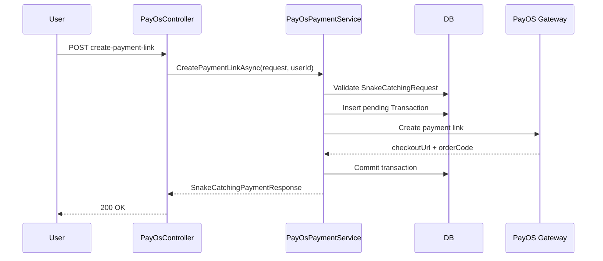
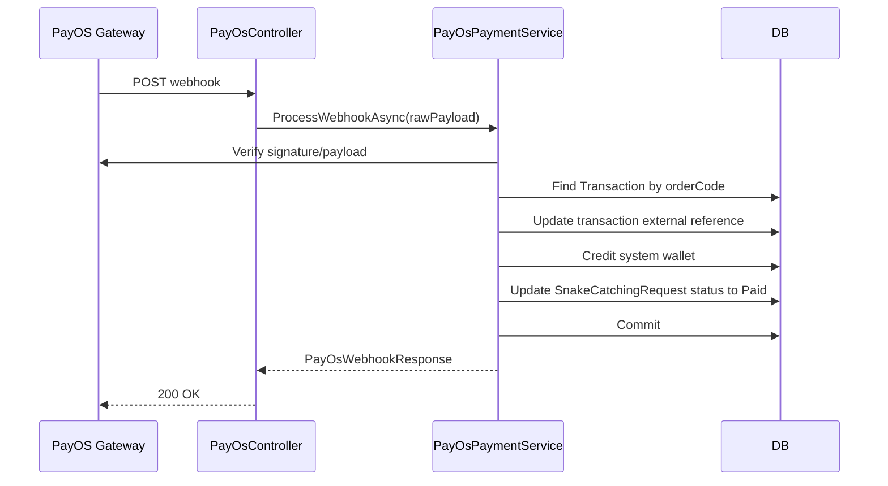
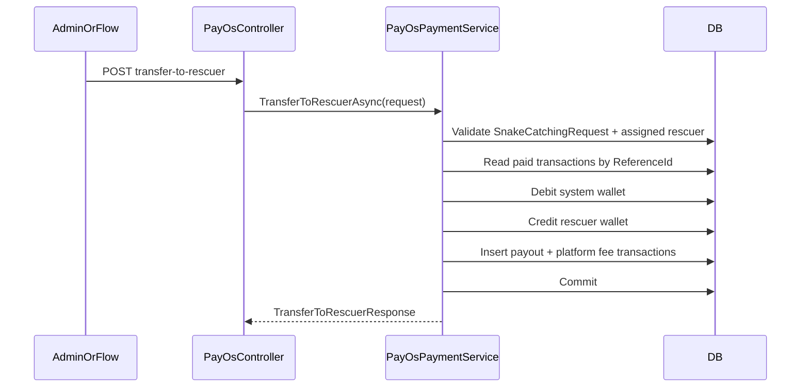

# PayOS Layer Source Code

## Mục tiêu tài liệu

Tài liệu này mô tả **current truth** của PayOS layer trong codebase.

Nó không mô tả kiến trúc mong muốn. Nó mô tả kiến trúc đang tồn tại.

## Current High-Level Shape

The PayOS layer currently consists of:
- provider SDK wrapper
- REST controller
- payment orchestration service
- PayOS-specific DTOs

However, the orchestration service and DTOs are tightly coupled to the snake-catching domain.

## Main Components

### Controller

- `SnakeAid.Api/Controllers/PayOsController.cs`

Public endpoints:
- `POST /api/v1/PayOs/create-payment-link`
- `POST /api/v1/PayOs/cancel-payment-link/{orderCode}`
- `POST /api/v1/PayOs/confirm-payment`
- `GET /api/v1/PayOs/return`
- `GET /api/v1/PayOs/cancel`
- `POST /api/v1/PayOs/webhook`
- `POST /api/v1/PayOs/transfer-to-rescuer`

Note: The `RefundTransactionAsync` method exists in the service but is not exposed as a public API endpoint. It is used internally by business logic (e.g., in `SnakeCatchingMissionService` for refunding failed missions).

### Provider Client

- `SnakeAid.Service/Interfaces/IPayOsClient.cs`
- `SnakeAid.Service/Services/PayOs/PayOsClient.cs`

This is the low-level provider client that directly interfaces with the PayOS SDK.

### Provider Layer (NEW)

- `SnakeAid.Service/Interfaces/IPayOsProvider.cs`
- `SnakeAid.Service/Services/PayOs/PayOsProvider.cs`

This is the domain-neutral provider façade that wraps the low-level client:
- `CreatePaymentLinkAsync()` - creates payment links with domain-neutral parameters
- `CancelPaymentLinkAsync()` - cancels payment links
- `GetPaymentLinkInformationAsync()` - retrieves payment link status
- `VerifyWebhook()` - verifies and parses webhook payloads

**Key Characteristics:**
- No snake-catching business logic
- Domain-neutral request/response contracts
- Reusable across different business domains (consultation, wallet top-up, etc.)
- Handles PayOS-specific concerns only

### Payment Context Contracts (NEW)

- `SnakeAid.Core/Domains/PaymentReferenceType.cs` - Enum for payment reference types (SnakeCatching, Consultation, WalletTopup)
- `SnakeAid.Core/Domains/PaymentContext.cs` - Generic payment context for all domains
- `SnakeAid.Core/Domains/PaymentResult.cs` - Generic payment result for all domains
- `SnakeAid.Service/Interfaces/IPaymentOrchestrator.cs` - Generic payment orchestrator interface
- `SnakeAid.Service/Implements/PaymentOrchestrator.cs` - Generic payment orchestrator implementation
- `SnakeAid.Core/Mappings/PaymentContextMapper.cs` - Mapping utilities between domain-specific and generic contracts

**Purpose**: Eliminate DTO duplication across domains. All payment domains (snake catching, consultation, wallet top-up) can now use the same shared payment contracts.

### Orchestration Service

- `SnakeAid.Service/Interfaces/IPayOsPaymentService.cs`
- `SnakeAid.Service/Services/PayOs/PayOsPaymentService.cs`

This service has been migrated to use `IPayOsProvider` for all gateway operations while preserving domain-specific business logic:
- ✅ **Migrated**: Uses `IPayOsProvider.CreatePaymentLinkAsync()` instead of direct `IPayOsClient` calls
- ✅ **Migrated**: Uses `IPayOsProvider.CancelPaymentLinkAsync()` for payment cancellation
- ✅ **Migrated**: Uses `IPayOsProvider.VerifyWebhook()` for webhook processing
- ✅ **Migrated**: Uses `IPayOsProvider.GetPaymentLinkInformationAsync()` for payment status checks

**Domain Logic Preserved**:
- Snake-catching request validation
- Snake-catching status validation
- System wallet accounting
- Webhook confirmation and business rule application
- Rescuer payout logic
- Refund logic

### Snake Catching Orchestrator (Primary Implementation)

- `SnakeAid.Service/Implements/SnakeCatchingPaymentOrchestrator.cs`

**Primary implementation** of `IPaymentOrchestrator` that handles snake catching payments. Contains all snake-catching business logic while using the domain-neutral `IPayOsProvider` for gateway operations.

**Key Features:**
- Implements complete snake-catching payment orchestration
- Uses `IPayOsProvider` directly (not delegated through `IPayOsPaymentService`)
- Handles payment creation, webhook processing, and manual confirmation
- Manages wallet operations, rescuer payouts, and commission calculations
- Preserves all existing business behavior and API compatibility

### PayOS DTOs

Requests:
- `SnakeAid.Core/Requests/PayOS/CreateSnakeCatchingPaymentRequest.cs`
- `SnakeAid.Core/Requests/PayOS/CancelPaymentLinkRequest.cs`
- `SnakeAid.Core/Requests/PayOS/ConfirmPaymentRequest.cs`
- `SnakeAid.Core/Requests/PayOS/TransferToRescuerRequest.cs`
- `SnakeAid.Core/Requests/PayOS/RefundTransactionRequest.cs`

Responses:
- `SnakeAid.Core/Responses/PayOS/SnakeCatchingPaymentResponse.cs`
- `SnakeAid.Core/Responses/PayOS/CancelPaymentLinkResponse.cs`
- `SnakeAid.Core/Responses/PayOS/PayOsWebhookResponse.cs`
- `SnakeAid.Core/Responses/PayOS/TransferToRescuerResponse.cs`
- `SnakeAid.Core/Responses/PayOS/RefundTransactionResponse.cs`

## Architecture After Refactoring

### Provider Layer Separation

**✅ RESOLVED:** The refactoring has successfully extracted a domain-neutral `PayOsProvider` layer.

**New Architecture:**
```
PayOsController → PayOsPaymentService → PayOsProvider → PayOsClient
                                      ↓
                               Domain Business Logic
                                   (Snake Catching)
```

### Interface-Level Separation

- `IPayOsProvider` = Domain-neutral provider façade
  - `CreatePaymentLinkAsync(PayOsCreatePaymentRequest)`
  - `CancelPaymentLinkAsync(long, string?)`
  - `GetPaymentLinkInformationAsync(long)`
  - `VerifyWebhook(string)`

- `IPayOsPaymentService` = Domain-specific orchestration
  - `CreatePaymentLinkAsync(CreateSnakeCatchingPaymentRequest)`
  - `TransferToRescuerAsync(TransferToRescuerRequest)`
  - Contains snake-catching business logic

### DTO-Level Separation

**Provider DTOs (Domain-Neutral):**
- `PayOsCreatePaymentRequest` - generic payment creation
- `PayOsPaymentLinkResult` - generic payment result

**Service DTOs (Domain-Specific):**
- `CreateSnakeCatchingPaymentRequest` - snake catching payment
- `SnakeCatchingPaymentResponse` - snake catching payment response

### Service-Level Separation

- `PayOsProvider`: Pure PayOS gateway operations
- `PayOsPaymentService`: Snake catching business orchestration + provider usage

### Controller-Level Coupling

The controller still exposes snake-catching specific endpoints, but now delegates to the separated layers appropriately.

## Payment Persistence Model

The PayOS layer persists into shared wallet/transaction infrastructure:

- `Transaction`
- `Wallet`

Current transaction patterns:
- gateway-created payment transaction
- system wallet top-up mirror transaction
- wallet withdrawal for payout/refund
- rescuer payout transaction
- platform fee transaction

`ReferenceId` is interpreted according to snake-catching business semantics.

## Runtime Interaction Flows

### 1. Create Snake-Catching Payment Link



### 2. Confirm Payment via Webhook



### 3. Transfer to Rescuer



## Current API/Domain Boundary Problem

The current boundary is inverted:

- The PayOS provider client is infrastructure.
- The payment orchestration service is snake-catching business logic.
- Both are packaged inside the same `payos` layer.

As a result, the module boundary currently mixes:
- provider integration
- payment session orchestration
- domain settlement

## Current Status After Refactoring

### ✅ Completed: Provider Layer Extraction

**Operation 02-REFACTOR-extract-provider-core: DONE**

The PayOS layer now has proper architectural separation:
- **Provider Layer**: `IPayOsProvider` / `PayOsProvider` - domain-neutral gateway operations
- **Service Layer**: `IPayOsPaymentService` / `PayOsPaymentService` - snake-catching business orchestration

### ✅ Completed: Payment Context Contracts

**Operation 03-REFACTOR-extract-payment-context-contract: DONE**

Shared payment contracts implemented:
- **PaymentReferenceType**: Enum for different payment domains (SnakeCatching, Consultation, WalletTopup)
- **PaymentContext**: Generic payment context with common fields (referenceId, amount, actors, etc.)
- **PaymentResult**: Generic payment result for all domains
- **IPaymentOrchestrator**: Generic payment orchestrator interface
- **PaymentContextMapper**: Utilities for mapping between domain-specific and generic contracts

### ✅ Completed: Snake Catching Migration

**Operation 04-REFACTOR-migrate-snake-catching-to-provider: DONE**

Snake catching payment flow successfully migrated:
- ✅ **PayOsPaymentService**: Now uses `IPayOsProvider` for all gateway operations
- ✅ **Removed Direct Dependencies**: No longer directly calls `IPayOsClient`
- ✅ **Business Logic Preserved**: All snake-catching validation, wallet operations, and payout logic intact
- ✅ **API Compatibility**: Existing controller endpoints work unchanged
- ✅ **SnakeCatchingPaymentOrchestrator**: Optional adapter layer for future generic orchestration

### Remaining Opportunities

- **Consultation Integration**: Can now reuse `PayOsProvider` + `PaymentContext` for consultation payments
- **Wallet Top-up Integration**: Can reuse `PayOsProvider` + `PaymentContext` for wallet funding
- **Future Domains**: Any payment use case can leverage the shared contracts and provider abstraction

### Current Truth Summary

The PayOS layer is now:
- ✅ **Reusable at the `IPayOsProvider` level** - domain-neutral gateway operations
- ✅ **Properly separated at the `IPayOsPaymentService` level** - contains snake-catching business logic but uses reusable provider
- ✅ **Architecturally sound** - provider concerns separated from business concerns

The main architectural risk has been resolved. Future payment integrations can reuse the `PayOsProvider` without duplicating gateway logic.
